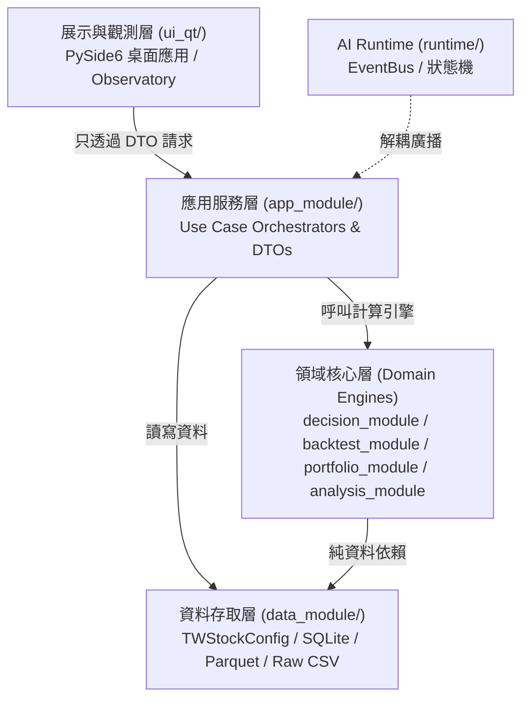

# GPT-6 Astra 專用專案架構解剖與閉環拆解上下文包 (Project Context Pack)

> **版本**：2026-09 High-Density Architecture Specification
> **適用模型**：GPT-6 Astra（頂階推理架構師）
> **下游執行**：5.6 Luna Max（`/goal` 自主長任務模式）
> **目標**：提供專案全局拓撲、資料流閉環、8 大工作區業務映射、金融防禦邊界與驗收命令庫，供 Astra 進行一次性深度分析並產出「閉環任務卡（Closed-Loop Goal Cards）」。

---

## 1. 系統身份與核心架構哲學 (System Purpose & Architecture)

### 1.1 專案定位
- **專案代號**：`baldr` / `technical_analysis`
- **核心目標**：這是一套「可驗證、可回溯、可演化」的台股研究與量化投資決策工作台。
- **架構理念**：**「看懂市場 ➔ 嘗試策略 ➔ 驗證策略 ➔ 管理持倉」**。
- **資料庫優先 (DB-First)**：所有分析模組、推薦打分與回測引擎均以 SQLite 與 Parquet 儲存為第一公民，禁止依賴運行中臨時記憶體狀態跨模組傳遞。
- **當前系統階段**：`V3.3 Engineering Complete / V4 Evidence Accumulation`。

### 1.2 系統分層架構與單向依賴約束 (Layer Governance)
系統遵循嚴格的四層分層架構，嚴禁任何循環引用或逆向依賴：



#### 嚴格分層禁止事項 (Boundary Guardrails)
1. **UI 層 (`ui_qt/`)**：
   - 只能作為純粹的**觀察儀 (Observatory)**。
   - **絕對禁止**直接 `import sqlite3`、讀寫資料庫或直連內部 Domain 實作檔案。
   - 必須只透過 `app_module` 提供的 Application Services 與 DTO (Data Transfer Object) 進行資料交換。
2. **App 層 (`app_module/`)**：
   - 負責用例編排 (Orchestration)。
   - **絕對禁止**引用 `PySide6`、`PyQt` 或任何 UI 框架套件，不可包含 HTML/CSS 格式化字串。
3. **Domain 層 (`decision_module/`, `backtest_module/`, `portfolio_module/`, `analysis_module/`)**：
   - 純 Python 業務與量化邏輯，嚴禁依賴 `ui_qt` 或 `app_module`。
4. **Runtime 層 (`runtime/`)**：
   - 保持純 Python 實作，事件總線 (`EventBus`) 不依賴 Qt Signal，透過 `QtRuntimeBridge` 在 UI 端橋接。

---

## 2. 模組職責與代碼目錄結構 (Module Directory Blueprint)

| 模組目錄 | 核心職責 | 關鍵檔案 / 子模組 |
|---|---|---|
| `ui_qt/` | PySide6 Qt 桌面主程式、8 大工作區視圖、非同步 Worker、主題樣式 | `main.py`, `tab_info_config.py`, `views/`, `widgets/`, `workers/`, `bridges/` |
| `app_module/` | 應用層服務：推薦編排、回測編排、資料更新、研究保存、DTO 契約 | `recommendation_service.py`, `backtest_service.py`, `update_service.py`, `research_run_service.py`, `portfolio_service.py`, `dto/` |
| `data_module/` | 資料庫設定、日K/分點載入、標準化、SQLite 讀寫、資料遷移 | `config.py` (`TWStockConfig`), `db_manager.py`, `stock_data_loader.py`, `broker_fetcher/` |
| `analysis_module/` | 技術指標計算（KD, MACD, RSI, ATR, 布林通道等）、價格型態、信號核心 | `indicators.py`, `patterns/`, `signals/`, `technical_indicators_facade.py` |
| `decision_module/` | 決策領域層：打分引擎 (`ScoringEngine`)、策略 Profile、大盤 Regime 偵測、籌碼信號 | `scoring_engine.py`, `profiles/`, `regime/`, `factors/`, `smart_money/` |
| `backtest_module/` | 策略回測引擎：事件驅動撮合、滑價/手續費模型、部位控管、績效指標計算 | `backtest_engine.py`, `performance.py`, `execution_model.py`, `risk_metrics.py` |
| `portfolio_module/` | 投資組合領域：Append-only 交易帳本、持倉投影、現金帳、Decimal 邊界 | `portfolio_manager.py`, `position_tracker.py`, `cash_ledger.py`, `paper_trade.py` |
| `runtime/` | AI 治理執行階段：事件總線 (`EventBus`)、狀態機生命週期、進程守護 | `event_bus.py`, `state_machine.py`, `process_custody.py`, `audit_registry.py` |

---

## 3. 八大 UI 工作區業務邏輯與資料流 (8 UI Workspaces / Tabs)

系統在 `ui_qt/` 中提供 8 個主要工作區（配置於 `ui_qt/tab_info_config.py`）：

### 3.1 數據更新工作台 (Update Workbench)
- **View 入口**：`ui_qt/views/update_view.py`
- **業務意圖**：管理本地資料生命週期。呈現數據狀態大看板（燈號：🟢正常 / 🟡待更新 / 🔴異常），提供一鍵安全更新與手動更新。
- **資料流閉環**：
  1. 檢查遠端/本地狀態（`UpdateService.check_status()`）
  2. 下載缺失原始 CSV（`data_module/raw/`）
  3. 增量合併寫入 SQLite 資料庫表 `daily_prices` 與 `broker_flows`
  4. 觸發技術指標極速增量計算（寫入指標衍生欄位）
  5. 刷新前端看板燈號。
- **防禦要點**：更新過程任何一步失敗必須原子回滾或中斷，不可留下髒資料。

### 3.2 市場觀察 (Market Watch & Regime)
- **View 入口**：`ui_qt/views/market_watch_view.py`
- **包含子視圖**：大盤指數 (`market_regime`)、強勢股 (`strong_stocks`)、弱勢股 (`weak_stocks`)、強勢產業 (`strong_industries`)、弱勢產業 (`weak_industries`)。
- **業務意圖**：市場狀態檢測器。辨識市場當前處於趨勢 (Trend)、區間反轉 (Reversion) 或突破 (Breakout)，提供強弱排名與類股輪動線索。
- **資料流閉環**：
  1. 讀取最新市場指數與全市場日K資料
  2. 計算 Market Breadth（騰落線、均線佔比）與動能分位
  3. 產出 `MarketRegimeDTO` 與排名清單
  4. 渲染視圖並支援使用者一鍵「加入觀察清單」。

### 3.3 推薦分析 (Recommendation Desk)
- **View 入口**：`ui_qt/views/recommendation_view.py`
- **業務意圖**：基於多因子打分與策略 Profile（如價值型、成長型、動能型）產生標的候選，並提供深度的 Why（推薦理由）與 Why Not（扣分/排除理由）透明解釋。
- **資料流閉環**：
  1. 使用者選擇分析日期與策略 Profile
  2. `RecommendationService` 從 SQLite 提取符合流動性門檻標的
  3. `ScoringEngine` 執行因子打分與排名
  4. 產出 `RecommendationResultDTO`（包含技術面、籌碼面、基本面貢獻值）
  5. 視圖呈現榜單，支援一鍵直接推進回測或加入觀察池。

### 3.4 策略回測與實驗室 (Research Lab & Backtest)
- **View 入口**：`ui_qt/views/research_lab_view.py`
- **業務意圖**：四大回測模式（單股回測、批次回測、推薦組合回放、固定組合回測）。提供權益曲線 (Equity Curve)、交易明細、Sharpe/MDD 等關鍵指標，並負責將結果正式保存到 **Research Run Registry**。
- **資料流閉環**：
  1. 使用者配置回測區間、初始資金、停損停利參數
  2. `BacktestService` 調度回測引擎執行事件驅動撮合
  3. 產生 `BacktestResultDTO` 呈現於 UI
  4. 使用者點擊「保存研究結果」，由 `ResearchRunService.save_run()` 寫入元數據至 SQLite，權益曲線與交易寫入 Parquet，遵循 `staging -> files_ready -> committed` 嚴格事務提交。

### 3.5 觀察清單 (Watchlist)
- **View 入口**：`ui_qt/views/watchlist_view.py`
- **業務意圖**：個人關注標的池與條件觸發器。監控標的是否觸發進出場訊號或形態突破。
- **資料流閉環**：
  1. 管理 SQLite 內的使用者自選股清單
  2. 依據最新行情數據計算觸發條件
  3. 呈現紅綠預警燈號與事件日誌。

### 3.6 持倉管理與真實度模擬 (Portfolio & Paper Execution)
- **View 入口**：`ui_qt/views/portfolio_view.py`
- **業務意圖**：管理目前投資組合與部位健康度。支援模擬交易 (Paper Trade)、交易費用扣減、現金水位追蹤與部位集中度風控。
- **資料流閉環**：
  1. 讀取 Append-only 交易帳本 (`trade_ledger`)
  2. 投影計算出當前持倉現狀 (`PositionProjection`)
  3. 結合即時報價計算未實現損益與保證金/現金比例
  4. 產生部位健康度與調倉建議 DTO。

### 3.7 每日決策台 (Daily Decision Desk)
- **View 入口**：嵌入於市場探索首頁，由 `ui_qt/views/decision_desk_view.py` 承載。
- **業務意圖**：每日盤後綜合決策看板。聚合大盤狀態、推薦清單頂尖標的、觀察清單觸發事件與現有持倉風控警示。

### 3.8 AI 執行階段與觀測台 (Runtime Observatory)
- **View 入口**：`ui_qt/views/runtime_view.py`
- **業務意圖**：監控背景非同步任務進度、EventBus 事件串流、記憶體負載與任務佇列生命週期。

---

## 4. 金融核心防禦規範 (Non-Negotiable Guardrails)

在任何程式碼重構、功能擴充或任務拆解中，必須遵守下列防禦鐵律：

### 4.1 核心計算嚴禁裸 `float` (Financial Numeric Boundary)
- **規定**：資金、部位、交易價格、手續費、滑價、盈虧 (PnL)、帳本計算中，**嚴禁新增任何裸 Python `float` 計算**。
- **解法**：必須全面使用 `decimal.Decimal` 或整數基點 (Cents / Basis Points)。
- **邊界隔離**：僅允許在資料分析邊界（如繪製 Matplotlib/Qt 圖表）或向量化 Pandas 計算的封閉函數內部使用浮點，一旦進入業務結算與帳本必須轉換回 `Decimal`。

### 4.2 嚴格杜絕未來函數 (Look-Ahead Bias Prevention)
- **規定**：在策略篩選、特徵工程、打分與回測決策中，只能使用「決策當下（`as_of_date`）已知」的資料。
- **財報與營收**：月營收與季度財報必須以「公告日（`available_date`）」而非「所屬期間（`period_end_date`）」對齊。
- **行情**：計算 T 日收盤後訊號時，撮合最快只能在 T+1 日開盤發生，不可使用 T 日收盤價無滑價同日立即成交。

### 4.3 研究保存與審計一致性 (Traceability & Immutability)
- 回測結果比對只能讀取已正式提交至 Registry 的歷史 Metadata，嚴禁比對時動態重新拉取當前最新市場資料重新計算。

---

## 5. 資料庫與持久化模型 (Storage Schema Snapshot)

- **SQLite 主資料庫**（預設位於 `FA_Data/market_data.db`，由 `TWStockConfig` 配置）：
  - `daily_prices`: `[stock_id, date, open, high, low, close, volume, amount, ...]`（含 KD, MACD 等指標衍生欄位）
  - `broker_flows`: `[stock_id, date, broker_id, buy_shares, sell_shares, net_shares]`
  - `companies`: `[stock_id, name, industry, listed_date, ...]`
  - `research_runs`: `[run_id, strategy_name, start_date, end_date, initial_cash, final_equity, sharpe_ratio, mdd, status, created_at, ...]`
  - `portfolios` & `trades`: 投資組合基本設定與 Append-only 交易紀錄。
- **Parquet 研究數據庫**（位於 `FA_Data/research_runs/`）：
  - `{run_id}_equity.parquet`: 時間序列每日權益曲線
  - `{run_id}_trades.parquet`: 完整逐筆撮合記錄
  - `{run_id}_factors.parquet`: 因子快照與貢獻度

---

## 6. 驗收命令庫 (Verification & DoD Arsenal)

下游 Agent（Luna Max）完成任務時，必須能直接執行以下驗收工具：

```powershell
# 1. 數據更新分頁核心測試
.\.venv\Scripts\python.exe -m pytest tests/test_ui_qt_update_view_workbench.py -q -o addopts=
.\.venv\Scripts\python.exe scripts\qa_validate_update_tab.py

# 2. 推薦分析與因子分頁驗證
.\.venv\Scripts\python.exe -m pytest tests/test_recommendation_ranking_service.py tests/test_ui_qt_recommendation_profiles.py -q
.\.venv\Scripts\python.exe scripts\qa_validate_recommendation_tab.py

# 3. 回測與 Research Run Registry 驗證
.\.venv\Scripts\python.exe -m pytest tests/test_backtest_execution_coordinator.py tests/test_ui_qt_research_run_save.py -q
.\.venv\Scripts\python.exe scripts\qa_validate_phase3_3b.py

# 4. 投資組合與持倉帳本驗證
.\.venv\Scripts\python.exe -m pytest tests/test_portfolio_mvp.py tests/test_ui_qt_portfolio_view.py -q
.\.venv\Scripts\python.exe scripts\qa_validate_portfolio_tab.py

# 5. 金融數值防禦與未來函數稽核
.\.venv\Scripts\python.exe scripts\check_financial_float_boundaries.py
.\.venv\Scripts\python.exe scripts\check_look_ahead_bias.py

# 6. 全系統快速健康度檢查
.\.venv\Scripts\python.exe scripts\run_full_app_healthcheck.py --quick

# 7. 全專案型態檢查
.\.venv\Scripts\python.exe -m mypy ui_qt app_module data_module analysis_module backtest_module decision_module portfolio_module runtime
```
