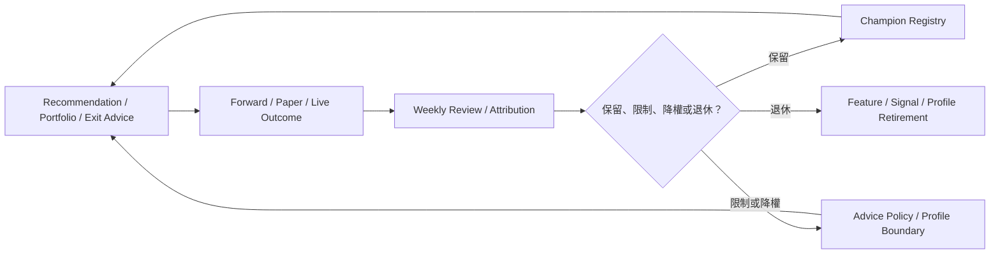

# baldr Post-Refactor 產品 Roadmap

> **2026-07-12 純工程狀態**：Gate 2–7 的批准工程包已完成，涵蓋 Evidence/V3、P0 source contracts/shadow adapters、Paper Portfolio、Position Health/Exit、完整結構化傳統 ML shadow challenger、closeout verifier 與控制中心。這只代表 `pure_engineering_complete`；Gate 2 真實週期、Gate 3 逐來源接受、Gate 4/6 paper/exit 時間證據、Gate 5 人工 pruning 決議、Gate 7 shadow days/revalidation/promotion review 仍由 [External Validation Register](../06_qa/GATE_2_TO_7_EXTERNAL_VALIDATION_REGISTER.md) 管理，不能標成 formal product closeout。

> **建立日期**：2026-07-11
> **定位**：本文件是安全重構完成後的產品方向權威，負責定義 baldr 為何存在、要協助哪些投資決策、能力演進順序與投資有效性 Gate。
> **工程落地**：未來六個月的交付物、依賴、測試與 Exit Criteria 以 [ROADMAP_6M_ENGINEERING.md](ROADMAP_6M_ENGINEERING.md) 為準。
> **現況邊界**：目前完成狀態以 [PROJECT_SNAPSHOT.md](PROJECT_SNAPSHOT.md) 為準；本文件中的 Target capability 不代表已實作。
> **安全邊界**：Investment Advice（投資建議）不等於 Broker Execution（券商執行）。本 Roadmap 不授權自動下單、保證獲利、production ML 或自動策略升降級。

---

## 1. Executive Summary

baldr 沒有走錯技術方向；SQLite-first、資料可得日治理、Research Run Registry、Recommendation、Backtest、Evidence、Portfolio 來源追溯與 Workbench 都是可延續的資產。問題在於工程完成度已跑在日常產品價值與投資有效性之前：使用者看得到 readiness、dry-run、scheduler、gate 與 closeout，卻還不能穩定取得「今天研究誰、是否建立部位、配置多少、持倉該加碼／持有／減碼／退出」的結構化答案。

Post-Refactor 主線改為：

```text
受治理資料
→ 結構化 Recommendation Advice
→ Portfolio Advice
→ Position Health / Exit
→ Forward / Paper / Live Evidence
→ 保留、降權、限制或退休
```

產品成功不以功能數量或勝率單點判定，而以「可驗證的決策品質、成本後風險調整表現、重大回撤控制、可解釋的 research-to-live gap，以及能主動淘汰無效訊號」判定。

## 2. 問題定義

### 2.1 使用者每天仍缺少的答案

1. 今天市場允許新增風險嗎？
2. 哪些股票值得研究、哪些可列為建立部位候選？
3. 為什麼選它、為什麼不選其他股票？
4. 每檔候選的建議目標權重、目前權重與差距是多少？
5. 現有持倉是 `ADD_CANDIDATE`、`HOLD`、`REDUCE_CANDIDATE` 還是 `EXIT_CANDIDATE`？
6. Recommendation、Alert、Exit 與 Portfolio Advice 是否真的有效？
7. 哪些資料、訊號、Profile 與工具應保留、降權、限制或退休？

### 2.2 現況能力矩陣

| 能力 | 目前狀態 | 真正價值 | 尚不能宣稱 |
|---|---|---|---|
| SQLite-first、資料更新與 quality 狀態 | 已存在 | 可追溯的本地資料底座 | 資料完整即代表策略有效 |
| Market Exploration / Daily Decision / Workbench | 已存在，Workbench 主要為 read-only | 提供市場、候選、警示與資料品質入口 | 已形成完整 Advice operating loop |
| Recommendation Profile、Why / Why Not、Screening Matrix | 已存在 | 建立候選與負面證據 | 入選等於適合買進 |
| Backtest、Replay、Walk-forward、Registry | 已存在 | 研究可重現與 OOS 比較 | historical replay 等於 forward / live evidence |
| Evidence Event、Forward Outcome、Signal Decay、Decision Quality | 工程底座已存在 | 可累積效果與退化證據 | read-only dashboard 或 dry-run 已證明有效 |
| Portfolio 追蹤、SL/TP、籌碼、來源追溯 | 已存在 | 持倉記錄與風險檢查 | 已有完整 Portfolio Advice / Exit Engine |
| Portfolio Construction Sandbox | research-only | 比較 sizing 與執行限制 | 已可管理正式 Portfolio |
| P0/P1 外部資料來源 | 部分 candidate / readiness | 改善可信度與成交可行性 | candidate 已正式 ingestion |
| V3 Score Effectiveness / ML readiness | engineering candidate | 提供可判讀 scaffold | 投資有效、production ML ready |
| Evidence Scheduler | data update 與 evidence dry-run 已有排程；production evidence write-mode 未批准 | 累積操作證據 | production scheduler 已核准 |

### 2.3 Gap 矩陣

| Gap | 對產品的影響 | 優先處置 | Done Definition |
|---|---|---|---|
| Recommendation Advice Contract 不完整 | 無法從分數轉成一致、可稽核建議 | Gate 1 | 每筆 advice 含 action、Why、Why Not、Risk、Evidence、資料日期、失效條件與可成交性 |
| Portfolio Advice 不存在 | 推薦清單無法回答資金配置 | Gate 1 / 4 | 輸出 target/current/gap、risk budget、rebalance band 與 paper evidence |
| Evidence operating loop 仍偏 read-only / dry-run | 無法持續驗證與修正 | Gate 2 | 形成 weekly review、action item、append-only evidence、backup/rollback/recovery 的真實節奏 |
| P0 資料未正式接受 | 回測與持倉可信度受限 | Gate 3 | 每個來源通過 available-date、quality、license、missing 與 shadow acceptance Gate |
| Signal / Gate / Alert 未做淘汰決策 | 系統只增不減、噪音累積 | Gate 5 | 有保留／限制／降權／退休決議與 evidence |
| Position Health / Exit 只具局部監控 | 無法以 thesis 管理部位 | Gate 6 | 狀態機、entry thesis、invalidation、time stop、relative deterioration 與 exit evidence 可用 |
| ML 只有 readiness | 容易提前黑箱化 | Gate 7 | 只在 rule baseline 可判讀後進 shadow，通過校準、漂移與 promotion review 才能影響正式決策 |

## 3. 方案取捨與採用決策

| 方案 | 作法 | 優點 | 主要風險 | 決議 |
|---|---|---|---|---|
| A. 繼續功能擴張 | 優先加入更多資料、模型與 Dashboard | 可快速增加表面能力 | 產品問題更分散，未驗證功能持續堆積 | 不採用 |
| B. Evidence-only | 停止產品能力，只累積 evidence | 風險低、治理清楚 | 使用者仍得不到日常建議，無法驗證 Advice 產品 | 不採用 |
| C. Bounded Advice + Evidence Gate | 先建立受限建議契約，與 evidence、Portfolio、Exit 同步演進 | 直接回答每日問題，且每一步有驗收與降級機制 | 需嚴格控制建議語意與 production 邊界 | **採用** |

採用方案 C，但不提前接 broker execution。所有正式 Advice 都必須可被規則重算、可追溯、可拒絕輸出，並允許 `NO_NEW_POSITION` 成為有效答案。

## 4. 產品北極星

baldr 的長期定位是：

> 一套可以觀察台股市場、篩選候選股票、產生結構化投資建議、建立建議投資組合、追蹤持倉健康、協助加減碼與退出判斷，並持續驗證自身建議是否有效的投資決策系統。

baldr 可以輸出：

- `RESEARCH`
- `ADD_CANDIDATE`
- `HOLD`
- `REDUCE_CANDIDATE`
- `EXIT_CANDIDATE`
- `AVOID`
- `NO_NEW_POSITION`

這些輸出是有條件、有證據、有風險揭露的 bounded structured advice（有界結構化建議），不是券商委託、保證獲利或自然語言信心。

## 5. 每日必須回答的投資問題

| 決策層 | 每日答案 | 最低證據 |
|---|---|---|
| 市場 | 現在可積極研究、保守研究或不新增部位？ | Regime、Breadth、流動性、資料品質、風險事件 |
| 股票 | 哪些股票為研究／建立部位候選，哪些應避免？ | Recommendation、Why / Why Not、Risk、Evidence tier |
| Portfolio | 資金如何配置，需保留多少現金？ | Risk budget、target weights、constraints、execution feasibility |
| 持倉 | 每檔是加碼、持有、減碼或退出候選？ | Entry thesis、health state、invalidation、relative deterioration |
| 改善 | 哪些訊號／警示／Profile 有效或應退休？ | Forward、paper、live、OOS、regime 與成本後 evidence |

## 6. Guided Mode 與 Professional Mode

### 6.1 Guided Mode（引導模式／無腦模式）

定位：只使用已通過 Promotion Gate、參數鎖定且 evidence disclosure 完整的正式策略，協助使用者建立與管理 Portfolio。

使用者只選：投資週期、風險容忍度、資金規模、是否接受小型股、是否接受低流動性、最大持倉數。

系統負責：市場狀態、Profile 建議、候選篩選、Why / Why Not / Risk、目標 Portfolio、權重、Add / Hold / Reduce / Exit Candidate 與 `NO_NEW_POSITION`。

Guided Mode 禁止使用 candidate Profile、未鎖定參數、未通過 forward evidence 的實驗結果或 ML shadow output。

### 6.2 Professional Mode（專業模式）

允許建立 Candidate Profile、調整 factor / threshold / holding horizon / SLTP / sizing，執行 ablation、robustness、walk-forward、execution realism 與 shadow testing。

實驗 Promotion 流程固定為：

```text
Hypothesis
→ Candidate Profile
→ Train
→ Validation
→ Test
→ Walk-forward
→ Execution Realism
→ Shadow Recommendation
→ Forward Evidence
→ Promotion Review
→ Guided Mode
```

兩種模式共用同一 Recommendation、Portfolio、Evidence 與 Advice Policy 核心；差別只在允許的設定面與策略狀態，不得形成兩套漂移引擎。

## 7. Recommendation Advice Contract

每筆 Advice 至少包含：

| 欄位 | 契約 |
|---|---|
| `stock_code` | 正式股票代碼。 |
| `advice_action` | 七種 bounded action 之一。 |
| `why_reasons` / `why_not_reasons` | 結構化理由 token 與來源。 |
| `risk_reasons` | 市場、個股、資料、流動性、Portfolio 風險。 |
| `confidence_tier` | 產品信心層級；不得等同勝率。 |
| `evidence_tier` | insufficient / directional / forward-reviewed / paper-validated / live-reviewed。 |
| `holding_horizon` | 預期持有期間與 review cadence。 |
| `entry_thesis` | 可驗證的進場假設。 |
| `invalidation_conditions` | 可判定的失效條件。 |
| `market_regime` | 決策當下市場狀態。 |
| `strategy_version` | 鎖定的正式或 candidate 版本。 |
| `liquidity_state` | 成交能力與限制。 |
| `execution_feasibility` | 可成交、受限、不可成交或資料不足。 |
| `data_quality` | OBSERVED / ESTIMATED / DEGRADED / MISSING 與 warnings。 |
| `decision_date` / `data_as_of_date` | 決策與資料截止日。 |

Advice Policy 必須能拒絕輸出。資料不足、Portfolio risk budget 已滿、整體市場風險過高或 execution 不可行時，輸出 `RESEARCH`、`AVOID` 或 `NO_NEW_POSITION`，不得硬湊候選。

## 8. Portfolio Advice Contract

每次 Portfolio Advice 至少輸出：

```text
stock_code
advice_action
target_weight_bp
current_weight_bp
weight_gap_bp
confidence_tier
evidence_tier
holding_horizon
entry_thesis
invalidation_conditions
market_regime
strategy_version
liquidity_state
execution_feasibility
risk_reasons
data_quality
review_date
```

### 8.1 Portfolio Risk Budget

必須治理：最大總曝險、現金保留、單股上限、產業／題材上限、高相關股票合計上限、小型股／低流動性上限、目標波動、最大可接受回撤、turnover budget 與交易成本限制。

### 8.2 Position Sizing

按下列順序比較，不假設分數高就應配置更多：

1. Equal Weight：正式 benchmark。
2. Score Weight：需證明 score bucket 單調性。
3. Inverse Volatility：需穩定波動估計。
4. Risk Budgeting：需可靠 covariance / exposure。
5. Confidence-adjusted Weight：需經校準的 confidence，不得使用自然語言信心。

任何候選方法必須在相同 universe、成本、限制與 OOS / forward 期間下相對 Equal Weight 比較。

### 8.3 Rebalance Bands

每個 policy 定義 lower band、target band、upper band、minimum trade threshold、turnover budget 與 cooldown。小幅偏離不觸發交易建議；若成本或流動性使調整不合理，保持 `HOLD`。

## 9. Position Health 與 Exit Engine

### 9.1 狀態機

```text
HEALTHY
→ WATCH
→ REDUCE_CANDIDATE
→ EXIT_CANDIDATE
→ CLOSED
```

狀態可降級或恢復，但每次轉移都必須保存 evidence、原因與 review date。

### 9.2 判斷來源

1. Hard Risk：停牌、交易限制、重大資料或風控事件。
2. Entry Thesis Invalidated：原始假設明確失效。
3. Relative Deterioration：相對 benchmark / industry / concept 惡化。
4. Time Stop：超過預期 horizon 且 thesis 未實現。
5. Portfolio-level Rebalance：集中度、相關性、risk budget 或現金政策要求。
6. Data Quality Degradation：關鍵資料失真或來源中斷。
7. Trading Restriction：處置、分盤、全額交割、漲跌停鎖死等。

固定停損、RSI 或 TotalScore 下降只能作輸入之一，不能單獨定義完整 Exit。

## 10. Evidence 與持續改善閉環



Evidence 分層：

- Historical replay：研究與缺口診斷，不計 forward gate。
- OOS / walk-forward：研究可信度，不等同實盤。
- Shadow recommendation：不影響正式建議。
- Forward evidence：真實決策日後 outcome。
- Paper Portfolio：納入配置、成本與 execution feasibility。
- Live review：需實際成交、override 與 decision journal 才能成立。

## 11. Data Source Roadmap

### 11.1 共通資料契約

每個來源必須登錄：Decision use case、official / licensed / `research_candidate` 狀態、expected fields、historical availability、`as_of_date`、`available_date`、source version、data quality、rate limit、license note、missing policy、look-ahead risk、ingestion stage，以及是否允許進 `ScoringEngine` / Portfolio Advice。

所有新來源一律依序：

```text
Diagnostics → Shadow Layer → Evidence Review → Accepted Feature → Formal Decision Layer
```

### 11.2 優先序

| Priority | 來源 | 主要用途 | 初始資格 | 正式接受 Gate |
|---|---|---|---|---|
| P0 | Corporate Action：除權息、減資、分割、面額變更 | 價格、回測、持倉可信度 | official / licensed / candidate | PIT timeline、調整政策、raw/adjusted 可追溯 |
| P0 | 停牌復牌、處置、分盤、全額交割、漲跌停鎖死 | execution / Why Not / Position Health | official / candidate | 日期區間、missing fail-closed、replay/paper 驗證 |
| P0 | 三大法人 | 市場／籌碼 diagnostics | `research_candidate` | available-date、授權、coverage、非單日買超解讀 |
| P0 | 信用交易 | 槓桿／擁擠／斷頭風險 | `research_candidate` | PIT、缺失政策、risk-only shadow evidence |
| P0 | TDCC / 集保分散 | 持股結構與集中度 | `research_candidate` | 週頻可得日、歷史版本、coverage |
| P0 | PIT 月營收與季度財報公告日 | 基本面 Look-ahead bias（未來函數）防禦 | 部分 baseline、正式 PIT 仍候選 | 官方／授權公告日、修訂政策、quality |
| P1 | Concept Basket / 題材籃子 | 產業外輪動與 exposure | candidate | 成分版本、effective / available date |
| P1 | ETF 持股與指數成分調整 | 被動資金與 exposure | candidate | 官方／授權成分歷史與公告日 |
| P1 | 借券／證券出借 | short / squeeze risk | candidate | 欄位、coverage、available-date policy |
| P1 | 重大訊息、法說會、股利事件 | thesis / event risk | candidate | 官方事件 id、時間戳、文本／結構化品質 |
| P1 | 市場波動與衍生品風險 | Portfolio risk budget | candidate | 穩定歷史與決策日可得性 |
| P2 | 新聞 NLP、公告／法說文字模型 | 事件分類與摘要 | `research_candidate` | governed corpus、label、baseline、OOS |
| P2 | 分析師預估、替代資料 | research features | licensed candidate | license、PIT snapshot、survivorship gate |
| P2 | ML ranking / DL temporal features | challenger features | shadow only | Rule baseline 可判讀、drift/rollback 完整 |

在通過 Accepted Feature Gate 前，所有新資料皆不得進 `ScoringEngine` 或正式 Portfolio Advice。

## 12. ML、DL 與金融模型導入順序

### 12.1 模型選型矩陣

| Technique | Use Case | Required Data | Baseline | Validation | Main Risk | Earliest Phase |
|---|---|---|---|---|---|---|
| Cross-sectional ranking | 同日候選排序 | PIT factor snapshot、固定 universe | 現行 rule score / equal bucket | OOS monotonicity、Precision@K | universe leakage | Gate 5 |
| Quantile portfolio | 分組驗證排名能力 | ranking + forward returns | Equal Weight | bucket monotonicity、cost-adjusted excess | turnover / crowding | Gate 5 |
| Factor attribution | 解釋績效來源 | factor snapshot、holdings、returns | component ablation | OOS / regime attribution | multicollinearity | Gate 5 |
| Regime-conditioned policy | 風險與策略適用範圍 | stable regime labels | static policy | purged walk-forward | regime instability | Gate 5 |
| Robustness matrix | 判斷參數脆弱性 | frozen experiment registry | single config | neighborhood stability | search overfit | Gate 5 |
| Bayesian / bootstrap uncertainty | confidence interval | adequate independent samples | point estimate | resampling / calibration | dependence ignored | Gate 5 |
| Change-point / decay detection | 訊號退化 | long forward evidence history | rolling threshold | delayed OOS confirmation | false alarms | Gate 5-6 |
| Equal Weight | Portfolio benchmark | eligible candidates | N/A | OOS / forward / paper | concentration | Gate 4 |
| Inverse Volatility | 降低高波動曝險 | stable volatility | Equal Weight | cost / drawdown / turnover | volatility regime shift | Gate 4 |
| Risk Parity / Risk Budgeting | 分配風險 | covariance / exposure | Inverse Volatility | stress / OOS | estimation error | Gate 4+ |
| Covariance shrinkage | 穩定 covariance | 足夠同步歷史 | sample covariance | OOS risk forecast | structural break | Gate 4+ |
| Hierarchical Risk Parity | 相關群組配置 | reliable correlations | Equal / inverse vol | OOS / stability | cluster instability | Gate 4+ |
| Maximum diversification | 提升分散 | vol + covariance | Equal Weight | OOS diversification ratio | unstable covariance | Gate 4+ |
| Constrained mean-variance | 有限制最佳化 | reliable expected returns + covariance | Equal Weight | nested OOS | return estimate error | 延後；V3+ |
| CVaR optimization | 尾端風險配置 | 足夠尾端情境 | risk budgeting | scenario / OOS CVaR | sample scarcity | 延後；V3+ |
| Scenario stress testing | 測試集中與流動性 | holdings、exposure、scenario | static limits | historical + hypothetical | false precision | Gate 4 |
| Exposure / factor risk model | 管理共同風險 | factor exposures | sector caps | OOS exposure stability | factor misspecification | Gate 4+ |
| Gradient Boosting | ranking / downside challenger | governed feature / label registry | rule score | purged walk-forward、calibration | overfit / drift | Gate 7 |
| Learning-to-rank | 同日相對排序 | query groups by decision date | rule ranking | NDCG、Precision@K、OOS | leakage / unstable labels | Gate 7 |
| Meta-labeling | 過濾 rule signal | rule signals + outcomes | unfiltered rule signals | precision / recall / cost | selection bias | Gate 7 |
| Probability calibration | 信心校準 | OOS probabilities / labels | raw score buckets | Brier / reliability | non-stationarity | Gate 7 |
| Positive excess classification | benchmark-relative outcome | PIT features + excess labels | rule score | AUC + calibration + utility | class imbalance | Gate 7 |
| Downside-risk prediction | 避免重大不利變動 | MAE / drawdown labels | rule risk gates | tail recall / calibration | rare events | Gate 7 |
| Drift / anomaly detection | 資料與模型監控 | feature / label / score history | static thresholds | false-alert review | alert fatigue | Gate 7 |
| DL NLP | 公告、法說、新聞分類／摘要 | governed text corpus | rules / classical NLP | OOS task metrics + citation audit | hallucination / cost | P2 shadow |
| DL temporal embedding | 多來源時序 representation | 大量穩定樣本 | boosting / linear baseline | purged walk-forward | opaque overfit | 長期 shadow |

Expected Return 不可靠時，不得過早使用 unconstrained mean-variance；DL 不作目前核心推薦引擎。

### 12.2 ML Governance

必須具備 Feature Registry、Label Registry、Dataset Fingerprint、Purged / Embargo Split、Model Registry、Calibration Report、Feature Importance、Drift Monitor、Shadow Prediction Storage、Champion / Challenger、Promotion Gate 與 Rollback。

Gate 通過前，ML 不得修改正式推薦、Portfolio Advice、Strategy Lifecycle、scheduler、參數或交易。

## 13. 輔助工具 Roadmap

| 工具 | 產品目的 | 最早 Gate | 邊界 |
|---|---|---|---|
| Data Source Control Center | 顯示 freshness、coverage、schema、version、available-date、missing、quarantine、retry、downstream eligibility | Gate 3 | 不自動接受新 feature |
| Experiment Manager | 保存 hypothesis、metric、benchmark、success/failure、split、search budget、horizon、execution、fingerprint | Gate 5 | 不自動找最佳參數並 promotion |
| Portfolio Policy Builder | 管理 risk budget、caps、cash、bands、turnover、Add/Reduce/Exit rules | Gate 4 | policy 變更需版本化與 review |
| Trade Import & Decision Journal | Broker CSV、paper portfolio、fill、partial fill、override、reason、execution gap、notes | Gate 4-6 | 不串自動下單 API |
| Scenario & Stress Lab | 快跌、跳空跌停、流動性消失、輪動失敗、相關股同跌、單股事件、集中、source outage | Gate 4 | 情境不是預測 |
| AI Research Copilot | 摘要建議、解釋 Portfolio、研究問題、Profile 比較、weekly review、evidence gap | Gate 2+ | 只讀受治理資料；不重算核心、不改策略、不下單 |

## 14. 30 / 60 / 90 日行動

### 30 日：關閉重構、建立 Advice 契約

- 完成 Safe Refactor Closeout baseline 與 rollback point。
- 定義 Recommendation Advice / Portfolio Advice DTO 與語意規格。
- 將 Guided / Professional Mode 映射到同一核心引擎。
- 將 `NO_NEW_POSITION`、Why / Why Not / Risk / Evidence、target/current/gap 納入設計與測試計畫。

### 60 日：建立真實 Evidence operating loop

- weekly review、manual note、action item、append-only evidence、backup / rollback / recovery 形成真實節奏。
- 明確區分 historical replay、scheduled dry-run、forward、paper 與 live evidence。
- Production evidence scheduler 只在明確人工批准後開啟 write-mode；仍不交易、不套 lifecycle。

### 90 日：P0 Data diagnostics / shadow

- Corporate action、trading restriction、三大法人、信用交易、TDCC、PIT fundamentals 逐一完成 source contract。
- 先進 diagnostics / shadow，產生 coverage、quality、look-ahead 與 acceptance report。
- 未通過來源維持 `research_candidate`，不得接正式 score / Portfolio Advice。

## 15. 六個月產品 Gate

每個 Gate 的工程細節見 6M Roadmap；此處維護產品問題與成熟度。

| Gate | Investment Question | Product Capability | Data Dependencies | Engineering Deliverables | Evidence Gate | Risks | Non-goals | Exit Criteria |
|---|---|---|---|---|---|---|---|---|
| 0 Safe Refactor Closeout | 現有行為是否可被安全延續？ | 可回滾、行為等價的產品底座 | Golden baseline | Recommendation / Backtest / Portfolio / Scheduler / DTO diff 與 rollback point | protected contract 無非預期差異 | 無止盡重構 | 不新增功能 | 完整 closeout 並停止主動擴張重構 |
| 1 Daily Usable Advice | 今天研究誰、能否新增部位、配置多少？ | Guided / Professional、Recommendation / Portfolio Advice Contract | 現有受治理資料與策略版本 | advice policy、contracts、`NO_NEW_POSITION`、target/current/gap | contract、explainability、paper dry-run | 把分數當建議 | 不下單、不保證結果 | 每筆建議完整、可拒絕、可追溯 |
| 2 Real Evidence Operating Loop | 建議與警示是否被持續檢查？ | weekly review、Action Item、Evidence write-mode | durable snapshots / outcomes | appendix-only write、backup / rollback / recovery、approval | 真實週期可重複、idempotent | 把 replay 當 forward | 不自動交易／lifecycle | 人工批准的 evidence loop 穩定運行 |
| 3 P0 Data Integration | 回測與 Advice 是否使用可信 PIT / restriction data？ | Data Source Control Center、shadow diagnostics | P0 sources | adapters、registry、quality / missing / available-date policy | source-by-source acceptance | license / look-ahead / outage | 未接受來源不進正式決策 | 每個 P0 source 有接受或明確拒絕決議 |
| 4 Portfolio Coach v1 | 資金應如何配置與再平衡？ | risk budget、target allocation、bands、paper portfolio | advice candidates、prices、liquidity、cost | policy builder、equal-weight benchmark、execution feasibility | OOS / forward / paper 成本後比較 | optimizer false precision | 不串 broker | target/current/gap 與 paper evidence 可重複 |
| 5 Signal Effectiveness & Pruning | 哪些 signal / gate / alert / Profile 真有用？ | score effectiveness、ablation、retirement | forward / paper evidence | metric dashboard、experiment registry、pruning decision | monotonicity、Precision@K、regime stability、cost | p-hacking | 不以新增 feature 代替淘汰 | 每項有保留／限制／降權／退休決議 |
| 6 Position Health & Exit | 持倉何時加碼、持有、減碼或退出？ | thesis-based health state machine | position source、market、risk、restriction、portfolio exposure | health engine、exit contract、journal / evidence | alert lead time、avoided / opportunity loss、false rate | 過早退出／固定停損依賴 | 不自動平倉 | 每次 state transition 可解釋且可追溯 |
| 7 ML Shadow Layer | ML 是否在 rule baseline 上提供可驗證增益？ | challenger ranking / calibration / downside risk | governed feature / label / dataset registry | shadow store、registry、drift、champion/challenger | purged OOS、calibration、net utility、rollback | 黑箱與 drift | 不取代正式引擎 | 只在增益穩定且 governance 完整時提出 promotion |

## 16. 投資有效性指標與產品決策

### 16.1 Recommendation 層

| 指標 | 影響的產品決策 |
|---|---|
| Forward return | 判斷候選是否具方向性觀察價值。 |
| Benchmark excess return | 決定 Recommendation 是否優於被動市場暴露。 |
| Industry / concept excess return | 區分選股能力與產業／題材 Beta。 |
| MAE / MFE | 設計 risk、holding horizon、entry / exit policy。 |
| Hit rate / Payoff ratio | 決定策略是否依賴高勝率或高賠率。 |
| Score bucket monotonicity | 決定 TotalScore 能否用於 ranking / sizing。 |
| Precision at K | 決定第一屏候選數與 top-K policy。 |
| Regime stability | 決定 Profile 適用範圍與 `NO_NEW_POSITION`。 |
| Liquidity-adjusted performance | 決定低流動性限制與容量。 |
| Execution feasibility | 決定 Advice 是否降級為 `RESEARCH` / `AVOID`。 |

### 16.2 Portfolio 層

| 指標 | 影響的產品決策 |
|---|---|
| Cost-adjusted / excess return | 決定 sizing 方法是否優於 Equal Weight。 |
| Sharpe / Sortino | 決定風險調整後配置政策。 |
| Maximum drawdown / duration | 決定總曝險、現金與 rebalance policy。 |
| CVaR | 決定尾端風險 budget 與 stress Gate。 |
| Turnover | 決定 minimum trade、band 與 cooldown。 |
| Cash utilization | 決定現金保留與 sizing 可行性。 |
| Concentration / diversification | 決定單股、產業、題材與 correlation cap。 |
| Exposure stability | 決定 Portfolio policy 是否過度跳動。 |
| Paper / Live vs Research Gap | 決定模型是否可 promotion 或需降級。 |

### 16.3 Alert / Exit 層

| 指標 | 影響的產品決策 |
|---|---|
| Alert lead time | 決定警示是否足以提前行動。 |
| Alert 後 MAE | 決定 risk severity 與 escalation。 |
| False-positive / false-negative rate | 決定保留、降權或退休 alert。 |
| Avoided loss / opportunity loss | 比較風控收益與過早退出成本。 |
| Early exit rate / exit 後續表現 | 調整 time stop、invalidation 與 exit policy。 |
| Add / Reduce 後續結果 | 驗證部位調整建議。 |

### 16.4 Model 層

| 指標 | 影響的產品決策 |
|---|---|
| Ranking quality | 是否採用 challenger ranking。 |
| Calibration | confidence tier 與 confidence-adjusted sizing 是否可用。 |
| Stability / regime performance | 模型適用範圍與 fallback。 |
| Feature / label drift | 是否停止模型、重訓或降級。 |
| OOS decay | 是否進入 watch / demote review。 |
| Research-to-live degradation | 是否可 promotion 或需 rollback。 |

## 17. 長期成功指標

1. Advice 完整率：每筆正式建議具理由、反對理由、風險、資料品質、evidence、權重與失效條件。
2. 可拒絕率健康：系統能在不適合時輸出 `NO_NEW_POSITION`，而非每日硬湊股票。
3. Portfolio 成本後穩定性：相對 Equal Weight 與合理 benchmark 可比較。
4. 重大回撤與 CVaR 在已聲明 risk budget 內。
5. Alert / Exit 有可量化 lead time 與 avoided-loss / opportunity-loss 取捨。
6. Research-to-paper/live gap 可解釋、可追蹤、可改善。
7. 無效 signal、gate、feature、Profile 可被降權或退休。
8. ML challenger 無增益時能被拒絕，不因模型複雜度取得特權。

## 18. 明確非目標

- 保證獲利或持續提高勝率。
- 預測明日收盤價的黑箱。
- AI 報明牌。
- 高頻交易與逐筆撮合平台。
- 自動下單、券商帳戶控制或自動平倉。
- 用單一分數取代風險、Portfolio 與 Evidence。
- 用 dashboard、scheduler 或 ML 工程完成度宣告 V4.0。

## 19. 現在應停止做的事情

1. 停止沒有產品問題與 Evidence Gate 的功能擴張。
2. Gate 0 完成後停止無止盡安全重構，回到產品主線。
3. 停止把 dry-run、read-only、candidate、replay、readiness 寫成正式完成。
4. 停止把新資料直接塞進 `ScoringEngine`。
5. 停止只找最佳參數；必須先做 robustness、ablation 與 OOS。
6. 停止只加 signal / alert；每個能力都要有 pruning / retirement 路徑。
7. 停止用自然語言信心代替統計校準。

## 20. 文件責任矩陣

| 文件 | 唯一責任 |
|---|---|
| `PROJECT_SNAPSHOT.md` | 現況、本週優先事項、目前 Gate、高風險區。 |
| 本文件 | Post-Refactor 產品方向、投資問題、能力演進與產品 Gate。 |
| `ROADMAP_6M_ENGINEERING.md` | 未來六個月工程交付、依賴、測試與 Exit Criteria。 |
| `system_vision_specification.md` | North Star、Product Principles、Bounded Advice、Evidence Requirement、Success Levels、Non-goals。 |
| `system_architecture.md` | 目前真實架構。 |
| `target_system_architecture.md` | Current → Transitional → Target 的理想架構與治理邊界。 |
| `VERSION_ROADMAP_V1_1_TO_V2_0.md` | 已完成版本與 V2.0 形成過程。 |
| `VERSION_ROADMAP_V2_1_TO_V4_0.md` | 長期產品成熟度與版本階梯。 |
| `SAFE_REFACTORING_MASTER_REPORT_2026_07_12.md` | 已完成行為不變重構的歷史執行與 rollback companion，位於 `docs/09_archive/`。 |
| `APPLICATION_MANUAL.md` | 目前已實作使用流程；Target 不得提前寫入。 |

## 21. Remaining Open Decisions

下列選項需要在對應 Gate 取得使用者決策；其餘未確定事項採保守 fail-closed：

1. Guided Mode 的預設風險等級、現金下限與最大持倉數。
2. Paper Portfolio 與實際 Broker CSV 的優先對接格式。
3. Gate 2 production evidence write-mode scheduler 的人工批准時間點。
4. P0 資料來源採官方自建、授權供應商或雙來源交叉驗證的成本選擇。
5. 是否允許通過 Gate 7 的 ML challenger 影響正式排序；即使允許，也不授權自動交易。

---

## 更新記錄

- 2026-07-11：初版建立 Post-Refactor 產品方向權威；確立 bounded advice、Guided / Professional 共核、Portfolio Advice、Position Health / Exit、Data Source priority、Evidence operating loop、ML shadow-first 與 signal pruning 主線。
