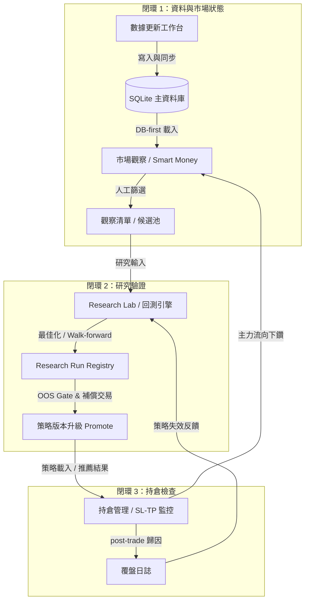

# 台股投資決策系統：最終樣貌與架構說明書

> **最後更新**：2026-06-15  
> **定位**：本文件是本系統的最終樣貌規劃、程式框架架構與 6 個月 Roadmap 演進的完整說明書，旨在清晰描繪系統的終極能力與核心邊界。

---

## 1. 系統的核心定位與願景

本系統並非「預測明日漲跌」的黑箱報牌工具，而是一個**「可驗證、可回溯、可演化」的台股投資決策系統（Investment Decision System, IDS）**。其核心願景是通過「嚴格的數據時序治理」與「科學的回測實證」，將人類的主觀分析、技術指標與籌碼因子轉換為可追溯的策略版本，並在持倉管理中建立反饋閉環。

系統最終會將以下**「三個產品閉環」**推向成熟：



---

## 2. 完整的程式分層框架

系統採用明確的**單向依賴分層架構**，確保金融計算與 UI 界面解耦，便於自動化測試與靜態合規掃描。

```text
PySide6 視覺介面層 (ui_qt/)
       |
       v
應用協調與儲存服務層 (app_module/)
       |
       +---> 決策與因子領域層 (decision_module/)
       |
       +---> 回測撮合引擎層 (backtest_module/)
       |
       +---> 持倉帳務領域層 (portfolio_module/)
       |
       +---> 數據存儲底座層 (data_module/)
       |
       v
Runtime 運作核心層 (runtime/)
```

### 2.1 各分層的責任與核心組件

#### A. 視覺介面層 (UI Layer - `ui_qt/`)
- **責任**：收集使用者操作、設定參數，並非同步呼叫應用服務（防止 UI 假死）；直觀呈現績效、指標對比及圖表。
- **頂層工作區**：
  1. **數據更新**：提供快速更新（直寫 SQLite）與安全更新（備份 CSV + SQLite），提供唯讀式 SQLite 資料檢視器。
  2. **市場觀察**：包含大盤 Regime 信心檢測、強弱勢個股與產業排名，以及 Smart Money 主力資金流向。
  3. **策略回測 / Research Lab**：整合單股、批次、組合、回放及策略研究等 5 種實驗模式。
  4. **推薦分析**：基於 Profile 一鍵配置或進階參數生成當日推薦，拆解 Why / Why Not。
  5. **觀察清單**：管理候選 Universe。
  6. **持倉管理**：記錄真實或模擬持倉，提供價格、損益與籌碼監控。
  7. **Runtime Observatory**：唯讀觀測狀態機運作與事件日誌。

#### B. 應用與儲存服務層 (Application Layer - `app_module/`)
- **責任**：封裝 Use Cases、組裝 DTO、管理儲存庫（Repository）與版本控制。
- **儲存防線**：`ResearchRunService` 統一管理 metadata（SQLite）與明細（Parquet），使用 Staging 狀態機與 Hash Integrity 確保資料不損壞、不覆寫。
- **報告防線**：`ReportExportService` 負責在背景 thread 將回測或推薦快照規格化匯出成 Excel，使用臨時檔寫入後進行 `os.replace` 原子替換。

#### C. 決策與因子領域層 (Decision Domain - `decision_module/`)
- **責任**：管理策略配置、指標與權重契約，以及百分位數排名與因子層。
- **三大安全防線**：
  - **參數契約 (`IndicatorParameterRegistry`)**：嚴格限制指標範圍與型態，非法值 Fail-Closed。
  - **權重契約 (`RecommendationWeightContract`)**：限制 key 為 `pattern`、`technical`、`volume`，值為整數 bp，總和必為 10000。
  - **時序分位數 (`ScoreThresholdPolicy`)**：分位數買賣門檻僅能使用 T-1 日以前的 Expanding 歷史分布，暖機期 60 天，徹底防止未來函數。
  - **因子層 v1 (`factors/`)**：建立 `FactorRecord` 品質三態（observed / estimated / missing）與 `FactorGate`（Look-ahead 門禁），防範未來數據滲漏。

#### D. 回測撮合引擎層 (Backtest Engine - `backtest_module/`)
- **責任**：模擬台股交易機制、撮合、費用、滑價與風控。
- **金額防線**：全面改用 `Decimal` 計算交易成本、手續費與 PnL，杜絕裸 `float` 精度漏洞。
- **時間軸防線**：限制訊號最早於 T+1 開盤成交 (`next_open`)，不混淆 OOS 與 IS 資料。

#### E. 持倉與帳務層 (Portfolio Domain - `portfolio_module/` & `app_module/`)
- **責任**：管理交易明細、持倉平均成本、實現/未實現損益、停損停利 (SL/TP) 警示。
- **來源追溯**：持倉能明確關聯其來源（如推薦 Profile、特定回測 Run 或 Promoted 策略版本）。

#### F. 數據存儲底座層 (Data Infrastructure - `data_module/`)
- **責任**：管理 SQLite 資料庫 (`twstock.db`) 與 CSV 檔案，設定統一配置 `TWStockConfig`。

#### G. Runtime 運作核心層 (Runtime Core - `runtime/`)
- **責任**：以有限狀態機 (FSM) 驅動系統事件，保障核心狀態不因意外崩潰而失控。

---

## 3. 系統最終能做到哪些事？

當系統完全演進至最終狀態時，將能實現以下全自動與受控工作流：

### 3.1 數據同步與高速檢視
- **能做到的事**：
  - 每天自動抓取並同步台股每日股價、大盤指數、產業指數、券商分點與技術指標。
  - 數據載入較 CSV 提速 **320 倍以上**（複合索引 SQLite 查詢僅需 20~30 毫秒）。
  - 使用者能直接在 UI 透過穩定分頁檢視幾百萬筆資料，自由篩選、排序、並將唯讀查詢結果原子化地匯出為符合 Excel 規範的報告。

### 3.2 嚴格治理的策略推薦與評分
- **能做到的事**：
  - 使用者可選擇不同的策略範本（暴衝/穩健/長期等 Profile）進行一鍵個股評分。
  - **橫斷面百分位排名 (Quantile Mode)**：可對當日符合 Universe 門檻的全部股票計算分位數，排除因大盤暴漲暴跌導致絕對分數失效的缺點。
  - 清楚拆解並說明為何入選（Why）與為何被淘汰（Why Not），將主觀分析公式化與參數化。

### 3.3 零未來函數的科學化回測與驗證
- **能做到的事**：
  - **單股與批次並行回測**：支援多核心 CPU 並行運算，可同時回測上百檔股票，且具備安全取消機制。
  - **推薦組合歷史回放**：模擬過去數年每週或每期套用推薦 Profile 的投資組合淨值曲線，展示 Rolling Sharpe、Sortino 及蒙地卡羅模擬（P05/P50/P95）的極端風險。
  - **滾動式 walk-forward 驗證**：自動進行 Out-of-Sample (OOS) 的滾動訓練與測試，確保參數最佳化不是來自於對歷史資料的過度擬合 (Overfitting)。

### 3.4 具交易完整性與原子性的策略升級 (Promotion Gate)
- **能做到的事**：
  - 研究結果在滿足最少交易次數門檻 (例如 10 筆以上 OOS 交易) 且資料完整性檢核成功後，可一鍵升級為正式「策略版本」。
  - 升級過程跨越 SQLite 數據庫與 JSON 版本文件，具備補償交易（寫入失敗時自動回滾 JSON）與雙向對齊（Reconciliation），絕不遺留懸空版本或版本衝突。

### 3.5 主動監控的持倉與籌碼流向下鑽
- **能做到的事**：
  - 結合當前最新股價，即時更新庫存持倉的未實現損益（Decimal 級精度）。
  - **主動 SL/TP 風控警告**：當股價跌破停損線或漲過停利線時，持倉狀態自動變更為「假設失效」並顯示複合警示。
  - **主力籌碼流向下鑽**：使用者可一鍵下鑽 (Drill-Down) 至主力流向 Tab，系統會自動高亮並定位該持倉個股的最新分點買賣張數、集中度與異常籌碼行為。

---

## 4. 系統 Roadmap 演進與最終狀態

系統的研發進度規劃為 6 個月，目前已完成 Month 1~3 的核心地基：

### 4.1 已完成的里程碑 (Month 1 ~ Month 3)
- **Month 1（實證與分頁匯出）**：
  - 完成了 fixed / quantile 雙模式的 walk-forward 實證基準線與 regime 分層歸因。
  - 實作了 SQLite 資料分頁與 Excel 背景原子寫入。
- **Month 2（研究儲存與 Promote）**：
  - 實作了 `IndicatorParameterRegistry` 與 `WeightContract` 參數權重 bp 契約。
  - 建立了 `ResearchRunRegistry`（SQLite + Parquet）的 immutable 儲存、crash recovery 與橫向對比 (2-5 run) 頁面。
  - 實作了基於 Registry 的 Promote Gate 與 JSON 補償交易。
- **Month 3（Factor Layer 基礎）**：
  - 建立了可防未來函數的 Factor Contract、Look-ahead Gate、既有技術/量能/籌碼 adapter，並將因子 snapshot 序列化寫入 Research Run。

### 4.2 未來 Roadmap 規劃 (Month 4 ~ Month 6)

後續月份將逐步推進「外部因子擴充」與「策略生命週期」，這也是程式的**最終樣貌完成期**：

```text
               【Month 4】                           【Month 5】                           【Month 6】
      ┌─────────────────────────────┐       ┌─────────────────────────────┐       ┌─────────────────────────────┐
      │     基本面與估值因子 v1      │       │     三大法人與籌碼共振      │       │    策略生命週期與後驗歸因    │
      ├─────────────────────────────┤       ├─────────────────────────────┤       ├─────────────────────────────┤
      │ • 接入月營收與財報數據        │       │ • 接入三大法人買賣超數據     │       │ • 建立 Promote/Demote/Retire│
      │ • 實作 YoY / MoM 因子        │ ───>  │ • 計算法人連買/成交占比     │ ───>  │   策略生命週期淘汰機制       │
      │ • 建立 PE / PB / PS 估值分位 │       │ • 法人與分點籌碼共振/背離    │       │ • 實作 post-trade 績效歸因  │
      │ • avaliable_date 時序防線   │       │   診斷模型                  │       │ • 分析回測與實盤滑價落差     │
      └─────────────────────────────┘       └─────────────────────────────┘       └─────────────────────────────┘
```

- **Month 4：基本面與估值因子 v1**
  - **功能**：新增月營收與公司財報資料表，計算營收增長與財務指標。建立 P/E、P/B、P/S 等產業相對估值因子。
  - **防線**：因子公告日時序防線（Available Date），回測與評分只能讀取該決策日當下已公告的營收。
- **Month 5：三大法人與籌碼因子 v1**
  - **功能**：接入外資、投信、自營商買賣超資料，計算連買連賣、成交占比等。
  - **能做到的事**：將三大法人因子的「大資金流向」與券商分點的「主力流向」進行交叉對比，形成「籌碼共振與背離診斷」。
- **Month 6：策略生命週期與 Portfolio 回饋**
  - **功能**：建立系統性的策略生命週期規則（Promote / Demote / Retire）。
  - **能做到的事**：
    - 策略版本不能只因一次高回測報酬就被保留，若在實盤/模擬中 Sharpe 退化、出現資料漂移或交易量萎縮，系統將自動建議 Demote（降級）或 Retire（淘汰）。
    - 實作持倉的後驗歸因（Post-trade attribution），自動統計實盤滑價、進場點偏離度，並回答「這筆交易的原始策略假設是否仍成立」。

---

## 5. 系統最終樣貌總結

當 Month 6 結束時，本股票決策程式將成為一個**高度工程化、安全且具有嚴格防禦機制的台股量化工作台**：
1. **數據層**：SQLite-first 複合存儲，完美兼顧 CSV 人工檢查與 DB 高速查詢。
2. **決策層**：由 Registry 時序 Gate 與 bp 契約把關，徹底杜絕主觀猜測與過度擬合的「未來函數」。
3. **研究層**：具備並行回測、最佳化、Walk-forward 與多 Run 對比分析，每一次策略的優劣都是數據說了算。
4. **交易層（持倉面）**：與策略版本、籌碼流向、SL/TP 風控及覆盤日誌完全打通，讓持倉不僅是損益數字，更是策略假設的「後驗實驗室」。
