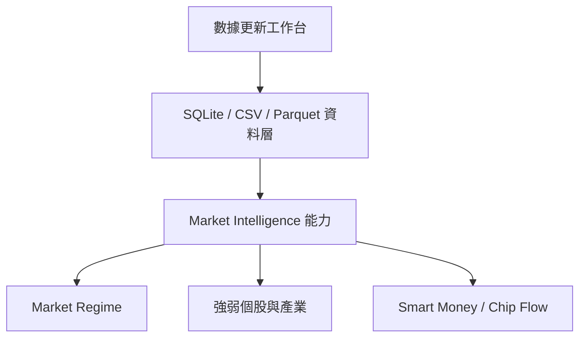
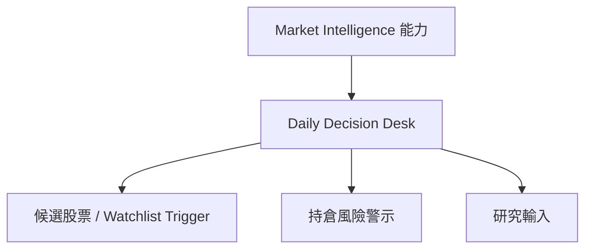
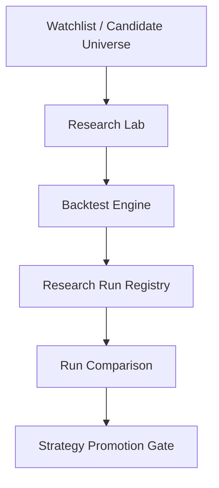
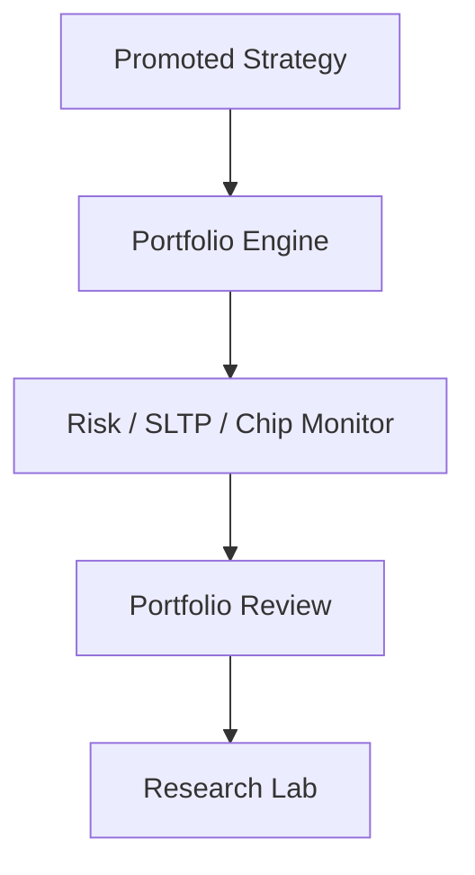

# baldr：North Star、Current State、Evidence Framework

> **最後更新**：2026-06-18
> **文件性質**：本文件描述 baldr 的長期北極星、目前邊界與投資有效性驗證架構。
> **核心原則**：本系統不以自動交易、不以 AI 報牌、不以預測明日漲跌為目標；本系統的目標是建立一套可驗證、可回溯、可解釋、可持續改進的台股投資研究與決策工作台。
> **權威邊界**：本文件提供產品願景、現況邊界與證據要求，不取代 Scoped SSOT。當前實作狀態以 `docs/00_core/PROJECT_SNAPSHOT.md` 為準；未來 6 個月工程路線以 `docs/00_core/ROADMAP_6M_ENGINEERING.md` 為準；目前模組邊界以 `docs/01_architecture/system_architecture.md` 為準；操作方式以 `docs/07_guides/APPLICATION_MANUAL.md` 為準。

---

## 0. 文件閱讀規則

本文件分為三種資訊：

1. **North Star**：系統長期最終樣貌，不代表目前已完全完成。
2. **Current State**：截至本文更新日，已經存在於系統中的能力與明確邊界。
3. **Evidence Requirement**：每項能力要被視為「投資上有用」之前，必須通過的驗證標準。

本文件不得把「功能已完成」等同於「投資效果已證明」。所有 v1 能力都必須標示其工程狀態、資料完整度、驗證狀態與投資有效性證據。

判讀規則：

- 「已完成 v1」只代表工程入口或資料契約存在，不代表訊號具備正向期望值。
- 「可用」只代表可操作或可產出結果，不代表可直接採信為買賣建議。
- 「未證明」不是失敗，而是尚未累積足夠 forward evidence、out-of-sample evidence 或 live-vs-research evidence。
- 若本文件與 Snapshot、6M Roadmap、Architecture 或 Manual 衝突，依對應 scoped authority 修正本文件。

---

## 1. 系統核心定位

本系統並非「預測明日漲跌」的黑箱報牌工具，也不是自動交易系統。

baldr 是一套以「市場觀察、決策摘要、策略驗證、持倉追蹤、覆盤回饋」為核心的台股研究與投資決策工作台。系統每天最重要的任務，是穩定回答以下五個問題：

1. 現在市場處於什麼狀態？
2. 哪些產業與股票正在轉強或轉弱？
3. 哪些股票值得進一步研究？
4. 我的持倉是否仍符合原始投資假設？
5. 我的策略是否正在失效或需要調整？

所有資料更新、技術指標、籌碼因子、基本面因子、回測、推薦、持倉管理與覆盤功能，都應服務於上述五個問題。系統的北極星不是「做出最多功能」，而是讓使用者能形成清楚、可驗證、可回溯的市場判斷與研究紀律。

本系統的第一階段成功標準，不是保證創造 Alpha，而是提升投資決策品質、降低錯誤決策、提升研究可追溯性，並逐步累積可驗證的投資有效性證據。

---

## 2. 設計第一原則

### 2.1 Decision First

本系統優先是一個投資決策工作台，其次才是量化研究平台。功能優先順序應為：

```text
市場判斷
↓
候選股票
↓
研究驗證
↓
持倉檢查
↓
覆盤回饋
```

回測與因子研究很重要，但它們必須回到最終問題：今天市場怎麼了、我該研究誰、我的持倉有沒有變壞、策略是否仍有效。

### 2.2 可驗證

任何推薦、排名、策略與警示，都必須能回到明確資料來源、參數設定與計算邏輯。系統不得只輸出「推薦買入」，而應輸出入選原因、排除原因、風險與資料品質。

### 2.3 可回溯

任何研究結果、推薦清單、回測結果、持倉來源與策略版本，都應保留當時的資料快照、參數、版本與輸出結果，讓使用者能回答：

```text
當時為什麼選這支股票？
當時的市場狀態是什麼？
當時策略版本是什麼？
當時回測證據是什麼？
後來失效的原因是什麼？
```

### 2.4 可解釋

系統不應只產生分數，而要能拆解分數。每一支股票至少應能輸出：

```text
Why：為什麼入選？
Why Not：為什麼被淘汰？
Risk：主要風險是什麼？
Drift：目前是否偏離原始投資假設？
Evidence：這項判斷有沒有被歷史或 forward evidence 支持？
```

Explainability 必須由資料結構、規則、欄位、分數拆解與 UI 呈現支撐，不應依賴 AI 自然語言生成來補足核心證據。長文字原因不是目標；更理想的呈現是因子貢獻、檢核矩陣、資料品質與風險標籤。

### 2.5 防止未來函數

所有回測、推薦、分位數門檻、基本面因子與籌碼因子，都必須遵守時間序列治理：

```text
決策日只能使用當時已知資料。
```

任何因子若無法確認資料可用日期，必須依政策標記為 `estimated`、`missing`、`neutral` 或 `skipped`，不得直接當成 `observed` 使用。

---

## 3. baldr 四大核心閉環

系統最終應形成四個閉環。現況上，閉環 1、2、3 已有可用基礎；閉環 4 已有 Portfolio 監控、Strategy Lifecycle、Post-trade Attribution 與 Portfolio Review snapshot 的 v1 入口。這些 v1 仍需要投資有效性驗證。

### 3.1 閉環 1：Data & Market State

目的：讓系統知道目前市場環境與資料品質。



此閉環回答：市場偏多還偏空、哪些產業正在轉強、資金流向是否集中、資料品質是否足夠。

資料風險：

- 公開或低成本資料源可能有配額、延遲、欄位調整與歷史缺漏。
- 還原股價、除權息、減資、處置股與停牌等台股微結構會直接影響回測可信度。
- 任何資料缺口都應顯示為品質狀態，不得靜默補成中性或已觀測。

### 3.2 閉環 2：Decision Desk

目的：把資料變成每日可檢閱的觀察結論，而不是把雜訊堆成儀表板。



Daily Decision Desk 已是主 UI 的頂層工作區 v1。此閉環要回答：今天市場是否值得積極研究、最強與最弱結構在哪裡、哪些股票剛進入觀察條件、哪些持倉出現警訊。

邊界：

- Daily Decision Desk 的「30 秒」只代表快速分流與風險掃描，不代表 30 秒完成買賣決策。
- Regime、Breadth、Sector Rotation 不能單獨成為買賣訊號。
- 所有摘要都必須保留資料日期、品質狀態與 warnings。

### 3.3 閉環 3：Research Validation

目的：驗證候選股票與策略假設。



此閉環回答：條件過去是否有效、不同 Regime 下表現如何、是否過度擬合、是否值得升級為策略版本。

驗證邊界：

- 回測與推薦回放不是實盤績效。
- 推薦組合回放需要揭露現金、權重、未成交、流動性、跳空與成本假設。
- 策略升級不能只看單次高報酬，必須通過 OOS、benchmark、風險與資料品質 Gate。

### 3.4 閉環 4：Portfolio Feedback

目的：讓持倉成為策略驗證的一部分，而不只是損益紀錄。



此閉環回答：持倉來自哪個策略、當初買入假設是否仍成立、目前是正常回撤還是策略失效、實際表現與回測預期差在哪裡。

關鍵邊界：

- Strategy Drift 不應懲罰「因股價上漲造成估值變貴」本身，而應聚焦底層投資假設是否崩壞。
- Post-trade Attribution 不應只做學術化績效拆解；它應協助辨識訊號、執行、資料品質、市場 Regime 與使用者行為落差。
- 若未記錄實際交易與人工偏離，Live vs Research Gap 只能視為模擬持倉與研究預期差距，不得宣稱為真實帳戶績效歸因。

---

## 4. Daily Decision Desk Contract

Daily Decision Desk 是 baldr 的每日決策入口。它不得在 UI 層重算 domain logic，只能消費 application service 產出的 snapshot。

### 4.1 輸入

Daily Decision Desk 目標輸入：

- Market Regime snapshot
- Market Breadth snapshot
- Sector Rotation snapshot
- Relative Strength / Liquidity snapshot
- Smart Money / Chip Flow snapshot
- Watchlist Trigger snapshot
- Portfolio Alert snapshot
- Fundamental diagnostics snapshot
- Data Quality snapshot

### 4.2 輸出

每日必須輸出三個答案：

1. 今天市場怎麼了？
2. 我該研究誰？
3. 我的持倉有沒有問題？

輸出不應是紅綠燈買賣建議，而應是結構化檢閱清單。

### 4.3 最低可用標準

使用者應能在短時間內看到：

- 市場狀態與資料日期
- 最強 / 最弱產業或題材結構
- 新進候選股與主要觸發條件
- 高風險持倉與風險來源
- 今日不應過度解讀的資料缺口

### 4.4 禁止事項

- UI 不得重算策略分數。
- UI 不得自行生成未經 service 驗證的推薦理由。
- UI 不得把 missing data 當成強訊號。
- UI 不得把 v1 訊號包裝成高信心買賣建議。
- Regime 不得作為單一股票進出場的絕對濾網。

### 4.5 現況邊界

| Section | 工程狀態 | 主要資料來源 | 邊界 |
|---|---|---|---|
| Market Regime | 已有基礎 | 價格、技術與市場資料 | 不能單獨作買賣濾網。 |
| Market Breadth | v1 已接線 | SQLite `daily_prices` | 需驗證轉弱 / 轉強提示能力。 |
| Sector Rotation | v1 已接線 | SQLite `industry_indices` | 官方產業分類可能無法反映台股題材輪動，後續需概念板塊能力。 |
| Relative Strength / Liquidity | v1 已接線 | SQLite `daily_prices` | 需追蹤被標示強勢 / 弱勢 / 低流動性的後續表現。 |
| Watchlist Trigger | v1 已接線 | `WatchlistService`、SQLite `technical_indicators` | 需 forward return 與 benchmark-relative 驗證。 |
| Portfolio Alert | v1 已接線 | Portfolio、Condition Monitor、Chip Monitor | 需驗證警示是否提前辨識風險惡化。 |
| Fundamental Risk Prompt | v1 已接線 | Fundamental diagnostics | 不得轉成高信心買賣理由。 |

---

## 5. Current Architecture

目前架構權威仍是 [system_architecture.md](system_architecture.md)。本節只摘要真實存在的模組與邊界。

```text
PySide6 UI
  ui_qt/
      |
      v
Application Services / DTO / Repository
  app_module/
      |
      +--> Decision Domain
      |      decision_module/
      |
      +--> Backtest Engine
      |      backtest_module/
      |
      +--> Portfolio Domain
      |      portfolio_module/
      |
      +--> Data Infrastructure
      |      data_module/
      |
      +--> Runtime Core
             runtime/
```

| 模組 / 服務 | 目前狀態 | 是否正式存在 | 權威文件 | 備註 |
|---|---|---|---|---|
| `ui_qt/` | 已存在 | 是 | `system_architecture.md` | 主 UI 層，目前 8 個頂層工作區。 |
| `app_module/` | 已存在 | 是 | `system_architecture.md` | use case、DTO、service orchestration、Repository。 |
| `decision_module/` | 已存在 | 是 | `system_architecture.md` | 策略、因子、評分、Regime、Screener。 |
| `backtest_module/` | 已存在 | 是 | `system_architecture.md` | 回測、撮合、成本、績效。 |
| `portfolio_module/` | 已存在 | 是 | `system_architecture.md` | 持倉帳務與 Decimal 邊界。 |
| `data_module/` | 已存在 | 是 | `system_architecture.md` | SQLite / CSV / Parquet、資料治理與 fundamental provider。 |
| `runtime/` | 已存在 | 是 | `system_architecture.md` | 背景任務、事件、狀態與治理觀測。 |
| `market_module/` | 目標方向 | 否 | 本文件僅描述願景 | 不得假設目前已有獨立 market domain。 |

---

## 6. Target Architecture

Target Architecture 描述 baldr 長期希望演進的模組邊界，不代表目前皆已存在。

```text
PySide6 視覺介面層 (ui_qt/)
        |
        v
應用協調與儲存服務層 (app_module/)
        |
        +---> 市場決策領域層 (market_module/)        [目標模組，尚未建立]
        |
        +---> 決策與因子領域層 (decision_module/)
        |
        +---> 回測撮合引擎層 (backtest_module/)
        |
        +---> 持倉帳務領域層 (portfolio_module/)
        |
        +---> 數據存儲底座層 (data_module/)
        |
        v
Runtime 運作核心層 (runtime/)
```

目標深化方向：

- Market Intelligence 可考慮從目前分散於 `app_module` / `decision_module` 的能力中，整理出獨立市場領域層。
- Portfolio Replay 可從推薦組合回放逐步深化為更完整的 execution model，包含零股、買賣價差、完整撮合與跳空成交風險。
- Sector Rotation 不應只依賴官方產業分類，長期應支援使用者自定義概念板塊或題材籃子。
- Smart Money / Chip Flow 在三大法人正式接入前，不得被描述為完整台股資金流模型。
- Passive Flow Noise 不應宣稱可精準剝離被動 ETF 資金；可降級為 ETF 審核月份、權重調整日前後的異常波動警示。

---

## 7. Data Governance & No-look-ahead Policy

### 7.1 資料可得日

所有因子與研究資料都應保存：

```text
symbol
factor_name
value
as_of_date
available_date
source
source_version
quality
missing_policy
```

`available_date > decision_date` 的資料不得進入回測、推薦、排名或策略升級判斷。

### 7.2 還原股價與權息風險

台股長期回測高度依賴權息、減資、面額變更與停復牌事件治理。若歷史技術指標使用未正確隔離的事後還原股價，會形成未來函數。

要求：

- 回測資料必須標示使用原始價、調整價或特定調整政策。
- 任何使用調整價的研究，都必須確認調整政策不使用決策日不可得資訊。
- 除權息、減資、處置股與停牌事件應納入資料品質與成交限制標籤。

### 7.3 基本面資料保守政策

基本面因子在 PIT 公告日、財報修正、一次性損益、業外收益與資料來源治理未完成前，不得直接作為高信心選股分數來源。

第一階段 Fundamental Layer 的責任是：

1. 提供 diagnostics。
2. 標記異常。
3. 輔助降權。
4. 提醒人工檢查。

不得自動產生單點合理價，不得自動假設 P/E 低估，不得把營收成長直接視為買進理由。

### 7.4 籌碼資料保守政策

三大法人正式接入前，Smart Money / Chip Flow 不得被描述為完整台股資金流模型。

券商分點、法人、ETF 被動調整、產業權重變化與價格延續性必須分開解讀。系統不得把單日法人買超或單一分點集中直接解釋為主動看多。

---

## 8. Signal / Factor / Alert Catalog

本節列出主要訊號類型的定位與證據要求。它是概念目錄，不是完整程式 API。

| 類型 | 目前定位 | 不得宣稱 | 必須補的證據 |
|---|---|---|---|
| Market Regime | 市場環境與風險預算參考 | 不得當成單股買賣絕對濾網 | 各 Regime 下策略 forward return、drawdown、勝率與失效特徵。 |
| Market Breadth | 市場健康度與擴散程度 | 不得宣稱可精準抓轉折 | 寬度惡化 / 改善後 5 / 10 / 20 / 60 日市場與策略表現。 |
| Sector Rotation | 產業或題材強弱觀察 | 不得用官方產業分類代表全部題材流 | 產業 / 概念籃子 forward return 與擴散率驗證。 |
| Relative Strength | 個股強弱排序 | 不得直接等同追價買點 | 強勢 / 弱勢分組後續報酬、波動、回撤與成交可行性。 |
| Liquidity Gate | 成交可行性與假績效防線 | 不得假設低流動性股票可用理想價格成交 | 排除組 vs 未排除組的滑價、成交困難與風險事件差異。 |
| Watchlist Trigger | 候選研究入口 | 不得宣稱入選即具買進價值 | 入選事件的 forward return、相對大盤與相對同產業超額報酬。 |
| Portfolio Alert | 持倉風險提示 | 不得以警示數量代表有效 | 警示後最大不利變動、是否提前於停損、誤報率。 |
| Fundamental Diagnostics | 基本面風險與人工檢查提示 | 不得直接生成目標價或買賣建議 | diagnostics 後續是否降低錯誤研究或提前辨識基本面惡化。 |
| Smart Money / Chip Flow | 籌碼風險與集中度觀察 | 不得宣稱完整法人資金流模型 | 分點 / 法人 / 信用資料接入後的 forward evidence 與假訊號率。 |

---

## 9. Explainability Layer

Explainability Layer 是系統核心，不是附屬功能。每一個推薦、淘汰、警示與策略結果，都應能轉換成可理解的原因與證據。

### 9.1 股票層級解釋

每支股票應輸出：

- Why：入選原因。
- Why Not：排除原因。
- Risk：主要風險。
- Evidence：該類型訊號過去是否有效。
- Data Quality：資料是否 observed、estimated、degraded 或 missing。

呈現方式應優先採用檢核矩陣、因子貢獻、風險標籤與資料品質，而不是冗長文字敘事。

### 9.2 策略層級解釋

每個策略應輸出：

- 有效市場 Regime。
- 失效市場 Regime。
- 主要獲利來源。
- 主要虧損來源。
- OOS 表現。
- IS / OOS 差異。
- benchmark-relative attribution。
- factor attribution。

### 9.3 持倉層級解釋

每筆持倉應輸出：

- 原始假設。
- 目前狀態。
- 偏離項目。
- 風險事件。
- 執行落差。
- 使用者人工偏離或行為滑點（若有記錄）。

---

## 10. Portfolio Feedback & Strategy Lifecycle

Month 6 v1 已建立 Strategy Lifecycle 與 Portfolio Feedback 的第一輪 service / gate / UI 入口，但它仍屬可驗證工程基礎，不代表投資效果已證明。

### 10.1 策略升級

策略不能只靠單次高報酬被升級。至少需要：

- 交易次數。
- 總報酬。
- Sharpe。
- 最大回撤。
- 勝率。
- benchmark excess return。
- factor quality。
- regime compatibility。
- Research Run Registry committed / valid 狀態。

### 10.2 Demote / Retire

Demote / retire 應先產生 proposed evidence，不得自動刪除或覆寫策略版本。所有降級與淘汰原因都必須保存。

### 10.3 Drift 判斷

Drift 應聚焦「原始投資假設是否仍成立」，而非單純指標離開買入區間。

範例：

- 股價上漲導致估值變高，不必然代表 thesis 崩壞。
- 營運邏輯、籌碼結構、資料品質或市場 Regime 發生不利改變，才是更重要的 drift evidence。

### 10.4 Live vs Research Gap

Live vs Research Gap 應追蹤：

- 回測報酬。
- 推薦回放報酬。
- 實際持倉報酬或模擬持倉報酬。
- 滑價差異。
- 未成交比例。
- 跳空影響。
- 流動性限制。
- Regime 變化。
- 策略衰退。
- 使用者未依規則執行造成的行為落差（若有紀錄）。

若無真實交易紀錄，系統只能宣稱「研究 / 模擬持倉落差」，不得宣稱完整實盤歸因。

---

## 11. 投資有效性驗證框架

本系統不得只以功能完成度判斷成功。任何推薦、警示、排名、策略或市場狀態分類，都必須逐步通過投資有效性驗證。

### 11.1 Watchlist Trigger 驗證

每一個 Watchlist Trigger 入選事件，都應保存：

- 入選日期。
- 入選原因。
- 當日市場 Regime。
- 所屬產業或概念板塊。
- 流動性狀態。
- 風險標籤。
- 5 / 10 / 20 / 60 日 forward return。
- 相對大盤超額報酬。
- 相對同產業或同概念板塊超額報酬。

驗收標準不是「能產生候選股」，而是候選股在扣除風險與流動性限制後，是否持續優於合理 benchmark。

### 11.2 Market Regime 驗證

Market Regime 不得只是顯示 Bull、Neutral、Bear。每一種 Regime 都必須回答：

- 該 Regime 下哪些策略有效？
- 哪些策略失效？
- 平均 forward return 如何？
- 最大回撤是否擴大？
- 是否應改變持倉上限、候選股門檻或風險預算？

如果 Regime 不會改變系統行為，它就只是裝飾性標籤。

### 11.3 Portfolio Alert 驗證

每一個 Portfolio Alert 都應追蹤：

- 警示日期。
- 警示類型。
- 警示後 5 / 10 / 20 日最大不利變動。
- 是否提前於停損發生。
- 是否避免持倉惡化。
- 是否過度誤報。

Portfolio Alert 的價值不是發出很多警示，而是能否有效辨識風險惡化。

### 11.4 Why Not / Liquidity Gate 驗證

被系統排除的股票也要追蹤，否則無法知道排除規則是否有效。

系統應比較：

- 被 Liquidity Gate 排除的股票。
- 被 Why Not 排除的股票。
- 未被排除的股票。

並觀察後續報酬、波動、滑價、成交困難與風險事件差異。如果排除規則沒有改善結果，該 Gate 就必須調整或降權。

### 11.5 Fundamental Diagnostics 驗證

基本面 diagnostics 應追蹤：

- 被標記為營收 / 獲利背離的股票後續表現。
- 業外收益異常標記後的報酬、波動與股利事件。
- 基本面風險提示是否真的降低錯誤研究或錯誤持倉。
- 哪些 diagnostics 只是雜訊，應降權或移除。

### 11.6 Smart Money / Chip Flow 驗證

籌碼訊號應分開驗證：

- 券商分點集中度。
- 三大法人買賣超。
- 投信連續買盤。
- 信用交易變化。
- ETF 權重調整與被動資金事件。

若無法拆解主動與被動資金，不得宣稱完成資金流判斷；只能標示為候選風險或待人工確認。

### 11.7 Live vs Research Gap

所有策略升級後，都必須追蹤實際表現與研究預期的差距：

- 回測報酬。
- 推薦回放報酬。
- 實際持倉報酬。
- 滑價差異。
- 未成交比例。
- 跳空影響。
- 流動性限制。
- Regime 變化。
- 策略衰退。

如果 live performance 長期低於 research performance，系統必須能歸因原因。

---

## 12. 目前能力盤點

| 能力 | 工程狀態 | 資料完整度 | 驗證狀態 | 投資有效性證據 |
|---|---|---|---|---|
| SQLite-first 更新、查詢與分頁 | 已完成 | 價格、指標、產業、券商分點與 fundamental tables 已有正式 SQLite 路徑 | 工程回歸已建立 | 不直接產生投資效果；作為資料可信度基礎。 |
| CSV 備份與 Excel 匯出 | 已完成 | CSV / Excel 輸出可作人工檢查 | 工程回歸已建立 | 不直接產生投資效果；提升追溯與審核能力。 |
| Market Regime | 基礎已存在 | 依價格、技術與市場資料 | 需 regime forward performance 驗證 | 尚未證明。 |
| Market Breadth | v1 已完成 | SQLite `daily_prices` 已接 | 需轉折提示能力驗證 | 尚未證明。 |
| Sector Rotation | v1 已完成 | SQLite `industry_indices` 已接 | 需與產業 / 概念 forward return 對照 | 尚未證明；官方產業分類限制需揭露。 |
| Relative Strength / Liquidity Ranking | v1 已完成 | SQLite `daily_prices` 已接 | 需分組 forward return 與成交可行性驗證 | 尚未證明。 |
| Watchlist Trigger | v1 已完成 | `technical_indicators` 已接 | 需 5 / 10 / 20 / 60 日 forward return | 尚未證明。 |
| Portfolio Alert | v1 已完成 | 價格、策略條件、部分籌碼已接 | 需警示後最大不利變動與誤報率驗證 | 尚未證明。 |
| Research Run Registry | 已完成基礎 | metadata、Parquet、hash、comparison、promotion gate | 工程與治理 gate 已建立 | 支援研究可信度；不等同策略有效。 |
| fixed / quantile OOS 實證 | 已完成 | 10 檔 OOS、Regime coverage | fixed / quantile 比較已完成 | quantile 未優於 fixed，維持 opt-in。 |
| Factor Layer v1 | 已完成 v1 | 技術、量能、券商分點、fundamental diagnostics 可形成 records / metadata | FactorGate 與 no-look-ahead 邊界已建立 | 因子投資有效性仍需逐項驗證。 |
| 推薦組合回放 | 可信度 v1 已完成 | 現金、權重、未成交、流動性與 gap labels 已揭露 | 工程可信度提升 | 仍不是實盤績效；需 live-vs-research 驗證。 |
| Portfolio 監控 | 已完成基礎 | 持倉、價格、SL/TP、來源追溯、籌碼監控 | 工程回歸已建立 | 需警示命中率與錯誤交易降低證據。 |
| Strategy Lifecycle / Portfolio Feedback | v1 已完成 | Registry metadata、factor snapshot、regime breakdown、portfolio source trace | lifecycle gate / evidence / projection 已建立 | 投資有效性尚未證明；需 live-vs-research gap。 |
| Fundamental Layer | v1 已完成 | 月營收、季度財報、P/E 初版；多數歷史 baseline quality 仍需治理 | available_date gate 與 diagnostics 已建立 | 不應接入高信心 scoring；只作 diagnostics / risk prompts。 |
| Smart Money / 券商分點 | 已完成基礎 | MoneyDJ E/B ranked metric 與分點 registry 已治理 | 需與 forward outcome 對照 | 尚未證明；不得宣稱完整法人資金流。 |
| 三大法人 | 未完成 | 不完整 | 不適用 | 不適用。 |
| 信用交易 / 處置股完整風險模型 | 未完成 | 不完整 | 不適用 | 不適用。 |
| PDF 報告 | 未完成 | Excel 已完成 | 不適用 | 不適用。 |

---

## 13. Gap Register：目前主要缺口總表

Gap Register 用於把散落在架構、資料治理、能力盤點與 roadmap 中的缺口集中管理。它不是新的願景清單，而是目前最需要被追蹤的工程與投資驗證缺口。

Priority 代表目前對決策可信度的影響，不等同實作順序；Owner 代表責任領域，不代表單一人員。任何 gap 關閉前，必須同時滿足工程完成、資料治理、驗證輸出與文件同步。

| Gap | 類型 | Priority | Owner | 目前狀態 | 投資風險 / 影響 | Done Definition / 下一步驗收 |
|---|---|---|---|---|---|---|
| 三大法人資料 | 資料缺口 | P0 | Data / Market Intelligence | 未完成 | Smart Money / Chip Flow 不完整，無法區分外資、投信、自營商與券商分點訊號。 | 接入外資、投信、自營商資料；保存 `available_date`、`source_version`、`quality`；建立缺失與延遲標示；不得污染既有分點訊號。 |
| 信用交易資料 | 資料缺口 | P0 | Data / Risk | 未完成 | 無法完整判斷槓桿、散戶擁擠、融資斷頭與軋空風險。 | 建立融資融券餘額、增減、使用率與可得日治理；在 Watchlist、Portfolio Alert 與 Why Not 中以風險標籤呈現。 |
| 處置股 / 分盤 / 全額交割 | 微結構缺口 | P0 | Backtest / Risk | 未完成 | 回測與推薦可能高估成交可行性，低估無法買進、無法賣出與滑價風險。 | 建立交易限制標籤、日期區間、撮合限制與 Liquidity Gate；Portfolio Alert 能標示持倉進入限制交易狀態。 |
| 除權息 / 還原價時間軸 | 資料治理缺口 | P0 | Data / Backtest | 部分治理仍需補強 | 長期均線、動能與回測可能因錯誤還原價產生未來函數或不一致績效。 | 明確區分原始價、決策日可得還原價與事後完整還原價；所有策略特徵只能使用決策日可得版本。 |
| Portfolio Replay Engine | 執行模型缺口 | P1 | Backtest / Portfolio | 可信度 v1 完成，但仍不完整 | 推薦回放仍不是實盤模擬，可能低估零股、買賣價差、跳空、未成交與資金配置限制。 | 補零股 / 整股、買賣價差、完整撮合、gap limiter、成交率與未成交原因；輸出 replay credibility score。 |
| Concept Basket / 題材籃子 | 市場結構缺口 | P1 | Market Intelligence / UI | 未完成 | 官方產業分類無法捕捉台股題材輪動，Sector Rotation 可能輸出低解釋力訊號。 | 支援自定義概念板塊、概念 benchmark、成分股版本與有效日期；Sector Rotation 可同時顯示官方產業與概念籃子。 |
| Forward Performance Dashboard | 證據缺口 | P1 | Research / App | 未完成 | 無法證明 Watchlist Trigger、Recommendation、Why Not、Liquidity Gate 或 Portfolio Alert 是否有效。 | 追蹤事件後 5 / 10 / 20 / 60 日 forward return、benchmark excess return、industry / concept excess return、誤報率與樣本數。 |
| Live vs Research Gap Dashboard | 證據缺口 | P1 | Portfolio / Research | 未完成 | 無法比較研究預期與實際持倉落差，績效衰退無法歸因。 | 建立回測、推薦回放、實際持倉三層績效比較；歸因滑價、未成交、跳空、流動性、Regime 改變、策略衰退與行為偏差。 |
| Signal Decay Monitor | 策略生命週期缺口 | P2 | Research / Strategy Lifecycle | 未完成 | 舊訊號失效後可能仍被使用，策略退化無法及時降權或退休。 | 追蹤近期分層績效、hit rate、drawdown、regime dependency 與 rolling decay；串接 lifecycle gate 的 hold / demote / retire 判斷。 |
| Decision Quality Review | 管理流程缺口 | P2 | Portfolio / Manual Review | 未完成 | 系統可能產出資料，但無法證明使用者少犯錯或決策流程改善。 | 建立週 / 月覆盤紀錄，追蹤錯誤交易、未遵守系統建議、手動 override、錯過訊號與事後歸因。 |
| PDF / polished report | 輸出缺口 | P3 | Reporting / UI | 未完成，Excel 已完成 | 對外溝通與長週期研究封存仍依賴人工整理。 | 在 Excel payload 穩定後補 PDF 報告；報告須保留資料版本、參數、限制、缺失資料與 no-look-ahead 聲明。 |

---

## 14. Next Stage：Evidence-Driven baldr

完成 Month 1-6 的工程基礎後，下一階段不應再優先增加更多功能，而應優先驗證既有功能是否真的改善決策。

### Priority 1：Forward Performance Dashboard

追蹤 Watchlist Trigger、Recommendation、Why Not、Liquidity Gate、Portfolio Alert 的後續表現。

最低欄位：

- event_date
- symbol
- event_type
- reason
- regime
- sector / concept
- liquidity_state
- data_quality
- forward return：5 / 10 / 20 / 60 日
- benchmark excess return
- industry / concept excess return

### Priority 2：Live vs Research Gap Dashboard

追蹤實際持倉績效與研究 / 回測預期之間的差距，並歸因滑價、未成交、跳空、流動性、Regime 改變、策略衰退與使用者行為落差。

### Priority 3：Signal Decay Monitor

追蹤每個訊號近期是否失效，避免舊策略在市場結構改變後繼續被使用。

### Priority 4：Decision Quality Review

建立每週 / 每月決策覆盤，檢查系統是否真的幫助使用者少犯錯。

### Priority 5：台股微結構治理

優先補強：

- 處置股與分盤集合競價風險。
- 跳空鎖漲停 / 鎖跌停成交不可得風險。
- 除權息 / 還原價時間軸治理。
- 三大法人與信用交易資料的可得日與品質治理。
- 自定義概念板塊 / 題材籃子，以補官方產業分類不足。

---

## 15. 成功標準

baldr 的成功分為四層。

### Level 1：決策可用性

- 使用者能快速理解市場狀態、候選股與持倉風險。
- Daily Decision Desk 每日 snapshot 可回溯。
- 所有推薦與警示都有結構化原因。
- 所有資料缺口都有品質標示與 warnings。

### Level 2：研究可信度

- 所有回測遵守 No-look-ahead Gate。
- 所有研究結果保存參數、資料版本、策略版本與輸出。
- 所有策略升級都需要 OOS、Regime coverage、成本模型、benchmark 與資料品質檢查。

### Level 3：風險控制有效性

- Liquidity Gate 排除組的實際成交風險高於未排除組。
- Portfolio Alert 能提前辨識持倉惡化。
- Why Not 能降低低品質候選股進入研究流程的比例。
- Fundamental diagnostics 能降低錯誤解讀基本面訊號的比例。

### Level 4：投資有效性

- Watchlist Trigger 入選後的 forward return 優於合理 benchmark。
- 推薦組合扣除交易成本後仍具備穩定性。
- Live performance 與 Research performance 的落差可被解釋並逐步縮小。
- Strategy Lifecycle 能辨識訊號衰退，避免失效策略持續被採用。

---

## 16. 非目標

本系統明確不以以下事項為優先目標：

```text
自動下單
高頻交易
即時逐筆交易
黑箱 AI 報牌
預測明日漲跌
用單一總分取代完整研究流程
把 v1 訊號包裝成高信心買賣建議
在資料未治理前把新因子硬接 ScoringEngine
```

若未來增加 AI 輔助，也應只作為分析摘要、文件產生或查詢介面，不應取代系統本身的資料治理、回測驗證、持倉檢查與策略生命週期管理。

---

## 17. 更新記錄

### 2026-06-18

本次更新類型：

- Current State 更新。
- Evidence Requirement 更新。
- Architecture Boundary 更新。
- Roadmap 語氣修正。
- Naming / Brand Boundary 更新。
- Gap Register 更新。

新增內容：

- 新增文件閱讀規則，明確區分 North Star、Current State 與 Evidence Requirement。
- 新增 Daily Decision Desk Contract，將 30 秒語彙降級為快速分流與檢閱入口，不作草率交易承諾。
- 拆分 Current Architecture 與 Target Architecture，避免把 `market_module/` 等目標方向誤讀為已存在。
- 新增 Data Governance、Signal / Factor / Alert Catalog、Portfolio Feedback 邊界與投資有效性驗證框架。
- 新增 Gap Register，集中列出資料、微結構、執行模型、市場結構、證據、生命週期、覆盤與輸出缺口，並標示 priority、owner、投資風險與 Done Definition。
- 新增 Evidence-Driven baldr 下一階段，將後續重心轉向 forward performance、live-vs-research gap、signal decay 與 decision quality review。
- 統一專案品牌命名為小寫 `baldr`，所有舊專案命名語彙不再作為專案名稱使用。

降級 / 修正內容：

- 將所有 v1 能力改用工程狀態、資料完整度、驗證狀態與投資有效性證據描述。
- 明確標示 Daily Decision Desk、Market Breadth、Sector Rotation、Watchlist Trigger、Portfolio Alert、Fundamental Layer 與 Smart Money 尚未證明投資有效性。
- 將 Passive Flow Noise 從「可剝離被動資金」降級為 ETF 審核月份 / 權重調整日前後的異常波動警示方向。
- 強化基本面與籌碼資料的保守邊界，避免把 diagnostics 或分點資料誤讀為高信心選股訊號。

仍未證明：

- Watchlist Trigger forward return 是否優於 benchmark。
- Market Regime 是否能改善策略風險預算與決策品質。
- Portfolio Alert 是否能提前辨識持倉惡化並降低錯誤交易。
- Why Not / Liquidity Gate 是否真的改善候選股品質。
- Smart Money / Chip Flow 是否在補齊法人與信用交易資料後具備穩定效果。

下次必須補上的證據：

- Forward Performance Dashboard。
- Live vs Research Gap Dashboard。
- Signal Decay Monitor。
- Decision Quality Review。
- 台股微結構治理清單：處置股、跳空鎖死、除權息時間軸、三大法人與信用交易。

### 2026-06-17

- 同步 Month 4 / Month 5 closeout 狀態，標示 Daily Decision Desk、Market Breadth、Sector Rotation、Watchlist Trigger、Factor Layer v1、Portfolio Replay credibility v1 與 Fundamental Layer v1 已完成，並轉入 Month 6 Strategy Lifecycle / Portfolio Feedback。
- 同步 Month 6 Strategy Lifecycle / Portfolio Feedback v1，標示 Strategy Drift、Post-trade Attribution、Portfolio Review snapshot 與持倉管理生命週期回顧入口已完成第一版。

### 2026-06-15

- 依 baldr 最終樣貌重新整理北極星、四個產品閉環、Daily Decision Desk 目標、完成狀態盤點與 6 個月 Roadmap 對齊；明確標示已完成、進行中與未完成能力，避免將願景誤寫為現況。
