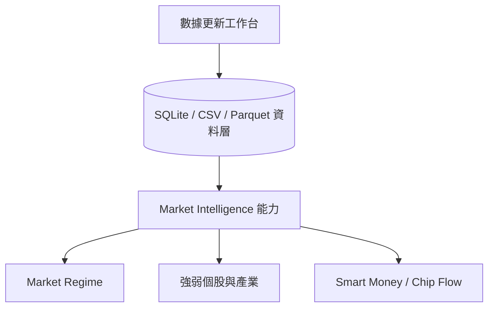
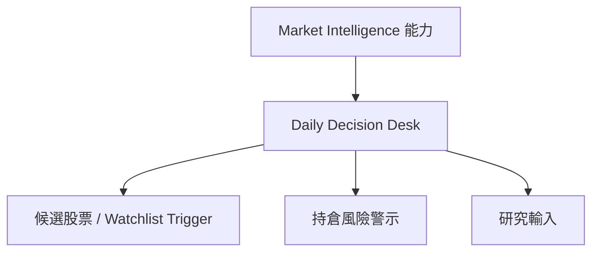
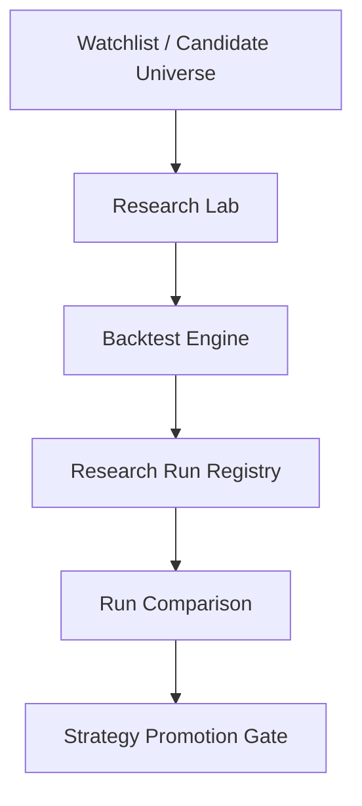
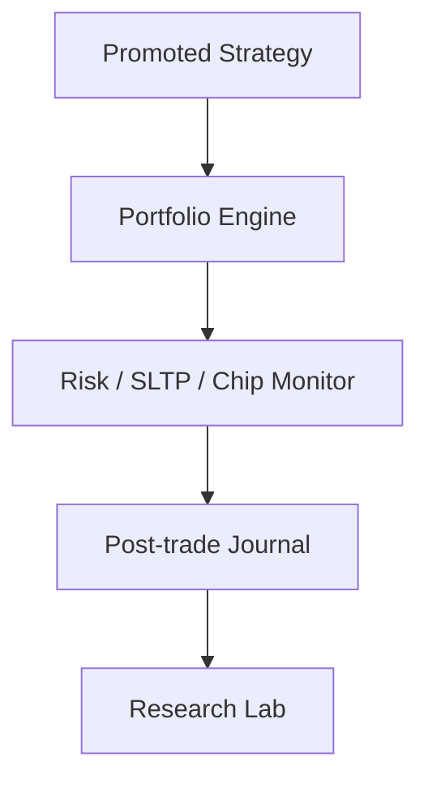

# 台股投資決策系統 IDS：最終樣貌與架構說明書

> **最後更新**：2026-06-17
> **系統定位**：本文件描述台股投資決策系統（Investment Decision System, IDS）的長期產品北極星、核心閉環、能力盤點、目標架構與 Roadmap 規劃。
> **核心原則**：本系統不以自動交易、不以 AI 報牌、不以預測明日漲跌為目標；本系統的目標是建立一套可驗證、可回溯、可解釋、可持續改進的台股投資研究與決策工作台。
> **權威邊界**：本文件提供產品願景與長期能力圖像，不取代 Scoped SSOT。當前實作狀態以 `docs/00_core/PROJECT_SNAPSHOT.md` 為準；未來 6 個月工程路線以 `docs/00_core/ROADMAP_6M_ENGINEERING.md` 為準；目前模組邊界以 `docs/01_architecture/system_architecture.md` 為準；操作方式以 `docs/07_guides/APPLICATION_MANUAL.md` 為準。

---

## 1. 系統核心定位

本系統並非「預測明日漲跌」的黑箱報牌工具，也不是自動交易系統。

本系統是一套以「市場觀察、決策摘要、策略驗證、持倉追蹤、覆盤回饋」為核心的台股投資決策系統。系統每天最重要的任務，是穩定回答以下五個問題：

1. 現在市場處於什麼狀態？
2. 哪些產業與股票正在轉強或轉弱？
3. 哪些股票值得進一步研究？
4. 我的持倉是否仍符合原始投資假設？
5. 我的策略是否正在失效或需要調整？

所有資料更新、技術指標、籌碼因子、基本面因子、回測、推薦、持倉管理與覆盤功能，都應服務於上述五個問題。系統的北極星不是「做出最多功能」，而是讓使用者每天打開系統後，能在短時間內形成清楚、可驗證、可回溯的市場判斷。

---

## 2. 設計第一原則

### 2.1 Decision First

本系統優先是一個投資決策工作台，其次才是量化研究平台。功能優先順序應為：

```text
市場判斷
↓
候選股票
↓
研究驗證
↓
持倉檢查
↓
覆盤回饋
```

回測與因子研究很重要，但它們必須回到最終問題：今天市場怎麼了、我該研究誰、我的持倉有沒有變壞、策略是否仍有效。

### 2.2 可驗證

任何推薦、排名、策略與警示，都必須能回到明確資料來源、參數設定與計算邏輯。系統不得只輸出「推薦買入」，而應輸出入選原因、排除原因與風險。

### 2.3 可回溯

任何研究結果、推薦清單、回測結果、持倉來源與策略版本，都應保留當時的資料快照、參數、版本與輸出結果，讓使用者能回答：

```text
當時為什麼選這支股票？
當時的市場狀態是什麼？
當時策略版本是什麼？
當時回測證據是什麼？
後來失效的原因是什麼？
```

### 2.4 可解釋

系統不應只產生分數，而要能拆解分數。每一支股票至少應能輸出：

```text
Why：為什麼入選？
Why Not：為什麼被淘汰？
Risk：主要風險是什麼？
Drift：目前是否偏離原始投資假設？
```

Explainability 必須由資料結構、規則、欄位、分數拆解與 UI 呈現支撐，不應依賴 AI 自然語言生成來補足核心證據。

### 2.5 防止未來函數

所有回測、推薦、分位數門檻、基本面因子與籌碼因子，都必須遵守時間序列治理：

```text
決策日只能使用當時已知資料。
```

任何因子若無法確認資料可用日期，必須依政策標記為 estimated、missing、neutral 或 skipped，不得直接當成 observed 使用。

---

## 3. 核心產品閉環

系統最終應形成四個閉環；目前閉環 1、2、3 的 v1 基礎已存在，閉環 4 已具備 Portfolio 監控基礎，且 Month 6 v1 已補上 Strategy Drift、Post-trade Attribution 與 Portfolio Review snapshot 的第一輪可用入口。

### 3.1 閉環 1：Data & Market State

目的：讓系統知道目前市場環境。



此閉環回答：市場偏多還偏空、哪些產業正在轉強、資金流向是否集中、資料品質是否足夠。

### 3.2 閉環 2：Decision Desk

目的：把資料變成每日可執行的觀察結論。



Daily Decision Desk 已是主 UI 的頂層工作區 v1。此閉環要回答：今天要不要積極研究、最強產業是什麼、哪些股票剛進入觀察條件、哪些持倉出現警訊。

### 3.3 閉環 3：Research Validation

目的：驗證候選股票與策略假設。



此閉環回答：條件過去是否有效、不同 Regime 下表現如何、是否過度擬合、是否值得升級為策略版本。

### 3.4 閉環 4：Portfolio Feedback

目的：讓持倉成為策略驗證的一部分，而不只是損益紀錄。



此閉環回答：持倉來自哪個策略、當初買入假設是否仍成立、目前是正常回撤還是策略失效、實際表現與回測預期差在哪裡。

---

## 4. 目標首頁：Daily Decision Desk

Daily Decision Desk 是整個 IDS 的目標核心頁。使用者每天打開系統後，應能在 30 秒內知道：

```text
今天市場如何？
我該研究誰？
我的持倉有沒有問題？
```

目前系統已有 Market Watch、Smart Money、Recommendation、Portfolio 監控、Research Lab 與 Daily Decision Desk v1。Daily Decision Desk 應維持 service snapshot 聚合，不是把現有各頁文字合併，也不得在 UI 層重算 domain logic。

### 4.1 Market Regime Summary

輸出市場狀態，例如 Strong Bull、Bull、Neutral、Bear、Strong Bear。Regime 不應只看大盤漲跌，應逐步納入大盤趨勢、成交量、市場寬度、產業擴散、權值股與中小型股背離。

### 4.2 Market Breadth

目標輸出市場健康度：

```text
上漲家數 / 下跌家數
創 20 日與 60 日新高家數
創 20 日與 60 日新低家數
漲停 / 跌停家數
成交量擴散率
```

Market Breadth v1 已由 SQLite `daily_prices` provider 接線，能輸出多方 / 空方 / 持平、新高新低與成交量擴散 metadata；後續仍可深化更完整的寬度與背離分析。

### 4.3 Sector Rotation

目標輸出最強 / 最弱產業、產業強度變化、產業成交量變化、產業內強勢股比例與創新高比例。目前 Sector Rotation v1 已由 SQLite `industry_indices` provider 接線，能輸出領先 / 落後產業、5 / 20 日變化與輪動強度；後續仍可深化產業內擴散率與背離。

### 4.4 Smart Money / Chip Flow

目標輸出外資、投信、自營商、券商分點集中度、主力連買連賣、籌碼共振與背離。目前已完成券商分點 Smart Money 與 Portfolio Chip Monitor；三大法人資料尚未正式接入。

### 4.5 Watchlist Trigger

目標輸出新進候選、移除候選、強度提升、強度下降、突破條件、量能條件、籌碼條件與風險條件。目前 Watchlist Trigger v1 已由 `WatchlistService` 與 SQLite `technical_indicators` 接線，能輸出 score_bp、risk_alert 與日期 fallback warning。

### 4.6 Portfolio Alert

目標輸出停損警示、停利警示、策略漂移警示、籌碼惡化警示、產業轉弱警示與流動性下降警示。目前已具備價格 / 策略條件監控、籌碼監控與生命週期回顧；策略漂移與 post-trade attribution v1 已由 service 層產生，不在 UI 重算。

---

## 5. 目標程式分層架構

目前架構權威仍是 `system_architecture.md`。以下是 IDS 最終樣貌的目標分層，其中 `market_module/` 是建議方向，尚未在目前程式碼中成為正式模組。

```text
PySide6 視覺介面層 (ui_qt/)
        |
        v
應用協調與儲存服務層 (app_module/)
        |
        +---> 市場決策領域層 (market_module/)        [目標模組，尚未建立]
        |
        +---> 決策與因子領域層 (decision_module/)
        |
        +---> 回測撮合引擎層 (backtest_module/)
        |
        +---> 持倉帳務領域層 (portfolio_module/)
        |
        +---> 數據存儲底座層 (data_module/)
        |
        v
Runtime 運作核心層 (runtime/)
```

### 5.1 UI Layer：`ui_qt/`

目前頂層工作區為數據更新、市場觀察、每日決策、策略回測 / Research Lab、推薦分析、觀察清單、持倉管理與 Runtime Observatory。Research Run Registry 可維持在 Research Lab 子頁，不必急著拆成頂層工作區。

### 5.2 Application Layer：`app_module/`

責任是封裝 use case、組裝 DTO、管理 Repository、協調多模組流程、管理 Research Run 保存與報表輸出。已存在的關鍵服務包括 `RecommendationService`、`ResearchRunService`、`ReportExportService`、`BrokerFlowService`、`PortfolioService` 與 `PortfolioConditionMonitor`。

目標新增或深化：

```text
MarketDashboardService
WatchlistTriggerService
PortfolioReviewService
DecisionDeskSnapshotBuilder
```

### 5.3 Market Domain：目標 `market_module/`

此層尚未獨立存在。目前市場狀態能力分散在 `decision_module/market_regime_detector.py`、`decision_module/stock_screener.py`、`decision_module/industry_mapper.py`、`decision_module/flow_signal_engine.py` 與 application services。若後續建立 `market_module/`，責任應是市場狀態判斷、市場寬度、產業輪動、相對強度、流動性排名、Smart Money 摘要與 Daily Decision Desk 資料供應。

### 5.4 Decision Domain：`decision_module/`

目前已包含策略配置、評分、指標參數治理、推薦權重契約、fixed / quantile 門檻、推薦橫斷面百分位與 Factor Layer v1。

長期權重契約可擴充至：

```text
pattern
technical
volume
chip
fundamental
market
risk
```

但目前正式 `RecommendationWeightContract` 僅接受 `pattern`、`technical`、`volume` 三項，總和固定為 `10000 bp`。擴充前必須先完成資料可得日、品質與 missing policy 治理。

### 5.5 Backtest Engine：`backtest_module/`

目前已具備撮合、成本、滑價、整股、漲跌停、成交量限制、最大參與率、single-stock 回測、批次回測與 walk-forward。推薦組合回放已有資金配置與持有期模擬，但仍不是完整 Portfolio Replay Engine。

目標深化：

```text
PortfolioReplayEngine
VirtualAccountStateMachine
RebalanceEngine
GapLimiter
LiquidityGate
Rolling Risk Metrics
```

### 5.6 Portfolio Domain：`portfolio_module/` 與 `app_module/`

目前已具備交易紀錄、平均成本、實現 / 未實現損益、來源追溯、停損停利警示、籌碼監控、策略漂移偵測、post-trade attribution、Portfolio Review snapshot、append-only lifecycle evidence 與 latest state projection。後續深化是把 lifecycle evidence projection 接到更完整的 review dashboard / 人工審核流程。

### 5.7 Data Infrastructure：`data_module/`

目前採 SQLite-first 查詢、CSV 保留人工檢查與備份、Parquet 儲存研究明細。未來資料擴充必須保留 `as_of_date`、`available_date`、quality、source_version 與 missing policy。

### 5.8 Runtime Core：`runtime/`

Runtime 層只負責背景任務狀態、事件日誌、治理觀測與錯誤恢復，不應混入策略邏輯。

---

## 6. 核心防線

### 6.1 No-look-ahead Gate

任何回測與推薦不得使用決策日尚不可得資料。所有 factor 應包含：

```text
symbol
factor_name
value
as_of_date
available_date
source
quality_status
```

### 6.2 Liquidity Gate

Liquidity Gate 是台股回測與推薦的核心防線之一。現有回測已具備成交量限制、最大參與率與漲跌停限制；完整 Liquidity Gate 尚需延伸到推薦、Watchlist Trigger 與 Why Not。

目標支援：

```text
20 日均成交金額門檻
20 日均成交量門檻
單筆交易不得超過當日成交量上限
漲停不得假設可買入
跌停不得假設可順利賣出
停牌排除
處置股標記或排除
全額交割股標記或排除
極低價股標記或排除
```

### 6.3 Gap Limiter

若策略假設使用 T+1 開盤成交，必須處理跳空問題。Gap Limiter 目前尚未形成獨立模組；目標是支援開盤跳空超過門檻時增加滑價、降低成交率、視為不成交或標記高風險成交，並把結果寫入研究摘要。

### 6.4 Cost Model

台股交易成本至少應考慮手續費、證交稅、最低手續費、滑價、零股或整股限制。核心金融數值不得新增裸 `float` 計算，需使用 Decimal、整數股數、整數基點或分為單位的整數金額。

### 6.5 Fundamental Flag

基本面資料第一階段不應直接建立過度自信的「業外損益扣除器」。更務實的做法是先建立 `AbnormalFundamentalFlag`，標記 EPS 暴增但營業利益未同步改善、營收成長與獲利成長背離、單季非營業利益異常、處分資產、匯兌收益或投資收益異常。第一階段只做標記與降權，不自動假設能精準扣除。

### 6.6 Passive Flow Noise Tag

籌碼資料不應把所有法人買超都視為主動看多。後續法人資料接入後，應建立 `PassiveFlowNoiseTag` 標記 ETF 成分股調整附近日期、單日異常大量、法人買超但價格未延續、法人買超但產業未同步轉強等情境。第一階段只做標記與降權，不假設能完全過濾。

---

## 7. Explainability Layer

Explainability Layer 是系統核心，不是附屬功能。每一個推薦、淘汰、警示與策略結果，都應能轉換成可理解的原因。

### 7.1 股票層級解釋

每支股票應輸出 Why、Why Not、Risk、Drift。目前推薦已有 Why / Why Not 與分數拆解；Risk 與 Drift 仍需隨 Daily Decision Desk、Liquidity Gate、Portfolio Feedback 深化。

### 7.2 策略層級解釋

每個策略應輸出有效市場 Regime、失效市場 Regime、主要獲利來源、主要虧損來源、最大風險、OOS 表現與 IS / OOS 差異。目前 Research Run Registry、Cross-run Comparison 與 benchmark metadata 已建立基礎；策略生命週期解釋仍在 Month 6。

### 7.3 持倉層級解釋

每筆持倉應輸出原始假設、目前狀態、偏離項目、風險事件與建議檢查項目。目前已具備來源追溯、價格與籌碼監控；完整 Strategy Drift 與 Post-trade Attribution 尚未完成。

---

## 8. 目前能力盤點

| 能力 | 狀態 | 證據 / 說明 |
|---|---|---|
| SQLite-first 更新、查詢與分頁 | 已完成 | `UpdateService`、`SqliteInspectorService`、SQLite Inspector UI、穩定分頁與唯讀查詢。 |
| CSV 備份與 Excel 匯出 | 已完成 | 快速 / 安全更新分流、CSV 匯出、`ReportExportService` 背景原子寫入。 |
| Market Regime、強弱股、強弱產業 | 已完成基礎 | `RegimeService`、`MarketRegimeDetector`、`StockScreener`、`IndustryMapper` 與市場觀察工作區。 |
| Smart Money / 券商分點 | 已完成基礎並深化品質治理 | `BrokerFlowService`、`FlowSignalEngine`、observed / estimated / unavailable 三態。 |
| Daily Decision Desk | 已完成 v1 | 主 UI 已有每日決策工作區，透過 service snapshot 聚合 Market Regime、Market Breadth、Sector Rotation、Relative Strength / Liquidity Ranking、Watchlist Trigger、Portfolio Alert 與 risk prompts。 |
| Market Breadth 完整服務 | 已完成 v1 | SQLite `daily_prices` provider 已能輸出多方 / 空方 / 持平、新高新低與成交量擴散 metadata；更細的 breadth / divergence 仍可後續深化。 |
| Sector Rotation service | 已完成 v1 | SQLite `industry_indices` provider 已能輸出領先 / 落後產業、5 / 20 日變化與輪動強度；產業內擴散率與背離仍可後續深化。 |
| fixed / quantile 與 OOS 實證 | 已完成 | 10 檔 OOS、Regime coverage Gate、quantile 維持 opt-in。 |
| Research Run Registry | 已完成基礎 | SQLite metadata、Parquet 明細、hash integrity、crash reconciliation、comparison、Promote Gate。 |
| Factor Layer v1 | 已完成 v1 | Contract、Registry、Gate、v1 adapters、FactorService、推薦回放 / 單股 / 批次 / 固定組合 per-stock factor metadata 已接入。 |
| 推薦組合回放 | 已完成可信度 v1 | 已有 portfolio credibility、unfilled orders、cash ledger、weight exposure 與 gap risk labels；零股、買賣價差與完整撮合模型待後續深化。 |
| Portfolio 監控 | 已完成基礎 | 持倉、來源追溯、SL/TP、籌碼監控與 Smart Money 下鑽。 |
| Strategy Drift / Post-trade Attribution | 已完成 v1 | Month 6 已完成 service gate、Portfolio feedback attribution 與持倉管理生命週期回顧入口；後續補 lifecycle 狀態持久化。 |
| 月營收、基本面、估值 | 已完成 v1 | 月營收、季度財報、P/E valuation 已可透過 provider / adapters 輸出 factor records / diagnostics；P/B、P/S 已具 guarded presentation policy，只接受 governed external observations 或 future backfill；官方歷史 PIT 公告日仍待後續治理。 |
| 三大法人 | 未完成 | 可納入後續籌碼 / Market Intelligence 擴充；必須保存資料品質與可得日。 |
| PDF 報告 | 未完成 | Excel 已完成，PDF 屬研究輸出 backlog。 |

---

## 9. 六個月 Roadmap 對齊

此 Roadmap 以「先提高每日決策價值，再提高研究深度」為原則；正式工程交付物與驗收標準以 `ROADMAP_6M_ENGINEERING.md` 為準。

### Month 1：實證與資料檢視基礎

狀態：已完成主要 Gate。

主要成果：

```text
Fixed / Quantile 雙模式基準
Walk-forward 初版與 Regime 分層歸因
SQLite 分頁查詢
Excel 原子匯出
```

### Month 2：研究儲存與策略版本基礎

狀態：已完成主要 Gate。

主要成果：

```text
IndicatorParameterRegistry
RecommendationWeightContract
ResearchRunRegistry
SQLite + Parquet 儲存
Run Comparison
Registry-based Promote Gate
```

### Month 3：Factor Layer 與 Portfolio Replay 可信度

狀態：已完成 v1。

主要項目：

```text
FactorRecord
FactorGate
FactorSnapshot
推薦回放 / 單股 / 批次 / 固定組合 per-stock factor metadata
Portfolio Replay credibility manifest、cash ledger、weight exposure、gap risk labels
No-look-ahead Regression Tests
```

Month 3 的攻堅核心是讓組合回放結果可信。v1 已具備現金、權重、未成交與 gap risk 揭露；零股、買賣價差與完整撮合模型仍屬後續執行模型深化。

### Month 4：Market Intelligence 與 Daily Decision Desk

狀態：已完成 v1。

主要項目：

```text
Daily Decision Desk
Market Regime Summary
Market Breadth
Sector Rotation
Relative Strength
Liquidity Gate
Watchlist Trigger
Portfolio Alert 初版
```

Month 4 不優先投入完整財報清洗。核心價值是把系統從研究平台推進成每日決策工作台。

### Month 5：Fundamental Layer 初版

狀態：已完成 v1。

主要項目：

```text
月營收資料
Revenue YoY
Revenue MoM
3M Revenue Trend
Revenue New High
available_date
AbnormalFundamentalFlag
P/E 初版
P/B / P/S guarded presentation policy
```

第一階段只做 factor records / diagnostics 與風險提示，不自動修正財報、不自動扣除業外、不自動產生單點目標價，也不接 `ScoringEngine`。

### Month 6：Strategy Lifecycle 與 Portfolio Feedback

狀態：v1 已完成第一輪 service / gate / UI 入口，且已補 append-only lifecycle evidence、latest state projection 與 demote / retire proposed evidence 保存；後續深化是把 evidence projection 接到更完整的 review dashboard / 人工審核流程。

主要項目：

```text
Promote / Demote / Retire
StrategyDriftDetector
Post-trade Attribution
Regime Compatibility
Live vs Research Gap
Portfolio Review Dashboard
```

Month 6 的核心問題是策略是否仍有效、持倉是否仍符合原始假設、實際表現與研究預期差在哪。

---

## 10. 成功標準

本系統成功與否，不應只用回測報酬率判斷。一套成功的 IDS 應滿足：

```text
每天能判斷市場狀態
能找出值得研究的股票
能排除不該碰的股票
能追蹤持倉是否變壞
能保存研究證據
能比較策略版本
能發現策略失效
能避免未來函數
能避免低流動性假績效
能讓使用者知道每個決策背後的原因
```

更精簡地說，系統每天應能回答三個問題：

```text
今天市場怎麼了？
我該研究誰？
我的持倉有沒有問題？
```

---

## 11. 非目標

本系統明確不以以下事項為優先目標：

```text
自動下單
高頻交易
即時逐筆交易
黑箱 AI 報牌
預測明日漲跌
過度參數最佳化
用單一模型取代完整研究流程
```

若未來增加 AI 輔助，也應只作為分析摘要、文件產生或查詢介面，不應取代系統本身的資料治理、回測驗證、持倉檢查與策略生命週期管理。

---

## 12. 更新記錄

- 2026-06-17：同步 Month 4 / Month 5 closeout 狀態，標示 Daily Decision Desk、Market Breadth、Sector Rotation、Watchlist Trigger、Factor Layer v1、Portfolio Replay credibility v1 與 Fundamental Layer v1 已完成，並轉入 Month 6 Strategy Lifecycle / Portfolio Feedback。
- 2026-06-17：同步 Month 6 Strategy Lifecycle / Portfolio Feedback v1，標示 Strategy Drift、Post-trade Attribution、Portfolio Review snapshot 與持倉管理生命週期回顧入口已完成第一版。
- 2026-06-15：依 IDS 最終樣貌重新整理北極星、四個產品閉環、Daily Decision Desk 目標、完成狀態盤點與 6 個月 Roadmap 對齊；明確標示已完成、進行中與未完成能力，避免將願景誤寫為現況。
