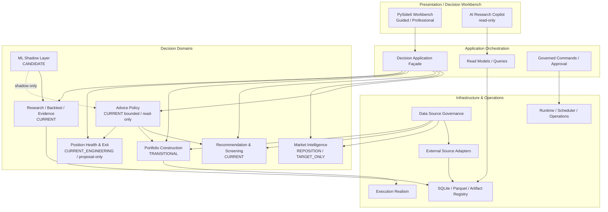
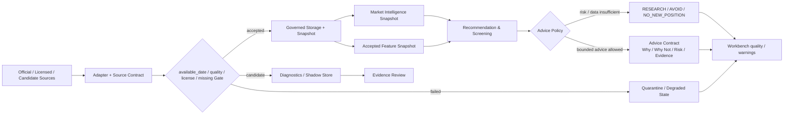
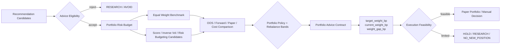
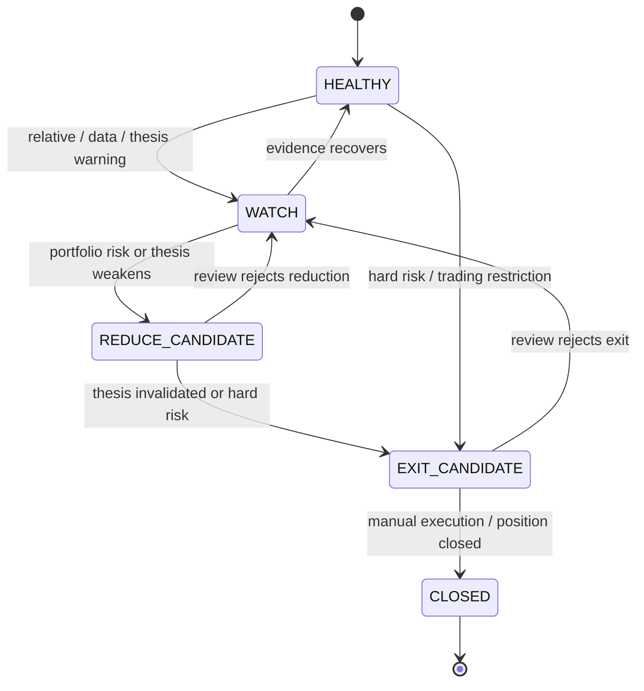
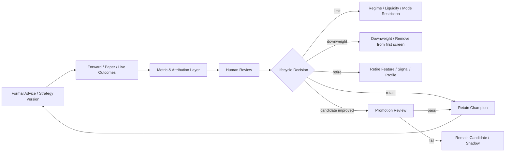

# baldr 理想目標系統架構

> **建立日期**：2026-07-11
> **定位**：本文件描述 baldr 的 Transitional / Target Architecture（過渡／目標架構），不代表目前皆已實作。
> **目前架構權威**：真實存在的 package、service、DTO、資料流與依賴以 [system_architecture.md](system_architecture.md) 為準。
> **產品方向**：能力優先序與產品 Gate 以 [PRODUCT_ROADMAP_POST_REFACTOR.md](../00_core/PRODUCT_ROADMAP_POST_REFACTOR.md) 為準。
> **禁止推論**：`market_module`／`advice_module` 仍是 target-only 候選邊界，不授權立即建立 package。`ml_module` 已有工程實作，其 current 能力與 shadow／Formal 限制以目前架構為準；不得把下列目標職責當成正式模型權限。

---

## 1. 架構目標

目標架構要讓 baldr 能以同一套受治理核心完成：

```text
市場觀察
→ Recommendation Advice
→ Portfolio Advice
→ Position Health / Exit
→ Evidence Review
→ 保留、限制、降權、退休或 Promotion
```

架構優先保護四件事：

1. Investment Advice 與 Broker Execution 永遠分離。
2. Guided / Professional Mode 共用核心引擎，只用 policy 與權限區隔。
3. 所有正式決策只使用 decision-time 可得資料，且可回溯資料、策略與 policy 版本。
4. Candidate data、research sandbox、historical replay、ML shadow 與 AI summary 不得直接修改正式決策。

## 2. 狀態語彙

| 狀態 | 意義 |
|---|---|
| `CURRENT` | 目前 repo 已有可識別模組或能力；詳細完成度仍看 Snapshot / current architecture。 |
| `REPOSITION` | 已存在，但需要重新定位、抽出 port 或由新 policy 邊界統一治理。 |
| `TRANSITIONAL` | 過渡期以既有 package 內 façade / service / DTO 落地，不立即建新 package。 |
| `TARGET_ONLY` | 理想邊界，尚未存在，不得假裝已完成。 |
| `CANDIDATE` | 資料／模型／功能只可 diagnostics 或 shadow。 |

## 3. Current → Transitional → Target

| 領域 | Current | Transitional | Target |
|---|---|---|---|
| Decision Workbench / UI | `ui_qt/` Workbench、Market、Recommendation、Research、Portfolio 等工作區 | Workbench 以 Advice / Portfolio / Health read models 統一第一屏，舊頁保留 drill-down | 任務導向決策工作台；Guided / Professional 共用 UI shell 與核心 DTO |
| Application Orchestration | `app_module/` 大量 use case / DTO / repository / composer | 建立明確 application façade、command/query、transaction / approval boundary | UI 只依賴 application ports；跨領域流程由 orchestration 組合，不把 domain 規則塞入 service |
| Advice Policy | `CURRENT`：`app_module` 已有 policy façade、Advice DTO、拒絕輸出與 Workbench projection | 維持 deterministic owner 與 canonical lineage projection | 抽成中立 package屬非 blocking reposition |
| Market Intelligence | 分散在 `app_module` / `decision_module` / data provider | 以 ports / read models 統一 market state、breadth、rotation、liquidity | `market_module` 候選，成為獨立市場語意領域 |
| Recommendation Engine & Screening | `RecommendationService`、`ScoringEngine`、Screener、Profile | 保留現行核心，增加 Advice adapter 與 Promotion status gate | 只產生候選、ranking、Why/Why Not，不直接決定 Portfolio 或 broker action |
| Research / Backtest / Evidence | Backtest、Replay、Registry、Evidence Store / dashboards | 統一 Experiment Contract、Evidence tiers、metric decision mapping | 研究與 production advice 以 registry / promotion boundary 分離 |
| Portfolio Construction | research-only sandbox + existing portfolio tracking | 建 Policy / Advice façade，Equal Weight benchmark、risk budget、paper portfolio | 組合建議、risk model、rebalance bands 與 execution feasibility 的獨立 domain boundary |
| Position Health & Exit | `CURRENT_ENGINEERING`：thesis contract、state machine、append-only transition、Exit read model | 累積真實 thesis、人工 transition 與 exit outcome | domain reposition候選；不自動平倉 |
| Data Source Governance | `data_module` registry / policy / candidate readiness | Source Registry、Control Center、quarantine、eligibility port | 所有來源具 PIT、quality、license、missing 與 downstream eligibility；未接受來源無法進 formal layer |
| Execution Realism | Backtest broker simulator、sandbox trace | 統一 execution assumption / feasibility / rejected taxonomy | 研究撮合與 broker execution port 分離；正式系統仍不提供 broker command |
| ML Shadow Layer | 已存在 `ml_module` 的工程實作；current 能力依目前架構，正式權限仍受 Gate 限制 | Feature / Label / Dataset / Model Registry 與 shadow store 的受治理整合 | Challenger 只透過 Promotion Review 影響 formal Advice；不是本輪八卡啟用項目 |
| AI Research Copilot | read-only evidence access / MCP | governed retrieval + citation / permission boundary | 只能摘要、比較、提問與找 evidence gap；不成為計算或 action owner |
| Runtime / Scheduling / Operations | `runtime/`、Windows tasks、dry-run wrappers | 依 job type 區隔 market data write、evidence dry-run、approved evidence write | Scheduler 只執行已核准 application command；不交易、不自動 lifecycle |
| Storage & Artifact Registry | SQLite、Parquet、JSON、Research Run / Evidence repositories | 統一 artifact identity、hash、status、lineage、backup / rollback | 每個 decision / advice / model / policy / outcome 可重建與稽核 |
| External Source Adapters | `data_module` fetcher / provider / candidate CLI | 每個 adapter 實作同一 source contract，先 diagnostics / shadow | adapter 可替換；domain 不知道 vendor、HTTP 或 SQLite 細節 |

### 2026-09-06 八卡工程後的剩餘差距

本節校正上表與八卡直接相關的 Current／Transitional 能力，依 [目前架構](C:/Projects/PythonProjects/technical_analysis/docs/01_architecture/system_architecture.md) 與 [TASK-08 整合證據](C:/Projects/PythonProjects/technical_analysis/docs/06_qa/TASK_LOOP_08_HANDOFF.md) 判讀；不是 V4 closeout，整體仍 `action_required`／V4 Evidence Accumulation。

| 邊界 | 本輪已落地的工程能力 | 尚需完成的 Target／外部條件 |
|---|---|---|
| Data／Market／Recommendation | 更新與市場日期／品質 DTO；`recommendation-context.v1` 保存可得切片、設定、母體、Why Not 與內容指紋 | 正式來源 acceptance、精確 available_at、具 PIT 與版本的產業成分；指標計算版本與市場 context 輸入版本須連貫。缺 PIT membership 前不恢復歷史產業篩選 |
| Execution／Registry | `next-session-open.v2`、精確帳務、terminal／cancelled 揭露、frozen 成本基準；顯式 writer、實際內容冪等、版本隔離與 hash 驗證 | 固定組合共享現金、正式微結構／成交來源及 production canary。舊 run 不原地重算或升版本；可重跑不等於有效投資證據 |
| Portfolio／Watchlist | candidate-only append SQLite 帳本、補償事件、精確 read model、候選池副本 repository／migration 與 source_id | 正式 JSONL／JSON 預設切換、真實 Paper fills／cost、thesis／估值與來源接受；目前候選池沒有已刪除項目的歷史 membership |
| Desk／Workbench | 日期與品質防護、保存推薦／ledger adapter、完整 loop payload、stale callback 隔離；08-B 已接 main 保存推薦與 Workbench 新來源欄位重載 | 其餘 legacy typed sections 的完整 hydration 仍有限；正式來源切換須獨立 Gate，缺輸入不補安全等級 |
| Evidence | `evidence-lineage.v1` 與唯讀人工 review proposal；outcome 保留事件 tier、run／snapshot／event hash | 真實 producer lineage、自然前瞻時間、具名獨立 review 與 Formal acceptance。declared tier／reviewer 字串不是核准證明；提案不改 credit／lifecycle |
| Runtime | `runtime-state.v2`、未知來源、取消訂閱與受限 ID 去重；治理／營運兩平面維持分離 | store 讀取原因與 log rotation／generation 契約仍有限；EventBus 不提供 durable dispatch，scheduler／writer 審核仍獨立 |

演進以保存來源與受控 adapter 逐項接線，不建立全域記憶體 SSOT；本輪候選 schema／隔離 fixture 不授權正式 migration、promotion、broker order 或 scheduler。

## 4. 整體分層架構



依賴方向：Presentation → Application → Domain ports；Infrastructure 實作 ports。Domain 不依賴 Qt、vendor API、concrete SQLite repository 或 scheduler。

## 5. 每日資料到投資建議的 end-to-end flow



正式 Advice 只能讀 accepted snapshot；candidate source 只能影響 diagnostics、warnings 或 shadow evidence，除非通過 source acceptance review。

## 6. Recommendation 到 Portfolio 的流程



高分不直接等於高權重。Portfolio owner 必須同時考慮風險、相關性、流動性、成本、現金、持倉上限與 rebalance bands。

## 7. 持倉監控到 Add / Hold / Reduce / Exit



每次轉移都輸出 source trace、reason category、data quality、review date 與 evidence link。系統只輸出 Candidate advice，不送出 broker order。`PositionInvalidationRule` 可明確標示 `reduce` 或 `exit`；只有 hard invalidation 進入 `EXIT_CANDIDATE`，論點弱化先進入 `REDUCE_CANDIDATE`。持有期限只在呼叫端提供完整官方交易日曆且涵蓋 entry／decision 兩端時計數，否則保留 `time_stop_calendar_incomplete`，不猜曆日、不自動交易。

判斷優先序：Hard Risk → Trading Restriction → Entry Thesis → Portfolio Risk → Relative Deterioration → Time Stop → Data Quality。固定 SL/TP、RSI、TotalScore 只作輸入，不單獨壟斷狀態機。

## 8. Evidence 到策略升降級與退休



Lifecycle action 必須由 deterministic rule + evidence package + human approval 驅動；AI 只能摘要 package，不作 action owner。

## 9. ML Shadow 到正式 Promotion

```mermaid
flowchart LR
    Registry["Feature / Label / Dataset Registry"] --> Split["Purged + Embargo Split"]
    Split --> Train["Challenger Training"]
    Train --> Cal["Calibration / Importance / Drift Baseline"]
    Cal --> Shadow["Shadow Predictions"]
    Shadow --> Compare["Champion vs Challenger\nOOS / Forward / Utility"]
    Compare --> Gate{"Promotion Gate"}
    Gate -->|insufficient / unstable| Reject["Reject / Continue Shadow"]
    Gate -->|stable incremental value| Review["Human Promotion Review"]
    Review -->|approved| Adapter["Versioned Formal Decision Adapter"]
    Review -->|rejected| Reject
    Adapter --> Monitor["Live Drift / Rollback Monitor"]
    Monitor -->|drift / degradation| Rollback["Rollback to Champion"]
```



即使通過 Promotion，ML 也只能透過 versioned adapter 影響排序、校準或風險過濾；不能直接寫 Portfolio、改 scheduler 或下單。

## 10. 主要模組契約

### 10.1 Decision Workbench / UI

- **Responsibility**：呈現今日任務、Advice、Portfolio、Health、Evidence、quality 與 drill-down。
- **Inputs**：application read models / DTO。
- **Outputs**：使用者選擇、人工 approval / override request；不直接寫 domain。
- **Dependencies**：Application façade。
- **Persistent artifacts**：UI 本身不持久化；由 application command 保存 review / journal。
- **Failure / degraded**：顯示 MISSING / DEGRADED、保留 `NO_NEW_POSITION`，不補值。
- **Current status**：`CURRENT`，Workbench 以 read-only 能力為主。
- **Target status**：Guided / Professional 任務導向入口。
- **修改正式決策**：否。

### 10.2 Application Orchestration

- **Responsibility**：use case、transaction / approval boundary、DTO、command/query 組合。
- **Inputs**：UI request、scheduler request、domain ports。
- **Outputs**：Advice / review / artifact DTO 與 governed command result。
- **Dependencies**：Domain interfaces、repositories / providers ports。
- **Persistent artifacts**：透過 repositories 保存，不自行持有 hidden state。
- **Failure / degraded**：partial source 轉 diagnostics；需要寫入時 fail-closed / idempotent。
- **Current status**：`CURRENT`，需持續薄化與 façade 化。
- **Target status**：明確 commands / queries / approvals。
- **修改正式決策**：只能執行已核准 domain policy，不可自行計算。

### 10.3 Advice Policy

- **Responsibility**：把 Recommendation、Portfolio、Health 與 Evidence 轉成 bounded action；管理 Mode、evidence tier、risk、拒絕輸出與 permission。
- **Inputs**：Recommendation result、market context、Portfolio state、health state、strategy / policy version、quality。
- **Outputs**：Recommendation Advice / Portfolio Advice Contract。
- **Dependencies**：domain DTO / ports，不依賴 UI / vendor。
- **Persistent artifacts**：advice snapshot、policy version、decision reasons。
- **Failure / degraded**：輸出 `RESEARCH` / `AVOID` / `NO_NEW_POSITION`。
- **Current status**：`CURRENT` bounded/read-only；Advice policy/composer/DTO 已形成 deterministic owner。這不代表投資有效性或 broker execution。
- **Target status**：單一正式 advice owner。
- **修改正式決策**：是，但僅 deterministic、版本化、可回滾 policy。

### 10.4 Market Intelligence

- **Responsibility**：Market regime、breadth、sector / concept rotation、relative strength、liquidity、market risk context。
- **Inputs**：accepted market snapshots。
- **Outputs**：market context DTO，不輸出單股 broker action。
- **Dependencies**：Data Source Governance ports。
- **Persistent artifacts**：decision-time market snapshot。
- **Failure / degraded**：最近可用日需明示 fallback；coverage 不足降級。
- **Current status**：`REPOSITION`，能力分散於既有 modules。
- **Target status**：獨立語意 domain / ports。
- **修改正式決策**：只能作 Advice Policy 輸入。

### 10.5 Recommendation Engine & Screening

- **Responsibility**：候選 universe、score / rank、screening matrix、Why / Why Not。
- **Inputs**：accepted features、Profile / strategy version、market context。
- **Outputs**：Recommendation result，不直接產生目標權重。
- **Dependencies**：Decision domain、data ports。
- **Persistent artifacts**：result snapshot、matrix、reasons、data / strategy version。
- **Failure / degraded**：eligible universe 太小或資料不足時拒絕／降級。
- **Current status**：`CURRENT`。
- **Target status**：成為 Advice Policy 的候選供應者。
- **修改正式決策**：不能單獨決定正式 Advice。

### 10.6 Research / Backtest / Evidence

- **Responsibility**：實驗、OOS、replay、forward outcome、attribution、lifecycle evidence。
- **Inputs**：frozen hypothesis / dataset / strategy / execution contract。
- **Outputs**：Research Run、Evidence tier、promotion / pruning review package。
- **Dependencies**：Backtest engine、storage ports、data governance。
- **Persistent artifacts**：registry metadata、Parquet、events/outcomes、review records。
- **Failure / degraded**：樣本不足只回 directional / insufficient，不產生有效性結論。
- **Current status**：`CURRENT`，多個工程底座已存在。
- **Target status**：Experiment Manager + Evidence operating loop。
- **修改正式決策**：只透過 Promotion / Lifecycle human review。

### 10.7 Portfolio Construction

- **Responsibility**：risk budget、sizing、constraints、rebalance bands、target/current/gap。
- **Inputs**：eligible Advice candidates、current positions、cash、cost、liquidity、risk exposures。
- **Outputs**：Portfolio Advice；不是 broker order。
- **Dependencies**：Advice Policy、execution realism、risk models。
- **Persistent artifacts**：policy version、allocation snapshot、paper portfolio、constraint reasons。
- **Failure / degraded**：fallback Equal Weight / hold cash / `NO_NEW_POSITION`。
- **Current status**：`TRANSITIONAL`；sandbox 與 tracking 已存在但非正式 Advice。
- **Target status**：Portfolio Coach domain。
- **修改正式決策**：是，僅產生目標建議；不執行交易。

### 10.8 Position Health & Exit

- **Responsibility**：thesis-based health、state transition、Add / Hold / Reduce / Exit Candidate。
- **Inputs**：entry thesis、position source、market / relative / risk / quality / restriction evidence。
- **Outputs**：health state、exit advice、review package。
- **Dependencies**：Portfolio、Market、Data Governance、Evidence。
- **Persistent artifacts**：thesis、invalidation、transitions、decision journal。
- **Failure / degraded**：關鍵資料缺失時 `WATCH`，Hard Risk 可直接 `EXIT_CANDIDATE` 但仍需人工執行。
- **Current status**：`CURRENT_ENGINEERING / proposal-only`；thesis contract、state machine、append-only transition 與 exit read model 已存在。真實 thesis、人工 transition 與 outcome仍屬外部 Gate。
- **Target status**：獨立 state machine / evidence owner。
- **修改正式決策**：可產生 Candidate advice；不可平倉。

### 10.9 Data Source Governance

- **Responsibility**：source identity、PIT、quality、license、rate limit、missing、quarantine、eligibility。
- **Inputs**：adapter observations / manifests。
- **Outputs**：accepted / shadow / quarantined snapshots 與 downstream eligibility。
- **Dependencies**：External adapters、storage。
- **Persistent artifacts**：source registry、version、quality report、acceptance decision。
- **Failure / degraded**：fail-closed、stale / missing 明示；不靜默 fallback 為 observed。
- **Current status**：`REPOSITION`，registry / policies / readiness 已有部分底座。
- **Target status**：Data Source Control Center + enforced ports。
- **修改正式決策**：只控制資料資格，不計算 Advice。

### 10.10 Execution Realism

- **Responsibility**：spread、tick、lot、gap、restriction、partial fill、rejected taxonomy、feasibility。
- **Inputs**：orders / allocation candidates、market constraints。
- **Outputs**：research execution trace、feasibility、cost assumptions。
- **Dependencies**：market microstructure data。
- **Persistent artifacts**：execution assumption version、virtual fill / reject events。
- **Failure / degraded**：無法建模時標示 unavailable，不假設理想成交。
- **Current status**：`CURRENT / REPOSITION`，backtest / sandbox 已有部分能力。
- **Target status**：統一 execution contract；broker adapter 仍不在範圍。
- **修改正式決策**：只影響 feasibility / Advice，不送單。

### 10.11 ML Shadow Layer

- **Responsibility**：challenger ranking、calibration、meta-label、downside risk、drift。
- **Inputs**：governed feature / label / dataset fingerprint。
- **Outputs**：shadow prediction、comparison、promotion package。
- **Dependencies**：Research / Evidence、model registry。
- **Persistent artifacts**：model、dataset、prediction、calibration、drift、rollback metadata。
- **Failure / degraded**：停止 shadow / rollback，不 fallback 成無版本輸出。
- **Current status**：`CANDIDATE`，readiness scaffold only。
- **Target status**：Champion / Challenger governed layer。
- **修改正式決策**：Gate 前否；Gate 後只能經 versioned adapter。

### 10.12 AI Research Copilot

- **Responsibility**：摘要、比較、研究問題、weekly review、evidence gap。
- **Inputs**：受治理 read-only query / citation payload。
- **Outputs**：自然語言摘要與問題，不是 evidence 或 action。
- **Dependencies**：Read-only application queries。
- **Persistent artifacts**：可選 audit log / cited report；不得寫 domain state。
- **Failure / degraded**：沒有證據就明示無法回答，不捏造理由。
- **Current status**：`CURRENT / REPOSITION`，已有 read-only evidence access。
- **Target status**：有 citation、permission 與 prompt/version audit。
- **修改正式決策**：否。

### 10.13 Runtime / Scheduling / Operations

- **Responsibility**：執行已核准 job、status、retry、observability、backup / recovery hook。
- **Inputs**：versioned application command。
- **Outputs**：run status、diagnostics、artifact pointers。
- **Dependencies**：Application command ports，不直接 import domain internals。
- **Persistent artifacts**：job manifest、run id、status、logs、approval id。
- **Failure / degraded**：disable future run、保留 last-good artifact、人工 recovery。
- **Current status**：`CURRENT`，market data write / evidence dry-run 已存在；production evidence write-mode 未批准。
- **Target status**：job type 與 permission 明確分離。
- **修改正式決策**：否；scheduler 不得 auto lifecycle 或交易。

### 10.14 Storage & Artifact Registry

- **Responsibility**：持久化 identity、hash、lineage、version、append-only / supersede policy。
- **Inputs**：domain artifacts。
- **Outputs**：read/write repositories、integrity result。
- **Dependencies**：SQLite / Parquet / filesystem adapters。
- **Persistent artifacts**：Research Run、Advice、Portfolio policy、Evidence、Model、Journal。
- **Failure / degraded**：staging / atomic replace / reconciliation / backup / rollback。
- **Current status**：`CURRENT / REPOSITION`。
- **Target status**：統一 Artifact Registry contract，不強迫單一實體儲存。
- **修改正式決策**：否。

### 10.15 External Source Adapters

- **Responsibility**：vendor / official source fetch、normalize、manifest、rate limit。
- **Inputs**：source request。
- **Outputs**：raw / normalized observation + provenance。
- **Dependencies**：HTTP / file / provider SDK。
- **Persistent artifacts**：raw evidence、fetch manifest、license / version note。
- **Failure / degraded**：retry / quarantine / last-known-good 只能明示 stale；不能偽裝 latest。
- **Current status**：`CURRENT / REPOSITION`。
- **Target status**：實作統一 source port，可替換供應商。
- **修改正式決策**：否。

## 11. 核心資料與決策契約

### 11.1 Advice Contract

正式 Advice 必須包含 action、Why / Why Not、Risk、Evidence tier、confidence tier、holding horizon、thesis、invalidation、market regime、strategy / policy version、liquidity、execution feasibility、data quality、decision / as-of date。

### 11.2 Portfolio Advice Contract

必須包含 `target_weight_bp`、`current_weight_bp`、`weight_gap_bp`，並以整數基點、整數股數與 Decimal 金額維持金融核心邊界。

### 11.3 Source Contract

```text
source_id
source_version
status
as_of_date
available_date
quality
missing_policy
license_note
rate_limit
look_ahead_risk
ingestion_stage
scoring_eligible
portfolio_advice_eligible
```

### 11.4 Experiment / Model Contract

保存 hypothesis、primary metric、benchmark、success / failure、train / validation / test、search budget、horizon、execution assumptions、dataset fingerprint、feature / label registry、split policy 與 rollback target。

## 12. Degraded Behavior 原則

1. Data missing：標示 MISSING / DEGRADED，禁止補成 observed。
2. Market context missing：Advice 降級為 `RESEARCH` 或 `NO_NEW_POSITION`。
3. Portfolio risk input missing：不產生增加曝險建議。
4. Execution feasibility unknown：不產生 `ADD_CANDIDATE` 的正式權重。
5. Evidence insufficient：`evidence_tier=insufficient`，不得進 Guided Mode。
6. ML unavailable / drift：回到 last approved champion，不中斷 rule engine。
7. AI unavailable：核心決策不受影響；只失去摘要層。
8. Scheduler failure：停止後續 write-mode run，保留 last-good 與 recovery evidence。

## 13. 正式決策修改權限矩陣

| 模組 | 可直接修改正式 Recommendation | 可直接修改正式 Portfolio Advice | 可執行交易 |
|---|---:|---:|---:|
| Workbench / UI | 否 | 否 | 否 |
| Application Orchestration | 否；只執行 policy | 否；只執行 policy | 否 |
| Advice Policy | 是，須版本化與 Gate | 只組合正式 Portfolio policy | 否 |
| Recommendation Engine & Screening | 否；只供候選與排名 | 否 | 否 |
| Portfolio Construction | 否 | 是，須 policy / evidence Gate | 否 |
| Position Health & Exit | 否 | 可輸出 Add / Hold / Reduce / Exit Candidate | 否 |
| Data Source Governance | 否；只控制 eligibility | 否；只控制 eligibility | 否 |
| Research / Evidence | 否；透過人工 Promotion | 否；透過人工 Promotion | 否 |
| ML Shadow | Gate 前否；Gate 後僅 versioned adapter | Gate 前否 | 否 |
| AI Copilot | 否 | 否 | 否 |
| Runtime / Scheduler | 否 | 否 | 否 |
| External Adapters / Storage | 否 | 否 | 否 |

## 14. 過渡原則與演進順序

1. 先完成 Safe Refactor Closeout；不在重構期間同時搬 domain package。
2. 先在既有 `app_module` / DTO 邊界建立 Advice / Portfolio / Health contract，鎖定行為與 tests。
3. 透過 façade / port 把分散能力重新定位；只有耦合、ownership 與測試證據支持時才建立新 package。
4. Data Source Governance 先強制 downstream eligibility，再增加來源數量。
5. Portfolio Coach 先以 Equal Weight / paper portfolio 成立，再評估複雜 optimizer。
6. Position Health 先建立 thesis state machine，再加入更多 alert。
7. Signal pruning 可刪除、降權或退休能力；架構不以永久保留所有 feature 為目標。
8. ML 只在 rule baseline、label 與 evidence 可判讀後進 shadow。

## 15. 架構驗收 Gate

- Current 與 Target 文件不互相冒充。
- Target-only package 全部有狀態標示，沒有建立假實作。
- Guided / Professional 共用 Recommendation / Portfolio / Evidence 核心。
- Advice 與 Broker Execution 有硬邊界。
- UI、AI、scheduler、adapter、storage 不能直接改正式投資決策。
- 新資料必經 available-date、quality、missing、license 與 eligibility Gate。
- Portfolio Advice 使用整數 bp / Decimal，並輸出 target/current/gap。
- Exit 使用 thesis-based state machine，不以固定停損或單一指標取代。
- Historical replay、dry-run、candidate、shadow 與 formal / live 狀態可辨識。
- 所有正式 artifact 可追溯 policy / strategy / data / model / decision date。

---

## 更新記錄

- 2026-09-06：校正八卡已落地工程與 Current → Target 差距，保留 PIT、真實 fills、自然時間、具名 review、正式 migration／writer 等獨立 Gate。

- 2026-07-11：初版建立 Current → Transitional → Target 架構；定義 15 個產品／領域邊界、6 張核心流程圖、degraded behavior、正式決策權限與不自動交易政策。
