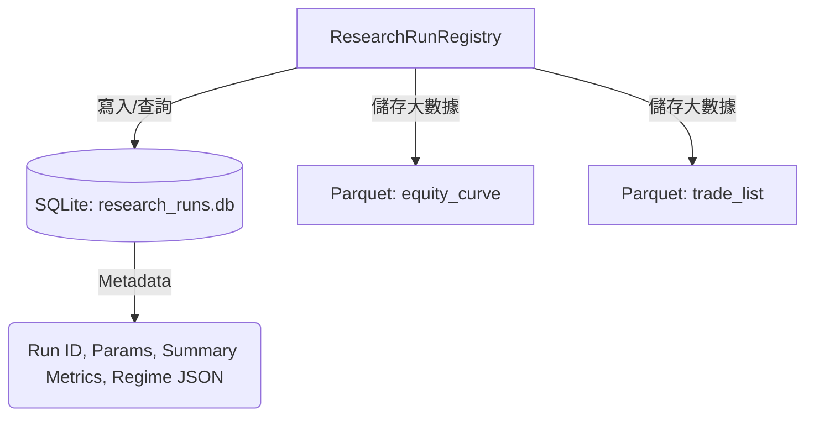

# 統一研究運行儲存庫設計規格 (Research Run Registry Specification)

> **最後更新**：2026-06-14  
> **定位**：本文件是 Month 1 參數與研究儲存治理的設計規格。它為 Month 2 的 Unified Storage、Indicator Parameter Registry、Recommendation Weight Contract 與 Cross-run 比較奠定標準 Schema 與儲存架構。

---

## 1. 背景與設計目標

目前系統中存在兩種回測儲存模型：
1. `BacktestRunRepository`：專門儲存單股與批次回測歷史，產出 parquet / CSV 檔案。
2. `RecommendationPortfolioRunRepository`：儲存推薦組合的 Mark-to-market 回測歷史，以 JSON 格式儲存詳細報告。

這兩種模型在資料欄位、成本假設、Universe 記錄與 Regime 表現上各自獨立，導致：
- 無法進行跨類型（如：單股策略 vs 推薦組合）的統一查詢與比較。
- 缺乏對資料截止日（`data_cutoff_date`）與資料指紋（`data_fingerprint`）的記錄，無法實現 100% 的回測可重現性（Reproducibility）。
- 缺乏 Regime 分層績效的標準儲存欄位。

**設計目標**：
- **統一儲存模型**：建立 `ResearchRunRegistry`，將單股、批次與組合回測統一收納。
- **資料指紋鎖定**：將資料版本、SHA-256 指紋與參數合約納入 metadata，確保 OOS 與 walk-forward 效力。
- **Regime 分層整合**：將 Trend、Breakout 與 Reversion 狀態下的績效（Sharpe、勝率、交易次數）以標準 JSON 格式持久化。
- **為 Cross-run 比較準備**：設計可利用 SQL 直接進行跨 run 比較的欄位結構。

---

## 2. 儲存架構

統一儲存庫將採用 **SQLite 結構化 Metadata + 離線詳細檔案 (Parquet/JSON)** 的混合儲存架構：



- **SQLite 資料庫**：儲存搜尋、篩選與 Cross-run 比較所需的 metadata 與績效摘要（包括 Regime 統計）。這使得 UI 在加載歷史列表與對比指標時能實現毫秒級「秒開」。
- **Parquet 離線檔案**：大數據量的 `equity_curve` (每日淨值序列) 與 `trade_list` (詳細交易明細) 採 Parquet 壓縮格式儲存，並以 `run_id` 進行關聯命名。

---

## 3. Schema 欄位定義

統一的 `research_runs` 表 Schema 設計如下：

| 欄位名稱 | 型態 | 說明 | 備註 |
|---|---|---|---|
| `run_id` | TEXT | PRIMARY KEY，UUID 或 run_前綴字串 | 唯一標識 |
| `run_name` | TEXT | 使用者定義的執行名稱或自動生成名稱 | 易讀名稱 |
| `run_type` | TEXT | `'single_stock'` \| `'batch'` \| `'portfolio'` | 運行類型 |
| `strategy_id` | TEXT | 策略識別碼 (例如 `'momentum_aggressive_v1'`) | 策略 ID |
| `strategy_version` | TEXT | 策略版本號 (例如 `'1.0.0'`) | 追溯策略代碼版本 |
| `strategy_params` | TEXT | 策略參數 (JSON 格式物件) | 包括 fixed / quantile 設定 |
| `universe` | TEXT | 回測包含的股票池代碼清單 (JSON 格式陣列) | 例如 `["2330", "2317"]` |
| `start_date` | TEXT | 回測開始日期，格式 `YYYY-MM-DD` | |
| `end_date` | TEXT | 回測結束日期，格式 `YYYY-MM-DD` | |
| `data_cutoff_date` | TEXT | 資料截止日，格式 `YYYY-MM-DD` | 決策當下可取得之最後日期 |
| `data_fingerprint` | TEXT | 歷史日股價與大盤資料的 SHA-256 雜湊值 | 鎖定資料版本，防漂移 |
| `capital_cents` | INTEGER | 初始資金，以「分」為單位 | `1,000,000` 元儲存為 `100000000` |
| `fee_bp_x100` | INTEGER | 手續費，以百分之一基點為單位 | `14.25` bps 儲存為 `1425` |
| `slippage_bp_x100` | INTEGER | 滑價，以百分之一基點為單位 | `5.0` bps 儲存為 `500` |
| `stop_loss_bp` | INTEGER | 固定停損百分比的整數基點 (可為 NULL) | `5%` 儲存為 `500` |
| `take_profit_bp` | INTEGER | 固定停利百分比的整數基點 (可為 NULL) | `10%` 儲存為 `1000` |
| `execution_price` | TEXT | 成交價格假設 (例如 `'next_open'`, `'close'`) | |
| `total_return` | REAL | 總報酬率 (例如 `0.152` 表示 15.2%) | 僅限分析／展示邊界 |
| `annual_return` | REAL | 年化報酬率 (CAGR) | 僅限分析／展示邊界 |
| `sharpe_ratio` | REAL | 年化夏普比率 | 僅限分析／展示邊界 |
| `max_drawdown` | REAL | 最大回撤 (負數，例如 `-0.185`) | 僅限分析／展示邊界 |
| `win_rate` | REAL | 交易勝率 | 僅限分析／展示邊界 |
| `total_trades` | INTEGER | 總交易次數 | |
| `regime_breakdown` | TEXT | 各大盤 Regime 下的分層統計 (JSON 格式物件) | 詳見後述結構 |
| `promoted_version_id` | TEXT | 升級後的策略版本 ID (可為 NULL) | 關聯策略生命週期 |
| `notes` | TEXT | 備註與診斷資訊 | |
| `tags` | TEXT | JSON 格式的標籤陣列 | 例如 `["walk-forward", "pilot"]` |
| `created_at` | TEXT | 建立時間，格式 ISO-8601 | 例如 `2026-06-14T08:54:00` |

### 3.1 `regime_breakdown` JSON 結構

為了標準化儲存並便於後續擴充，`regime_breakdown` 必須遵循以下 JSON Schema：

```json
{
  "Trend": {
    "trade_count": 15,
    "avg_return": 0.0452,
    "win_rate": 0.60,
    "sharpe": 1.42
  },
  "Breakout": {
    "trade_count": 8,
    "avg_return": -0.012,
    "win_rate": 0.375,
    "sharpe": -0.21
  },
  "Reversion": {
    "trade_count": 22,
    "avg_return": 0.0185,
    "win_rate": 0.50,
    "sharpe": 0.68
  }
}
```

---

## 4. Repository 介面設計

在 Month 2 實作中，`ResearchRunRegistry` 將提供以下標準 Python API：

```python
class ResearchRunRegistry:
    def __init__(self, config: TWStockConfig):
        """初始化儲存庫，建立 SQLite 資料表並設定資料夾路徑。"""
        pass
        
    def save_run(
        self,
        run_name: str,
        run_type: str,
        strategy_spec: StrategySpec,
        universe: list[str],
        start_date: str,
        end_date: str,
        data_fingerprint: str,
        capital_cents: int,
        fee_bp_x100: int,
        slippage_bp_x100: int,
        report: BacktestReportDTO,
        regime_breakdown: dict[str, dict[str, Any]],
        notes: str = "",
        tags: list[str] = None
    ) -> str:
        """
        將 metadata 儲存至 SQLite，並將 equity_curve 與 trade_list 存為離線 Parquet。
        傳回自動生成的 run_id。
        """
        pass
        
    def load_run(self, run_id: str) -> Optional[dict[str, Any]]:
        """載入 metadata 與對應的 Parquet 詳細資料，還原為統一字典格式。"""
        pass
        
    def list_runs(
        self,
        run_type: Optional[str] = None,
        strategy_id: Optional[str] = None,
        tag: Optional[str] = None,
        limit: int = 100
    ) -> list[dict[str, Any]]:
        """高速查詢與過濾 runs metadata，用於 UI 列表展示。"""
        pass
        
    def delete_run(self, run_id: str) -> bool:
        """安全地刪除 SQLite 記錄與關聯的 Parquet 實體檔案。"""
        pass
```

---

## 5. Cross-run 比較設計方向

統一的 Schema 使得跨運行（Cross-run）的比較可以直接透過 SQL 進行高效聚合。

### 5.1 相同策略不同參數比較
```sql
SELECT 
    run_id, 
    run_name,
    json_extract(strategy_params, '$.params.buy_score') as buy_score,
    json_extract(strategy_params, '$.params.threshold_mode') as mode,
    total_return, 
    sharpe_ratio, 
    max_drawdown,
    total_trades
FROM research_runs 
WHERE strategy_id = 'momentum_aggressive_v1' 
ORDER BY sharpe_ratio DESC;
```

### 5.2 相同參數不同 Universe 表現
```sql
SELECT 
    run_id, 
    universe, 
    total_return, 
    sharpe_ratio,
    json_extract(regime_breakdown, '$.Trend.sharpe') as trend_sharpe,
    json_extract(regime_breakdown, '$.Reversion.sharpe') as reversion_sharpe
FROM research_runs 
WHERE strategy_version = '1.0.0';
```

---

## 6. 指標與權重合約對接門禁

當 Month 2 建立此儲存庫後，系統將實施以下門禁（Gate）：
1. **Indicator Parameter Registry** 必須以 JSON/Schema 快照的形式，隨 `strategy_params` 一併存入資料庫，確保 3 個月後重播回測時使用的 RSI/MACD 參數與回測當下一模一樣。
2. **Recommendation Weight Contract** (推薦權重) 必須作為 `ResearchRun` 的獨立合約欄位保存，禁止只依靠硬編碼執行推薦組合回測。
3. 任何 promoted 的策略版本都必須關聯一個有效的 `run_id`，以便隨時進行資料來源的追溯。

### 6.1 金融數值邊界

- 資金、費用、滑價、停損與停利在 registry contract 中不得使用裸 `float`。
- 金額以整數分、門檻以整數基點或百分之一基點保存。
- 報酬率、Sharpe、最大回撤等 `REAL` 欄位是已完成核心計算後的分析／展示快照，不得反向作為交易決策輸入。
