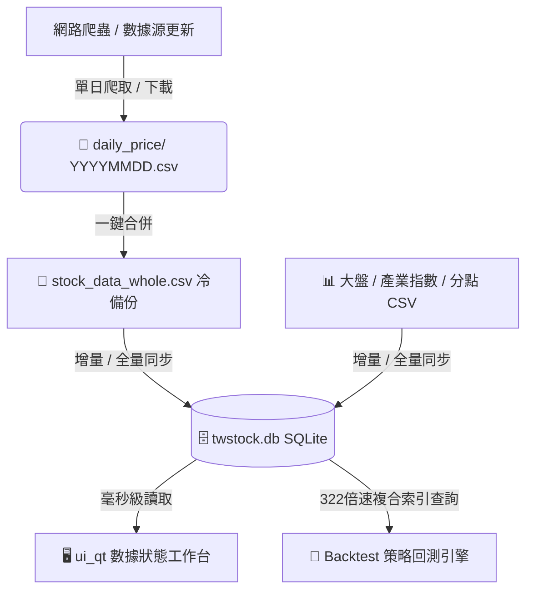

# SQLite 儲存與雙軌相容架構指南 (SQLite Storage & Dual-Track Guide)

> **版本**：v1.0 (2026-05-30)  
> **系統定位**：說明本系統如何利用「CSV 冷備份」與「SQLite 高效快取」雙軌架構，在保證 100% 數據安全性的同時，實現 322 倍的效能飛躍。

---

## 1. 雙軌相容架儲構 (Dual-Track Architecture)

為了平衡金融數據的**絕對安全性（耐用度）**與**策略回測的極速效能（查詢速度）**，系統採用了「雙軌相容」設計：



### 💾 1.1 CSV 冷備份層 (Durability Layer)
* **角色**：資料的唯一真實來源 (Single Source of Truth, SSOT)。
* **存放路徑**：`D:\Min\Python\Project\FA_Data\` (含 `daily_price/`、`meta_data/` 等)。
* **特色**：所有原始爬取的資料依然會先以 CSV 格式保存。CSV 是最直觀、不輕易損壞且隨時可以用 Excel 打開的格式。這確保了系統數據的離線完整性，隨時可以隨意重建資料庫。

### ⚡ 1.2 SQLite 極速快取層 (Performance Layer)
* **角色**：查詢與回測加速引擎。
* **存放路徑**：`D:\Min\Python\Project\FA_Data\sqlite\twstock.db`。
* **特色**：當 UI 打開或回測啟動時，系統 **100% 透過 SQLite 複合索引進行加載**。大盤、個股價格、分點與衍生技術指標不再經歷緩慢的 CSV 遍歷，實現 25 毫秒內（322 倍速）的極致加載。

---

## 2. 日常更新流程 (Daily Operations)

當您在 UI 中點擊 **「安全更新所有數據」** 時，系統底層會自動編排並依序完成以下流程，無需手動干預：

```
[1] 狀態檢查 (毫秒秒開) ──> [2] 爬取新 CSV 數據 ──> [3] 合併 YYYYMMDD CSV
                                                                 │
[6] SQLite 指標批量寫入 <── [5] 重算衍生指標 (1分51秒) <── [4] 增量寫入 SQLite
```

1. **極速狀態檢查**：直接對 SQLite 執行 `COUNT(*)` 聚合，幾毫秒內在 UI 呈報現有數據起始與結束日期。
2. **爬取最新 CSV 資料**：爬蟲去抓取最新日期的個股 CSV、大盤、產業及分點檔案。
3. **安全合併每日 CSV**：將最新的單日 CSV 資料，追加合併入 `stock_data_whole.csv`。
4. **增量寫入 SQLite**：自動偵測 `stock_data_whole.csv` 中最新多出的日期，快速將其增量寫入 SQLite 的 `daily_prices` 表中。
5. **衍生技術指標重新計算**：
   * 運行 `calculate_technical_indicators.py`，僅花費約 1 分多鐘全量重算 1,157 檔股票的衍生指標（如 KD、MACD、MA、RSI）。
   * 指標計算完成後，**直接以批量寫入 (bulk insert)** 的方式同步更新 SQLite 的 `technical_indicators` 表中。

---

## 3. 資料庫一鍵遷移與災後重建 (Migration & Rebuild)

如果因為意外斷電、資料庫損毀或您手動修改了 CSV 需要重新灌入 SQLite，我們為您設計了完整的**一鍵重建與驗證工具箱**：

### 🛠️ 3.1 重新遷移與重建資料庫
直接在專案根目錄下，開啟 PowerShell 執行：
```powershell
# 1. 將所有 CSV 全量重新遷移並導入 SQLite (包含價格、大盤、產業與分點)
.\.venv\Scripts\python.exe scripts/migrate_csv_to_sqlite.py

# 2. 全量重新計算所有股票的技術指標並同步批量寫入 SQLite
.\.venv\Scripts\python.exe scripts/calculate_technical_indicators.py
```
> 💡 **耗時參考**：269.9 萬筆價格與指標，在全量重建下僅需 **1 分 51 秒** 即可全部算完並完美寫入！

### 🔍 3.2 數據狀態自我審計 (Data Auditing)
您可以隨時運行審計腳本，在螢幕上列印出資料庫中每個 Table 的完整筆數與日期健康狀態：
```powershell
.\.venv\Scripts\python.exe scripts/audit_database_status.py
```

### 🧪 3.3 等價性雙向隨機對比驗證 (Equivalence Validation)
為了確保 SQLite 資料庫裡的價格數據與原本的 CSV 備份 **100% 完全一致（無任何小數點或資料丟失）**，可以運行隨機對比腳本：
```powershell
.\.venv\Scripts\python.exe scripts/validate_sqlite_equivalence.py
```
> 💡 該腳本會隨機抽樣多檔個股（如台積電 2330 等），同時從 CSV 與 SQLite 讀入，雙向進行 Pandas `.equals()` 檢驗。目前的測試結果為 **100% 完美一致**。

---

## 4. 核心程式碼結構與配置

### ⚙️ 4.1 資料庫配置與開關 (`data_module/config.py`)
在 `TWStockConfig` 類別中，有兩個關鍵參數決定了系統是否走 SQLite 機制：
```python
# 數據庫開關與存放位置
self.use_sqlite = True  # 是否開啟 SQLite 高速讀取
self.sqlite_db_name = "twstock.db"  # 資料庫名稱
# 資料庫存放絕對路徑：D:\Min\Python\Project\FA_Data\sqlite\twstock.db
self.sqlite_db_path = os.path.join(self.data_root, "sqlite", self.sqlite_db_name)
```

### 📂 4.2 核心管理模組 (`data_module/db_manager.py`)
* **職責**：動態寬表建表、SQLite Connection 池管理、批量導入、資料庫優化。
* **特色**：啟用了 `journal_mode = WAL` (寫入 ahead 記錄模式) 與 `PRAGMA synchronous = NORMAL`，使批量寫入效能達到極限。

### 📥 4.3 資料載入相容層 (`data_module/data_loader.py`)
* 內部自動判斷 `config.use_sqlite` 是否啟用。
* 啟用時，大盤價格載入與個股載入會自動繞開大 CSV 的硬碟掃描，直接對 SQLite 發送高效率複合索引查詢，並回傳格式與原本 100% 相同的 Pandas DataFrame，**業務代碼與回測引擎完全零侵入、零改動**。

---

## 5. 效能對比 (Performance Metrics)

| 評測項目 | 舊大 CSV 遍歷模式 | 新 SQLite 複合索引模式 | 🚀 效能提升倍數 |
| :--- | :--- | :--- | :--- |
| **個股載入時間 (台積電 2330)** | 8.37 秒 | **0.025 秒 (25 ms)** | ⚡ **322.9 倍加速** |
| **數據更新 Tab 加載** | 3.5 ~ 5.0 秒 | **0.015 秒 (15 ms)** | ⚡ **秒級瞬間開屏** |
| **全量指標計算寫入 (280萬筆)** | 約 12 ~ 15 分鐘 | **1 分 51 秒 (高速批量)** | ⚡ **約 7.5 倍加速** |

---

> [!IMPORTANT]
> **開發守則**：
> 1. 修改任何資料庫欄位或追加資料表時，請同步更新 [data_module/db_manager.py](file:///c:/Projects/PythonProjects/technical_analysis/data_module/db_manager.py) 的 schema 宣告。
> 2. 請不要手動編輯 `.db` 二進位檔案，所有數據的源頭變更一律以 CSV 更新為準，再同步寫入資料庫。
