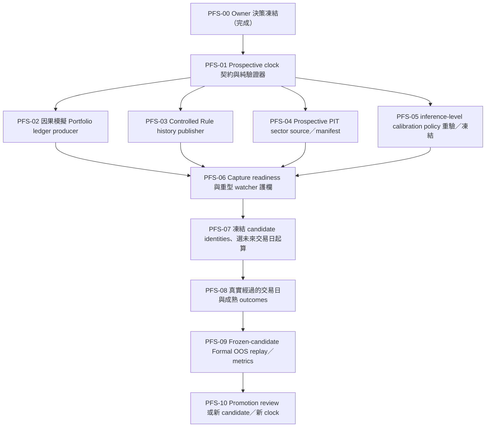

# Prospective Formal Simulated Portfolio Execution Plan（2026-08-14）

> 狀態：`owner_direction_approved / PFS-02_complete / PFS-03_next`
>
> 範圍：Gate 7 正式模擬持倉的未來式證據鏈、PIT sector 邊界、Rule Champion custody、calibration policy 與 frozen-candidate OOS 評估順序。
>
> 安全狀態：`formal_oos_allowed=false`、`production_blend_alpha_bp=0`、`broker_order_allowed=false`；重型 ML watcher 維持停止。

## 1. Owner 決策與產品語意

Owner 已確認現有持倉是功能測試用資料，不是實際券商持倉，也沒有在既定截止時間前保存可驗證的正式 Portfolio transitions 或 HMAC-signed Rule snapshots。因此本專案採用下列產品決策：

1. 建立 **prospective-only 的正式模擬持倉 clock**。這裡的「正式」只表示受治理、不可事後改寫、可供既定 verifier 稽核；`real_money=false`、`broker_execution=false`，不宣稱是真實持倉。
2. `2014–2026` 既有 Direct／OOC、research causal ledger、paper portfolio、Teacher target 與 current-company sector snapshot 全部保留在 research/history 邊界，不改名、不回填、不升格為 Formal 證據。
3. 正式起算日不在本文件預填。只有 capture contract、producer、PIT source、readiness 與安全護欄完成 QA 後，才由 owner 選定當時仍在未來的台灣交易日；不能把已經過去的日期補成起點。
4. 每日正式蒐證與重型 Direct → OOC 重建分開。預設直接把 current cutoff=`2026-08-13T08:30:00+08:00` 的既有 candidate 綁成 prospective clock 的 frozen model，不為了啟動 clock 重訓；若 owner 日後選擇 pre-activation rebuild，必須在起算日前完成並綁定新 identity。Clock 啟動後，同一 clock 期間禁止以已消費的 Formal OOS 日期重訓或替換 model／calibration policy。
5. 這項決策不放寬 calibration、class coverage、20 個真實成熟 shadow trading days、promotion authority 或 rollback Gate。

既有 `2014–2026` model 是由受治理的歷史 research/training lane 產生，prospective clock 只能把它視為 **frozen research-trained challenger** 並提供未來式 Formal OOS 評估；它不會因此變成「歷史正式訓練模型」。若未來 promotion policy 要接受這種 training provenance，必須另有明確、版本化的人類核准；在那之前 `promotion_eligible=false`。

## 2. 目前基線

| 區塊 | 目前狀態 | 判讀 |
|---|---|---|
| Raw PIT publication | 最新 candidate cutoff=`2026-08-14T08:30:00+08:00` | 只有在 clock 啟動前另行核准 rebuild 才可使用；預設 frozen candidate 不消費它 |
| Direct／OOC | current cutoff=`2026-08-13T08:30:00+08:00`；OOC `41/41` folds 與 final meta allocator 已完成 | 訓練完成，不等於允許 Formal OOS |
| 背景程序 | 目前沒有 ML training／formal watcher 在跑 | 安全維持停止；重開機不會中斷這條已停止的鏈 |
| Formal portfolio ledger | path／artifact 缺失 | 不得用 cash-only、research ledger 或 paper portfolio 代替 |
| Formal Rule history | path／artifact 缺失 | controlled HMAC 與 store identity 已可由 runtime handoff 使用；秘密值不得出現在 repo、命令列、status 或 log |
| PIT sector membership | path／artifact 缺失 | prospective-only 可取消 2014 歷史 coverage 主張，但不能取消來源、授權、publication time 與 hash lineage |
| Calibration | 現行唯讀 audit `quality_pass=false`；最大 ECE=`2,627 bp`、最大 calibrated Brier=`3,175 bp`，threshold=`500 bp` | 只作 diagnostic，未掛回模型 |
| Rebalance label | 現行 final meta 的 `rebalance_worthwhile` 沒有 class 1 | promotion 仍 blocked；不得合成正例 |
| Promotion | `formal_oos_allowed=false`、alpha=`0`、broker disabled | 維持 fail-closed |

立即啟動既有 `maintain_ml_direct_v3_refresh_chain.py --watch-formal-inputs` 會先因 raw PIT cutoff 前進而觸發完整 Direct → OOC，而不是單純等待 Formal inputs；因此目前不啟動。

## 3. 不可放寬的安全規則

- 不建立、改寫或宣稱任何 clock 起算日前的 Formal transition、Rule snapshot、PIT membership、elapsed day、outcome 或 promotion credit。
- 首日以 clock 明列的前一交易日 cash seed 為 input state；若版本化策略在首個決策日產生合格配置，才可由該日 transition 形成非現金 output state。
- 所有 feature、sector、restriction、Rule decision 與 portfolio input state 都必須在 decision timestamp 可得；Portfolio state 固定使用 T-1，禁止 future teacher target 與 same-day Advice。
- 金融決策與持久化欄位使用 `Decimal`、整數基點、整數股數或最小貨幣單位；不得新增裸 `float` 核心計算。
- HMAC key 只從 Windows 使用者環境或受控 secret store 進入 process memory；任何輸出最多顯示 `configured=true/false`，不得輸出值、部分值或衍生可逆內容。
- 手動測試持倉的新增／刪除不自動成為 Formal transition。正式模擬 lane 只接受 clock-bound、版本化 policy 的 causal output；若未來允許人工調整，必須另有事前定義的 event schema 與 eligibility 規則。
- prospective-only 不等於「無資料治理」。每日 PIT sector 仍須 `status=accepted`，且具完整 source／license／publication／canonical hash lineage。
- Frozen candidate 的 training cutoff 必須早於 activation；model、feature、calibration 與 evaluation policy identities 在同一 clock 期間不可替換。使用 Formal OOS outcomes 調整的新 candidate 必須開另一個未來 clock，不能回頭在原 clock 計分。
- 未通過 calibration、class coverage、shadow maturity 與 promotion authority 前，不得修改正式 Advice、Portfolio、scheduler、alpha 或 broker 行為。

## 4. 規劃中的版本化契約

以下 identifier 中，PFS-01 的 clock contract 已實作並通過 focused tests；它仍不是目前 full-history consumer 已接受的 Formal artifact，後續 producer／consumer 接線仍須依 PFS-02～06 完成：

| 契約 | 規劃語意 | 與既有 v1 的隔離 |
|---|---|---|
| `prospective-formal-simulated-portfolio-clock.v1` | 綁定 clock id、owner decision、未來 activation trading day、decision timezone／time、immutable official calendar evidence、virtual-cash seed、policy/version/hash、frozen model/training cutoff、calibration/evaluation policy hash、`real_money=false`、`broker_execution=false`、`historical_backfill_claimed=false` | 現行 full-history Gate 不得把它當成舊 v1 已通過 |
| `causal-simulated-portfolio-ledger.v1` | append-only 模擬 transitions、T-1 state、row/chain/custody hash、非現金日計數與禁止 look-ahead flags | 不冒充 `causal-portfolio-ledger.v1` 的歷史正式實盤語意 |
| clock-bound Rule history | 保留 `RuleChampionSnapshot.v1`／`FormalRuleDecisionSnapshot.v1` 的 HMAC、連續 rank 與 immutable hash 要求，另由 prospective clock 綁定起點與不可回填邊界 | 歷史 snapshot 或 TEMP/manual artifact 不得掛接新 clock |
| `pit-sector-membership-prospective-manifest-v1` | rows 可沿用既有 PIT sidecar 欄位，但 manifest 明列 `scope=prospective_only`、`coverage_start`、source/license/publication/hash 與 `historical_backfill_claimed=false` | 不得滿足聲稱覆蓋 `2014–2026` 的舊 full-history Gate |

Consumer 必須顯式選擇 `prospective_formal_simulation` mode；不能因檔案路徑存在，就讓新契約靜默通過舊 `causal-portfolio-ledger.v1`／full-history PIT 驗證器。PFS-01 若發現以 wrapper 綁定既有嚴格 schema 更能維持相容性，可以保留內層 schema，但外層 mode discriminator、起算日與 no-backfill 驗證不可省略。

## 5. 依賴順序

PFS-05 可與 PFS-02～04 平行實作，但 methodology 與 policy hash 必須在 activation 前凍結；它不要求歷史 audit 先達 promotion threshold，但禁止看過 prospective outcomes 後再回頭選方法。PFS-04 的合法 daily source 是 activation 的外部 blocker。

## 6. 可獨立驗證與提交的工作包

| ID | 狀態 | 交付物 | 完成條件 | 建議 commit |
|---|---|---|---|---|
| PFS-00 | `complete` | 本決策與執行計畫 | owner 採用 prospective-only 正式模擬持倉；沒有 Gate credit | `docs(ml): plan prospective formal simulation track` |
| PFS-01 | `complete` | `data_module/prospective_formal_clock.py`、`scripts/inspect_prospective_formal_clock.py`、`tests/test_prospective_formal_clock.py` | 純 contract／validator；拒絕過去或同日 activation、training cutoff 污染、retro credit、real-money/broker flags、缺 hash、無官方 calendar evidence、未知欄位；fixture-only，不寫 `D:` | `feat(ml): define prospective formal simulation clock` |
| PFS-02 | `complete` | `data_module/formal_simulated_portfolio_ledger.py`、`scripts/capture_formal_simulated_portfolio_transition.py`、tests | cash seed → 當日 causal output；T-1、append-only、idempotent、canonical row/chain/hash、non-cash count；無 Teacher／same-day Advice／裸 float；5 focused tests、既有 ledger／turnover regression、py_compile、mypy 0 issues | `feat(ml): capture prospective simulated transitions` |
| PFS-03 | `next` | controlled Rule history publisher adapter／CLI、tests | clock-bound、HMAC-signed canonical bytes、store identity、snapshot id／lineage、rank `1..N`、不可回填；任何輸出不含 secret | `feat(ml): publish clock-bound rule snapshots` |
| PFS-04 | `external_source_required` | prospective PIT manifest／validator／capture、tests、source acceptance evidence | 每列 accepted；source/license/publication/available/effective/hash 完整；只由首次合格 publication 往後計 credit | `feat(data): add prospective PIT sector custody` |
| PFS-05 | `queued` | inference-level calibration audit、預註冊方法與 immutable policy hash | 使用正式 inference 相同的 horizon/family aggregation；每個 validation fold 僅用 prior folds fit；identity 與 isotonic 並列；activation 前凍結，未達預註冊門檻不得 attach 或事後改選 | `fix(ml): align calibration audit with inference` |
| PFS-06 | `queued` | readiness mode、capture-only preflight、heavy-rebuild guard、tests | 三條 capture producer 完整才 ready；capture 路徑不呼叫 Direct/OOC；重建預估與 owner confirmation 分離；status 只顯示 secret configured flag | `feat(ml): guard prospective capture readiness` |
| PFS-07 | `waiting_for_prerequisites` | frozen candidate/calibration/evaluation identities、immutable clock manifest、三個受控 path、輕量 daily capture 啟動紀錄 | PFS-01～06 通過；預設綁定 cutoff 2026-08-13 的現有 candidate；如選 rebuild，必須在 activation 前另行核准並完成；之後選當時仍在未來的台灣交易日 | `ops(ml): activate prospective formal clock` |
| PFS-08 | `waiting_for_time` | 每日 Rule/PIT/transition chain、mature outcomes、shadow observations | 只計真實經過的交易日；至少滿足既有 20 日 shadow Gate；各 5/10/20/60 horizon 仍須分別等到成熟；`rebalance_worthwhile` 需自然出現兩類，不得合成正例或重播補日 | artifact revision，不預先承諾 repo commit |
| PFS-09 | `waiting_for_evidence` | frozen-candidate Formal OOS replay、calibration／PSI report | 只對 clock 已綁定 model/policies 評估；primary／verification hash 相同；不 fit、不 retrain、不用 formal outcomes 選方法 | run artifact；程式未變時不為 run output 建 commit |
| PFS-10 | `waiting_for_gates` | promotion review package 或 next-candidate decision | 所有 machine／human Gate 通過才可評估 promotion；預設仍 `promotion_eligible=false`。如需 retrain／recalibrate，關閉本 clock 並從另一個未來 clock 評估 | 依實際 review 分批 |

## 7. PFS-01：完成證據與 PFS-02 交接

### Definition of Ready

- 本文件已進版控，owner direction 不再是口頭假設。
- 不需要 HMAC secret、正式資料 deposit、網路、Windows scheduler 或 `D:` 寫入。
- 現行 v1 loader、readiness inspector、watcher 與測試保持不變；PFS-01 只新增純 domain contract 與唯讀 inspector。

### Definition of Done

1. Clock manifest 至少保存：schema、clock id、mode、owner decision id/time、activation trading day、decision timezone/time、seed state、virtual notional 最小貨幣單位、strategy/policy version/hash、universe hash、source policy hash、frozen candidate model/feature/training cutoff、calibration/evaluation policy hash、`real_money=false`、`broker_execution=false`、`historical_backfill_claimed=false`、manifest hash。
2. activation 必須嚴格晚於驗證／核准當下的台灣日期，且由注入的 official trading calendar 驗證為交易日；測試不依賴真實系統時間。
3. 驗證器拒絕：過去或同日 activation、candidate training cutoff 不早於 activation、缺 owner decision／frozen identity、非 simulation mode、任何 real-money/broker true、負 virtual notional、float monetary fields、錯 canonical hash、retro evidence count、宣稱歷史 coverage、未知欄位或 schema。
4. inspector 只讀指定 manifest，回傳 status、blockers、logical/file hash 與布林安全旗標；不建立目錄、不寫正式 artifact、不讀出 secret。
5. focused tests、`py_compile`、mypy 與文件編碼檢查通過；變更以單一 commit 提交。

### PFS-01 已完成證據

- 新增 `data_module/prospective_formal_clock.py`：strict top-level／nested schema、canonical SHA-256、Taipei future-date gate、candidate training cutoff gate、cash seed hash、official calendar evidence 與 simulation-only flags。
- 新增 `scripts/inspect_prospective_formal_clock.py`：只讀 stdout／明確 `--output` report；不建立 parent、不寫正式 artifact、不讀出 HMAC secret。
- 新增 `tests/test_prospective_formal_clock.py`：`14 passed`，涵蓋 past／same-day activation、training cutoff、unknown field、tamper hash、seed／integer notional、calendar evidence、read-only inspector 與外部 evidence override。
- `py_compile` 通過；mypy 以 `--explicit-package-bases` 檢查三個檔案為 `0 issues`。此 slice 沒有設定正式 path、寫 SQLite、建立 transition／Rule／PIT artifact 或啟動 watcher。

PFS-02 已完成：新增 append-only、T-1、idempotent 的模擬 Portfolio transition producer；它消費 clock manifest 的 frozen identities，但仍只允許 fixture／受控測試輸入，不寫正式 `D:`。下一個 slice 是 PFS-03：建立 clock-bound、HMAC-signed 的 Rule Champion snapshot history publisher。

### 本 slice 明確不做

- 不選 activation date、不設定三個正式 path、不啟動 capture／watcher／scheduler。
- 不建立 transitions、Rule signatures、PIT rows、elapsed day 或 promotion credit。
- 不重跑 Direct／OOC、不修改 calibration artifact、不寫正式 SQLite。

### PFS-02 已完成證據

- 新增 `data_module/formal_simulated_portfolio_ledger.py`：使用獨立的
  `causal-simulated-portfolio-ledger.v1`，以 T-1 `CausalPortfolioState`、整數 bp
  turnover、canonical transition hash、明確 `previous_chain_hash` 與 recursive
  chain hash 寫入 append-only SQLite；update／delete trigger 與 metadata identity
  會在讀回時重新驗證。
- 新增 `scripts/capture_formal_simulated_portfolio_transition.py`：明確要求
  `--fixture-only`，只接受呼叫端指定的 SQLite，沒有正式 path、watcher、ML
  rebuild 或 HMAC secret 讀取；可用 `--previous-chain-hash` 重播連續日。
- 新增 `tests/test_formal_simulated_portfolio_ledger.py`：`5 passed`，涵蓋首日
  cash seed、idempotent／conflict、T-1／decision time、兩筆連續日 state／chain
  continuity 與 append-only trigger。
- PFS-02 另通過既有 formal portfolio ledger／turnover regression `6 passed`、
  PFS-01 clock `14 passed`、py_compile 與 mypy `0 issues`。這些是 repo／tmp
  fixture 驗證，不是正式 clock 的 elapsed day 或 Formal OOS credit。

### PFS-02 明確不做

- 不建立 `manifest.json`、不設定 `BALDR_ML_FORMAL_PORTFOLIO_LEDGER_PATH`，也不
  將模擬 SQLite 接到既有 `causal-portfolio-ledger.v1` full-history consumer。
- 不產生 Rule HMAC snapshot、PIT sector row、activation date、elapsed day、
  promotion credit 或正式 `D:` artifact。

## 8. Activation 與日常蒐證 Runbook（待程式完成後使用）

下列是執行順序，不是現有可直接複製的命令；實際 CLI 名稱與參數由 PFS-01～06 固化後才寫入 Application Manual：

1. 以 dry-run 驗證下一個可用台灣交易日、clock contract、PIT source acceptance、HMAC/store configured flags 與三條 producer readiness。
2. 預設綁定既有 cutoff=`2026-08-13T08:30:00+08:00` candidate。若 owner 明確要求較新的 candidate，先在 clock 外做一次 pre-activation rebuild、驗證其 model/training identities，完成後才選更晚的 activation；不啟動長駐 watcher。
3. 凍結 model、feature、training cutoff、calibration 與 evaluation policy hashes。Owner 核准 activation manifest；manifest 一經發布，起算日、seed、policy、universe 與任何 frozen identity 不得原地修改，變更只能開新 clock id。
4. 在 Windows 使用者環境／受控 secret store 設定 path 與 Rule store identity；HMAC secret 不出現在對話、repo、命令列、status 或 log。
5. 啟動獨立的低 CPU capture task；每天依序封存 PIT publication → Rule snapshot → T-1 portfolio transition → frozen-candidate inference → readiness/heartbeat。當日任一步驟失敗即不給該日 credit，不在隔日補寫。
6. 重型 ML watcher 在整個 clock 期間維持停止。每週只讀稽核 row count、chain continuity、late/missing days、class counts、source/license drift、frozen identity 與 secret exposure。
7. 各 horizon outcomes 真實成熟後，對同一 frozen candidate 執行 Formal OOS replay／calibration／PSI 與 promotion review；不在本 clock 內 fit 或 retrain。任何 Gate 失敗都保持 alpha 0 與 broker disabled。
8. 若 review 指向 retrain／recalibration，先關閉本 clock、建立新 candidate，再選另一個未來 activation；舊 Formal OOS 只能作前一 candidate 的證據。

## 9. 停止條件與恢復方式

出現下列任一狀況，capture 或後續重建必須 fail closed：

- source/license/publication lineage 缺失、PIT canonical hash 或 coverage 斷裂；
- snapshot 過期、rank 不連續、HMAC/store identity 不符或 secret 被輸出；
- T-1 state、policy/universe/restrictions hash、transition chain 不一致；
- candidate training cutoff 不早於 activation，或 model／feature／calibration／evaluation identity 在 clock 中途改變；
- clock 起算日已錯過、同日才完成核准，或任何元件嘗試回填 elapsed day；
- 只有單一 rebalance class、calibration 比 identity 更差、ECE／Brier 未達門檻；
- watcher 未經 owner 核准即準備啟動完整 rebuild，或已有另一條 ML chain 在跑。

已發布的 append-only artifact 不原地刪改。若 contract 或 policy 必須改版，關閉舊 clock 並以新的未來交易日、新 clock id 重新開始；舊 clock 留作失敗／中止證據，不計入新 clock 的 elapsed days。

## 10. 完成判定

本計畫只有在 PFS-01～10 各自的證據成立後才算完成。完成程式碼、凍結 candidate、啟動 clock、累積 20 日、各 horizon outcome 成熟、通過 Formal OOS、通過 calibration 與取得 promotion authority 是不同事件；前一事件不得自動宣稱後一事件成立。
