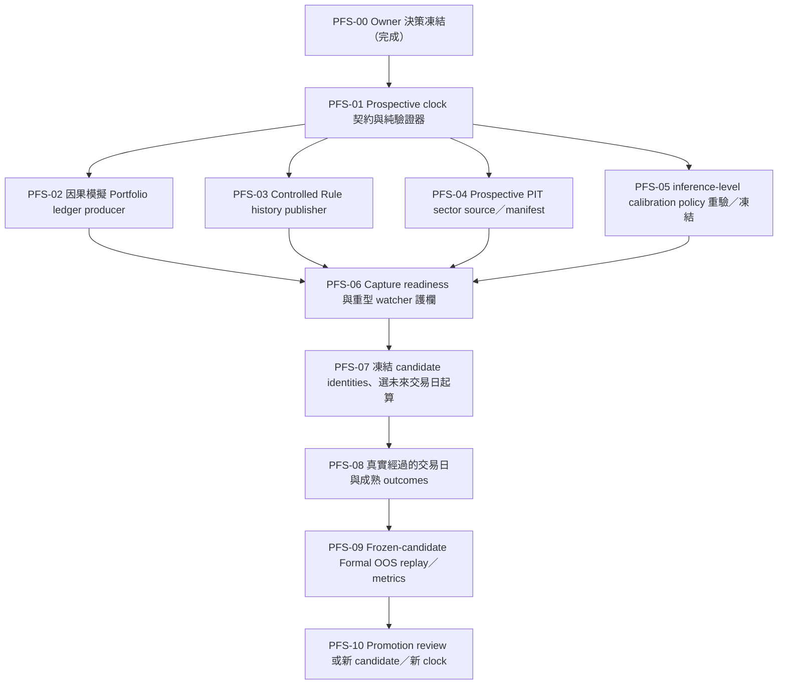

# Prospective Formal Simulated Portfolio Execution Plan（2026-08-14）

> 狀態：`owner_direction_approved / PFS-10_complete / execution_waiting_for_owner_activation`
>
> 範圍：Gate 7 正式模擬持倉的未來式證據鏈、PIT sector 邊界、Rule Champion custody、calibration policy 與 frozen-candidate OOS 評估順序。
>
> 安全狀態：`formal_oos_allowed=false`、`production_blend_alpha_bp=0`、`broker_order_allowed=false`；重型 ML watcher 維持停止。

## 1. Owner 決策與產品語意

Owner 已確認現有持倉是功能測試用資料，不是實際券商持倉，也沒有在既定截止時間前保存可驗證的正式 Portfolio transitions 或 HMAC-signed Rule snapshots。因此本專案採用下列產品決策：

1. 建立 **prospective-only 的正式模擬持倉 clock**。這裡的「正式」只表示受治理、不可事後改寫、可供既定 verifier 稽核；`real_money=false`、`broker_execution=false`，不宣稱是真實持倉。
2. `2014–2026` 既有 Direct／OOC、research causal ledger、paper portfolio、Teacher target 與 current-company sector snapshot 全部保留在 research/history 邊界，不改名、不回填、不升格為 Formal 證據。
3. 正式起算日不在本文件預填。只有 capture contract、producer、PIT source、readiness 與安全護欄完成 QA 後，才由 owner 選定當時仍在未來的台灣交易日；不能把已經過去的日期補成起點。
4. 每日正式蒐證與重型 Direct → OOC 重建分開。預設直接把 current cutoff=`2026-08-13T08:30:00+08:00` 的既有 candidate 綁成 prospective clock 的 frozen model，不為了啟動 clock 重訓；若 owner 日後選擇 pre-activation rebuild，必須在起算日前完成並綁定新 identity。Clock 啟動後，同一 clock 期間禁止以已消費的 Formal OOS 日期重訓或替換 model／calibration policy。
5. 這項決策不放寬 calibration、class coverage、20 個真實成熟 shadow trading days、promotion authority 或 rollback Gate。

既有 `2014–2026` model 是由受治理的歷史 research/training lane 產生，prospective clock 只能把它視為 **frozen research-trained challenger** 並提供未來式 Formal OOS 評估；它不會因此變成「歷史正式訓練模型」。若未來 promotion policy 要接受這種 training provenance，必須另有明確、版本化的人類核准；在那之前 `promotion_eligible=false`。

## 2. 目前基線

| 區塊 | 目前狀態 | 判讀 |
|---|---|---|
| Raw PIT publication | 最新 candidate cutoff=`2026-08-14T08:30:00+08:00` | 只有在 clock 啟動前另行核准 rebuild 才可使用；預設 frozen candidate 不消費它 |
| Direct／OOC | current cutoff=`2026-08-13T08:30:00+08:00`；OOC `41/41` folds 與 final meta allocator 已完成 | 訓練完成，不等於允許 Formal OOS |
| 背景程序 | 目前沒有 ML training／formal watcher 在跑 | 安全維持停止；重開機不會中斷這條已停止的鏈 |
| Formal portfolio ledger | path／artifact 缺失 | 不得用 cash-only、research ledger 或 paper portfolio 代替 |
| Formal Rule history | path／artifact 缺失 | controlled HMAC 與 store identity 已可由 runtime handoff 使用；秘密值不得出現在 repo、命令列、status 或 log |
| PIT sector membership | path／artifact 缺失 | prospective-only 可取消 2014 歷史 coverage 主張，但不能取消來源、授權、publication time 與 hash lineage |
| Calibration | 現行唯讀 audit `quality_pass=false`；最大 ECE=`2,627 bp`、最大 calibrated Brier=`3,175 bp`，threshold=`500 bp` | 只作 diagnostic，未掛回模型 |
| Rebalance label | 現行 final meta 的 `rebalance_worthwhile` 沒有 class 1 | promotion 仍 blocked；不得合成正例 |
| Promotion | `formal_oos_allowed=false`、alpha=`0`、broker disabled | 維持 fail-closed |

立即啟動既有 `maintain_ml_direct_v3_refresh_chain.py --watch-formal-inputs` 會先因 raw PIT cutoff 前進而觸發完整 Direct → OOC，而不是單純等待 Formal inputs；因此目前不啟動。

## 3. 不可放寬的安全規則

- 不建立、改寫或宣稱任何 clock 起算日前的 Formal transition、Rule snapshot、PIT membership、elapsed day、outcome 或 promotion credit。
- 首日以 clock 明列的前一交易日 cash seed 為 input state；若版本化策略在首個決策日產生合格配置，才可由該日 transition 形成非現金 output state。
- 所有 feature、sector、restriction、Rule decision 與 portfolio input state 都必須在 decision timestamp 可得；Portfolio state 固定使用 T-1，禁止 future teacher target 與 same-day Advice。
- 金融決策與持久化欄位使用 `Decimal`、整數基點、整數股數或最小貨幣單位；不得新增裸 `float` 核心計算。
- HMAC key 只從 Windows 使用者環境或受控 secret store 進入 process memory；任何輸出最多顯示 `configured=true/false`，不得輸出值、部分值或衍生可逆內容。
- 手動測試持倉的新增／刪除不自動成為 Formal transition。正式模擬 lane 只接受 clock-bound、版本化 policy 的 causal output；若未來允許人工調整，必須另有事前定義的 event schema 與 eligibility 規則。
- prospective-only 不等於「無資料治理」。每日 PIT sector 仍須 `status=accepted`，且具完整 source／license／publication／canonical hash lineage。
- Frozen candidate 的 training cutoff 必須早於 activation；model、feature、calibration 與 evaluation policy identities 在同一 clock 期間不可替換。使用 Formal OOS outcomes 調整的新 candidate 必須開另一個未來 clock，不能回頭在原 clock 計分。
- 未通過 calibration、class coverage、shadow maturity 與 promotion authority 前，不得修改正式 Advice、Portfolio、scheduler、alpha 或 broker 行為。

## 4. 規劃中的版本化契約

以下 identifier 中，PFS-01 的 clock contract 已實作並通過 focused tests；它仍不是目前 full-history consumer 已接受的 Formal artifact，後續 producer／consumer 接線仍須依 PFS-02～06 完成：

| 契約 | 規劃語意 | 與既有 v1 的隔離 |
|---|---|---|
| `prospective-formal-simulated-portfolio-clock.v1` | 綁定 clock id、owner decision、未來 activation trading day、decision timezone／time、immutable official calendar evidence、virtual-cash seed、policy/version/hash、frozen model/training cutoff、calibration/evaluation policy hash、`real_money=false`、`broker_execution=false`、`historical_backfill_claimed=false` | 現行 full-history Gate 不得把它當成舊 v1 已通過 |
| `causal-simulated-portfolio-ledger.v1` | append-only 模擬 transitions、T-1 state、row/chain/custody hash、非現金日計數與禁止 look-ahead flags | 不冒充 `causal-portfolio-ledger.v1` 的歷史正式實盤語意 |
| clock-bound Rule history | 保留 `RuleChampionSnapshot.v1`／`FormalRuleDecisionSnapshot.v1` 的 HMAC、連續 rank 與 immutable hash 要求，另由 prospective clock 綁定起點與不可回填邊界 | 歷史 snapshot 或 TEMP/manual artifact 不得掛接新 clock |
| `pit-sector-membership-prospective-manifest-v1` | rows 可沿用既有 PIT sidecar 欄位，但 manifest 明列 `scope=prospective_only`、`coverage_start`、source/license/publication/hash 與 `historical_backfill_claimed=false` | 不得滿足聲稱覆蓋 `2014–2026` 的舊 full-history Gate |

Consumer 必須顯式選擇 `prospective_formal_simulation` mode；不能因檔案路徑存在，就讓新契約靜默通過舊 `causal-portfolio-ledger.v1`／full-history PIT 驗證器。PFS-01 若發現以 wrapper 綁定既有嚴格 schema 更能維持相容性，可以保留內層 schema，但外層 mode discriminator、起算日與 no-backfill 驗證不可省略。

## 5. 依賴順序



PFS-05 可與 PFS-02～04 平行實作，但 methodology 與 policy hash 必須在 activation 前凍結；它不要求歷史 audit 先達 promotion threshold，但禁止看過 prospective outcomes 後再回頭選方法。PFS-04 的合法 daily source 是 activation 的外部 blocker。

## 6. 可獨立驗證與提交的工作包

| ID | 狀態 | 交付物 | 完成條件 | 建議 commit |
|---|---|---|---|---|
| PFS-00 | `complete` | 本決策與執行計畫 | owner 採用 prospective-only 正式模擬持倉；沒有 Gate credit | `docs(ml): plan prospective formal simulation track` |
| PFS-01 | `complete` | `data_module/prospective_formal_clock.py`、`scripts/inspect_prospective_formal_clock.py`、`scripts/publish_prospective_formal_clock.py`、`tests/test_prospective_formal_clock.py`、`tests/test_publish_prospective_formal_clock.py` | 純 contract／validator；拒絕過去或同日 activation、training cutoff 污染、retro credit、real-money/broker flags、缺 hash、無官方 calendar evidence、未知欄位；publisher 只接受 owner 明確輸入的未來交易日與官方 calendar evidence，fixture-only、canonical create-only，不寫 `D:` | `feat(ml): define prospective formal simulation clock` |
| PFS-02 | `complete` | `data_module/formal_simulated_portfolio_ledger.py`、`data_module/prospective_simulated_ledger_manifest.py`、`scripts/capture_formal_simulated_portfolio_transition.py`、`scripts/publish_prospective_simulated_portfolio_ledger.py`、tests | cash seed → 當日 causal output；T-1、append-only、idempotent、canonical row/chain/hash、non-cash count；relative SQLite manifest publisher 重新驗證 file hash／clock identity；無 Teacher／same-day Advice／裸 float；ledger／manifest focused tests、既有 ledger／turnover regression、py_compile、mypy 0 issues | `feat(ml): capture prospective simulated transitions` |
| PFS-03 | `complete` | `data_module/prospective_rule_champion_publisher.py`、`scripts/publish_prospective_rule_champion_history.py`、tests | clock-bound `RuleChampionSnapshot.v1`／`FormalRuleDecisionSnapshot.v1`；controlled-store HMAC、store identity、snapshot id／lineage、rank `1..N`、decision timestamp、canonical immutable manifest、不可回填；任何輸出不含 secret；6 focused tests、PFS-01／Rule service regression、mypy 0 issues | `feat(ml): publish clock-bound rule snapshots` |
| PFS-04 | `complete` | `data_module/prospective_pit_sector_membership.py`、`scripts/capture_prospective_pit_sector_membership.py`、tests | prospective-only sidecar 支援 `.json`／`.jsonl`／`.jsonl.gz`；每列 accepted；source/license/publication/available/effective/hash 完整；clock／universe／coverage 綁定；拒絕歷史回填與 current/research fallback；8 focused tests、py_compile、mypy 0 issues | `feat(data): add prospective PIT sector custody` |
| PFS-05 | `complete` | `data_module/prospective_calibration_policy.py`、`scripts/audit_prospective_inference_calibration.py`、tests | policy hash 固定 identity／isotonic 並列、5／10／20／60 horizon、prior validation folds、ECE `500 bp`、class coverage 與 `rebalance_worthwhile` 雙類別；固定 conservative max、禁止 post-outcome method selection；8 focused tests、既有 calibration/OOC/monitor 8 passed、py_compile、mypy 0 issues | `fix(ml): align calibration audit with inference` |
| PFS-06 | `complete` | `data_module/prospective_capture_readiness.py`、`scripts/inspect_prospective_capture_readiness.py`、tests | strict 模式唯讀檢查 calibration／ledger wrapper／Rule history／PIT 三項 input；ledger 要求相對 SQLite、hash chain 與 `non_cash_state_day_count>0`；另有 `--defer-until-activation` staging 模式解除 prospective-only 的循環依賴但不給任何 credit；capture-only 永不呼叫 Direct/OOC；heavy rebuild launch 永遠 false；focused tests、py_compile、mypy 0 issues | `feat(ml): guard prospective capture readiness` |
| PFS-07 | `complete` | `data_module/prospective_formal_clock_activation.py`、`scripts/activate_prospective_formal_clock.py`、`scripts/record_prospective_daily_capture.py`、tests | strict 模式凍結三個 controlled path + file hash；另有 `--defer-inputs` 只保存 `deferred=true`／`path=null` 的未來預約；兩種模式都凍結 candidate／calibration／evaluation／seed identities、controlled store id 與 secret-store configured flag（不含 secret）；owner activation timestamp；daily capture sequence；rebuild／formal／credit flags 全部 fail-closed；focused tests、py_compile、mypy 0 issues | `ops(ml): freeze prospective activation contract` |
| PFS-08 | `complete` | `data_module/prospective_shadow_maturity.py`、`scripts/inspect_prospective_shadow_maturity.py`、tests | complete observation 只接受 activation 後 capture、T-1 input、clock／activation／source hash、已成熟 integer-bp outcomes；maturity report 固定 20 shadow days、每 horizon 至少 20 matured observations、`rebalance_worthwhile` 雙類別；replay/backfill/synthetic/future target 全拒絕；6 focused tests、py_compile、mypy 0 issues | `feat(ml): enforce prospective shadow maturity` |
| PFS-09 | `complete` | `data_module/prospective_frozen_oos_evidence.py`、`scripts/inspect_prospective_frozen_oos.py`、tests | frozen-candidate primary／verification replay wrapper；model／dataset／feature／clock／policy identity；maturity hash；calibration audit／PSI hash；primary／verification replay identity equality；fit／retrain／post-outcome method selection false；missing／quality failure 只產生 blocker；7 focused tests、py_compile、mypy 0 issues | `feat(ml): bind frozen oos evidence` |
| PFS-10 | `complete` | `data_module/prospective_promotion_review.py`、`scripts/inspect_prospective_promotion_review.py`、tests | 聚合 PFS-09 package 與 10 個 machine gates／integer metrics；缺件／失敗列 blockers；即使 `ready_for_owner_review` 仍 `owner_review_received=false`、`owner_authorization_received=false`、`promotion_eligible=false`、alpha=`0`、broker disabled；5 focused tests、py_compile、mypy 0 issues | `ops(ml): keep promotion behind owner review` |

## 7. PFS-01：完成證據與 PFS-02 交接

### Definition of Ready

- 本文件已進版控，owner direction 不再是口頭假設。
- 不需要 HMAC secret、正式資料 deposit、網路、Windows scheduler 或 `D:` 寫入。
- 現行 v1 loader、readiness inspector、watcher 與測試保持不變；PFS-01 只新增純 domain contract 與唯讀 inspector。

### Definition of Done

1. Clock manifest 至少保存：schema、clock id、mode、owner decision id/time、activation trading day、decision timezone/time、seed state、virtual notional 最小貨幣單位、strategy/policy version/hash、universe hash、source policy hash、frozen candidate model/feature/training cutoff、calibration/evaluation policy hash、`real_money=false`、`broker_execution=false`、`historical_backfill_claimed=false`、manifest hash。
2. activation 必須嚴格晚於驗證／核准當下的台灣日期，且由注入的 official trading calendar 驗證為交易日；測試不依賴真實系統時間。
3. 驗證器拒絕：過去或同日 activation、candidate training cutoff 不早於 activation、缺 owner decision／frozen identity、非 simulation mode、任何 real-money/broker true、負 virtual notional、float monetary fields、錯 canonical hash、retro evidence count、宣稱歷史 coverage、未知欄位或 schema。
4. inspector 只讀指定 manifest，回傳 status、blockers、logical/file hash 與布林安全旗標；不建立目錄、不寫正式 artifact、不讀出 secret。
5. focused tests、`py_compile`、mypy 與文件編碼檢查通過；變更以單一 commit 提交。

### PFS-01 已完成證據

- 新增 `data_module/prospective_formal_clock.py`：strict top-level／nested schema、canonical SHA-256、Taipei future-date gate、candidate training cutoff gate、cash seed hash、official calendar evidence 與 simulation-only flags。
- 新增 `scripts/inspect_prospective_formal_clock.py`：只讀 stdout／明確 `--output` report；不建立 parent、不寫正式 artifact、不讀出 HMAC secret。
- 新增 `scripts/publish_prospective_formal_clock.py`：要求 `--fixture-only`，只把 owner 提供的 clock identity、owner decision、未來 activation trading day、官方 calendar evidence、cash seed 與 frozen candidate identities 組成 planned manifest；輸出採 canonical JSON／create-only，不能自動選日期、補過去日期、設定正式 path 或啟動 watcher。
- 新增 `tests/test_prospective_formal_clock.py`：`14 passed`，涵蓋 past／same-day activation、training cutoff、unknown field、tamper hash、seed／integer notional、calendar evidence、read-only inspector 與外部 evidence override。
- 新增 `tests/test_publish_prospective_formal_clock.py`：`4 passed`，涵蓋 immutable file hash、重複寫入、fixture-only guard、有效未來 clock 與同日 activation 拒絕。
- `py_compile` 通過；mypy 以 `--explicit-package-bases` 檢查三個檔案為 `0 issues`。此 slice 沒有設定正式 path、寫 SQLite、建立 transition／Rule／PIT artifact 或啟動 watcher。

PFS-02 已完成：新增 append-only、T-1、idempotent 的模擬 Portfolio transition producer；它消費 clock manifest 的 frozen identities，但仍只允許 fixture／受控測試輸入，不寫正式 `D:`。PFS-03～PFS-10 亦已完成；接下來不再由 repo 自動選日期或啟動正式流程，等待 owner 以受控環境提供未來 activation decision。

### 本 slice 明確不做

- 不選 activation date、不設定三個正式 path、不啟動 capture／watcher／scheduler。
- 不建立 transitions、Rule signatures、PIT rows、elapsed day 或 promotion credit。
- 不重跑 Direct／OOC、不修改 calibration artifact、不寫正式 SQLite。

### PFS-02 已完成證據

- 新增 `data_module/formal_simulated_portfolio_ledger.py`：使用獨立的
  `causal-simulated-portfolio-ledger.v1`，以 T-1 `CausalPortfolioState`、整數 bp
  turnover、canonical transition hash、明確 `previous_chain_hash` 與 recursive
  chain hash 寫入 append-only SQLite；update／delete trigger 與 metadata identity
  會在讀回時重新驗證。
- 新增 `scripts/capture_formal_simulated_portfolio_transition.py`：明確要求
  `--fixture-only`，只接受呼叫端指定的 SQLite，沒有正式 path、watcher、ML
  rebuild 或 HMAC secret 讀取；可用 `--previous-chain-hash` 重播連續日。
- 新增 `data_module/prospective_simulated_ledger_manifest.py` 與
  `scripts/publish_prospective_simulated_portfolio_ledger.py`：在 activation-bound
  clock 下唯讀重驗 SQLite chain、T-1、相對 child path、file hash 與
  `non_cash_state_day_count>0`，再 create-only 產生
  `prospective-formal-simulated-portfolio-ledger-manifest.v1`；publisher 不設定
  formal environment，也不把 fixture/research ledger 自動升格。
- 新增 `tests/test_formal_simulated_portfolio_ledger.py`：`5 passed`，涵蓋首日
  cash seed、idempotent／conflict、T-1／decision time、兩筆連續日 state／chain
  continuity 與 append-only trigger。
- `tests/test_prospective_simulated_ledger_manifest.py`：`4 passed`，涵蓋相對
  SQLite custody、non-cash gate、外部 path、create-only 與寫入前 file-hash drift。
- PFS-02 另通過既有 formal portfolio ledger／turnover regression `6 passed`、
  PFS-01 clock `14 passed`、py_compile 與 mypy `0 issues`。這些是 repo／tmp
  fixture 驗證，不是正式 clock 的 elapsed day 或 Formal OOS credit。

### PFS-02 明確不做

- publisher 可以建立 prospective wrapper `manifest.json`，但不設定
  `BALDR_ML_FORMAL_PORTFOLIO_LEDGER_PATH`，也不將模擬 SQLite 接到既有
  `causal-portfolio-ledger.v1` full-history consumer；是否成為 owner-controlled
  input 仍須 activation 前的合法 path／clock／readiness custody。
- 不產生 Rule HMAC snapshot、PIT sector row、activation date、elapsed day、
  promotion credit 或正式 `D:` artifact。

### PFS-03 已完成證據

- 新增 `data_module/prospective_rule_champion_publisher.py`：只呼叫既有
  `RuleChampionSnapshotService`／`PersistedFormalDecisionArtifactRepository`，由
  controlled runtime HMAC 驗證每列 `FormalRuleDecisionSnapshot.v1`，再建立獨立的
  `prospective-formal-rule-champion-snapshot-history.v1`。manifest 明列 clock id／
  manifest hash、activation boundary、decision time、store identity、Rule／policy／
  score／universe identities、snapshot／lineage ids、連續 rank、canonical hash、
  `historical_backfill_claimed=false` 與 `promotion_eligible=false`。
- 新增 `scripts/publish_prospective_rule_champion_history.py`：明確要求
  `--fixture-only`，只讀 clock／requests／artifact fixture，輸出至呼叫端既有
  parent；不輸出 HMAC key、不啟動 watcher、不讀正式 Portfolio／PIT path。
- 新增 `tests/test_prospective_rule_champion_publisher.py`：`6 passed`，涵蓋
  activation 後 capture loader、clock／timestamp boundary、HMAC／rank、canonical
  manifest、immutable output、fixture CLI 與 secret-safe stdout。
- PFS-03 另通過 PFS-01 clock／既有 Rule service regression `30 passed`、PFS-02／
  formal ledger／turnover regression `11 passed`、py_compile 與 mypy `0 issues`。
  這仍是受控 fixture 驗證，不建立歷史 elapsed day 或 Formal OOS credit。

### PFS-03 明確不做

- 不設定 `BALDR_ML_FORMAL_RULE_CHAMPION_HISTORY_PATH`，不把 prospective wrapper
  靜默交給舊的 full-history `rule-champion-snapshot-history.v1` loader；consumer 必須
  顯式選擇 `prospective_formal_simulation` mode。
- 不合成缺失的 historical Rule rows、不使用 current／research snapshot、不產生 PIT
  membership、activation credit、promotion artifact 或正式 `D:` history。

### PFS-04 已完成證據

- 新增 `data_module/prospective_pit_sector_membership.py`：只接受呼叫端提供的已授權來源 registry 與 membership rows，不下載 T97/T30、不讀 `companies.csv`、不從產業指數或 research output 推導 sector。sidecar 外層 schema 為 `pit-sector-membership-sidecar-v1`，prospective manifest 明確使用 `pit-sector-membership-prospective-manifest-v1`，支援 `.json`、`.jsonl`、`.jsonl.gz`。
- 每列嚴格驗證 `symbol`、`sector_id`、`available_at`、`effective_from`、`effective_to`、`status=accepted`、`source_id`、`license_id`、`source_hash`；source registry 還要求 publication timestamp、版本、sha256 與 `prospective_pit_sector_membership` 使用授權。所有 rows 必須在 clock activation 到 decision date 內、`available_at <= decision_timestamp`、有效區間覆蓋決策日，並完整覆蓋 frozen universe。
- manifest 綁定 clock id／manifest hash、universe hash、coverage、rows hash 與 canonical hash，固定 `formal_source_only=true`、`research_only=false`、`formal_consumer_compatible=true`、`promotion_eligible=false`、`scope=prospective_only`、`historical_backfill_claimed=false`；輸出採 immutable create-only，JSON 解析拒絕重複 key／非 canonical bytes。
- 新增 fixture-only CLI 與 `tests/test_prospective_pit_sector_membership.py`：`.json`／`.jsonl`／`.jsonl.gz`、source／license／status、future availability、universe、歷史／啟動日前 effective_from、tamper、immutability 與 CLI 共 `8 passed`；py_compile 與 mypy `0 issues`。

### PFS-04 明確不做

- 沒有創造或宣稱任何 T97/T30 歷史來源、license、publication metadata；測試 registry 只是受控 fixture，不是正式 source acceptance evidence。
- 不設定 `BALDR_ML_PIT_SECTOR_MEMBERSHIP_PATH`，不寫正式 `D:`，不讓 prospective manifest 靜默通過既有要求 `pit-sector-membership-manifest-v1`／2014–2026 full-history 的 consumer；目前 `formal_oos_allowed=false`、alpha=`0`、broker disabled 維持不變。
- 不把 2014-01-03 或任何 activation 前 rows 回填成 formal PIT；若未來 source 不含完整 lineage，capture 必須 fail closed，不能以 current company snapshot、研究輸出或產業指數成分替代。

### PFS-05 已完成證據

- 新增 `data_module/prospective_calibration_policy.py`：建立 immutable `prospective-formal-inference-calibration-policy.v1`，固定 5／10／20／60 日 horizon、`identity` 與 `isotonic_integer_bp` 並列、primary method 不得由 outcome 事後選擇、每個 target fold 必須提供完整 zero-based prior fold ranks、conservative max aggregation、ECE threshold=`500 bp` 與兩個 class-coverage gates。
- 同一 policy 強制綁定 `clock_id`、model artifact hash、dataset identity hash；`validate_policy_against_clock()` 另重驗 clock 的 `calibration_policy_hash` 與 candidate model identity。policy／audit 均採 canonical hash、create-only bytes，不含 secret、不改既有 OOC／inference artifact。
- 新增 `scripts/audit_prospective_inference_calibration.py`，明確要求 `--fixture-only`；audit 對每個 horizon 比較 identity／isotonic ECE／Brier，檢查 prior-fold fit boundary、source／model／dataset／inference lineage、`rebalance_worthwhile` 的 class 0/1 coverage，並固定輸出 `formal_oos_allowed=false`、alpha=`0`、`promotion_pass=false`。
- `tests/test_prospective_calibration_policy.py` 共 `8 passed`，涵蓋 policy hash／immutability、shadow-only pass、target-fold contamination、isotonic 不改善、class 0 only、缺 horizon、clock binding 與 fixture CLI；既有 OOC cross-fitted calibration、audit 與 matured monitor regression 共 `8 passed`，py_compile 與 mypy `0 issues`。

### PFS-05 明確不做

- 不重新 fit isotonic、不替換 current model／calibrator、不把 base-OOF diagnostic 改名成 inference-level Formal evidence；現有 `latest.json` 的 ECE／Brier 仍須由真正的 inference observations 與 matured outcomes 重新證明。
- 不合成 `rebalance_worthwhile` class 1、不把只含 class 0 的 final head 當作可校準、不寫正式 `D:` calibration pointer，也不解除 `formal_oos_allowed=false`、alpha=`0` 或 broker disabled。

### PFS-06 已完成證據

- 新增 `data_module/prospective_capture_readiness.py`：strict 模式以 planned 或 active clock 唯讀驗證 calibration policy binding、prospective ledger manifest wrapper、clock-bound Rule history 與 PIT sidecar；三項 input 必須同時 `ready` 才會回報正式 readiness ready。另提供 planned clock 的 `defer_until_activation` staging report，明確標示三項 input 尚未收集，不驗證、不給 credit。
- Portfolio wrapper 固定 `prospective-formal-simulated-portfolio-ledger-manifest.v1`，只接受 manifest 內的相對 SQLite path，重新計算 SQLite file hash、ledger manifest hash、transition chain、決策日數與 `non_cash_state_day_count>0`，並拒絕未來決策日、絕對／逃逸 path、空 ledger 或 hash drift。
- Rule readiness 不讀 HMAC secret，只驗證 prospective schema、clock／activation boundary、snapshot／row rank、HMAC signature presence、canonical manifest hash 與 decision timestamp；PIT readiness 重用 PFS-04 的 canonical validator。任何 input 缺失／不合法都只變成 input-level blocker，不會部分啟動。
- 新增 `scripts/inspect_prospective_capture_readiness.py`，明確要求 `--fixture-only`；輸出固定 `capture_only=true`、`direct_ooc_invocation_count=0`、`heavy_rebuild_launch_allowed=false`、`owner_confirmation_required_for_heavy_rebuild=true`，且不讀出 secret、不啟動 watcher。`--defer-until-activation` 只可在 planned fixture mode 使用，並固定 `schema=prospective-formal-capture-readiness-deferred.v1`、`input_collection_phase=deferred_until_activation`。focused tests、py_compile 與 mypy `0 issues` 均通過。

### PFS-06 明確不做

- 不設定 Windows formal paths、不把 fixture wrapper 發布到 `BALDR_ML_*`，不啟動現行 `maintain_ml_direct_v3_refresh_chain.py --watch-formal-inputs`，也不觸發 Direct／OOC rebuild。
- readiness `ready_for_future_activation` 不是 Formal OOS permission；deferred staging 也不代表三項 input ready，仍要等 PFS-07 owner activation、真實經過交易日與後續 matured outcomes。clock 啟動後必須再跑 strict readiness；三項 input 只到位一項時，不能先跑 partial chain。

### PFS-07 已完成證據

- 新增 `data_module/prospective_formal_clock_activation.py`：重新驗證 PFS-06 strict 或 deferred readiness hash，凍結 clock 的 candidate model／feature／training cutoff、calibration／evaluation／policy／universe／source identities 與 seed state；activation manifest 只允許 `status=scheduled`、future activation boundary、三個受控 path（strict）或明確 deferred entries、controlled store id 與 secret-store configured 布林旗標。
- strict activation 的三個 path 必須是 readiness 已驗證的絕對檔案，activation 重新計算每個 path hash／file hash；deferred activation 則只允許三個 `deferred=true`、`path=null` entries，並拒絕任何具體 path。任何 strict readiness 後檔案漂移、path 漂移、缺少 input 或 controlled store 未配置都拒絕。HMAC secret 僅能存在 Windows 使用者／受控 secret store，程式不接受、不讀取、不保存、不輸出 secret value。
- 新增 `scripts/activate_prospective_formal_clock.py`（強制 `--fixture-only`）與 `scripts/record_prospective_daily_capture.py`（強制 `--fixture-only`）。daily record 固定 PIT → Rule → T-1 Portfolio → frozen inference → heartbeat 順序，`completed_steps=[]`、`elapsed_day_credit=0`、`formal_credit=0`，不可隔日補寫；兩個 CLI 都不設定環境、不啟動 watcher／Direct／OOC。
- `tests/test_prospective_formal_clock_activation.py` focused tests 覆蓋 frozen identity、path／readiness drift、deferred activation、secret-store／rebuild guard、create-only manifest、daily zero-credit 與 CLI guard；py_compile 與 mypy `0 issues`。

### PFS-07 明確不做

- 不替 owner 選 activation trading day、不宣稱「第一個未消費交易日」、不建立正式 `D:` artifact，不設定 `BALDR_ML_*` path、`RULE_CHAMPION_CONTROLLED_STORE_ID` 或任何 HMAC secret。
- 不啟動 `maintain_ml_direct_v3_refresh_chain.py --watch-formal-inputs`，不呼叫 Direct／OOC，不重訓／重校準、不消費 Formal OOS 日期；activation manifest 與 daily start record 都不是 Formal OOS permission 或 promotion credit。

### PFS-08 已完成證據

- 新增 `data_module/prospective_shadow_maturity.py`：complete observation 必須在 frozen activation 後、決策日未來界線內，帶有 PIT publication／Rule snapshot／Portfolio transition／inference／source lineage hashes，且 `input_state_date == previous_trading_day < capture_date`。每筆 outcome 只能使用已到 `now` 的日期與 `matured_at`，採 integer bp；缺少 horizon 時保持 waiting，不預先建立 target。
- maturity report 只依 activation-bound、sorted unique observation dates 計算 elapsed shadow days；固定至少 `20` 個 shadow days、每個 `5/10/20/60` horizon 至少 `20` 個 matured observations，並要求每個 horizon 的 `rebalance_worthwhile` class `0/1` 自然出現。任何 `future_teacher_target_used`、`same_day_advice_used`、`replayed`、`backfilled` 或 `synthetic_outcomes_used` flag 都會拒絕。
- 新增 `scripts/inspect_prospective_shadow_maturity.py`，強制 `--fixture-only`；輸出只報告 `waiting_for_maturity` 或 `maturity_gate_ready_shadow_only`，即使 gate ready 仍固定 `formal_oos_allowed=false`、alpha=`0`、promotion=`false`，不啟動 Direct/OOC、不寫正式 `D:`。
- 新增 `scripts/capture_prospective_shadow_observation.py`，強制 `--fixture-only`；只把 owner/producer 已提供的五條 lineage hash、T-1 日期與已成熟 outcome rows 交給 PFS-08 builder，寫出 create-only 單日 observation，不抓資料、不回放、不補日、不建立 target。
- `tests/test_prospective_shadow_maturity.py` 共 `7 passed`，涵蓋 20 日／四 horizon／雙類別、future outcome、unsafe flags、duplicate capture date、create-only report、observation CLI 與 maturity CLI guard；py_compile 與 mypy `0 issues`。

### PFS-08 明確不做

- 不使用 2014–2026 history、research replay、paper／cash-only ledger、Teacher target 或補日來增加 elapsed days；不把日曆天數自動當成交易日，不在本 slice 代替官方 PIT／Rule／transition producer。
- maturity gate 通過只表示 observations 足夠進入 PFS-09 的 frozen-candidate Formal OOS replay；不代表 calibration、PSI、promotion、production alpha 或 broker permission 已通過。

### PFS-09 已完成證據

- 新增 `data_module/prospective_frozen_oos_evidence.py`：只封裝外部已完成的 frozen-candidate primary／verification replay，不執行 heavy replay、fit、retrain、calibrator attach 或 PSI 計算。兩個 role 必須綁定同一 clock／activation／candidate model／feature／dataset／calibration／evaluation identity、同一 maturity report hash，且 `result_identity_hash` 與 `replay_result_hash` 都相同。
- PFS-09 package 另外綁定 inference-level calibration audit 與 integer-bp PSI report；目前 calibration quality 或 PSI 缺件／失敗只產生 `waiting_for_frozen_oos_evidence` blockers，不把 diagnostic 改名為 pass。package 固定 `replay_fit_called=false`、`retrained=false`、`post_outcome_method_selection=false`、`formal_oos_allowed=false`、alpha=`0`。
- 新增 `scripts/inspect_prospective_frozen_oos.py`，強制 `--fixture-only`；它只讀 activation／maturity／replay／calibration／PSI JSON，輸出 create-only evidence package，不設定 path、不啟動 watcher／Direct／OOC。`tests/test_prospective_frozen_oos_evidence.py` 共 `7 passed`，涵蓋完整雙 replay、缺件／quality blocker、identity mismatch、maturity gate、create-only、unsafe fit flag 與 CLI guard；py_compile 與 mypy `0 issues`。

### PFS-09 明確不做

- 不把現有 2014–2026 OOS replay、base-OOF calibration diagnostic 或 research PSI 自動轉成 prospective Formal evidence；沒有同一 frozen candidate 的成熟輸入就維持 waiting。
- `ready_for_formal_review` 仍不是 promotion authority；必須到 PFS-10 完成人工／機器 Gate review，且任何 quality／coverage／cost／drawdown／class failure 都維持 alpha=`0` 與 broker disabled。

### PFS-10 已完成證據

- 新增 `data_module/prospective_promotion_review.py`：固定聚合 10 個 machine gates（雙 replay identity、inference calibration、PSI、rebalance class、look-ahead、source lineage、cost、drawdown／CVaR、turnover／liquidity）與 integer metrics；缺 gate 或 false gate 只列 blocker，未知欄位與非整數 metric fail-closed。
- review package 綁定 PFS-09 package hash、clock／activation／candidate／calibration／evaluation identities，且永久固定 `owner_review_required=true`、`owner_review_received=false`、`owner_authorization_received=false`、`promotion_eligible=false`、`formal_oos_allowed=false`、alpha=`0`、broker disabled。`ready_for_owner_review` 只表示 machine evidence 齊備，不是 promotion。
- 新增 `scripts/inspect_prospective_promotion_review.py`，強制 `--fixture-only`；只建立 create-only review package，不設定 Windows path、不讀 HMAC secret、不啟動 watcher／Direct／OOC、不改 production flags。`tests/test_prospective_promotion_review.py` 共 `5 passed`，涵蓋全 gates 仍須 owner、缺件／失敗 blockers、owner／gate tamper、OOS not-ready 與 create-only／CLI guard；py_compile 與 mypy `0 issues`。

### PFS-10 明確不做

- 不自動產生 owner decision、選 activation trading day、設定三個正式 path／store identity／secret store，不執行任何實際 replay、promotion、retrain 或 broker action。
- review package 完成後，專案仍須等待 owner 明確提供未來 activation decision；若任何 machine／human Gate 失敗，維持 alpha=`0`、broker disabled，另開新 clock 才能評估 retrain／recalibration。

## 11. Execution handoff preflight（PFS-01～10 之後）

程式面完成後，第一個實際執行步驟是唯讀檢查 Windows 使用者／系統環境，不是啟動 watcher：

```powershell
.\.venv\Scripts\python.exe scripts\inspect_prospective_activation_environment.py
```

這個命令只檢查三個 `BALDR_ML_*_PATH` 是否是已存在的檔案，以及
`RULE_CHAMPION_CONTROLLED_STORE_ID`／HMAC secret store 是否配置；secret 只在
受控 reader 內取 configured flag，不會輸出 value。即使回報
`ready_for_owner_activation`，`activation_launch_allowed=false`、
`heavy_rebuild_launch_allowed=false`、`formal_oos_allowed=false` 仍固定不變。

2026-08-15 的目前唯讀結果是 `waiting_for_controlled_environment`：三個 formal path
均缺失；shared controlled reader 回報 store／HMAC configured flag，但沒有任何 path
可供 activation。這不是 failure，也不會觸發補檔、重訓或 watcher；owner 設定合法
manifest paths 後，再重新執行同一 preflight，才可進入 PFS-07 activation command。

為了讓目前狀態可以直接交接給下一個執行者，另提供單一唯讀 execution-plan
inspector：

```powershell
.\.venv\Scripts\python.exe scripts\inspect_prospective_execution_plan.py `
  --now <OWNER-SUPPLIED-ISO-TIMESTAMP>
```

它會把環境、clock、readiness、activation、daily capture、shadow maturity、
frozen OOS／calibration／PSI 與 promotion review 固定列成八個 stage，並且把
需要 owner 補齊的 path／source／日期決策列成 `next_actions`。這個工具的 schema
是 `prospective-formal-execution-plan.v1`；輸出固定
`read_only=true`、`date_auto_selected=false`、`formal_oos_allowed=false`、
`heavy_rebuild_launch_allowed=false`、`promotion_eligible=false`，不會寫入
Windows 環境、不會建立任何 formal artifact、不會啟動 watcher／Direct／OOC，
也不會輸出 HMAC secret。若要留存 immutable handoff，可加上已存在 parent 的
`--output <PLAN_JSON>`；檔案已存在時拒絕覆寫。

目前該 inspector 的結果同樣是 `waiting_for_owner_inputs`，三個
`BALDR_ML_*_PATH` blocker 尚未消失；這代表程式與執行順序已 ready，外部合法
資料／path 與 owner activation decision 仍是唯一未完成的輸入，不代表可以用
research／現行公司快照或 2014 舊檔代替。

若三份 prospective input 在 activation 前尚不存在，先用
`inspect_prospective_capture_readiness.py --fixture-only --defer-until-activation`
建立 deferred staging report；它只綁定 planned clock／policy 與未來第一個 decision
timestamp，不讀任何 formal path，也不宣稱 input ready。搭配
`activate_prospective_formal_clock.py --fixture-only --controlled-environment --defer-inputs`
可在只具備 controlled store identity／HMAC configured flag 時預約 clock；三個
controlled path 會明確保存為 deferred，且不給 non-cash、elapsed day、Formal OOS 或
promotion credit。

clock 到達第一個未來決策日後，owner 設定 paths，PFS-06 再用明確的
`--controlled-environment` opt-in 直接讀取同一個 shared reader，驗證三份
manifest／sidecar 的 schema、hash、clock boundary、T-1 與 lineage；這仍是唯讀
capture readiness，不會把環境值寫入 process、repo 或 artifact，不會讀出 HMAC secret，
也不會啟動 watcher／Direct／OOC。任何 path missing 或 input invalid 都維持 blocked；
只有 strict readiness report 及 owner activation manifest 都通過後，才進入未來交易日
的 daily capture。

PFS-07 activation CLI 支援兩種明確 source mode：strict 的
`--fixture-only --controlled-environment` 取三個 path、非秘密
`RULE_CHAMPION_CONTROLLED_STORE_ID` 與 HMAC configured boolean，重新交給既有
activation validator 做 readiness／file-hash／frozen identity 檢查；deferred 的
`--fixture-only --controlled-environment --defer-inputs` 則只取 store identity／HMAC
configured boolean，並要求 readiness 是 deferred schema。strict path、store id 或
HMAC configured flag 任一缺失時不寫 manifest；deferred 只允許 path 尚未配置，不放寬
store／HMAC gate。即使成功，manifest 仍固定 `heavy_rebuild_launch_allowed=false`、
`formal_oos_allowed=false`、alpha=`0`、broker disabled，且不啟動任何 ML 程序。

## 8. Activation 與日常蒐證 Runbook（PFS-01～10 已完成；等待 owner inputs）

下列是目前可執行的順序。每個命令都必須由 owner 明確提供 clock／policy／
readiness／activation identity 與輸出 parent；fixture-only 或
`--controlled-environment` 模式只做受控驗證與 create-only evidence，不會自動
啟動 legacy Direct/OOC watcher。prospective capture lane 與歷史 heavy rebuild
lane 必須保持分離：三個 prospective path 出現時，不能直接把它們交給舊的
`--watch-formal-inputs` 重建器。

1. 執行 `scripts\inspect_prospective_execution_plan.py --now <NOW>` 與
   `scripts\inspect_prospective_activation_environment.py`；三個 path、store
   identity、HMAC configured flag 與目前 ML／CPU 狀態先只讀確認。
2. Owner 提供合法 prospective PIT source／license／publication/hash lineage、
   clock calendar evidence、cash seed、frozen candidate 與 calibration policy；
   以 `publish_prospective_formal_clock.py --fixture-only` 建立 planned clock。
   不自動選日期、不回填 2014–2026。
3. 若三份正式 input 尚未存在，先以
   `inspect_prospective_capture_readiness.py --fixture-only --defer-until-activation`
   建立 deferred readiness，再由 owner 確認 controlled store identity／HMAC
   configured flag 後執行 `activate_prospective_formal_clock.py --fixture-only
   --controlled-environment --defer-inputs`。這一步只預約 clock，不建立 transition、
   snapshot 或 PIT row。
4. 在第一個未來決策日以前或當日，由 owner 透過 Windows 使用者環境／受控 secret
   store 設定三個 path；HMAC secret 不出現在對話、repo、命令列、status 或 log。再以
   `inspect_prospective_capture_readiness.py --controlled-environment`（不帶 defer）
   同時驗證三項 input，不能 partial start；若沒有合法 source／license／publication/
   hash lineage 就維持 blocked。
5. Owner 明確確認 activation 後，以 strict
   `activate_prospective_formal_clock.py --fixture-only --controlled-environment`
   凍結 path／file hashes 與所有 candidate identities。deferred 預約不會自動轉成
   strict readiness，也不會自動給 Formal OOS permission。
6. 每個未來交易日只執行低 CPU capture：先建立
   `record_prospective_daily_capture.py --fixture-only` 的 start record，再由
   PIT／Rule／T-1 transition／frozen inference producers 供給 lineage hashes，
   以 `capture_prospective_shadow_observation.py --fixture-only` 形成單日 evidence。
   任一步驟失敗即不給該日 credit，不在隔日補寫。
7. 重型 legacy ML watcher 在整個 prospective clock 期間維持停止。每週只讀稽核
   row count、chain continuity、late/missing days、class counts、source/license
   drift、frozen identity 與 secret exposure；不要把 prospective wrapper 當成
   舊 full-history consumer 的輸入。
8. 各 horizon outcomes 真實成熟後，以
   `inspect_prospective_shadow_maturity.py`、`inspect_prospective_frozen_oos.py`
   與 `inspect_prospective_promotion_review.py` 依序檢查；不在本 clock 內 fit 或
   retrain。任何 Gate 失敗都保持 alpha 0 與 broker disabled。
9. 若 review 指向 retrain／recalibration，先關閉本 clock、建立新 candidate，再
   選另一個未來 activation；舊 Formal OOS 只能作前一 candidate 的證據。

## 9. 停止條件與恢復方式

出現下列任一狀況，capture 或後續重建必須 fail closed：

- source/license/publication lineage 缺失、PIT canonical hash 或 coverage 斷裂；
- snapshot 過期、rank 不連續、HMAC/store identity 不符或 secret 被輸出；
- T-1 state、policy/universe/restrictions hash、transition chain 不一致；
- candidate training cutoff 不早於 activation，或 model／feature／calibration／evaluation identity 在 clock 中途改變；
- clock 起算日已錯過、同日才完成核准，或任何元件嘗試回填 elapsed day；
- 只有單一 rebalance class、calibration 比 identity 更差、ECE／Brier 未達門檻；
- watcher 未經 owner 核准即準備啟動完整 rebuild，或已有另一條 ML chain 在跑。

已發布的 append-only artifact 不原地刪改。若 contract 或 policy 必須改版，關閉舊 clock 並以新的未來交易日、新 clock id 重新開始；舊 clock 留作失敗／中止證據，不計入新 clock 的 elapsed days。

## 10. 完成判定

本計畫只有在 PFS-01～10 各自的證據成立後才算完成。完成程式碼、凍結 candidate、啟動 clock、累積 20 日、各 horizon outcome 成熟、通過 Formal OOS、通過 calibration 與取得 promotion authority 是不同事件；前一事件不得自動宣稱後一事件成立。
