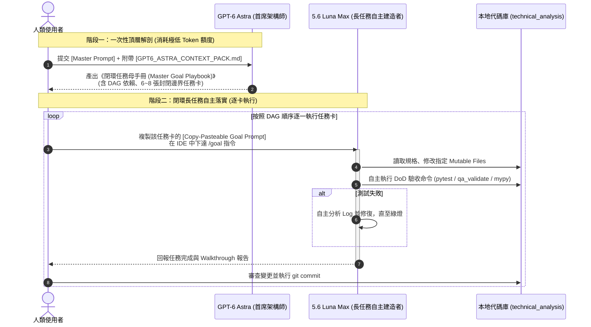

# GPT-6 Astra 與 5.6 Luna Max 雙 Agent 協作操作標準手冊 (SOP)

> **目標**：用最昂貴、推理能力最強的 **GPT-6 Astra** 進行一次性全局架構解剖與閉環任務卡拆解；隨後由 **5.6 Luna Max** 透過 `/goal` 長任務模式，依序將各個閉環任務逐一落實、測試並收斂。

---

## 總體執行流程圖



---

## 第一階段：向 GPT-6 Astra 提問 (SOP)

### 步驟 1.1：準備輸入資料
您只需要準備兩個東西：
1. **上下文檔案**：位於專案根目錄的 [GPT6_ASTRA_CONTEXT_PACK.md](file:///c:/Projects/PythonProjects/technical_analysis/GPT6_ASTRA_CONTEXT_PACK.md)。
2. **Master Prompt**：下方提供的完整提示詞範本。

### 步驟 1.2：發送給 GPT-6 Astra 的 Master Prompt
直接將以下內容複製貼入 GPT-6 Astra（若 Astra 支援附加檔案，直接上傳 `GPT6_ASTRA_CONTEXT_PACK.md`；若不支援，將該檔案內容貼在 Context 區域）：

````markdown
# Role: Principal Quant Software Architect & Task Decomposition Lead

## Background & Constraints
請閱讀附帶的專案架構規範文件《GPT6_ASTRA_CONTEXT_PACK.md》。
這是一套約 6 萬行代碼的台股量化與決策工作台（baldr / technical_analysis）。
【重要限制】：請不要生成任何具體的業務實作程式碼（以節省生成 Token 與推理預算）。你的唯一使命是進行「端到端閉環（Closed-Loop）架構解剖」，為下游自主長任務 Agent 輸出結構嚴密的「模組化長任務藍圖（Master Goal Playbook）」。

---

## Output Deliverables

請依序產出以下四個部分：

### Part 1: 全局資料流閉環拓撲 (System Closed-Loop Topology)
- 繪製或列出從「原始行情與分點獲取」➔「SQLite 落地」➔「指標與因子運算」➔「推薦與回測」➔「研究保存」➔「持倉風控」的完整 DAG 流程。
- 指明各層之間的 DTO 契約邊界。

### Part 2: 核心閉環任務卡片清單 (Closed-Loop Goal Task Cards)
請將整個系統解構為 6 ~ 8 個高凝聚、低耦合的「獨立閉環任務卡」。
每個任務卡必須完全符合以下標準 Markdown 規格：

#### [TASK-LOOP-XX: 任務代號與模組名稱]
1. **【閉環定義 (Closed Loop Scope)】**：
   - 觸發與輸入 (Trigger / Input)：
   - 核心處理引擎 (Domain / App Engine)：
   - 產出物與儲存 (Artifact / Output)：
   - 驗證方式 (Verification / Audit)：
2. **【檔案邊界控制 (Strict File Boundaries)】**：
   - 允許修改的檔案 (Mutable Files)：
   - 僅限讀取的參考檔案 (Read-Only Context Files)：
   - 嚴禁觸碰的檔案 (Forbidden Off-limit Files)：
3. **【防禦與治理守則 (Guardrails)】**：
   - 是否涉及金融數值？如何防範裸 float？
   - 是否涉及時間序列？如何防範 Look-ahead bias？
   - 分層限制（UI 禁連 DB、App 禁引用 Qt）。
4. **【驗收標準與 CLI 命令 (Definition of Done & Verification CLI)】**：
   - 具體需要執行的 pytest 測試檔與 qa_validate 腳本。
5. **【給 5.6 Luna Max 的 /goal 提示詞 (Copy-Pasteable Goal Prompt)】**：
   - 撰寫一段 200~300 字、具備完整上下文引導的 Prompt，使人類能直接一鍵複製貼給 Luna Max 開啟 `/goal` 執行。

### Part 3: 任務依賴 DAG 與執行順序矩陣 (Execution Roadmap)
- 使用表格或 ASCII/Mermaid 說明各任務卡的先後順序（哪些必須先做、哪些可平行處理）。

### Part 4: 潛在技術債與風險雷達 (Risk Radar)
- 指出本系統在長期演化（V4.0+）中最脆弱的 3 個架構瓶頸與建議防範策略。
````

---

## 第二階段：將產出交給 5.6 Luna Max 執行 (SOP)

當 GPT-6 Astra 生成了這份 Master Goal Playbook 之後，請依以下步驟驅動 Luna Max：

### 步驟 2.1：確認任務卡依賴順序 (DAG)
通常 Astra 會將任務拆解為類似以下順序：
- **Loop 1**：`Data Pipeline & Indicators`（數據更新與指標計算閉環）
- **Loop 2**：`Market Regime & Breadth`（大盤狀態與市場觀察閉環）
- **Loop 3**：`Scoring & Recommendation`（推薦分析與解釋理由閉環）
- **Loop 4**：`Research Lab & Run Registry`（回測撮合與 Parquet 保存閉環）
- **Loop 5**：`Portfolio & Paper Execution`（持倉帳本與 Decimal 模擬閉環）
- **Loop 6**：`Daily Decision Desk & Runtime`（決策總合與事件總線閉環）

### 步驟 2.2：在 IDE 中啟動 Luna Max 並開啟 `/goal`
1. 切換模型至 `5.6 Luna Max`。
2. 在對話框中輸入：
   ```text
   /goal
   ```
3. 緊接著貼上 Astra 任務卡中的 **【給 5.6 Luna Max 的 /goal 提示詞】**。

### 步驟 2.3：Luna Max 的自主執行與驗收模式
- Luna Max 在 `/goal` 模式下會自主閱讀相關檔案、進行修改。
- **重要防線**：Luna Max 必須在結束任務前，自主執行任務卡上指定的 CLI 命令：
  ```powershell
  .\.venv\Scripts\python.exe -m pytest tests/test_xxxx.py -q
  .\.venv\Scripts\python.exe scripts\qa_validate_xxxx.py
  ```
- 若測試報錯，Luna Max 會自主讀取 Traceback 並調試，直到所有測試通過。

### 步驟 2.4：單卡完成與 Git Commit
- 當 Luna Max 回報任務完成並輸出 Walkthrough 後，在終端機檢查 git status：
  ```powershell
  git status
  ```
- 確認修改皆在任務卡允許的 `Mutable Files` 範圍內。
- 執行一次乾淨的 Commit：
  ```powershell
  git add .
  git commit -m "feat(loop-01): 完成 Data Pipeline & Indicators 閉環實作與驗收"
  ```
- **完成後再進入下一張任務卡！** 這種「一卡一提交」的紀律能確保代碼庫永遠維持在可回滾、高健康的狀態。
