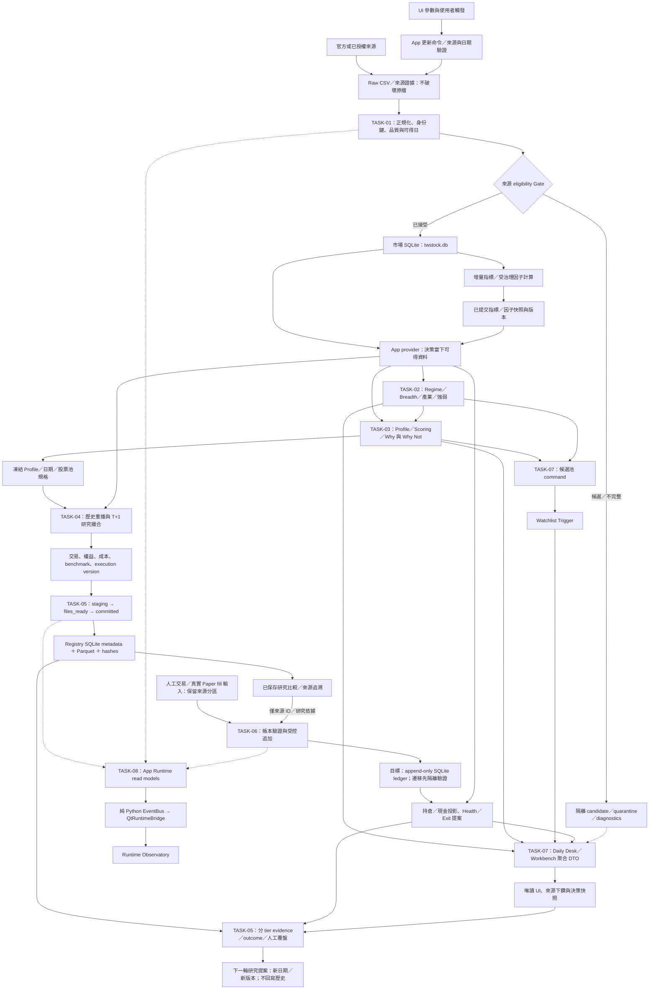
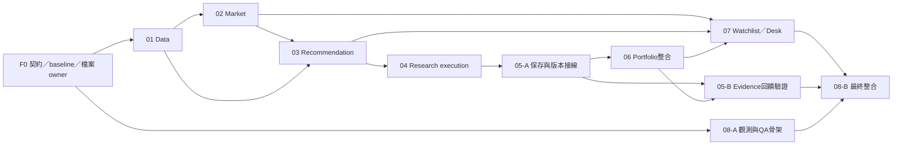

# 模組化長任務藍圖（Master Goal Playbook）

> 2026-09-06；用途是下游長任務分解與驗收契約，並非取代 Scoped SSOT、正式資料寫入授權或 V4 release approval。本次只讀架構、程式與驗收入口，沒有執行 pytest／QA，也沒有修改業務程式。
> 本文件所稱「新增」檔案目前不存在，必須由指定任務建立後才可執行。其餘檔案已按目前工作樹核對。閱讀範圍包括治理文件、current status，以及大型 Architecture／Manual 中與八個閉環相關章節；沒有逐行閱讀全部程式。

## Part 1：全局資料流閉環拓撲（System Closed-Loop Topology）

### 現況校正

使用者給定的分層、Decimal、T+1、DB-first 是本藍圖的驗收目標；現存實作有下列差距：

- [data_module/config.py](C:/Projects/PythonProjects/technical_analysis/data_module/config.py)：市場 DB 是 DATA_ROOT/sqlite/twstock.db，Registry 另在 OUTPUT_ROOT/research_runs/research_runs.db，不能硬編碼 market_data.db 或假設只有一個 DB。
- 市場頁實際入口是 [ui_qt/views/market_regime_view.py](C:/Projects/PythonProjects/technical_analysis/ui_qt/views/market_regime_view.py) 等市場探索分頁；研究頁是 [ui_qt/views/backtest_view.py](C:/Projects/PythonProjects/technical_analysis/ui_qt/views/backtest_view.py)；題述兩個 market_watch_view.py／research_lab_view.py 不存在。
- [app_module/watchlist_service.py](C:/Projects/PythonProjects/technical_analysis/app_module/watchlist_service.py) 使用 JSON；[app_module/portfolio_store.py](C:/Projects/PythonProjects/technical_analysis/app_module/portfolio_store.py) 使用 JSONL。[app_module/portfolio_service.py](C:/Projects/PythonProjects/technical_analysis/app_module/portfolio_service.py) 的 delete／clear 可重寫帳本，故 immutable DB-first ledger 是待收斂目標。
- [app_module/recommendation_portfolio_backtest_service.py](C:/Projects/PythonProjects/technical_analysis/app_module/recommendation_portfolio_backtest_service.py) 仍有同日收盤訊號／成交及影響退出與報酬的浮點路徑；不能宣稱已符合 T+1。
- EventBus 實在 [app_module/runtime_services/event_bus.py](C:/Projects/PythonProjects/technical_analysis/app_module/runtime_services/event_bus.py)；Runtime Observatory 是唯讀觀測，不是已完成的 durable task queue。
- [docs/00_core/PROJECT_SNAPSHOT.md](C:/Projects/PythonProjects/technical_analysis/docs/00_core/PROJECT_SNAPSHOT.md) canonical status 仍為 action_required；工程完成、source accepted、Formal credit、paper fills 與 production writer readiness 必須分開。

### 單次執行 DAG

實線是資料／命令流，虛線是狀態投影。節點區分輸入及輸出階段，不代表 Python import；所有 UI 跨界均透過 app ports。覆盤只生成下一輪輸入，故單輪保持 DAG。



### DTO 與 SSOT 邊界

| 跨界 | 現存接點與待補契約 | 最低驗收內容 |
|---|---|---|
| UI → App | 更新目前部分 dict；TASK-01 新增 update_loop_dtos；市場舊 tuple/DataFrame 由 TASK-02 包裝 | request_id、決策日／實際資料日、來源 ID、quality、warnings、成功／部分完成／失敗；名稱為目標欄位，依既有 DTO 相容映射 |
| App → Domain | domain 自有值物件或中立 port；不可把 app DTO import 進 domain | Decimal 金額／整數分、股、bp，凍結資料切片；domain 不接 SQL、Qt 或全域資料集 |
| Recommendation | RecommendationDTO／RecommendationResultDTO；FactorRecord 為 domain 因子契約 | eligible universe 日期與大小、Profile／權重版本、Why／Why Not、資料來源與資格 |
| Research → Registry | ResearchRunMetadataDTO | run_id、data_cutoff_date、data_fingerprint、data_manifest、execution_price、capital_cents、費用／滑價單位、benchmark、payload/file hashes；新增 execution version 須相容 |
| Ledger → App → UI | TradeDTO／PositionDTO／PortfolioDTO；domain 重建持倉 | 事件 ID、來源 namespace、交易時間與估值日、精確股數／金額、現金與損益；展示 float 不得回流決策 |
| App → Daily Desk | DecisionDeskSnapshot 與各 Summary／Workbench DTO | 每 section 自有 as_of_date、quality、warnings；聚合不能洗掉降級，unknown 不等於無風險 |
| Runtime → UI | RuntimeStateSnapshotDTO／RuntimeHealthSnapshotDTO／RuntimeEventDTO／ScheduledOperationsSnapshotDTO | 事件時間、cursor、read state、來源路徑、治理與營運分開；通知不負責持久化或啟動任務 |
| 大型資料 | 市場 DB、Registry DB、Parquet 與受治理 evidence repository | 跨模組交 ID／hash／manifest，使用範圍受限且可重建的資料切片；不以全域 DataFrame 當 SSOT |

財報 period、available_date／available_at、decision_time、execution_time 必須分開；若只有公告日期而無時刻，採明定保守交易時點。T+1 指下一個可交易 session，不是曆日加一。

## Part 2：核心閉環任務卡片清單（Closed-Loop Goal Task Cards）

### 全卡共同執行契約

1. 先讀根目錄 AGENTS 與其必讀文件、git status、當前卡白名單；不重建已通過的底座，只修復 DoD 證實缺口。本次出藍圖不等於啟動這八張實作。
2. 除本卡 Mutable、新增檔案、明定測試 owner 與本卡新交接文件外，其餘檔案均禁止修改；Read-Only 與 Forbidden 可供核對，不能編輯。禁止改使用者 dirty files、正式 DATA_ROOT／OUTPUT_ROOT、原始資料、密鑰、Git 歷史或外部 Gate。
3. 每卡可新增 tests/test_task_loop_XX_contract.py 與 docs/06_qa/TASK_LOOP_XX_HANDOFF.md（XX 換本卡編號），只收錄關鍵行為／故障測試，不寫映射實作的空泛測試。本卡既有 pytest 測試允許修改；test_ui_qt_research_run_save.py 唯一 owner 為 TASK-05，TASK-04 僅執行。
4. 每次交接包含 base／current SHA、dirty 摘要、實際改檔、DTO/Schema 版本、輸入來源及 hash、決策／可得／成交時點、測試命令與 exit code、skips／failures、artifact 位置、回復步驟及未完成條件。全用繁中，交接檔保存精簡證據；output/ 原始 QA、graphify-out/ 不提交。
5. 共享檔唯一 owner：config.py→01；dtos/__init__.py→03；research_run_dtos.py→05；decision_desk_dtos.py→07；ui_qt/main.py 與 QA inventory→08。跨卡契約先交換提案，由 owner 修改；凍結後才作平行整合。不存在「整個 app_module 都可改」。
6. Manual、current/target architecture、Snapshot、Roadmap Hub、6M、Index 與 shared state 由整合者單一寫入。各卡同步交付精確章節補丁，TASK-08 依 coverage 集中套用與覆核；未同步不得工程 closeout。只更新已證實行為，不改未通過 Gate 的成熟度。新的跨模組 schema 或正式 migration 要有獨立的可審閱提案。
7. 所有測試雙根隔離：DATA_ROOT 與 OUTPUT_ROOT 都指向此卡獨立 sandbox；PROFILE=test 會再追加 /_test，須核對實際解析路徑。使用離線 fixtures 或合法唯讀備份，不因空資料測试失敗改指正式環境。正式讀取須 query-only，不能初始化會建 schema／reconcile 的 writer service。fixture 不算真實來源／時間／投資證據。
8. 工程狀態採進行中／工程驗收完成／外部條件未滿／已整合；不得以測試綠燈、日曆前進、缺資料補值或修改 Gate 達成 /goal。外部來源缺件只阻擋依賴它的步驟；可繼續其他已授權工程。自然週期、真實 fills、具名接受、正式 canary／切換另列有輸入要求的 Gate。
9. 功能修改皆做量化時間線自查；新金融核心運算不能裸 float。靜態檢查是白名單 AST gate，不足以證明跨函式 PIT、全期間標準化或成交語義。必要行為測試是 future-append 不變性、late-publication、成本與現金守恆、來源損毀／中斷。
10. 所有 UI 修改強制執行更新頁 pytest、更新 QA、全模組 mypy，再 py_compile 本次變更 Python；本卡專用 pytest／QA 仍須跑。若未修改 Python，不為本文件執行無關測試。

### CLI 共用前置

以下是命令，沒有業務實作程式碼。從專案根目錄執行，並先把此例 01 換成本卡 ID；每卡建立有必要資料的獨立 fixture sandbox。新 QA 腳本必須自備隔離 fixture、明確結果與失敗非零 exit code，缺輸入或 skip 不能冒充通過。

```powershell
Set-Location "C:/Projects/PythonProjects/technical_analysis"
$Py = "C:/Projects/PythonProjects/technical_analysis/.venv/Scripts/python.exe"
$env:DATA_ROOT = "C:/Projects/PythonProjects/technical_analysis/output/master_goal/TASK-LOOP-01/data"
$env:OUTPUT_ROOT = "C:/Projects/PythonProjects/technical_analysis/output/master_goal/TASK-LOOP-01/artifacts"
$env:PROFILE = "test"
$env:QT_QPA_PLATFORM = "offscreen"
```

金融／日期邏輯修改必跑：

```powershell
& $Py "C:/Projects/PythonProjects/technical_analysis/scripts/check_financial_float_boundaries.py"
& $Py "C:/Projects/PythonProjects/technical_analysis/scripts/check_look_ahead_bias.py"
```

UI 修改必跑；py_compile 後面的佔位須展開為本次改動的實際完整路徑：

```powershell
& $Py -m pytest "C:/Projects/PythonProjects/technical_analysis/tests/test_ui_qt_update_view_workbench.py" -q -o addopts=
& $Py "C:/Projects/PythonProjects/technical_analysis/scripts/qa_validate_update_tab.py"
& $Py -m mypy ui_qt app_module data_module analysis_module backtest_module decision_module portfolio_module runtime
& $Py -m py_compile <本次變更的Python完整檔案路徑>
```

[scripts/qa_validate_phase2_5.py](C:/Projects/PythonProjects/technical_analysis/scripts/qa_validate_phase2_5.py) 不作本藍圖正式 DoD：它會新增／移除／清空候選與保存其他 artifacts，還存在 tuple/DataFrame 契約漂移及失敗不傳出非零碼問題。不可直接在正式雙根執行。TASK-02／07 各建立專用隔離 QA。[scripts/qa_validate_phase3_3b.py](C:/Projects/PythonProjects/technical_analysis/scripts/qa_validate_phase3_3b.py) 含保存／promotion 測試，只可在 TASK-04 的隔離 sandbox 驗證；不得作用於正式策略。

#### [TASK-LOOP-01: DATA：資料更新與可得日閉環]

1. **【閉環定義 (Closed Loop Scope)】**：
   - 觸發與輸入 (Trigger / Input)：手動更新／既有已授權更新入口；交易日範圍、來源設定、既有 watermark 與 Raw CSV。
   - 核心處理引擎 (Domain / App Engine)：UpdateService → DataProcessor／DBManager → TechnicalAnalyzer；統一狀態查詢、增量同步與失敗診斷。
   - 產出物與儲存 (Artifact / Output)：受治理 daily_prices／broker_flows／technical_indicators、資料版本與更新結果 DTO；candidate 資料維持隔離。
   - 驗收與覆盤 (Verification / Audit)：同批重跑無重複；中斷不發布完成燈號；增量與同參數完整重算在隔離樣本上一致。
2. **【檔案邊界控制 (Strict File Boundaries)】**：
   - 允許修改的檔案 (Mutable Files)：[app_module/update_service.py](C:/Projects/PythonProjects/technical_analysis/app_module/update_service.py)、[app_module/update_service_status_support.py](C:/Projects/PythonProjects/technical_analysis/app_module/update_service_status_support.py)、[data_module/config.py](C:/Projects/PythonProjects/technical_analysis/data_module/config.py)、[data_module/data_processor.py](C:/Projects/PythonProjects/technical_analysis/data_module/data_processor.py)、[data_module/db_manager.py](C:/Projects/PythonProjects/technical_analysis/data_module/db_manager.py)、[analysis_module/technical_analysis/technical_analyzer.py](C:/Projects/PythonProjects/technical_analysis/analysis_module/technical_analysis/technical_analyzer.py)、[ui_qt/views/update_view.py](C:/Projects/PythonProjects/technical_analysis/ui_qt/views/update_view.py)、[scripts/qa_validate_update_tab.py](C:/Projects/PythonProjects/technical_analysis/scripts/qa_validate_update_tab.py)。新增白名單：`C:/Projects/PythonProjects/technical_analysis/app_module/dtos/update_loop_dtos.py`。另含本卡測試 owner、新契約測試與交接文件，依共用規則。
   - 僅限讀取的參考檔案 (Read-Only Context Files)：[data_module/fundamental_sqlite_provider.py](C:/Projects/PythonProjects/technical_analysis/data_module/fundamental_sqlite_provider.py)、[data_module/fundamental_availability.py](C:/Projects/PythonProjects/technical_analysis/data_module/fundamental_availability.py)、[data_module/p0_source_contract_registry.py](C:/Projects/PythonProjects/technical_analysis/data_module/p0_source_contract_registry.py)；共用 Scoped SSOT 依唯一整合 owner 規則。
   - 嚴禁觸碰的檔案 (Forbidden Off-limit Files)：正式 Raw／availability mapping；非市場資料表 schema；推薦、回測與持倉計算；不開啟 production process-pool。所有未列入白名單的檔案禁止修改。
3. **【防禦與治理守則 (Guardrails)】**：
   - 狀態查詢不得建表或修復資料；股價日與檢查日分離；available_date 不由期別猜測。指標窗口只讀截止日前資料；worker 計算、父程序單一寫入者。
4. **【驗收標準與 CLI 命令 (Definition of Done & Verification CLI)】**：
   - 隔離 TWSE／TPEX／broker fixtures 驗證重跑、中斷、缺資料、週末與指標暖機；(證券代號,日期) 與 broker 四欄身份鍵保持正確。新 status DTO 保留來源、實際日期、quality、warnings；candidate 不取得 scoring eligibility。
   - 跑本卡 pytest、新契約測試及 QA；QA 是現有入口，隔離 fixture 不足或 skip 必須明示。共同金融／UI Gate 依觸發條件追加。
   
   ```powershell
   & $Py -m pytest "C:/Projects/PythonProjects/technical_analysis/tests/test_update_service_status.py" "C:/Projects/PythonProjects/technical_analysis/tests/test_update_service_status_support.py" "C:/Projects/PythonProjects/technical_analysis/tests/test_ui_qt_update_view_workbench.py" "C:/Projects/PythonProjects/technical_analysis/tests/test_technical_indicator_process_pool.py" "C:/Projects/PythonProjects/technical_analysis/tests/test_analysis/test_technical_analysis.py" "C:/Projects/PythonProjects/technical_analysis/tests/test_task_loop_01_contract.py" -q -o addopts=
   & $Py "C:/Projects/PythonProjects/technical_analysis/scripts/qa_validate_update_tab.py"
   ```
5. **【給 5.6 Luna Max 的 /goal 提示詞 (Copy-Pasteable Goal Prompt)】**：

   ```text
   /goal 完成 TASK-LOOP-01 資料閉環。先閱讀專案治理文件及 MASTER_GOAL_PLAYBOOK_2026_09_06.md，嚴守本卡白名單與共同驗收。以隔離資料重現更新、落地、增量指標及狀態刷新，補齊重跑、中斷、缺資料與週末案例。狀態查詢保持唯讀，原始資料不得覆寫；可得日與來源資格不能猜測，候選資料不得進入正式評分。只修復已證實缺口，沿用單一寫入者。逐項執行本卡測試及必要的全域防禦與介面檢查，保存版本、來源雜湊、差異與結果。同步文件補丁，區分工程完成及外部接受未完成；未達驗收不得宣稱閉環。
   ```

#### [TASK-LOOP-02: MARKET：市場狀態與排名閉環]

1. **【閉環定義 (Closed Loop Scope)】**：
   - 觸發與輸入 (Trigger / Input)：指定 decision_date／eligible universe，讀取 TASK-01 已提交的市場資料快照。
   - 核心處理引擎 (Domain / App Engine)：RegimeService、MarketBreadthService、SectorRotationService、RelativeStrengthLiquidityService、ScreeningService。
   - 產出物與儲存 (Artifact / Output)：Regime／Breadth／Sector／Relative Strength DTO、排名與來源追溯；跨頁僅交股票代碼、來源 ID 與日期。
   - 驗收與覆盤 (Verification / Audit)：已知小型股票池可手算分母／排名；市場休市、缺歷史與來源日期 fallback 必須揭露。
2. **【檔案邊界控制 (Strict File Boundaries)】**：
   - 允許修改的檔案 (Mutable Files)：[app_module/regime_service.py](C:/Projects/PythonProjects/technical_analysis/app_module/regime_service.py)、[app_module/market_breadth_service.py](C:/Projects/PythonProjects/technical_analysis/app_module/market_breadth_service.py)、[app_module/sector_rotation_service.py](C:/Projects/PythonProjects/technical_analysis/app_module/sector_rotation_service.py)、[app_module/relative_strength_liquidity_service.py](C:/Projects/PythonProjects/technical_analysis/app_module/relative_strength_liquidity_service.py)、[app_module/screening_service.py](C:/Projects/PythonProjects/technical_analysis/app_module/screening_service.py)、[ui_qt/views/market_regime_view.py](C:/Projects/PythonProjects/technical_analysis/ui_qt/views/market_regime_view.py)、[ui_qt/views/strong_stocks_view.py](C:/Projects/PythonProjects/technical_analysis/ui_qt/views/strong_stocks_view.py)、[ui_qt/views/weak_stocks_view.py](C:/Projects/PythonProjects/technical_analysis/ui_qt/views/weak_stocks_view.py)、[ui_qt/views/strong_industries_view.py](C:/Projects/PythonProjects/technical_analysis/ui_qt/views/strong_industries_view.py)、[ui_qt/views/weak_industries_view.py](C:/Projects/PythonProjects/technical_analysis/ui_qt/views/weak_industries_view.py)。新增白名單：`C:/Projects/PythonProjects/technical_analysis/app_module/dtos/market_loop_dtos.py`、`C:/Projects/PythonProjects/technical_analysis/scripts/qa_validate_market_loop.py`。另含本卡測試 owner、新契約測試與交接文件，依共用規則。
   - 僅限讀取的參考檔案 (Read-Only Context Files)：[app_module/decision_desk_dtos.py](C:/Projects/PythonProjects/technical_analysis/app_module/decision_desk_dtos.py)、[app_module/decision_market_frame.py](C:/Projects/PythonProjects/technical_analysis/app_module/decision_market_frame.py)、[decision_module/market_regime_detector.py](C:/Projects/PythonProjects/technical_analysis/decision_module/market_regime_detector.py)、[app_module/watchlist_service.py](C:/Projects/PythonProjects/technical_analysis/app_module/watchlist_service.py)；共用 Scoped SSOT 依唯一整合 owner 規則。
   - 嚴禁觸碰的檔案 (Forbidden Off-limit Files)：資料 ingestion／schema、ScoringEngine、觀察清單 writer；市場頁不直接 import DBManager 或查 CSV。所有未列入白名單的檔案禁止修改。
3. **【防禦與治理守則 (Guardrails)】**：
   - eligible universe 先凍結再算橫截面分母；不足歷史不得補零；Regime 匹配度不當勝率。新增排名 DTO 相容包裝現有 tuple[DataFrame,int]，不讓 UI 決定 fallback。
4. **【驗收標準與 CLI 命令 (Definition of Done & Verification CLI)】**：
   - future-append 不改既有日結果；對停牌、上市不足窗口、零有效樣本、同分排序與 fallback 日期逐案驗證；加入觀察清單只呼叫 TASK-07 既有 command port。
   - 跑本卡 pytest、新契約測試及 QA；下列 QA 尚不存在，建立後才可執行，不能宣稱目前已通過。共同金融／UI Gate 依觸發條件追加。
   
   ```powershell
   & $Py -m pytest "C:/Projects/PythonProjects/technical_analysis/tests/test_ui_qt_market_regime_view.py" "C:/Projects/PythonProjects/technical_analysis/tests/test_market_breadth_service.py" "C:/Projects/PythonProjects/technical_analysis/tests/test_sector_rotation_service.py" "C:/Projects/PythonProjects/technical_analysis/tests/test_relative_strength_liquidity_service.py" "C:/Projects/PythonProjects/technical_analysis/tests/test_market_regime_data_provider.py" "C:/Projects/PythonProjects/technical_analysis/tests/test_task_loop_02_contract.py" -q -o addopts=
   & $Py "C:/Projects/PythonProjects/technical_analysis/scripts/qa_validate_market_loop.py"
   ```
5. **【給 5.6 Luna Max 的 /goal 提示詞 (Copy-Pasteable Goal Prompt)】**：

   ```text
   /goal 完成 TASK-LOOP-02 市場閉環。先讀專案治理文件及 MASTER_GOAL_PLAYBOOK_2026_09_06.md，依本卡白名單工作。固定決策日、股票池與資料版本，驗證市場狀態、廣度、產業輪動及強弱排名。以可手算樣本檢查分母、同分順序、缺歷史及日期降級，並證明新增未來資料不改既有結果。將舊回傳契約相容包裝成應用層資料物件；介面不得查庫或重算排名，加入候選只呼叫既有服務。執行本卡測試並建立隔離驗收腳本，保留品質與警告。完成來源追溯、文件補丁及可重跑交接，不能把市場匹配度宣稱為勝率。
   ```

#### [TASK-LOOP-03: RECO：推薦、負面證據與歷史重播輸入閉環]

1. **【閉環定義 (Closed Loop Scope)】**：
   - 觸發與輸入 (Trigger / Input)：指定 as_of_date、Profile、權重版本、eligible universe 與已接受特徵。
   - 核心處理引擎 (Domain / App Engine)：RecommendationService → ranking pipeline／ScoringEngine → Profile 與理由 DTO 組裝。
   - 產出物與儲存 (Artifact / Output)：可序列化 RecommendationResultDTO、Why／Why Not、排除原因、Profile/config 快照及來源 ID；提供歷史重播規格。
   - 驗收與覆盤 (Verification / Audit)：每筆入選／排除能追溯到日期、因子與規則；同輸入同排序；無候選是有效結果。
2. **【檔案邊界控制 (Strict File Boundaries)】**：
   - 允許修改的檔案 (Mutable Files)：[app_module/recommendation_service.py](C:/Projects/PythonProjects/technical_analysis/app_module/recommendation_service.py)、[app_module/recommendation_ranking_pipeline.py](C:/Projects/PythonProjects/technical_analysis/app_module/recommendation_ranking_pipeline.py)、[app_module/recommendation_profile_service.py](C:/Projects/PythonProjects/technical_analysis/app_module/recommendation_profile_service.py)、[app_module/dtos/__init__.py](C:/Projects/PythonProjects/technical_analysis/app_module/dtos/__init__.py)、[decision_module/scoring_engine.py](C:/Projects/PythonProjects/technical_analysis/decision_module/scoring_engine.py)、[ui_qt/views/recommendation_view.py](C:/Projects/PythonProjects/technical_analysis/ui_qt/views/recommendation_view.py)、[scripts/qa_validate_recommendation_tab.py](C:/Projects/PythonProjects/technical_analysis/scripts/qa_validate_recommendation_tab.py)。另含本卡測試 owner、新契約測試與交接文件，依共用規則。
   - 僅限讀取的參考檔案 (Read-Only Context Files)：[app_module/recommendation_dataframe_provider.py](C:/Projects/PythonProjects/technical_analysis/app_module/recommendation_dataframe_provider.py)、[app_module/recommendation_replay_service.py](C:/Projects/PythonProjects/technical_analysis/app_module/recommendation_replay_service.py)、[app_module/fundamental_factor_service.py](C:/Projects/PythonProjects/technical_analysis/app_module/fundamental_factor_service.py)、[decision_module/factors/factor_dtos.py](C:/Projects/PythonProjects/technical_analysis/decision_module/factors/factor_dtos.py)；共用 Scoped SSOT 依唯一整合 owner 規則。
   - 嚴禁觸碰的檔案 (Forbidden Off-limit Files)：回測撮合、Portfolio 配置、source acceptance、production ML／promotion flags；不得把 candidate fundamental 強接 scoring。所有未列入白名單的檔案禁止修改。
3. **【防禦與治理守則 (Guardrails)】**：
   - 窗口、標準化與 universe 僅使用 decision-time 可得資料；營收／財報用 available_date。fixed 預設、quantile opt-in；新增金融核心計算不用裸 float，既有展示轉換不得反向決定 eligibility。
4. **【驗收標準與 CLI 命令 (Definition of Done & Verification CLI)】**：
   - 使用未來新增／修訂資料、同分、空集合、缺因子及延遲公告案例；核對 Profile→replay 傳規格而非今日名單；Why Not 不遺失且不把未知視為中性零分。
   - 跑本卡 pytest、新契約測試及 QA；QA 是現有入口，隔離 fixture 不足或 skip 必須明示。共同金融／UI Gate 依觸發條件追加。
   
   ```powershell
   & $Py -m pytest "C:/Projects/PythonProjects/technical_analysis/tests/test_recommendation_ranking_service.py" "C:/Projects/PythonProjects/technical_analysis/tests/test_recommendation_ranking_pipeline.py" "C:/Projects/PythonProjects/technical_analysis/tests/test_scoring_kernels.py" "C:/Projects/PythonProjects/technical_analysis/tests/test_recommendation_execution_coordinator.py" "C:/Projects/PythonProjects/technical_analysis/tests/test_task_loop_03_contract.py" -q -o addopts=
   & $Py "C:/Projects/PythonProjects/technical_analysis/scripts/qa_validate_recommendation_tab.py"
   ```
5. **【給 5.6 Luna Max 的 /goal 提示詞 (Copy-Pasteable Goal Prompt)】**：

   ```text
   /goal 完成 TASK-LOOP-03 推薦閉環。先讀專案治理文件及 MASTER_GOAL_PLAYBOOK_2026_09_06.md，只修改本卡白名單。凍結決策日、策略設定、股票池及來源版本，逐筆核對評分、入選與排除理由。公告日未到、資料不足或來源未接受時不得偷用資料或補成零分；固定門檻維持預設，分位數仍須明確選用。重播入口傳遞策略設定而非今日名單，新增金融核心運算遵守精度防線。驗證未來資料追加、同分、空集合及理由序列化，執行本卡測試與隔離驗收。提交最小差異、文件補丁與來源證據，不改正式策略升級或模型權限。
   ```

#### [TASK-LOOP-04: EXEC：研究執行、T+1 撮合與金融精度閉環]

1. **【閉環定義 (Closed Loop Scope)】**：
   - 觸發與輸入 (Trigger / Input)：單股／批次／固定組合／推薦回放 request；凍結資料、Profile、期間、資金、成本與成交假設。
   - 核心處理引擎 (Domain / App Engine)：BacktestService／BatchBacktestService／RecommendationReplayService／RecommendationPortfolioBacktestService → broker simulator／performance metrics。
   - 產出物與儲存 (Artifact / Output)：版本化結果、交易與權益序列、拒單／未成交原因、benchmark 與 execution assumptions；交 TASK-05 保存。
   - 驗收與覆盤 (Verification / Audit)：逐筆核對 signal_time、可得時間、execution_time、現金與倉位；重新執行同版本輸入得到一致結果。
2. **【檔案邊界控制 (Strict File Boundaries)】**：
   - 允許修改的檔案 (Mutable Files)：[app_module/backtest_service.py](C:/Projects/PythonProjects/technical_analysis/app_module/backtest_service.py)、[app_module/batch_backtest_service.py](C:/Projects/PythonProjects/technical_analysis/app_module/batch_backtest_service.py)、[app_module/recommendation_replay_service.py](C:/Projects/PythonProjects/technical_analysis/app_module/recommendation_replay_service.py)、[app_module/recommendation_portfolio_backtest_service.py](C:/Projects/PythonProjects/technical_analysis/app_module/recommendation_portfolio_backtest_service.py)、[app_module/recommendation_portfolio_dtos.py](C:/Projects/PythonProjects/technical_analysis/app_module/recommendation_portfolio_dtos.py)、[backtest_module/broker_simulator.py](C:/Projects/PythonProjects/technical_analysis/backtest_module/broker_simulator.py)、[backtest_module/performance_metrics.py](C:/Projects/PythonProjects/technical_analysis/backtest_module/performance_metrics.py)、[ui_qt/views/backtest_view.py](C:/Projects/PythonProjects/technical_analysis/ui_qt/views/backtest_view.py)、[ui_qt/views/backtest/execution_coordinator.py](C:/Projects/PythonProjects/technical_analysis/ui_qt/views/backtest/execution_coordinator.py)、[scripts/qa_validate_phase3_3b.py](C:/Projects/PythonProjects/technical_analysis/scripts/qa_validate_phase3_3b.py)。另含本卡測試 owner、新契約測試與交接文件，依共用規則。
   - 僅限讀取的參考檔案 (Read-Only Context Files)：[app_module/recommendation_portfolio_dates.py](C:/Projects/PythonProjects/technical_analysis/app_module/recommendation_portfolio_dates.py)、[app_module/research_run_service.py](C:/Projects/PythonProjects/technical_analysis/app_module/research_run_service.py)、[app_module/research_run_dtos.py](C:/Projects/PythonProjects/technical_analysis/app_module/research_run_dtos.py)、[app_module/recommendation_service.py](C:/Projects/PythonProjects/technical_analysis/app_module/recommendation_service.py)；共用 Scoped SSOT 依唯一整合 owner 規則。
   - 嚴禁觸碰的檔案 (Forbidden Off-limit Files)：Registry 寫入實作、已存 run payload、正式 Profile／promotion 狀態、真實帳本與 broker。所有未列入白名單的檔案禁止修改。
3. **【防禦與治理守則 (Guardrails)】**：
   - 先列時間線自查再修改。T 收盤訊號最早下一個可交易 session 開盤；缺開盤／停牌不得回退同日收盤成交。觸發退出與實際成交分開；同根 OHLC 多事件採明定保守順序。所有影響資金與決策的報酬／成本／退出計算進 Decimal／整數邊界。
4. **【驗收標準與 CLI 命令 (Definition of Done & Verification CLI)】**：
   - 補強既有同日收盤測試，將舊行為明確標為 legacy idealized，新 execution contract 驗證 T+1、gap、停牌、交易成本、買賣數量、end-of-data、取消與末端持倉；相同資料與成本對齊 benchmark；不同 execution version 不可混排名。
   - 跑本卡 pytest、新契約測試及 QA；QA 是現有入口，隔離 fixture 不足或 skip 必須明示。共同金融／UI Gate 依觸發條件追加。
   
   ```powershell
   & $Py -m pytest "C:/Projects/PythonProjects/technical_analysis/tests/test_backtest_execution_coordinator.py" "C:/Projects/PythonProjects/technical_analysis/tests/test_backtest_timeline_contract.py" "C:/Projects/PythonProjects/technical_analysis/tests/test_recommendation_portfolio_backtest.py" "C:/Projects/PythonProjects/technical_analysis/tests/test_recommendation_portfolio_numeric_governance.py" "C:/Projects/PythonProjects/technical_analysis/tests/test_performance_numeric_governance.py" "C:/Projects/PythonProjects/technical_analysis/tests/test_ui_qt_research_workflow.py" "C:/Projects/PythonProjects/technical_analysis/tests/test_ui_qt_research_run_save.py" "C:/Projects/PythonProjects/technical_analysis/tests/test_task_loop_04_contract.py" -q -o addopts=
   & $Py "C:/Projects/PythonProjects/technical_analysis/scripts/qa_validate_phase3_3b.py"
   ```
5. **【給 5.6 Luna Max 的 /goal 提示詞 (Copy-Pasteable Goal Prompt)】**：

   ```text
   /goal 完成 TASK-LOOP-04 研究執行閉環。先讀專案治理文件及 MASTER_GOAL_PLAYBOOK_2026_09_06.md，嚴守檔案白名單。先畫出訊號、資料可得、委託及成交時間線，再修正推薦組合的同日收盤理想化路徑。新契約採下一可交易日開盤，缺價或停牌不得倒退成交；資金、費稅、滑價、退出判斷及損益使用精確數值。舊結果保留版本與不相容標記。驗證四種模式、跳空、取消、末端持倉及未來資料不變性，執行本卡測試與隔離驗收。將可重現結果交保存服務，同步文件及差異證據；不得修改正式帳本、升級策略或宣稱實盤有效。
   ```

#### [TASK-LOOP-05: REGISTRY：研究保存、證據與覆盤閉環]

1. **【閉環定義 (Closed Loop Scope)】**：
   - 觸發與輸入 (Trigger / Input)：TASK-04 完成結果與 immutable metadata；既存 run_id、之後自然產生的 evidence／outcome 與人工 review 輸入。
   - 核心處理引擎 (Domain / App Engine)：ResearchRunService／Repository／ComparisonService；EvidenceEventService／ForwardPerformanceService 形成引用原 run 的覆盤資料。
   - 產出物與儲存 (Artifact / Output)：research_runs.db metadata、Parquet equity/trades、hash/manifest、committed 狀態；分 tier 的 evidence 與下一輪研究提案。
   - 驗收與覆盤 (Verification / Audit)：重新啟動後載入核對 payload/file hashes；比較只用保存時 benchmark；review 必須能回指原始 recommendation、run 與 outcome。
2. **【檔案邊界控制 (Strict File Boundaries)】**：
   - 允許修改的檔案 (Mutable Files)：[app_module/research_run_service.py](C:/Projects/PythonProjects/technical_analysis/app_module/research_run_service.py)、[app_module/research_run_repository.py](C:/Projects/PythonProjects/technical_analysis/app_module/research_run_repository.py)、[app_module/research_run_dtos.py](C:/Projects/PythonProjects/technical_analysis/app_module/research_run_dtos.py)、[app_module/research_run_comparison_service.py](C:/Projects/PythonProjects/technical_analysis/app_module/research_run_comparison_service.py)、[app_module/evidence_event_service.py](C:/Projects/PythonProjects/technical_analysis/app_module/evidence_event_service.py)、[app_module/evidence_event_repository.py](C:/Projects/PythonProjects/technical_analysis/app_module/evidence_event_repository.py)、[app_module/forward_performance_service.py](C:/Projects/PythonProjects/technical_analysis/app_module/forward_performance_service.py)、[ui_qt/views/backtest/research_run_metadata.py](C:/Projects/PythonProjects/technical_analysis/ui_qt/views/backtest/research_run_metadata.py)、[ui_qt/views/research_lab/run_registry_compare_widget.py](C:/Projects/PythonProjects/technical_analysis/ui_qt/views/research_lab/run_registry_compare_widget.py)。新增白名單：`C:/Projects/PythonProjects/technical_analysis/scripts/qa_validate_research_registry_loop.py`。另含本卡測試 owner、新契約測試與交接文件，依共用規則。
   - 僅限讀取的參考檔案 (Read-Only Context Files)：[app_module/strategy_lifecycle_service.py](C:/Projects/PythonProjects/technical_analysis/app_module/strategy_lifecycle_service.py)、[app_module/strategy_lifecycle_repository.py](C:/Projects/PythonProjects/technical_analysis/app_module/strategy_lifecycle_repository.py)、[app_module/evidence_event_dtos.py](C:/Projects/PythonProjects/technical_analysis/app_module/evidence_event_dtos.py)、[data_module/config.py](C:/Projects/PythonProjects/technical_analysis/data_module/config.py)；共用 Scoped SSOT 依唯一整合 owner 規則。
   - 嚴禁觸碰的檔案 (Forbidden Off-limit Files)：回測撮合／績效重算、歷史 artifacts 原地修改、正式 evidence credit／promotion 決議與排程啟用；不直接改 backtest_view.py。所有未列入白名單的檔案禁止修改。
3. **【防禦與治理守則 (Guardrails)】**：
   - SQLite 與 Parquet 無共同 ACID transaction；由單一 save owner 管理可恢復狀態。唯讀 query 不得暗中觸發建構子 reconciliation。replay／forward／paper／live 分 tier；沒有真實時間與具名 review 不得增加 Formal credit。
4. **【驗收標準與 CLI 命令 (Definition of Done & Verification CLI)】**：
   - 逐一注入 after_staging_row、after_temp_write、after_hash、after_first_rename、after_second_rename、before_final_commit 失敗，重啟只回復完整一致結果或明確 failed；同 run_id 同 hash 冪等、異 hash 拒絕；檔案損毀、缺檔、版本不相容必須阻擋；新增 future prices 不改已保存研究。
   - 跑本卡 pytest、新契約測試及 QA；下列 QA 尚不存在，建立後才可執行，不能宣稱目前已通過。共同金融／UI Gate 依觸發條件追加。
   
   ```powershell
   & $Py -m pytest "C:/Projects/PythonProjects/technical_analysis/tests/test_research_run_service.py" "C:/Projects/PythonProjects/technical_analysis/tests/test_research_run_repository.py" "C:/Projects/PythonProjects/technical_analysis/tests/test_research_run_comparison_service.py" "C:/Projects/PythonProjects/technical_analysis/tests/test_ui_qt_research_run_save.py" "C:/Projects/PythonProjects/technical_analysis/tests/test_ui_qt_run_registry_compare.py" "C:/Projects/PythonProjects/technical_analysis/tests/test_evidence_event_service.py" "C:/Projects/PythonProjects/technical_analysis/tests/test_evidence_event_repository.py" "C:/Projects/PythonProjects/technical_analysis/tests/test_forward_performance_service.py" "C:/Projects/PythonProjects/technical_analysis/tests/test_task_loop_05_contract.py" -q -o addopts=
   & $Py "C:/Projects/PythonProjects/technical_analysis/scripts/qa_validate_research_registry_loop.py"
   ```
5. **【給 5.6 Luna Max 的 /goal 提示詞 (Copy-Pasteable Goal Prompt)】**：

   ```text
   /goal 完成 TASK-LOOP-05 保存與覆盤閉環。先讀專案治理文件及 MASTER_GOAL_PLAYBOOK_2026_09_06.md，依本卡白名單修復。使用隔離資料庫及檔案驗證保存狀態、雜湊、冪等、損毀拒絕與重啟恢復；逐一注入各保存階段失敗，半成品不得載入為成功。唯讀查詢不得暗中啟動修復，比較只能使用保存時的資料與基準。將後續事件、結果及人工覆盤連回原始研究，歷史重播與自然前瞻證據分開。執行全部指定測試與新隔離驗收，提交版本清單、故障證據及文件補丁。缺真實時間或具名審核時明列缺件，不改正式證據信用或策略權限。
   ```

#### [TASK-LOOP-06: PORT：帳本、持倉、現金與退出風控閉環]

1. **【閉環定義 (Closed Loop Scope)】**：
   - 觸發與輸入 (Trigger / Input)：人工交易／真正 Paper producer fills、source ID、thesis、風控設定與已提交市場價格；缺 fills 明確視為缺件。
   - 核心處理引擎 (Domain / App Engine)：PortfolioService → portfolio core rebuild_positions；PaperTradeImport／Ledger／Reconciliation；PositionHealthService／state machine。
   - 產出物與儲存 (Artifact / Output)：受控新帳本與可重建 Position／Cash／Health DTO、來源 lineage、提案式 rebalance／exit 及 reconciliation 報告。
   - 驗收與覆盤 (Verification / Audit)：事件重播能重建相同股數、成本、現金、已實現／未實現損益；撤銷用補償事件保留歷史。
2. **【檔案邊界控制 (Strict File Boundaries)】**：
   - 允許修改的檔案 (Mutable Files)：[portfolio_module/core.py](C:/Projects/PythonProjects/technical_analysis/portfolio_module/core.py)、[app_module/portfolio_service.py](C:/Projects/PythonProjects/technical_analysis/app_module/portfolio_service.py)、[app_module/portfolio_store.py](C:/Projects/PythonProjects/technical_analysis/app_module/portfolio_store.py)、[app_module/dtos/portfolio_dtos.py](C:/Projects/PythonProjects/technical_analysis/app_module/dtos/portfolio_dtos.py)、[app_module/paper_trade_import_service.py](C:/Projects/PythonProjects/technical_analysis/app_module/paper_trade_import_service.py)、[app_module/paper_trade_ledger.py](C:/Projects/PythonProjects/technical_analysis/app_module/paper_trade_ledger.py)、[app_module/paper_trade_reconciliation.py](C:/Projects/PythonProjects/technical_analysis/app_module/paper_trade_reconciliation.py)、[app_module/position_health_service.py](C:/Projects/PythonProjects/technical_analysis/app_module/position_health_service.py)、[app_module/position_health_state_machine.py](C:/Projects/PythonProjects/technical_analysis/app_module/position_health_state_machine.py)、[ui_qt/views/portfolio_view.py](C:/Projects/PythonProjects/technical_analysis/ui_qt/views/portfolio_view.py)、[scripts/qa_validate_portfolio_tab.py](C:/Projects/PythonProjects/technical_analysis/scripts/qa_validate_portfolio_tab.py)。新增白名單：`C:/Projects/PythonProjects/technical_analysis/data_module/portfolio_ledger_repository.py`、`C:/Projects/PythonProjects/technical_analysis/data_module/portfolio_ledger_migration.py`。另含本卡測試 owner、新契約測試與交接文件，依共用規則。
   - 僅限讀取的參考檔案 (Read-Only Context Files)：[app_module/portfolio_condition_monitor.py](C:/Projects/PythonProjects/technical_analysis/app_module/portfolio_condition_monitor.py)、[app_module/portfolio_source_adapter.py](C:/Projects/PythonProjects/technical_analysis/app_module/portfolio_source_adapter.py)、[app_module/research_run_service.py](C:/Projects/PythonProjects/technical_analysis/app_module/research_run_service.py)、[data_module/config.py](C:/Projects/PythonProjects/technical_analysis/data_module/config.py)；共用 Scoped SSOT 依唯一整合 owner 規則。
   - 嚴禁觸碰的檔案 (Forbidden Off-limit Files)：正式 JSONL／Paper ledger 原地改寫、正式 migration apply／delete／clear、回測結果改造為成交、broker 下單、source acceptance。所有未列入白名單的檔案禁止修改。
3. **【防禦與治理守則 (Guardrails)】**：
   - JSONL 現況不冒充 immutable SQLite ledger；先在隔離副本建立 DB-first migration 與相容 adapter，保留原檔及單一 writer，正式切換另有明確核准 Gate。以 Decimal／分／股／bp 做帳；手動、paper、backtest 分 namespace，不可混充真實成交。
4. **【驗收標準與 CLI 命令 (Definition of Done & Verification CLI)】**：
   - 驗證重複 fill、partial fill、費稅、超賣、負現金、補償事件、重建、source 缺失、missing prices、Health 缺 thesis 的降級；JSONL→隔離 SQLite 對帳且重跑無重複；沒有真 fills 就產出 blocked external evidence，不能填造正式帳本。
   - 跑本卡 pytest、新契約測試及 QA；QA 是現有入口，隔離 fixture 不足或 skip 必須明示。共同金融／UI Gate 依觸發條件追加。
   
   ```powershell
   & $Py -m pytest "C:/Projects/PythonProjects/technical_analysis/tests/test_portfolio_mvp.py" "C:/Projects/PythonProjects/technical_analysis/tests/test_portfolio_numeric_governance.py" "C:/Projects/PythonProjects/technical_analysis/tests/test_portfolio_jsonl_store_serialization.py" "C:/Projects/PythonProjects/technical_analysis/tests/test_portfolio_delete.py" "C:/Projects/PythonProjects/technical_analysis/tests/test_paper_trade_ledger.py" "C:/Projects/PythonProjects/technical_analysis/tests/test_paper_trade_import_service.py" "C:/Projects/PythonProjects/technical_analysis/tests/test_paper_trade_reconciliation.py" "C:/Projects/PythonProjects/technical_analysis/tests/test_position_health_service.py" "C:/Projects/PythonProjects/technical_analysis/tests/test_position_health_state_machine.py" "C:/Projects/PythonProjects/technical_analysis/tests/test_task_loop_06_contract.py" -q -o addopts=
   & $Py "C:/Projects/PythonProjects/technical_analysis/scripts/qa_validate_portfolio_tab.py"
   ```
5. **【給 5.6 Luna Max 的 /goal 提示詞 (Copy-Pasteable Goal Prompt)】**：

   ```text
   /goal 完成 TASK-LOOP-06 帳本與持倉閉環。先讀專案治理文件及 MASTER_GOAL_PLAYBOOK_2026_09_06.md，遵守本卡白名單。先核對既有手動帳本與紙上成交來源，在隔離副本建立不可變事件、相容讀取及資料庫遷移驗證；原始帳本保留，撤銷採補償事件。以精確金額、整數股數及基點驗證部分成交、費稅、重複輸入、超賣、現金與持倉重建。健康度與退出只產出有來源的提案。執行本卡測試和隔離驗收，保存對帳、回復證據及文件補丁；缺真實成交就明列外部缺件，不可從回測反推，也不得正式遷移、清帳或下單。
   ```

#### [TASK-LOOP-07: DESK：觀察清單、每日決策與跨頁回饋閉環]

1. **【閉環定義 (Closed Loop Scope)】**：
   - 觸發與輸入 (Trigger / Input)：市場／推薦加入候選、人工選定日期、已提交持倉與各 section DTO、刷新／導航操作。
   - 核心處理引擎 (Domain / App Engine)：WatchlistService／TriggerService → DecisionDeskSnapshotBuilder／DashboardService → Workbench composer。
   - 產出物與儲存 (Artifact / Output)：候選池、Trigger、DecisionDeskSnapshot／Workbench DTO、拒絕理由與導覽來源 ID；決策快照落 repository，回到下一輪研究輸入。
   - 驗收與覆盤 (Verification / Audit)：同一決策日期聚合可追溯；刷新時舊結果不覆蓋新日期；工作台導航指向市場總覽唯一實例。
2. **【檔案邊界控制 (Strict File Boundaries)】**：
   - 允許修改的檔案 (Mutable Files)：[app_module/watchlist_service.py](C:/Projects/PythonProjects/technical_analysis/app_module/watchlist_service.py)、[app_module/watchlist_trigger_service.py](C:/Projects/PythonProjects/technical_analysis/app_module/watchlist_trigger_service.py)、[app_module/decision_desk_service.py](C:/Projects/PythonProjects/technical_analysis/app_module/decision_desk_service.py)、[app_module/decision_desk_dashboard_service.py](C:/Projects/PythonProjects/technical_analysis/app_module/decision_desk_dashboard_service.py)、[app_module/decision_desk_dtos.py](C:/Projects/PythonProjects/technical_analysis/app_module/decision_desk_dtos.py)、[app_module/decision_desk_snapshot_repository.py](C:/Projects/PythonProjects/technical_analysis/app_module/decision_desk_snapshot_repository.py)、[app_module/workbench_read_only_composer.py](C:/Projects/PythonProjects/technical_analysis/app_module/workbench_read_only_composer.py)、[ui_qt/views/watchlist_view.py](C:/Projects/PythonProjects/technical_analysis/ui_qt/views/watchlist_view.py)、[ui_qt/views/decision_desk_view.py](C:/Projects/PythonProjects/technical_analysis/ui_qt/views/decision_desk_view.py)、[ui_qt/views/workbench_view.py](C:/Projects/PythonProjects/technical_analysis/ui_qt/views/workbench_view.py)。新增白名單：`C:/Projects/PythonProjects/technical_analysis/data_module/watchlist_repository.py`、`C:/Projects/PythonProjects/technical_analysis/data_module/watchlist_migration.py`、`C:/Projects/PythonProjects/technical_analysis/scripts/qa_validate_decision_loop.py`。另含本卡測試 owner、新契約測試與交接文件，依共用規則。
   - 僅限讀取的參考檔案 (Read-Only Context Files)：[app_module/regime_service.py](C:/Projects/PythonProjects/technical_analysis/app_module/regime_service.py)、[app_module/recommendation_service.py](C:/Projects/PythonProjects/technical_analysis/app_module/recommendation_service.py)、[app_module/portfolio_service.py](C:/Projects/PythonProjects/technical_analysis/app_module/portfolio_service.py)、[app_module/decision_desk_builder_factory.py](C:/Projects/PythonProjects/technical_analysis/app_module/decision_desk_builder_factory.py)、[ui_qt/main.py](C:/Projects/PythonProjects/technical_analysis/ui_qt/main.py)；共用 Scoped SSOT 依唯一整合 owner 規則。
   - 嚴禁觸碰的檔案 (Forbidden Off-limit Files)：Scoring／撮合／帳務／市場計算；正式 watchlist JSON 改寫或直接套 migration；不得新增第二個 Daily Decision widget。所有未列入白名單的檔案禁止修改。
3. **【防禦與治理守則 (Guardrails)】**：
[scripts/qa_validate_phase2_5.py](C:/Projects/PythonProjects/technical_analysis/scripts/qa_validate_phase2_5.py) 不作本藍圖正式 DoD：它會新增／移除／清空候選與保存其他 artifacts，還存在 tuple/DataFrame 契約漂移及失敗不傳出非零碼問題。不可直接在正式雙根執行。TASK-02／07 各建立專用隔離 QA。[scripts/qa_validate_phase3_3b.py](C:/Projects/PythonProjects/technical_analysis/scripts/qa_validate_phase3_3b.py) 含保存／promotion 測試，只可在 TASK-04 的隔離 sandbox 驗證；不得作用於正式策略。
4. **【驗收標準與 CLI 命令 (Definition of Done & Verification CLI)】**：
   - 加入／重複加入／移除候選的相容與重開載入；as-of fallback、section missing、無候選、過期結果與錯誤 recovery；推薦／持倉 source lineage 穿透至 desk；契約測試阻擋 UI direct storage import；隔離快照保存後重載一致。
   - 跑本卡 pytest、新契約測試及 QA；下列 QA 尚不存在，建立後才可執行，不能宣稱目前已通過。共同金融／UI Gate 依觸發條件追加。
   
   ```powershell
   & $Py -m pytest "C:/Projects/PythonProjects/technical_analysis/tests/test_watchlist_trigger_service.py" "C:/Projects/PythonProjects/technical_analysis/tests/test_ui_qt_watchlist_candidate_pool_copy_text.py" "C:/Projects/PythonProjects/technical_analysis/tests/test_decision_desk_service.py" "C:/Projects/PythonProjects/technical_analysis/tests/test_decision_desk_dashboard_service.py" "C:/Projects/PythonProjects/technical_analysis/tests/test_decision_desk_dto_contract.py" "C:/Projects/PythonProjects/technical_analysis/tests/test_decision_desk_ui_contract.py" "C:/Projects/PythonProjects/technical_analysis/tests/test_ui_qt_decision_desk_view.py" "C:/Projects/PythonProjects/technical_analysis/tests/test_ui_qt_decision_desk_main_integration.py" "C:/Projects/PythonProjects/technical_analysis/tests/test_task_loop_07_contract.py" -q -o addopts=
   & $Py "C:/Projects/PythonProjects/technical_analysis/scripts/qa_validate_decision_loop.py"
   ```
5. **【給 5.6 Luna Max 的 /goal 提示詞 (Copy-Pasteable Goal Prompt)】**：

   ```text
   /goal 完成 TASK-LOOP-07 觀察與每日決策閉環。先讀專案治理文件及 MASTER_GOAL_PLAYBOOK_2026_09_06.md，只改本卡白名單。清除觀察清單介面直接查庫與讀檔，交由應用服務提供資料；候選池遷移只在隔離副本驗證。以同一決策日期聚合市場、推薦、候選預警及持倉風險，保留來源、實際日期與品質。驗證重複加入、移除、重開、缺區塊、無候選、非同步舊結果及導航唯一性，不在介面重算策略或帳務。執行指定測試與新隔離驗收，提交快照重載、來源追溯及文件補丁。未知不可顯示安全，預警不得冒稱即時行情。
   ```

#### [TASK-LOOP-08: OBS：Runtime 觀測與跨閉環整合驗收]

1. **【閉環定義 (Closed Loop Scope)】**：
   - 觸發與輸入 (Trigger / Input)：既有治理事件／狀態檔與 saved scheduled status；各任務卡提交的版本化 handoff manifest。
   - 核心處理引擎 (Domain / App Engine)：RuntimeSnapshot／Health／EventStream／ScheduledOperationsStatusService → EventBus → QtRuntimeBridge；整合者驗證各 upstream DTO 與證據。
   - 產出物與儲存 (Artifact / Output)：RuntimeState／Health／Event／ScheduledOperations DTO、診斷、工程 closeout 與外部 Gate 分開的整合報告。
   - 驗收與覆盤 (Verification / Audit)：事件時間與 cursor、partial JSONL、未知狀態、future event、遺失來源均可解釋；重啟 UI 不觸發任何 task。
2. **【檔案邊界控制 (Strict File Boundaries)】**：
   - 允許修改的檔案 (Mutable Files)：[app_module/runtime_services/event_bus.py](C:/Projects/PythonProjects/technical_analysis/app_module/runtime_services/event_bus.py)、[app_module/runtime_services/runtime_controller.py](C:/Projects/PythonProjects/technical_analysis/app_module/runtime_services/runtime_controller.py)、[app_module/runtime_services/snapshot_service.py](C:/Projects/PythonProjects/technical_analysis/app_module/runtime_services/snapshot_service.py)、[app_module/runtime_services/health_service.py](C:/Projects/PythonProjects/technical_analysis/app_module/runtime_services/health_service.py)、[app_module/runtime_services/event_stream_service.py](C:/Projects/PythonProjects/technical_analysis/app_module/runtime_services/event_stream_service.py)、[app_module/runtime_services/scheduled_operations_service.py](C:/Projects/PythonProjects/technical_analysis/app_module/runtime_services/scheduled_operations_service.py)、[app_module/dtos/runtime_dtos.py](C:/Projects/PythonProjects/technical_analysis/app_module/dtos/runtime_dtos.py)、[ui_qt/bridges/runtime_event_bridge.py](C:/Projects/PythonProjects/technical_analysis/ui_qt/bridges/runtime_event_bridge.py)、[ui_qt/views/runtime_view.py](C:/Projects/PythonProjects/technical_analysis/ui_qt/views/runtime_view.py)、[ui_qt/main.py](C:/Projects/PythonProjects/technical_analysis/ui_qt/main.py)、[qa/full_app_healthcheck/test_inventory.py](C:/Projects/PythonProjects/technical_analysis/qa/full_app_healthcheck/test_inventory.py)。新增白名單：`C:/Projects/PythonProjects/technical_analysis/scripts/qa_validate_runtime_loop.py`。另含本卡測試 owner、新契約測試與交接文件，依共用規則。
   - 僅限讀取的參考檔案 (Read-Only Context Files)：[runtime/store/local_file_store.py](C:/Projects/PythonProjects/technical_analysis/runtime/store/local_file_store.py)、[runtime/interfaces/store_interface.py](C:/Projects/PythonProjects/technical_analysis/runtime/interfaces/store_interface.py)、[runtime/README.md](C:/Projects/PythonProjects/technical_analysis/runtime/README.md)、[scripts/run_full_app_healthcheck.py](C:/Projects/PythonProjects/technical_analysis/scripts/run_full_app_healthcheck.py)；共用 Scoped SSOT 依唯一整合 owner 規則。
   - 嚴禁觸碰的檔案 (Forbidden Off-limit Files)：runtime 核心狀態／events 正式檔寫入、Windows Scheduler 註冊／修改、啟動 task／重試、策略升級、自動交易；不得越權修其他卡 domain。所有未列入白名單的檔案禁止修改。
3. **【防禦與治理守則 (Guardrails)】**：
   - 治理健康與日常營運兩個觀測平面分開；saved artifact 不等於 scheduler 正在執行。EventBus 只通知，不是 durable queue；UI 截斷至500筆不裁切底層 append-only log。不存在事件不是來源不可讀，未知不得顯示 healthy。
4. **【驗收標準與 CLI 命令 (Definition of Done & Verification CLI)】**：
   - 驗證 observer cursor/partial-line/時間窗與 event 去重、取消訂閱、poll/Qt bridge thread boundary；整合全部 upstream manifest、架構 imports、UI gates、quant gates、手動缺口；只做工程 closeout，V4 maturity 仍由真正 external evidence 決定。
   - 跑本卡 pytest、新契約測試及 QA；下列 QA 尚不存在，建立後才可執行，不能宣稱目前已通過。共同金融／UI Gate 依觸發條件追加。
   
   ```powershell
   & $Py -m pytest "C:/Projects/PythonProjects/technical_analysis/tests/test_runtime_health_service.py" "C:/Projects/PythonProjects/technical_analysis/tests/test_runtime_event_stream_service.py" "C:/Projects/PythonProjects/technical_analysis/tests/test_runtime_event_cursor.py" "C:/Projects/PythonProjects/technical_analysis/tests/test_scheduled_operations_service.py" "C:/Projects/PythonProjects/technical_analysis/tests/test_runtime_ui_composition.py" "C:/Projects/PythonProjects/technical_analysis/tests/test_ui_qt_runtime_view.py" "C:/Projects/PythonProjects/technical_analysis/tests/test_full_app_healthcheck_test_inventory.py" "C:/Projects/PythonProjects/technical_analysis/tests/test_task_loop_08_contract.py" -q -o addopts=
   & $Py "C:/Projects/PythonProjects/technical_analysis/scripts/qa_validate_runtime_loop.py"
   ```
5. **【給 5.6 Luna Max 的 /goal 提示詞 (Copy-Pasteable Goal Prompt)】**：

   ```text
   /goal 完成 TASK-LOOP-08 觀測與整合閉環。先讀專案治理文件及 MASTER_GOAL_PLAYBOOK_2026_09_06.md，遵守白名單及共享檔案規則。維持治理與排程產物兩個觀測平面，資料只經應用層物件、事件通知及介面橋接。驗證事件游標、半行資料、未來時間、來源不可讀、重啟及取消訂閱；未知不得當健康，通知匯流排不得變成任務執行器。逐張核對上游交接版本、來源雜湊與測試，執行指定驗收、介面強制檢查和快速全檢，集中同步文件及測試清冊。分開交付工程完成與外部證據缺件，不啟用排程、修復正式狀態或開放交易。
   ```

## Part 3：任務依賴 DAG 與執行順序矩陣（Execution Roadmap）

先完成 F0：讀取現況、建立 baseline、分配每卡隔離雙根、凍結 DTO 與所有權。F0 是八張卡共用的入場 checkpoint，不新增第九張卡。不等待來源正式 acceptance 才寫 fixture 測試，但正式接線必須等待 acceptance。



| 任務 | 優先級 | 硬依賴（正式整合） | 可平行的工程工作 | 交棒／外部 Gate |
|---|---|---|---|---|
| F0 | P0 | 無 | owner 契約審查 | SHA、DTO 版本、現況與隔離路徑 |
| 01 | P0 | F0 | 08-A；04 的時間線與精度 fixture 稽核 | 受治理 committed data；P0 source 接受另列 |
| 02 | P1 | 01 的日期／品質契約 | 03 的封裝與 fixture 測試 | 可追溯市場 read models |
| 03 | P1 | 01；使用市場語境時需 02 | 04 fixtures、05 failure injection、06 ledger fixtures | 凍結 Profile／universe／negative evidence |
| 04 | P0 | 03 replay contract；01 PIT 資料 | 05 storage 故障測試、06 ledger prototype | T+1 精度結果與 execution version |
| 05-A | P0 | 04 結果版本 | 06 副本遷移、07 舊 DTO 相容測試 | committed＋hash-valid run |
| 06 | P0 | 01 估值契約、05 已保存來源接線 | 04／05 尚未完成前可做 synthetic ledger 測試 | 工程對帳；真 fills／正式切換另 Gate |
| 07 | P1 | 02、03、06；決策快照 schema 已凍結 | 靜態 UI 邊界與候選 migration fixtures | 同日聚合、單一導航、快照重載 |
| 05-B | P1 | 05-A、06 的 outcome lineage | 07 UI 整合 | 真 evidence／review 未齊保留外部缺件 |
| 08-A／B | P0／P1 | A 僅 F0；B 需全部 handoff | A 自始可與領域卡平行；B 序列收斂 | 不開 production 權限的工程整合報告 |

P0 是風險優先級，不是略過依賴的許可。尤其 TASK-04 的同日成交與浮點決策稽核應在 F0 後立即展開，正式接線依 DAG 等待上游契約。TASK-05 的保存與回饋分兩個 milestone，TASK-08 的 observer 與整合分兩個 milestone，避免將資料回饋誤畫成開發循環。

平行只在檔案不重疊、DTO 已凍結時成立。已有 worktree／checkouts 時使用隔離分支；若共用目錄，就嚴格單檔 owner。共享 QA 原始輸出路徑有碰撞風險，即使單元測試可平行，同名 QA 腳本也應序列執行或由 owner 增加隔離輸出能力。

最終工程整合執行：

```powershell
& $Py "C:/Projects/PythonProjects/technical_analysis/scripts/run_full_app_healthcheck.py" --mode quick
```

實際 CLI 是 --mode quick，沒有 --quick。Quick 不涵蓋所有 Research、Registry、多頁、真實資料或 UI 人工缺口；必須保留每卡完整 focused suite、需要的 full/manual checks 與共同 UI gates。未跑、skip、缺真實輸入都不當 passed。

## Part 4：系統潛在技術債與風險雷達（Risk Radar）

| 風險 | 具體薄弱點 | 防範與可量測 Gate | Owner |
|---|---|---|---|
| R1 決策時間與精度在跨路徑漂移 | 推薦回放同日 close／close；analytics 標記的 float 仍控制退出／報酬；可得日、公司存續／universe、標準化、benchmark 可跨函式滲漏 | 版本化 decision/execution contract；T+1 含停牌／gap／末端資料測試；future-append 不變性；late-publication；精度與現金守恆；舊理想化結果永久標識、不與新 run 混排名。AST 綠燈不是完整證明 | 03／04，01 提供 PIT |
| R2 多儲存與多寫入者破壞可重建性 | 市場 DB、Registry DB、Parquet、手動 JSONL、watchlist JSON 並存；SQLite+Parquet 無跨儲存 transaction；Portfolio delete/clear 重寫歷史；ResearchRunService 初始化會 reconciliation | 每個 aggregate 單一 writer；全域關聯 ID／hash／schema version；讀寫生命週期明確分開；全保存階段 crash injection；帳本補償事件與隔離遷移；逐 event 對帳及來源原檔 hash 不變。正式切換有備份、核准與回復方案；不盲目拆 DB | 01／05／06／07 |
| R3 工程可觀測性被當正式決策授權 | UI 尚有直接資料存取；dict／DataFrame／DTO 混合；Runtime EventBus 不是 durable queue；QA 路由存在假陽性；Formal／Paper 真實證據未齊 | 契約／AST import tests、單一 app port；unknown fail-closed；治理與營運健康分離；QA 失敗非零碼且報告核對；以 execution evidence 與 authorization evidence 分欄；保留 source acceptance、真實週期、Paper fills、Formal inputs、具名 reviewer Gate | 07／08，05 提供 evidence lineage |

V4+ 的下一步是讓每一筆決策可由當時資料、設定、執行假設及之後真實結果重建；這八張卡完成時只能依實際證據宣告工程整合，不能自動升格 V4、啟用正式 scheduler、ML promotion 或 broker execution。
