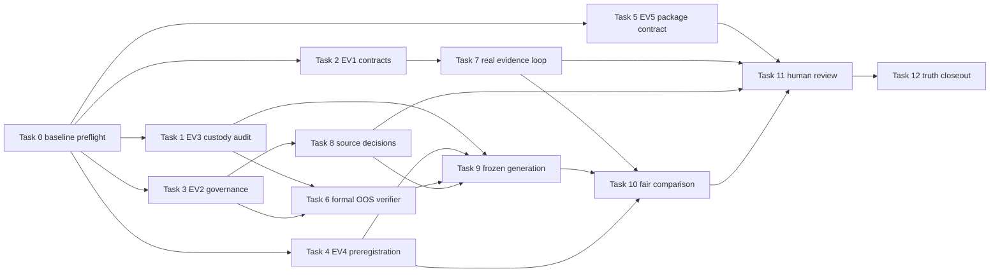

# External Evidence and Investment Effectiveness Validation Master Implementation Plan

> **For agentic workers:** REQUIRED SUB-SKILL: Use superpowers:subagent-driven-development (recommended) or superpowers:executing-plans to implement this plan task-by-task. Steps use checkbox (`- [ ]`) syntax for tracking.

**Goal:** 在不修改正式 Score、Recommendation、Portfolio、Exit、scheduler 或交易路徑的前提下，建立 EV1～EV5 的因果 evidence、source eligibility、formal OOS、Rule-vs-ML comparison 與 non-applying promotion review 能力。

**Architecture:** 採核准的「雙時鐘並行」：EV1 立即開始真實 evidence clock，EV2／EV3 同步推進 governance clock；EV4 先凍結 experiment contract，EV5 先建 non-applying review contract。既有 A～G 保持凍結，新能力以 versioned sidecar、pure verifier 與 thin projection 增量實作，所有 external Gate 都由真實時間、授權與人工 decision artifact 解鎖。

**Tech Stack:** Python 3、dataclass／Protocol、SQLite append-only registries、JSON/Markdown evidence artifacts、`Decimal`／integer bp、pytest、mypy、PySide6 thin projection、現有 Gate／lineage／encoding verifiers。

## Global Constraints

- 固定 `dev`；不得建立或切換 branch/worktree。
- Baseline 固定 `4f72766a1d1e7bd4b80ccb595ad3cb2fa84bd84a`，除具體 regression 外不重做 A～G。
- 不修改 `ScoringEngine` 權重或正式 Rule、Recommendation、Advice、Portfolio、Exit、Strategy Lifecycle、scheduler。
- `production_blend_alpha_bp=0`；不得 auto promotion、auto retrain、auto exit、auto rebalance、broker execution。
- 正式資料只允許 bounded、read-only；測試與 rehearsal 只寫 `tmp_path`／隔離 working copy／獨立 evidence registry。
- 核心金融計算使用 `Decimal` 或 integer bp；float 只允許隔離的 ML／分析／視覺化邊界。
- EV3 第一個 domain step 固定是 2025 OOS Exposure／Custody Audit；audit 前不得讀 2025 outcome payload、重訓或正式比較。
- 2025 若影響 Feature、Label、Universe、Rule、threshold、model 或 hyperparameter，必須標 `seen_oos`，不得稱 virgin／untouched OOS。
- 第一次 experiment 的 Primary Label 固定 `relative_return_20d_bp`；Downside Guardrail 固定 `downside_20d_flag`、`downside_threshold_bp=-500`；5／10 日只作 sensitivity，60 日只作 diagnostics。
- Rule Champion 必須使用當時正式 rule-only snapshot；禁止 neutral-zero surrogate。
- 20 causal shadow days 只代表 pipeline operational，不代表模型有效或 promotion。
- 停止非必要 Product UI 擴建；CLI／artifact優先，UI只保留 thin Research／Observability projection。
- DL、正式 alpha blending、production adapter、production scheduler 與 broker integration 全部延後。
- 本計畫是未來執行規格，不是 EV1～EV5 的實作授權；本次規劃 commit 不執行以下 checkbox。

---

## 1. Current Verified Baseline

| 項目 | 基線真相 | 不得誤解為 |
|---|---|---|
| Git | `HEAD == origin/dev == 4f72766...`、clean | future execution 已開始 |
| A～G | engineering integration verified | formal product closeout |
| Tests | pytest 2240、mypy 455、Gate 2～7 35/35 | 投資有效 |
| Dashboard | visibility verified | source accepted |
| Historical ML | `continue_shadow` | formal OOS／promotion |
| Formal OOS | `formal_oos_allowed=false` | 可讀取或解封 locked 2025 outcome |
| Production blend | `0 bp` | research blend可正式套用 |
| Forward evidence | pending | replay可折抵 |
| Source acceptance | pending | parser/candidate可正式使用 |
| Production automation | pending | scheduler可啟用 |
| Formal product closeout | false | engineering closeout可改寫 |

現有 2025 preflight 只證明指定 OOS payload 在 eligibility failure 前未被該路徑讀取；人工與其他研究路徑仍未完成 custody audit，因此初始狀態是 `indeterminate`。

## 2. Non-goals

- 不重建 Evidence、ML、Broker、Dashboard 或 P0 ingestion 的 A～G 底座。
- 不藉本計畫調整 score weight、threshold、Profile、Rule action 或 portfolio policy。
- 不把 source acceptance 變成批次自動決議。
- 不以 replay、fixture、backfill、historical rehearsal 或 simulated elapsed time滿足 external Gate。
- 不承諾 ML 優於 Rule，不以單一年度／metric／regime勝出提 promotion。
- 不建立 DL model、正式 blend、下單、broker account control、auto exit或production scheduler。
- 不新增大範圍 Product UI、決策控制或 UI-side domain calculation。
- 不在 planning commit 更新 Snapshot／Roadmap完成狀態或 Manual功能說明。

## 3. Future File Map

下列是未來 implementation 的 exclusive ownership map；本次只記錄，不建立這些程式檔。

| Workstream | Create | Modify | Tests |
|---|---|---|---|
| EV3-A custody | `ml_module/oos_exposure_custody.py`、`scripts/audit_ml_oos_exposure.py` | 無；audit先獨立 | `tests/test_ml_oos_exposure_custody.py`、`tests/test_ml_oos_exposure_cli.py` |
| EV1 contracts | `app_module/external_evidence_contracts.py`、`app_module/evidence_outcome_revision_repository.py` | `app_module/evidence_event_service.py:132`、`app_module/evidence_event_repository.py:103`只加formal sidecar adapter，不改legacy語意 | `tests/test_external_evidence_contracts.py`、`tests/test_evidence_outcome_revision_repository.py` |
| EV1 cadence | `app_module/evidence_cadence_review_service.py`、`scripts/capture_external_evidence_manual.py` | `app_module/evidence_operations_service.py:24`、`app_module/forward_performance_service.py:60`只消費formal projection | `tests/test_evidence_cadence_review_service.py`、`tests/test_capture_external_evidence_manual_cli.py` |
| EV2 | `data_module/source_acceptance_governance.py`、`data_module/source_acceptance_decision_registry.py`、`scripts/build_source_acceptance_dossier.py` | `data_module/p0_source_contract_registry.py:35`、`data_module/p0_source_acceptance_verifier.py:35` | `tests/test_source_acceptance_governance.py`、`tests/test_source_acceptance_decision_registry.py`、`tests/test_source_acceptance_dossier_cli.py` |
| EV3 formal | `ml_module/formal_oos_eligibility.py`、`ml_module/formal_oos_evaluation.py` | `ml_module/historical_dataset_builder.py:34`、`ml_module/locked_oos.py:33`、`ml_module/model_artifact_manifest.py:17` | `tests/test_ml_formal_oos_eligibility.py`、`tests/test_ml_formal_oos_evaluation.py`、既有 locked/artifact tests |
| EV4 | `app_module/rule_champion_snapshot_service.py`、`ml_module/experiment_preregistration.py`、`ml_module/formal_champion_comparison.py` | `ml_module/drift_champion_comparison.py:108`保持MVP相容，只由新service adapter消費 | `tests/test_rule_champion_snapshot_service.py`、`tests/test_ml_experiment_preregistration.py`、`tests/test_ml_formal_champion_comparison.py` |
| EV5 | `app_module/ml_promotion_review_v2.py`、`app_module/external_evidence_observability_dtos.py`、`app_module/external_evidence_observability_service.py` | `ml_module/promotion_review_package.py:47`保持v1相容；`app_module/ml_shadow_projection_dtos.py:38`只作neutral projection | `tests/test_ml_promotion_review_v2.py`、`tests/test_external_evidence_observability_service.py`、既有projection boundary tests |
| Integration | `scripts/verify_external_evidence_validation.py` | External Validation Register、QA closeout、Manual只在各自Gate／功能真的改變後更新 | `tests/test_verify_external_evidence_validation.py`、boundary/encoding/link suites |

正式 market DB 不新增 acceptance、OOS 或 comparison tables。Registries 使用獨立 configured evidence/governance DB；raw artifacts 寫 `OUTPUT_ROOT/external_evidence/`，repo只保存規格、可重跑 verifier與經整理的QA摘要。

## 4. Shared Interfaces

以下程式區塊只定義未來實作必須遵守的 public signature 與 immutable 欄位；方法尾端的 `...` 是 Python Protocol／介面宣告語法，不建立任何預設行為。具體方法 body、驗收條件與測試責任均在第 7 節對應 Task 完整列出。

### 4.1 OOS custody

```python
@dataclass(frozen=True)
class OOSExposureCustodyReport:
    report_id: str
    generation_id: str
    holdout_start_date: str
    holdout_end_date: str
    status: Literal[
        "custody_verified_unopened",
        "exposed_no_design_influence_declared",
        "seen_oos",
        "indeterminate",
    ]
    accessed_artifact_ids: tuple[str, ...]
    influenced_dimensions: tuple[str, ...]
    machine_evidence_ids: tuple[str, ...]
    signed_declaration_id: str | None
    formal_locked_oos_allowed: bool
    blockers: tuple[str, ...]

class OOSExposureCustodyAuditor:
    def evaluate(
        self,
        *,
        generation_id: str,
        holdout: tuple[str, str],
        machine_evidence_ids: tuple[str, ...],
        accessed_artifact_ids: tuple[str, ...],
        influenced_dimensions: tuple[str, ...],
        signed_declaration_id: str | None,
    ) -> OOSExposureCustodyReport: ...
```

`formal_locked_oos_allowed` 只在 status=`custody_verified_unopened`、machine evidence與signed declaration都完整時為 true。

### 4.2 Evidence snapshot與revision

```python
@dataclass(frozen=True)
class ExternalEvidenceDecisionSnapshot:
    snapshot_id: str
    decision_timestamp: str
    data_as_of_date: str
    max_available_timestamp: str
    source_versions: Mapping[str, str]
    strategy_version: str
    policy_version: str
    rule_champion_snapshot_id: str | None
    universe_id: str
    universe_hash: str
    symbol: str
    score_bp: int | None
    score_status: Literal["observed", "not_applicable"]
    rank: int | None
    action_or_prompt: str
    why: tuple[str, ...]
    why_not: tuple[str, ...]
    risk_reasons: tuple[str, ...]
    market_regime: str
    liquidity_state: str
    restriction_state: str
    evidence_tier: str
    missing_sources: tuple[str, ...]
    degraded_reasons: tuple[str, ...]
    parent_artifact_ids: tuple[str, ...]
    content_hash: str

    @classmethod
    def create(
        cls,
        *,
        decision_timestamp: str,
        data_as_of_date: str,
        max_available_timestamp: str,
        source_versions: Mapping[str, str],
        strategy_version: str,
        policy_version: str,
        rule_champion_snapshot_id: str | None,
        universe_id: str,
        universe_hash: str,
        symbol: str,
        score_bp: int | None,
        score_status: Literal["observed", "not_applicable"],
        rank: int | None,
        action_or_prompt: str,
        why: tuple[str, ...],
        why_not: tuple[str, ...],
        risk_reasons: tuple[str, ...],
        market_regime: str,
        liquidity_state: str,
        restriction_state: str,
        evidence_tier: str,
        missing_sources: tuple[str, ...],
        degraded_reasons: tuple[str, ...],
        parent_artifact_ids: tuple[str, ...],
    ) -> "ExternalEvidenceDecisionSnapshot": ...

@dataclass(frozen=True)
class EvidenceOutcomeRevision:
    revision_id: str
    parent_revision_id: str | None
    snapshot_id: str
    window_trading_days: int
    return_basis: str
    status: Literal["pending_maturity", "verified", "invalidated"]
    observed_at: str
    data_as_of_date: str
    return_bp: int | None
    benchmark_return_bp: int | None
    reason_code: str
    source_hashes: Mapping[str, str]
    content_hash: str

class EvidenceOutcomeRevisionRepository:
    def __init__(self, db_path: Path) -> None: ...
    def append(self, revision: EvidenceOutcomeRevision) -> EvidenceOutcomeRevision: ...
    def list_revisions(self, snapshot_id: str) -> tuple[EvidenceOutcomeRevision, ...]: ...
    def current(self, snapshot_id: str) -> EvidenceOutcomeRevision | None: ...

@dataclass(frozen=True)
class EvidenceCadencePackage:
    package_id: str
    cadence: Literal["daily", "weekly", "monthly"]
    snapshot_ids: tuple[str, ...]
    outcome_revision_ids: tuple[str, ...]
    primary_matured_count: int
    missing_day_reasons: tuple[str, ...]
    blockers: tuple[str, ...]
    content_hash: str

class EvidenceCadenceReviewService:
    def build_monthly(
        self,
        *,
        snapshots: tuple[ExternalEvidenceDecisionSnapshot, ...],
        outcome_revisions: tuple[EvidenceOutcomeRevision, ...],
    ) -> EvidenceCadencePackage: ...
```

### 4.3 Source acceptance

```python
@dataclass(frozen=True)
class SourceAcceptanceDossier:
    source_id: str
    source_owner_role: str
    license_owner_role: str
    license_status: str
    license_scope: str
    redistribution_policy: str
    source_status: str
    publication_time_policy: str
    timezone: str
    available_date_policy: str
    revision_policy: str
    pit_coverage_window: str
    coverage_numerator: int
    coverage_denominator: int
    missing_policy: str
    row_conservation_counts: Mapping[str, int]
    quarantine_policy: str
    quality_thresholds: Mapping[str, int]
    downstream_use_cases: tuple[str, ...]
    disable_conditions: tuple[str, ...]
    rollback_reference: str
    evidence_artifact_ids: tuple[str, ...]

@dataclass(frozen=True)
class SourceAcceptanceDecisionRevision:
    decision_revision_id: str
    parent_revision_id: str | None
    source_id: str
    status: Literal["accepted", "limited", "rejected", "deferred"]
    allowed_use_cases: tuple[str, ...]
    license_evidence_ids: tuple[str, ...]
    quality_evidence_ids: tuple[str, ...]
    pit_evidence_ids: tuple[str, ...]
    owner_role: str
    reviewer_role: str
    decided_at: str
    rollback_reference: str

@dataclass(frozen=True)
class SourceAcceptanceProjection:
    p0_source_ids: tuple[str, ...]
    p0_source_count: int
    accepted_source_ids: tuple[str, ...]
    limited_source_ids: tuple[str, ...]
    rejected_source_ids: tuple[str, ...]
    deferred_source_ids: tuple[str, ...]
    broker_revalidation_status: str

class SourceAcceptanceGovernance:
    def evaluate(self, dossier: SourceAcceptanceDossier) -> SourceAcceptanceDecisionRevision: ...
    def project(
        self,
        contracts: tuple[P0SourceContract, ...],
        decisions: tuple[SourceAcceptanceDecisionRevision, ...],
    ) -> SourceAcceptanceProjection: ...

class SourceAcceptanceDecisionRegistry:
    def __init__(self, db_path: Path) -> None: ...
    def append(
        self, decision: SourceAcceptanceDecisionRevision
    ) -> SourceAcceptanceDecisionRevision: ...
    def latest(self, source_id: str) -> SourceAcceptanceDecisionRevision | None: ...
```

### 4.4 Formal OOS與experiment

```python
@dataclass(frozen=True)
class FormalOOSReadinessRequest:
    generation_id: str
    dataset_id: str
    model_id: str
    custody_report: OOSExposureCustodyReport
    source_decisions: tuple[SourceAcceptanceDecisionRevision, ...]
    feature_registry_hash: str
    label_registry_hash: str
    universe_registry_hash: str
    dataset_manifest_hash: str
    model_manifest_hash: str
    max_train_decision_date: str
    max_train_label_available_date: str
    max_blend_label_available_date: str
    split_policy_hash: str
    preprocessing_policy_hash: str
    calibration_policy_hash: str
    corporate_action_coverage: str
    fundamental_eligibility: str
    broker_generation_separated: bool
    artifact_load_status: str
    lineage_status: str
    rollback_artifact_id: str
    independent_validation_decision_id: str
    production_blend_alpha_bp: Literal[0]

@dataclass(frozen=True)
class FormalOOSReadinessDecision:
    generation_id: str
    dataset_id: str
    model_id: str
    custody_report_id: str
    source_decision_revision_ids: tuple[str, ...]
    feature_registry_hash: str
    label_registry_hash: str
    universe_registry_hash: str
    dataset_manifest_hash: str
    model_manifest_hash: str
    formal_oos_allowed: bool
    blockers: tuple[str, ...]

class FormalOOSEligibilityVerifier:
    def verify(self, request: FormalOOSReadinessRequest) -> FormalOOSReadinessDecision: ...

@dataclass(frozen=True)
class RuleChampionSnapshot:
    champion_snapshot_family_id: str
    source_kind: Literal["formal_rule_only"]
    strategy_version: str
    policy_version: str
    score_configuration_hash: str
    universe_hash: str
    selection_capacity: int
    decision_snapshot_ids: tuple[str, ...]
    content_hash: str

class RuleChampionSnapshotService:
    def build(
        self,
        *,
        source_kind: str,
        strategy_version: str,
        policy_version: str,
        score_configuration_hash: str,
        universe_hash: str,
        selection_capacity: int,
        rows: tuple[ExternalEvidenceDecisionSnapshot, ...],
    ) -> RuleChampionSnapshot: ...

@dataclass(frozen=True)
class ExperimentPreregistration:
    experiment_id: str
    hypothesis: str
    champion_snapshot_family_id: str
    challenger_model_id: str
    primary_label_id: Literal["relative_return_20d_bp"]
    downside_guardrail_id: Literal["downside_20d_flag"]
    downside_threshold_bp: Literal[-500]
    sensitivity_horizons: tuple[Literal[5, 10], ...]
    primary_horizon_trading_days: Literal[20]
    confidence_level_bp: Literal[9500]
    minimum_material_effect_bp: int
    downside_noninferiority_margin_bp: int
    k_policy_hash: str
    cost_policy_hash: str
    sample_policy_hash: str
    bootstrap_policy_hash: str
    search_budget_hash: str
    multiple_testing_policy_hash: str
    failure_policy_hash: str
    unblinded_at_freeze: Literal[False]
    frozen: bool
```

### 4.5 Comparison與review

```python
@dataclass(frozen=True)
class FormalScoredCandidateRow:
    sample_id: str
    decision_date: str
    symbol: str
    rank: int
    cost_bp: int
    outcome_revision_id: str

@dataclass(frozen=True)
class FormalChampionComparisonResult:
    experiment_id: str
    sample_set_hash: str
    primary_effect_bp: int
    primary_ci_low_bp: int
    primary_ci_high_bp: int
    downside_recall_diff_bp: int
    downside_ci_low_bp: int
    metrics_bp: Mapping[str, int]
    sensitivity_metrics_bp: Mapping[str, int]
    integrity_blockers: tuple[str, ...]
    review_status: Literal[
        "invalid", "fail", "inconclusive", "continue_shadow",
        "eligible_for_promotion_review",
    ]
    production_blend_alpha_bp: Literal[0] = 0

class FormalChampionComparisonService:
    def compare(
        self,
        *,
        preregistration: ExperimentPreregistration,
        champion_rows: tuple[FormalScoredCandidateRow, ...],
        challenger_rows: tuple[FormalScoredCandidateRow, ...],
        outcomes: tuple[EvidenceOutcomeRevision, ...],
    ) -> FormalChampionComparisonResult: ...
    def classify(
        self,
        *,
        preregistration: ExperimentPreregistration,
        primary_ci_low_bp: int,
        downside_ci_low_bp: int,
        sensitivity_metrics_bp: Mapping[str, int],
        integrity_blockers: tuple[str, ...],
    ) -> str: ...

@dataclass(frozen=True)
class MLPromotionReviewPackageV2:
    experiment_id: str
    comparison_artifact_id: str
    formal_oos_decision_id: str
    forward_evidence_ids: tuple[str, ...]
    paper_evidence_ids: tuple[str, ...]
    source_decision_revision_ids: tuple[str, ...]
    shadow_observed_days: int
    shadow_pipeline_operational: bool
    drift_statuses: tuple[str, ...]
    calibration_status: str
    rollback_artifact_id: str
    blockers: tuple[str, ...]
    review_status: Literal["defer", "eligible_for_human_review"]
    apply_promotion: Literal[False] = False
    auto_promotion_allowed: Literal[False] = False
    production_scheduler_allowed: Literal[False] = False

class MLPromotionReviewPackageV2Service:
    def build(
        self,
        *,
        experiment_id: str,
        comparison: FormalChampionComparisonResult,
        formal_oos_decision: FormalOOSReadinessDecision,
        forward_evidence_ids: tuple[str, ...],
        paper_evidence_ids: tuple[str, ...],
        source_decision_revision_ids: tuple[str, ...],
        shadow_observed_days: int,
        drift_statuses: tuple[str, ...],
        calibration_status: str,
        rollback_artifact_id: str,
    ) -> MLPromotionReviewPackageV2: ...

@dataclass(frozen=True)
class ExternalEvidenceValidationReport:
    engineering_status: str
    external_validation_status: str
    formal_product_closeout: bool
    production_blend_alpha_bp: Literal[0]
    blockers: tuple[str, ...]

class ExternalEvidenceValidationVerifier:
    def verify(self, artifacts: Mapping[str, object]) -> ExternalEvidenceValidationReport: ...
```

本計畫測試片段中的effect／margin數值只用於 deterministic fixture，不是投資政策。真實 `minimum_material_effect_bp` 與 `downside_noninferiority_margin_bp` 必須在unblind前由具名Quant Validation／Risk owner另行簽核；缺值時preregistration拒絕freeze。

## 5. Execution Protocol

1. 所有 worker 共享固定 `dev` working tree，但使用 exclusive files與自己的 `%TEMP%`、pytest cache、SQLite fixture。
2. Worker不得執行任何 Git mutation；只回傳 ready files、SHA-256、tests、blockers與suggested commit message。
3. Git Coordinator一次只接一個ready slice，重新計算hash、跑focused checks、精確stage與commit。
4. Heavy QA與正式read-only audit序列化；執行時其他worker暫停repository寫入。
5. 任何需要跨owner檔案的變更先以Protocol／adapter解耦；無法解耦即登錄blocker，不越界修改。
6. 正式資料URI固定read-only；任何指令若要求正式source write立即停止。

## 6. Phase Gates

| Phase | 內容 | Exit criteria | 不可折抵項目 |
|---|---|---|---|
| P0 Planning | 本spec、Master Plan、Index | 文件驗證、精確commit/push | 不代表EV開始 |
| P1 Immediate contracts | Custody、snapshot/revision、dossier、preregistration、review contracts | focused tests、boundary、tmp-only smoke | 不代表source/OOS/evidence成熟 |
| P2 Evidence & decisions | real snapshots、source dossiers、human/license decisions | 3 weekly periods、P0-13逐一決議、paper records | replay與時間模擬 |
| P3 Formal OOS | generation freeze、pure eligibility、sealed evaluation | custody verified、all manifests/load/lineage通過 | seen 2025不能洗白 |
| P4 Fair comparison | actual Rule Champion、same sample、after-cost primary/guardrail | 完整CI、integrity、sensitivity揭露 | best-horizon／single metric |
| P5 Human review | weekly/monthly package、promotion review、adapter proposal | 具名human decision與rollback | 20 shadow days單獨不足 |

---

## 7. Task-by-task Plan

### Task 0: Coordinator Preflight 與 immutable baseline

**Owner:** Git Coordinator／Tech Lead
**Files:** Read-only；不建立程式檔。
**Inputs:** repo instructions、baseline SHA、External Validation Register。
**Outputs:** ignored preflight record與exclusive ownership table。
**Completion:** branch/SHA/clean tree/remote/forbidden paths全部確認。
**Fail-closed:** 任一不符即停止，不自行switch／pull／reset。

- [ ] **Step 1: 讀取強制文件與Git排除規則**

  依 `AGENTS.md` 順序讀取 core、architecture、agent與Manual文件；再次讀 `docs/agents/git_exclusions.md`。

- [ ] **Step 2: 驗證固定基線**

  Run:

  ```powershell
  git branch --show-current
  git rev-parse HEAD
  git rev-parse origin/dev
  git status --short
  ```

  Expected: `dev`、兩個SHA均為 `4f72766a1d1e7bd4b80ccb595ad3cb2fa84bd84a`、status無輸出。若未來經明確核准更新baseline，preflight record必須同時保存新SHA與核准來源，不能默認漂移。

- [ ] **Step 3: 凍結 ownership與forbidden paths**

  Forbidden ownership至少包含正式 scoring、recommendation、portfolio、exit、scheduler與broker execution paths。輸出不得commit的handoff JSON至獨立TEMP root。

- [ ] **Step 4: 記錄零production-write聲明**

  確認本wave只寫tmp／new evidence registry；正式market DB hash/size/mtime只在必要的bounded read-only audit前後比對。

### Task 1: EV3-A 2025 OOS Exposure／Custody Audit（EV3第一步）

**Owner:** OOS Custody Reviewer
**Files:** Create `ml_module/oos_exposure_custody.py`、`scripts/audit_ml_oos_exposure.py`、兩個tests。
**Consumes:** Git metadata、artifact manifests、CLI/access evidence、signed declaration；不消費2025 outcome values。
**Produces:** `OOSExposureCustodyReport`與`oos-exposure-custody.json`。
**Completion:** status可重跑、evidence IDs可追溯、2025 influence dimensions完整。
**Fail-closed:** 缺任何machine evidence或declaration即`indeterminate`。
**Rollback:** append新audit revision；不覆寫舊report。

- [ ] **Step 1: 寫RED tests**

  ```python
  def test_threshold_influence_marks_seen_oos() -> None:
      report = OOSExposureCustodyAuditor().evaluate(
          generation_id="historical-core-v1",
          holdout=("2025-01-01", "2025-12-31"),
          machine_evidence_ids=("preflight:no-payload-read",),
          accessed_artifact_ids=("report:2025-summary",),
          influenced_dimensions=("threshold",),
          signed_declaration_id="declaration:reviewer-1",
      )
      assert report.status == "seen_oos"
      assert report.formal_locked_oos_allowed is False

  def test_missing_declaration_is_indeterminate() -> None:
      report = OOSExposureCustodyAuditor().evaluate(
          generation_id="historical-core-v1",
          holdout=("2025-01-01", "2025-12-31"),
          machine_evidence_ids=("preflight:no-payload-read",),
          accessed_artifact_ids=(),
          influenced_dimensions=(),
          signed_declaration_id=None,
      )
      assert report.status == "indeterminate"
  ```

- [ ] **Step 2: 確認RED**

  Run:

  ```powershell
  .\.venv\Scripts\python.exe -m pytest tests/test_ml_oos_exposure_custody.py -q -o addopts=
  ```

  Expected: FAIL，因module/class尚不存在；若測試意外pass，停止並檢查是否已有未交接變更。

- [ ] **Step 3: 實作pure auditor與canonical hash**

  實作Shared Interface 4.1；status precedence固定 `seen_oos` > `exposed_no_design_influence_declared` > `custody_verified_unopened`，缺證據直接`indeterminate`。Auditor不得開啟holdout payload。

- [ ] **Step 4: 實作read-only CLI**

  CLI只讀manifest、Git/report metadata與人工declaration JSON，輸出到明確`--output`；拒絕與`--oos-payload`等會讀結果的參數共存。

- [ ] **Step 5: 驗證GREEN與CLI**

  ```powershell
  .\.venv\Scripts\python.exe -m pytest tests/test_ml_oos_exposure_custody.py tests/test_ml_oos_exposure_cli.py -q -o addopts=
  .\.venv\Scripts\python.exe -m mypy ml_module/oos_exposure_custody.py scripts/audit_ml_oos_exposure.py
  ```

  Expected: all passed；mypy無error。

- [ ] **Step 6: 產生handoff，不執行formal OOS**

  Handoff明記目前status；若不是`custody_verified_unopened`，後續2025formal task保持blocked。

### Task 2: EV1 Decision Snapshot 與 Append-only Outcome Revision

**Owner:** Evidence Owner
**Files:** Create EV1 contract/repository files；只以adapter接既有event service/repository。
**Consumes:** 已保存的Rule／Watchlist／Paper／Exit-Risk artifacts。
**Produces:** immutable decision snapshots、outcome revisions、current projection。
**Completion:** future availability、revision history、pending maturity與score not-applicable皆有test。
**Fail-closed:** 無identity／future data／pending入分母／legacy upsert冒充formal即invalid。
**Rollback:** current projection回到最後verified revision；不刪history。

- [ ] **Step 1: 寫snapshot與revision RED tests**

  ```python
  def test_future_available_snapshot_is_rejected() -> None:
      with pytest.raises(ValueError, match="available"):
          ExternalEvidenceDecisionSnapshot.create(
              decision_timestamp="2026-07-13T09:00:00+08:00",
              data_as_of_date="2026-07-12",
              max_available_timestamp="2026-07-13T09:00:01+08:00",
              source_versions={"daily_prices": "sha256:" + "1" * 64},
              strategy_version="rule-v1",
              policy_version="policy-v1",
              rule_champion_snapshot_id="champion:rule-v1",
              universe_id="tw-equity-20260713",
              universe_hash="sha256:" + "2" * 64,
              symbol="2330",
              score_bp=7000,
              score_status="observed",
              rank=1,
              action_or_prompt="RESEARCH",
              why=("rule_rank_top_k",),
              why_not=(),
              risk_reasons=("market_risk",),
              market_regime="neutral",
              liquidity_state="liquid",
              restriction_state="clear",
              evidence_tier="forward",
              missing_sources=(),
              degraded_reasons=(),
              parent_artifact_ids=("recommendation:20260713",),
          )

  def test_correction_appends_child_revision() -> None:
      def revision(
          revision_id: str, parent: str | None, return_bp: int
      ) -> EvidenceOutcomeRevision:
          return EvidenceOutcomeRevision(
              revision_id=revision_id,
              parent_revision_id=parent,
              snapshot_id="snapshot:2330:20260713",
              window_trading_days=20,
              return_basis="stock_minus_benchmark",
              status="verified",
              observed_at="2026-08-10T16:00:00+08:00",
              data_as_of_date="2026-08-10",
              return_bp=return_bp,
              benchmark_return_bp=50,
              reason_code="initial" if parent is None else "source_correction",
              source_hashes={"daily_prices": "sha256:" + "3" * 64},
              content_hash="sha256:" + ("4" if parent is None else "5") * 64,
          )

      repo = EvidenceOutcomeRevisionRepository(tmp_path / "evidence.sqlite")
      first = repo.append(revision("rev-1", parent=None, return_bp=120))
      second = repo.append(revision("rev-2", parent=first.revision_id, return_bp=110))
      assert repo.list_revisions(first.snapshot_id) == (first, second)
      assert repo.current(first.snapshot_id).revision_id == "rev-2"
  ```

- [ ] **Step 2: 確認RED**

  ```powershell
  .\.venv\Scripts\python.exe -m pytest tests/test_external_evidence_contracts.py tests/test_evidence_outcome_revision_repository.py -q -o addopts=
  ```

- [ ] **Step 3: 實作contract與append-only schema**

  實作Shared Interface 4.2。Repository只允許`INSERT`；duplicate revision ID只有payload hash完全相同才idempotent，否則raise。Legacy outcome upsert不作formal source。

- [ ] **Step 4: 加formal adapter，不改legacy語意**

  `EvidenceEventService.validate_event`補common temporal validation；legacy read model繼續可用，但formal projection必須帶revision ID與verification status。

- [ ] **Step 5: GREEN與focused regression**

  ```powershell
  .\.venv\Scripts\python.exe -m pytest tests/test_external_evidence_contracts.py tests/test_evidence_outcome_revision_repository.py tests/test_evidence_event_service.py tests/test_evidence_event_repository.py -q -o addopts=
  .\.venv\Scripts\python.exe -m mypy app_module/external_evidence_contracts.py app_module/evidence_outcome_revision_repository.py app_module/evidence_event_service.py
  ```

### Task 3: EV2 Source Dossier 與 Append-only Decision Registry

**Owner:** Data Governance Owner
**Files:** Create EV2 governance/registry/CLI；modify P0 contract/verifier。
**Consumes:** P0-13 registry、license/quality/PIT evidence IDs、bounded read-only audits。
**Produces:** `SourceAcceptanceDossier.v1`、decision revisions、P0-13 status projection、Broker revalidation projection。
**Completion:** 每個P0 ID都有decision slot，Broker不改分母，missing evidence維持deferred。
**Fail-closed:** HTTP/parser/candidate/coverage單一成功不得accepted。
**Rollback:** append disable/reject revision，eligibility投影none。

- [ ] **Step 1: 寫P0-13與Broker separation RED tests**

  ```python
  def test_p0_denominator_remains_thirteen() -> None:
      contracts = build_p0_source_contract_registry().list()
      report = SourceAcceptanceGovernance().project(contracts, decisions=())
      assert report.p0_source_count == 13
      assert "broker_branch.revalidation" not in report.p0_source_ids

  def test_http_and_parser_success_do_not_accept_source() -> None:
      dossier = SourceAcceptanceDossier(
          source_id="institutional_flows",
          source_owner_role="Data Source Owner",
          license_owner_role="License/Legal Owner",
          license_status="requires_review",
          license_scope="not_decided",
          redistribution_policy="not_decided",
          source_status="candidate",
          publication_time_policy="daily publication window unverified",
          timezone="Asia/Taipei",
          available_date_policy="explicit and not later than decision time",
          revision_policy="not_evidenced",
          pit_coverage_window="not_evidenced",
          coverage_numerator=10,
          coverage_denominator=10,
          missing_policy="fail_closed",
          row_conservation_counts={"raw": 10, "accepted_candidate": 10},
          quarantine_policy="malformed rows isolated",
          quality_thresholds={"minimum_coverage_bp": 8000},
          downstream_use_cases=(),
          disable_conditions=("license_not_accepted",),
          rollback_reference="commit:engineering-candidate",
          evidence_artifact_ids=("http:200", "parser:passed"),
      )
      decision = SourceAcceptanceGovernance().evaluate(dossier)
      assert decision.status == "deferred"
      assert decision.allowed_use_cases == ()
  ```

- [ ] **Step 2: 確認RED**

  ```powershell
  .\.venv\Scripts\python.exe -m pytest tests/test_source_acceptance_governance.py tests/test_source_acceptance_decision_registry.py -q -o addopts=
  ```

- [ ] **Step 3: 實作dossier與decision rules**

  Dossier欄位完整複製design spec；accepted需要license、PIT、quality、coverage、owner與rollback evidence全部存在。Limited只開列出的use cases。Decision registry append-only且hash-idempotent。

- [ ] **Step 4: 建立舊ID→現行13-ID migration map**

  Map只作名稱對齊；不得改寫歷史document decision。任何無一對一對應項保留`unmapped_legacy_id` blocker。

- [ ] **Step 5: GREEN與既有P0 regression**

  ```powershell
  .\.venv\Scripts\python.exe -m pytest tests/test_source_acceptance_governance.py tests/test_source_acceptance_decision_registry.py tests/test_source_acceptance_dossier_cli.py tests/test_p0_source_contract_registry.py tests/test_p0_source_acceptance_verifier.py tests/test_p0_source_acceptance_verifier_cli.py -q -o addopts=
  .\.venv\Scripts\python.exe -m mypy data_module/source_acceptance_governance.py data_module/source_acceptance_decision_registry.py data_module/p0_source_contract_registry.py data_module/p0_source_acceptance_verifier.py
  ```

### Task 4: EV4 Experiment Preregistration 與 Rule Champion Snapshot

**Owner:** Quant Validation Owner／Rule Baseline Owner
**Files:** Create preregistration與Champion snapshot services/tests。
**Consumes:** 當時正式rule-only decision artifacts；不讀future outcome。
**Produces:** frozen `RuleChampionSnapshot.v1`與`ExperimentPreregistration.v1`。
**Completion:** single primary/guardrail、K/cost/sample/bootstrap/search budget全部frozen。
**Fail-closed:** neutral-zero、重算舊Rule、缺Champion score、缺human thresholds、outcome已unblind皆invalid。
**Rollback:** close preregistration generation；不得修改原artifact。

- [ ] **Step 1: 寫Champion identity RED tests**

  ```python
  def test_neutral_zero_is_not_a_rule_champion() -> None:
      with pytest.raises(ValueError, match="formal rule-only snapshot"):
          RuleChampionSnapshotService().build(
              source_kind="neutral_zero",
              strategy_version="rule-v1",
              policy_version="policy-v1",
              score_configuration_hash="sha256:" + "0" * 64,
              universe_hash="sha256:" + "1" * 64,
              selection_capacity=10,
              rows=(),
          )

  def test_first_experiment_has_exact_primary_and_guardrail() -> None:
      prereg = ExperimentPreregistration(
          experiment_id="experiment:rule-vs-hgb-v1",
          hypothesis="ML Top-K 20日成本後相對報酬優於正式Rule且downside recall不劣於guardrail",
          champion_snapshot_family_id="champion:rule-v1",
          challenger_model_id="model:hgb-core-v1",
          primary_label_id="relative_return_20d_bp",
          downside_guardrail_id="downside_20d_flag",
          downside_threshold_bp=-500,
          sensitivity_horizons=(5, 10),
          primary_horizon_trading_days=20,
          confidence_level_bp=9500,
          minimum_material_effect_bp=0,
          downside_noninferiority_margin_bp=0,
          k_policy_hash="sha256:" + "6" * 64,
          cost_policy_hash="sha256:" + "2" * 64,
          sample_policy_hash="sha256:" + "3" * 64,
          bootstrap_policy_hash="sha256:" + "4" * 64,
          search_budget_hash="sha256:" + "5" * 64,
          multiple_testing_policy_hash="sha256:" + "7" * 64,
          failure_policy_hash="sha256:" + "8" * 64,
          unblinded_at_freeze=False,
          frozen=True,
      )
      assert prereg.primary_label_id == "relative_return_20d_bp"
      assert prereg.primary_horizon_trading_days == 20
      assert prereg.downside_guardrail_id == "downside_20d_flag"
      assert prereg.downside_threshold_bp == -500
      assert prereg.sensitivity_horizons == (5, 10)
  ```

- [ ] **Step 2: 確認RED**

  ```powershell
  .\.venv\Scripts\python.exe -m pytest tests/test_rule_champion_snapshot_service.py tests/test_ml_experiment_preregistration.py -q -o addopts=
  ```

- [ ] **Step 3: 實作frozen contracts**

  Champion從persisted formal snapshot讀取，不呼叫ScoringEngine。Preregistration在`minimum_material_effect_bp`或`downside_noninferiority_margin_bp`缺失時拒絕freeze。

- [ ] **Step 4: 防unblind mutation**

  同一experiment ID重送只有canonical hash相同才idempotent；任何欄位變動要求新experiment ID與新holdout。

- [ ] **Step 5: GREEN與boundary checks**

  ```powershell
  .\.venv\Scripts\python.exe -m pytest tests/test_rule_champion_snapshot_service.py tests/test_ml_experiment_preregistration.py -q -o addopts=
  .\.venv\Scripts\python.exe -m mypy app_module/rule_champion_snapshot_service.py ml_module/experiment_preregistration.py
  .\.venv\Scripts\python.exe scripts/check_ml_shadow_boundary.py
  ```

### Task 5: EV5 Promotion Review v2 與 Thin Observability Contract

**Owner:** Promotion/Release Owner／Thin UI Owner
**Files:** Create package v2、neutral DTO/service與tests；初始slice不改Qt widgets。
**Consumes:** artifact identities與已算好的metrics；不重算domain logic。
**Produces:** non-applying package與read-only observability DTO。
**Completion:** 20-day語意、citations、identity、blockers與rollback完整。
**Fail-closed:** 只有20days、mixed/tied、缺formal OOS／forward／paper任一都defer。
**Rollback:** 隱藏不可用projection，維持Rule與alpha=0。

- [ ] **Step 1: 寫20-day RED test**

  ```python
  def test_twenty_shadow_days_only_mark_pipeline_operational() -> None:
      comparison = FormalChampionComparisonResult(
          experiment_id="experiment:rule-vs-hgb-v1",
          sample_set_hash="sha256:" + "1" * 64,
          primary_effect_bp=50,
          primary_ci_low_bp=10,
          primary_ci_high_bp=90,
          downside_recall_diff_bp=0,
          downside_ci_low_bp=0,
          metrics_bp={},
          sensitivity_metrics_bp={},
          integrity_blockers=(),
          review_status="continue_shadow",
      )
      formal_oos = FormalOOSReadinessDecision(
          generation_id="generation:core-v1",
          dataset_id="dataset:core-v1",
          model_id="model:hgb-core-v1",
          custody_report_id="custody:2025",
          source_decision_revision_ids=(),
          feature_registry_hash="sha256:" + "2" * 64,
          label_registry_hash="sha256:" + "3" * 64,
          universe_registry_hash="sha256:" + "4" * 64,
          dataset_manifest_hash="sha256:" + "5" * 64,
          model_manifest_hash="sha256:" + "6" * 64,
          formal_oos_allowed=False,
          blockers=("formal_oos_not_allowed",),
      )
      package = MLPromotionReviewPackageV2Service().build(
          experiment_id=comparison.experiment_id,
          comparison=comparison,
          formal_oos_decision=formal_oos,
          forward_evidence_ids=(),
          paper_evidence_ids=(),
          source_decision_revision_ids=(),
          shadow_observed_days=20,
          drift_statuses=("stable",),
          calibration_status="passed",
          rollback_artifact_id="rollback:rule-v1",
      )
      assert package.shadow_pipeline_operational is True
      assert package.review_status == "defer"
      assert "formal_oos_not_allowed" in package.blockers
      assert package.apply_promotion is False
  ```

- [ ] **Step 2: 確認RED**

  ```powershell
  .\.venv\Scripts\python.exe -m pytest tests/test_ml_promotion_review_v2.py tests/test_external_evidence_observability_service.py -q -o addopts=
  ```

- [ ] **Step 3: 實作non-applying package與neutral DTO**

  Package要求formal OOS decision、comparison、forward、paper、source revisions、drift/calibration與rollback citations。DTO僅複製artifact欄位；不得import `ml_module`。

- [ ] **Step 4: GREEN與dependency boundary**

  ```powershell
  .\.venv\Scripts\python.exe -m pytest tests/test_ml_promotion_review_v2.py tests/test_external_evidence_observability_service.py tests/test_ml_shadow_projection_boundary.py tests/test_ml_promotion_review_package.py -q -o addopts=
  .\.venv\Scripts\python.exe scripts/check_ml_shadow_boundary.py
  ```

### Task 6: EV3 Formal OOS Eligibility Pure Verifier

**Owner:** ML Research Owner；Independent Quant Validator sign-off
**Dependencies:** Task 1 contract、Task 3 source decision contract。
**Files:** Create formal eligibility/evaluation modules；adapt existing builder/preflight/manifest load。
**Produces:** generation-scoped `FormalOOSReadinessDecision`。
**Completion:** every blocker可對應artifact；true只授權sealed evaluation。
**Fail-closed:** custody非unopened、fundamental pending、corporate unknown、hash/load/lineage任一失敗即false。
**Rollback:** append blocked decision；model不刪除但不能load為formal。

- [ ] **Step 1: 寫formal eligibility RED matrix**

  ```python
  from dataclasses import replace

  @pytest.mark.parametrize(
      "blocker",
      (
          "oos_custody_not_verified",
          "fundamental_eligibility_pending",
          "corporate_action_coverage_unknown",
          "universe_registry_not_frozen",
          "model_artifact_load_failed",
      ),
  )
  def test_each_integrity_blocker_keeps_formal_oos_false(blocker: str) -> None:
      custody = OOSExposureCustodyReport(
          report_id="custody:2025",
          generation_id="generation:core-v1",
          holdout_start_date="2025-01-01",
          holdout_end_date="2025-12-31",
          status="custody_verified_unopened",
          accessed_artifact_ids=(),
          influenced_dimensions=(),
          machine_evidence_ids=("preflight:no-payload-read",),
          signed_declaration_id="declaration:reviewer-1",
          formal_locked_oos_allowed=True,
          blockers=(),
      )
      request = FormalOOSReadinessRequest(
          generation_id="generation:core-v1",
          dataset_id="dataset:core-v1",
          model_id="model:hgb-core-v1",
          custody_report=custody,
          source_decisions=(),
          feature_registry_hash="sha256:" + "1" * 64,
          label_registry_hash="sha256:" + "2" * 64,
          universe_registry_hash="sha256:" + "3" * 64,
          dataset_manifest_hash="sha256:" + "4" * 64,
          model_manifest_hash="sha256:" + "5" * 64,
          max_train_decision_date="2024-12-31",
          max_train_label_available_date="2024-12-31",
          max_blend_label_available_date="2024-12-31",
          split_policy_hash="sha256:" + "6" * 64,
          preprocessing_policy_hash="sha256:" + "7" * 64,
          calibration_policy_hash="sha256:" + "8" * 64,
          corporate_action_coverage="clean_official_or_observed",
          fundamental_eligibility="excluded_by_approved_scope",
          broker_generation_separated=True,
          artifact_load_status="passed",
          lineage_status="passed",
          rollback_artifact_id="rollback:rule-v1",
          independent_validation_decision_id="review:validator-1",
          production_blend_alpha_bp=0,
      )
      if blocker == "oos_custody_not_verified":
          request = replace(request, custody_report=replace(custody, status="indeterminate"))
      elif blocker == "fundamental_eligibility_pending":
          request = replace(request, fundamental_eligibility="pending")
      elif blocker == "corporate_action_coverage_unknown":
          request = replace(request, corporate_action_coverage="unknown")
      elif blocker == "universe_registry_not_frozen":
          request = replace(request, universe_registry_hash="")
      else:
          request = replace(request, artifact_load_status="failed")
      decision = FormalOOSEligibilityVerifier().verify(request)
      assert decision.formal_oos_allowed is False
      assert blocker in decision.blockers
  ```

- [ ] **Step 2: 確認RED**

  ```powershell
  .\.venv\Scripts\python.exe -m pytest tests/test_ml_formal_oos_eligibility.py -q -o addopts=
  ```

- [ ] **Step 3: 實作pure verifier**

  Verifier不建立schema、不讀OOS payload、不改registry；只驗證custody、cutoff、Feature/Label/Universe、source revisions、purged folds、calibration、manifest/load/lineage、rollback與alpha=0。

- [ ] **Step 4: 收斂manifest/load contract**

  `model_artifact_store`與`model_artifact_manifest`都必須驗證同一feature/label registry、schema、family、library與artifact hash；任何reduced manifest只能作legacy shadow adapter，不能formal。

- [ ] **Step 5: GREEN與既有locked regression**

  ```powershell
  .\.venv\Scripts\python.exe -m pytest tests/test_ml_formal_oos_eligibility.py tests/test_ml_2025_locked_oos.py tests/test_ml_historical_dataset_builder.py tests/test_ml_model_artifact_manifest.py tests/test_ml_model_artifact_loader.py tests/test_ml_model_artifact_store.py -q -o addopts=
  .\.venv\Scripts\python.exe -m mypy ml_module/formal_oos_eligibility.py ml_module/formal_oos_evaluation.py ml_module/historical_dataset_builder.py ml_module/locked_oos.py ml_module/model_artifact_manifest.py
  .\.venv\Scripts\python.exe scripts/check_ml_shadow_boundary.py
  ```

### Task 7: EV1 Manual Daily／Weekly／Monthly Evidence Loop

**Owner:** Evidence Owner／Evidence Operator
**Dependencies:** Task 2。
**Files:** Create cadence service/manual CLI；adapt operations/read model。
**Produces:** daily/weekly/monthly packages、manual review revisions、paper citations。
**Completion:** default dry-run、explicit confirm、missing-day reason、no scheduler path。
**Fail-closed:** formal market DB write、缺confirm、pending入分母、replay tier錯誤即拒絕。
**Rollback:** evidence package append correction；不刪event/outcome。

- [ ] **Step 1: 寫cadence RED tests**

  ```python
  def test_pending_outcomes_are_not_in_effectiveness_denominator() -> None:
      pending = EvidenceOutcomeRevision(
          revision_id="revision:pending-20d",
          parent_revision_id=None,
          snapshot_id="snapshot:2330:20260713",
          window_trading_days=20,
          return_basis="stock_minus_benchmark",
          status="pending_maturity",
          observed_at="2026-07-13T16:00:00+08:00",
          data_as_of_date="2026-07-13",
          return_bp=None,
          benchmark_return_bp=None,
          reason_code="horizon_not_mature",
          source_hashes={"daily_prices": "sha256:" + "1" * 64},
          content_hash="sha256:" + "2" * 64,
      )
      package = EvidenceCadenceReviewService().build_monthly(
          snapshots=(),
          outcome_revisions=(pending,),
      )
      assert package.primary_matured_count == 0
      assert "primary_horizon_pending" in package.blockers

  def test_cli_defaults_to_dry_run(tmp_path: Path, capsys: pytest.CaptureFixture[str]) -> None:
      exit_code = main(["--db", str(tmp_path / "evidence.sqlite")])
      assert exit_code == 0
      assert "write_performed=false" in capsys.readouterr().out
  ```

- [ ] **Step 2: 確認RED**

  ```powershell
  .\.venv\Scripts\python.exe -m pytest tests/test_evidence_cadence_review_service.py tests/test_capture_external_evidence_manual_cli.py -q -o addopts=
  ```

- [ ] **Step 3: 實作manual-only loop**

  CLI入口固定`main(argv: Sequence[str] | None = None) -> int`。正式append需`--confirm append-external-evidence`，並拒絕formal market DB path。不得新增scheduled wrapper、PowerShell task或runtime hook。

- [ ] **Step 4: 建立真實操作Gate**

  Daily package要求每個預期操作日有snapshot或具名missing reason；weekly至少3個真實period；monthly只彙總matured outcomes。30/60/90日只是review checkpoint。

- [ ] **Step 5: GREEN與existing evidence regression**

  ```powershell
  .\.venv\Scripts\python.exe -m pytest tests/test_evidence_cadence_review_service.py tests/test_capture_external_evidence_manual_cli.py tests/test_evidence_operations_service.py tests/test_evidence_operations_history_repository.py tests/test_paper_portfolio_weekly_report.py -q -o addopts=
  .\.venv\Scripts\python.exe -m mypy app_module/evidence_cadence_review_service.py scripts/capture_external_evidence_manual.py
  ```

### Task 8: EV2 Source-by-source Evidence Review

**Owner:** Data Governance Owner；每個來源另有Source/License owners
**Dependencies:** Task 3 tooling；真實license/quality/PIT evidence。
**Outputs:** P0-13與Broker decision revisions。
**Completion:** 13個P0各有具名accepted/limited/rejected/deferred；deferred不產生eligibility。
**Fail-closed:** 缺owner、license、available policy、revision、coverage、row conservation、quarantine、quality或rollback任一即deferred。
**Rollback:** append新decision revision；不改歷史。

- [ ] **Step 1: 依固定順序建立dossiers**

  順序：corporate actions/restrictions → monthly revenue/quarterly financials → institutional/credit/TDCC → Broker revalidation。順序只管理review，不代表前者自動accepted。

- [ ] **Step 2: 對每個來源跑bounded read-only verifier**

  ```powershell
  $outputRoot = Join-Path $env:TEMP 'external-evidence-source-dossiers'
  $sourceIds = @(
    'corporate_action.ex_dividend_timeline',
    'corporate_action.reduction_split_par_value',
    'microstructure.suspended_halt_resume',
    'microstructure.disposition_stock',
    'microstructure.periodic_call_auction',
    'microstructure.full_delivery',
    'microstructure.limit_lock',
    'institutional_flows',
    'credit_transactions',
    'tdcc_shareholding',
    'twse.monthly_revenue_announcement',
    'tpex.monthly_revenue_announcement',
    'pit.quarterly_financials'
  )
  foreach ($sourceId in $sourceIds) {
    $output = Join-Path $outputRoot ($sourceId.Replace('.', '_') + '.json')
    .\.venv\Scripts\python.exe scripts/build_source_acceptance_dossier.py --source-id $sourceId --read-only --output $output
    if ($LASTEXITCODE -ne 0) { throw "source dossier failed: $sourceId" }
  }
  ```

  Expected: 13份candidate dossiers寫入TEMP；每份初始decision最多為deferred/limited candidate，不會因CLI成功變成accepted。CLI若收到未註冊ID必須exit non-zero。

- [ ] **Step 3: 人工簽核append-only decision**

  Reviewer明記owner role/name、decision time、allowed use、evidence IDs、rollback。未簽核時保留deferred。

- [ ] **Step 4: 更新External Gate revision**

  只有13個來源都完成一次具名裁決時，`p0:source-acceptance-13`才可從open進入reviewed狀態；其中有deferred不代表formal feature eligibility完成。

### Task 9: EV3 Frozen Generation 與 Sealed OOS Evaluation

**Owner:** ML Research Owner／Dataset Custodian
**Dependencies:** Task 1 custody、Task 6 verifier、所需Task 8 source decisions、Task 4 preregistration。
**Produces:** immutable dataset/model manifests、load report、formal readiness decision、sealed OOS result。
**Completion:** strict data非零、all manifests/hashes/load/purged folds/calibration通過、OOS無feedback。
**Fail-closed:** `seen_oos`／indeterminate、fundamental pending、corporate unknown、rule champion缺失任一阻擋。
**Rollback:** close generation、回Rule；不刪artifact。

- [ ] **Step 1: 驗證custody before payload read**

  ```powershell
  $ev3Root = Join-Path $env:TEMP 'external-evidence-validation\EV3'
  .\.venv\Scripts\python.exe scripts/audit_ml_oos_exposure.py `
    --generation-manifest (Join-Path $ev3Root 'generation-manifest.json') `
    --declaration (Join-Path $ev3Root 'signed-exposure-declaration.json') `
    --output (Join-Path $ev3Root 'oos-exposure-custody.json')
  ```

  只有report status=`custody_verified_unopened`才可繼續。若2025是`seen_oos`，建立新generation與新holdout；2025可明記為development data，2026 matured outcomes仍不得fit。

- [ ] **Step 2: Freeze dataset/model generation**

  Assert training decision／label availability／blend selection都不晚於cutoff；broker dataset與core dataset使用不同IDs；fundamental為accepted/limited-use或`excluded_by_approved_scope`，不能unknown。

- [ ] **Step 3: 真實artifact load與lineage verification**

  Load驗證feature/label/universe registries、schema、family、library、artifact hash與rollback reference。

- [ ] **Step 4: 執行pure formal readiness verifier**

  `formal_oos_allowed=false`時CLI必須在開啟payload前exit；true時只准sealed preregistered evaluation。

- [ ] **Step 5: 一次evaluation與deterministic re-verification**

  Outcome不得回流fit/threshold/model selection。相同frozen input允許重跑驗證hash相同；任何policy變更必須新generation。

### Task 10: EV4 Fair Rule Champion vs ML Challenger Comparison

**Owner:** Quant Validation Owner／Independent Experiment Reviewer
**Dependencies:** Task 4 prereg、Task 9 formal generation、Task 7 matured evidence。
**Files:** Create formal comparison service/tests。
**Produces:** `FormalChampionComparisonResult`、sample exclusion ledger、bootstrap artifact。
**Completion:** same sample、primary/guardrail/CI/cost/stability/integrity全可重跑。
**Fail-closed:** primary未達、guardrail失敗、sample/lineage/PIT破壞、best-horizon selection。
**Rollback:** status回continue_shadow/invalid；Rule保持正式。

- [ ] **Step 1: 寫same-sample與primary RED tests**

  ```python
  def preregistration() -> ExperimentPreregistration:
      return ExperimentPreregistration(
          experiment_id="experiment:rule-vs-hgb-v1",
          hypothesis="ML Top-K 20日成本後相對報酬優於正式Rule且downside recall不劣於guardrail",
          champion_snapshot_family_id="champion:rule-v1",
          challenger_model_id="model:hgb-core-v1",
          primary_label_id="relative_return_20d_bp",
          downside_guardrail_id="downside_20d_flag",
          downside_threshold_bp=-500,
          sensitivity_horizons=(5, 10),
          primary_horizon_trading_days=20,
          confidence_level_bp=9500,
          minimum_material_effect_bp=0,
          downside_noninferiority_margin_bp=0,
          k_policy_hash="sha256:" + "5" * 64,
          cost_policy_hash="sha256:" + "1" * 64,
          sample_policy_hash="sha256:" + "2" * 64,
          bootstrap_policy_hash="sha256:" + "3" * 64,
          search_budget_hash="sha256:" + "4" * 64,
          multiple_testing_policy_hash="sha256:" + "6" * 64,
          failure_policy_hash="sha256:" + "7" * 64,
          unblinded_at_freeze=False,
          frozen=True,
      )

  def test_comparison_rejects_unpaired_samples() -> None:
      prereg = preregistration()
      rule_row = FormalScoredCandidateRow(
          sample_id="2026-07-13:2330",
          decision_date="2026-07-13",
          symbol="2330",
          rank=1,
          cost_bp=25,
          outcome_revision_id="revision:2330:20d",
      )
      outcome = EvidenceOutcomeRevision(
          revision_id="revision:2330:20d",
          parent_revision_id=None,
          snapshot_id="snapshot:2330:20260713",
          window_trading_days=20,
          return_basis="stock_minus_benchmark",
          status="verified",
          observed_at="2026-08-10T16:00:00+08:00",
          data_as_of_date="2026-08-10",
          return_bp=120,
          benchmark_return_bp=50,
          reason_code="initial_maturity",
          source_hashes={"daily_prices": "sha256:" + "5" * 64},
          content_hash="sha256:" + "6" * 64,
      )
      with pytest.raises(ValueError, match="paired sample"):
          FormalChampionComparisonService().compare(
              preregistration=prereg,
              champion_rows=(rule_row,),
              challenger_rows=(),
              outcomes=(outcome,),
          )

  def test_sensitivity_win_cannot_override_primary_failure() -> None:
      prereg = preregistration()
      status = FormalChampionComparisonService().classify(
          preregistration=prereg,
          primary_ci_low_bp=-1,
          downside_ci_low_bp=0,
          sensitivity_metrics_bp={"relative_return_5d_bp": 300},
          integrity_blockers=(),
      )
      assert status == "fail"
  ```

- [ ] **Step 2: 確認RED**

  ```powershell
  .\.venv\Scripts\python.exe -m pytest tests/test_ml_formal_champion_comparison.py -q -o addopts=
  ```

- [ ] **Step 3: 實作primary與guardrail**

  Primary是同日Top-K after-cost `relative_return_20d_bp` paired difference，95% date-block bootstrap CI下界需達`minimum_material_effect_bp`。Guardrail是`downside_20d_flag` recall difference，CI下界不得低於負的noninferiority margin。

- [ ] **Step 4: 實作secondary／sensitivity全量揭露**

  輸出Rule monotonicity、Spearman/Rank IC、Precision@K、NDCG、Top-Bottom spread、Brier、turnover、cost/slippage、MDD、regime/liquidity/industry、survivorship、corporate/restriction與5/10日sensitivity。60日不進首次Gate。

- [ ] **Step 5: multiple-testing與search-budget guard**

  非preregistered model/metric標exploratory；超search budget或post-unblind mutation使generation invalid。

- [ ] **Step 6: GREEN與quant boundary**

  ```powershell
  .\.venv\Scripts\python.exe -m pytest tests/test_ml_formal_champion_comparison.py tests/test_ml_drift_champion_comparison.py -q -o addopts=
  .\.venv\Scripts\python.exe -m mypy ml_module/formal_champion_comparison.py
  .\.venv\Scripts\python.exe scripts/quant_guard_linter.py
  .\.venv\Scripts\python.exe scripts/check_ml_shadow_boundary.py
  ```

### Task 11: EV5 Human Review、Promotion Governance 與 Thin Projection

**Owner:** Promotion/Release Owner／Risk Reviewer
**Dependencies:** Task 5 package contract、Task 10 comparison、Task 7 forward/paper、Task 8 source decisions、20 real shadow days。
**Produces:** weekly/monthly review、human decision revision、versioned formal adapter proposal。
**Completion:** all citations/owners/rollback完整；最高只eligible_for_human_review/proposal。
**Fail-closed:** 20days alone、mixed/tied、missing source、drift/calibration/primary/guardrail failure任一defer。
**Rollback:** disable proposal projection、Rule-only、alpha=0。

- [ ] **Step 1: Build weekly/monthly package from frozen artifacts**

  Package必須列dataset/model/prediction/Champion/experiment IDs、importance/stability、calibration/drift、regime/liquidity、missing/degraded、owner與rollback。

- [ ] **Step 2: Validate natural-time gates**

  20 shadow days只設`shadow_pipeline_operational=true`；另檢查3weekly periods、20d primary maturity、paper cycle與matured labels。

- [ ] **Step 3: Human review revision**

  Allowed decisions為reject、defer、continue_shadow、eligible_for_adapter_proposal。沒有apply promotion action。

- [ ] **Step 4: Thin projection only**

  初始slice只提供neutral DTO/service，不新增Qt widget。若日後既有Workbench無法顯示必要status，另由Thin UI Owner提出單一read-only projection slice與Manual update，不擴建Product workflow。

- [ ] **Step 5: Regression**

  ```powershell
  .\.venv\Scripts\python.exe -m pytest tests/test_ml_promotion_review_v2.py tests/test_external_evidence_observability_service.py tests/test_ml_shadow_projection_boundary.py -q -o addopts=
  .\.venv\Scripts\python.exe scripts/check_ml_shadow_boundary.py
  ```

### Task 12: Integration Verification、SSOT 與 Closeout Truth

**Owner:** Integration Reviewer／Documentation Owner／Git Coordinator
**Dependencies:** 各engineering slice ready；external Gate可仍pending。
**Files:** Create verifier/tests；只在真實狀態改變時更新Register/QA/Manual/Snapshot/Roadmap。
**Produces:** pure integration report與truth matrix。
**Completion:** engineering與external status分離、full QA通過、formal boundaries固定。
**Fail-closed:** 任一external項目缺證據即pending；不因full green改formal closeout。
**Rollback:** revert單一versioned adapter／projection；不破壞data/registry history。

- [ ] **Step 1: 寫cross-workstream verifier RED tests**

  ```python
  def test_engineering_complete_does_not_close_external_gates() -> None:
      report = ExternalEvidenceValidationVerifier().verify(
          {
              "engineering_integration": "verified",
              "historical_ml_shadow": "continue_shadow",
              "formal_oos_allowed": False,
              "forward_evidence": "pending",
              "source_acceptance": "pending",
              "production_automation": "pending",
              "production_blend_alpha_bp": 0,
          }
      )
      assert report.engineering_status == "complete"
      assert report.external_validation_status == "pending"
      assert report.formal_product_closeout is False
      assert report.production_blend_alpha_bp == 0
  ```

- [ ] **Step 2: 實作pure verifier**

  Verifier只讀artifact summaries，不建立schema、不寫formal DB、不啟scheduler。

- [ ] **Step 3: Focused與full gates**

  ```powershell
  .\.venv\Scripts\python.exe -m pytest tests/test_verify_external_evidence_validation.py -q -o addopts=
  .\.venv\Scripts\python.exe -m pytest -q -o addopts=
  .\.venv\Scripts\python.exe -m mypy ui_qt app_module data_module analysis_module backtest_module decision_module portfolio_module runtime ml_module
  .\.venv\Scripts\python.exe scripts/quant_guard_linter.py
  .\.venv\Scripts\python.exe scripts/check_ml_shadow_boundary.py
  .\.venv\Scripts\python.exe scripts/verify_gate_2_to_7_closeout.py --help
  ```

  Actual Gate verifier invocation必須使用當次明確的fixture／registry paths；不得默認讀寫正式資料。

- [ ] **Step 4: Documentation Coverage Pass**

  Engineering contract改變時更新architecture；user-visible行為改變時更新Manual；current truth改變時才更新Snapshot；direction/Gate改變時才更新Roadmap。單純新增artifact不得提前升級狀態。

- [ ] **Step 5: Git Coordinator精確提交**

  Coordinator依每個ready slice列出的檔案stage，先跑`git diff --cached --check`與ownership audit，再commit/push `dev`。禁止`git add -A`與順手提交TEMP、model artifacts、raw QA output。

---

## 8. Workstream Contracts

| Workstream | Inputs | Outputs/artifacts | Tests/verifiers | Completion | Degraded/failure | Rollback | SSOT owner |
|---|---|---|---|---|---|---|---|
| EV1 | formal rule snapshots、saved recommendations、paper/exit prompts、market data read-only | decision snapshots、outcome revisions、daily/weekly/monthly packages | temporal/revision/cadence tests、lineage verifier | causal capture + 3 weeks + matured 20d + paper cycle | missing day/source/outcome/cost/benchmark→degraded | prior verified revision | Evidence Owner |
| EV2 | P0-13 contracts、license/PIT/quality evidence | dossiers、decision revisions、Broker revalidation | P0/verifier/row conservation/PIT | 13具名裁決；eligibility依各決議 | 任一evidence缺→deferred | append disable/reject | Data Governance Owner |
| EV3 | custody、source decisions、registries、manifests、Rule rollback | custody report、formal decision、sealed OOS artifact | custody/cutoff/purged/load/hash/lineage | generation-scoped formal evaluation完成 | seen/indeterminate/source/hash/load→blocked | close generation、Rule-only | ML Research + Independent Validator |
| EV4 | prereg、Rule Champion、challenger、same outcomes/cost | comparison、CI、exclusion ledger、sensitivity | same-sample/bootstrap/quant guard | primary/guardrail/integrity可判讀；負結果可完成 | integrity→invalid；效果不足→fail/inconclusive | continue_shadow | Quant Validation Owner |
| EV5 | comparison、forward/paper、sources、drift/calibration、20 days | review package、human revision、adapter proposal | package/boundary/projection tests | human-review package完整 | 任一上游Gate缺→defer | disable proposal、Rule-only | Promotion/Release Owner |

## 9. Engineering Time 與 Natural Time

| Work | Engineering estimate | Natural/human/license time |
|---|---:|---|
| Task 1 custody audit | 2～4 owner-days | signed declaration與access evidence |
| EV1 contracts/cadence | 5～8 owner-days | 3 real weekly periods、20 trading-day primary、paper cycle |
| EV2 tooling | 8～15 owner-days | 13 source reviews；license時程無法由工程估計 |
| EV3 formal freeze | 8～15 owner-days after prerequisites | clean source/custody與未暴露holdout |
| EV4 prereg/comparison | 8～12 owner-days | matured OOS/forward/paper samples |
| EV5 package/projection | 5～8 owner-days | >=20 real shadow days + human review；20days不等於promotion |

估計不含heavy QA queue。30/60/90 calendar checkpoints只觸發review，不自動改completion。

## 10. Final Promotion Review Prerequisites

必須同時存在：

1. generation-specific custody status=`custody_verified_unopened`；或seen-OOS後改用全新未暴露holdout。
2. `formal_oos_allowed=true`的pure verifier artifact。
3. frozen Feature/Label/Universe/Dataset/Model identities與真實load/hash/lineage。
4. P0-13與所有declared model sources有可接受decision revision；fundamental不為unknown/pending。
5. persisted formal Rule Champion；無neutral-zero。
6. first experiment單一20d Primary Label、單一Downside Guardrail、5/10 sensitivity-only。
7. same-sample after-cost primary CI、downside non-inferiority、完整secondary/stability/integrity。
8. 真實forward maturity、3weekly reviews、完整paper cycle與人工review。
9. 至少20 causal shadow days與matured labels；只取得operational evidence。
10. drift/calibration/importance/stability、failure/missing disclosure與rollback。
11. independent reviewer與Promotion/Release owner具名decision。
12. 另立versioned formal adapter/release Gate；在此之前alpha=0且formal decision不變。

---

## 11. Plan-ending Execution Pack

### 11.1 Dependency DAG



### 11.2 Immediate／time-bound／human-bound／license-bound

| Class | Items | Gate rule |
|---|---|---|
| Immediate | T1 custody、T2 contracts、T3 tooling、T4 prereg contract、T5 package contract | 可立刻工程化，但不產生external completion |
| Time-bound | 5/10/20 maturity、3 weekly periods、paper cycle、20 shadow days | 必須使用真實交易／操作時間；不可回填合成 |
| Human-bound | exposure declaration、material effect/margin、source/paper/thesis/transition/promotion/release decisions | 缺具名decision即defer/invalid |
| License-bound | P0-13與Broker用途、保存、再散布、歷史coverage | 工程結果不能替代license owner |

### 11.3 Ownership

| Package | Exclusive code owner | Decision owner | Git/docs rule |
|---|---|---|---|
| EV1 | Evidence Engineer | Evidence Owner | 不碰EV2/ML/UI；交Git Coordinator |
| EV2 | Data Governance Engineer | Data + License/Legal Owners | P0 register由EV2；central docs由Docs owner |
| EV3 | ML Dataset/Custody Engineer | Independent Quant/OOS Reviewer | 不碰formal app/runtime；artifact不commit |
| EV4 | Quant Validation Engineer | Quant Validation Owner | 不修改Rule/ScoringEngine |
| EV5 | Review/Projection Engineer | Promotion/Release Owner | initial slice不改Qt widget；不提供apply |
| Integration | Integration Reviewer | Release Owner | 唯一central docs/full QA/Git coordinator |

### 11.4 Completion 與 fail-closed summary

| Package | Completion | Immediate fail-closed |
|---|---|---|
| EV1 | causal snapshots + append-only revisions + real cadence/maturity | future data、pending分母、replay標forward |
| EV2 | 13具名decision；每個use case有明確eligibility | 缺license/PIT/quality/owner/rollback |
| EV3 | holdout custody + frozen/loadable generation + sealed eval | seen/indeterminate、fundamental pending、corporate unknown |
| EV4 | preregistered primary/guardrail + paired after-cost CI | neutral-zero、unpaired sample、best-horizon、integrity break |
| EV5 | complete non-applying package + human decision + rollback | 20days單獨、缺forward/paper、drift/calibration failure |

### 11.5 可平行工作與建議任務數

建議維持 **5 個 logical Codex/Terra tasks**，最多 **3 個 technical workers + 1 個 Git/validation coordinator** 同時活動，分兩波：

- **Wave 1**：T1 EV3 custody、T2 EV1 contracts、T3 EV2 governance；Coordinator只做read-only preflight與handoff review。
- **Wave 2**：T4 EV4 preregistration、T5 EV5 package contract、T6 EV3 verifier；T6只完成engineering verifier，外部來源未裁決時維持false。
- **等待波**：T7～T11依真實時間、source decisions與formal OOS依賴啟動。
- **Final**：T12序列化full QA、central docs與Git。

不可平行：共享Git index、full pytest/mypy、正式read-only DB benchmark、central SSOT edits、locked OOS unblind、promotion human decision。

### 11.6 Terra 可直接使用的第一輪啟動 Prompts

以下 prompts 只供下一輪明確授權後使用；本次不啟動。

#### Terra Prompt 1 — EV3 OOS Custody（最高優先）

```text
你是 EV3 OOS Custody Reviewer。固定在目前 dev working tree，不建立或切換 branch/worktree，不執行任何 git mutation。先完整讀 AGENTS.md 與指定 agent/core/architecture/ML closeout 文件。你的唯一任務是實作 Task 1：2025 OOS Exposure／Custody Audit。只能讀 Git、manifest、既有report與access metadata，不得開啟2025 outcome payload、不得重訓、不得比較模型。建立 ml_module/oos_exposure_custody.py、scripts/audit_ml_oos_exposure.py 與兩個指定tests；狀態只能是 custody_verified_unopened、exposed_no_design_influence_declared、seen_oos、indeterminate。任何2025對Feature、Label、Universe、Rule、threshold、model或hyperparameter的影響都必須seen_oos；缺signed declaration即indeterminate。完成RED/GREEN、targeted mypy與source review後，只回傳ready files、SHA-256、tests與blockers，不commit、不push、不修改正式資料。
```

#### Terra Prompt 2 — EV1 Evidence Contracts

```text
你是 EV1 Evidence Engineer。固定dev、禁止branch/worktree與所有git mutation。不要重做A～G，不修改formal Score、Recommendation、Portfolio、Exit或scheduler。依Master Plan Task 2，只建立ExternalEvidenceDecisionSnapshot與append-only EvidenceOutcomeRevision sidecar；不得把現有upsert outcome當formal ledger，也不得破壞legacy read model。強制available_at<=decision_timestamp、pending不進分母、無score事件使用score_status=not_applicable且不補零。所有測試只寫tmp_path；不得寫正式market DB。完成指定RED/GREEN、existing evidence regressions與targeted mypy後，回傳ready files、SHA-256、tests與blockers，不commit、不push。
```

#### Terra Prompt 3 — EV2 Source Governance

```text
你是 EV2 Data Governance Engineer。固定dev、禁止branch/worktree與所有git mutation。依Master Plan Task 3建立SourceAcceptanceDossier、append-only SourceAcceptanceDecisionRevision與read-only dossier CLI。P0分母固定13；Broker只走broker_branch.revalidation獨立lane。HTTP 200、parser success、candidate rows、單一coverage數字都不得accepted。缺owner、license、publication/available policy、revision、PIT coverage、row conservation、quarantine、quality、eligibility或rollback任一項都deferred。不得寫正式資料或讓任何candidate進Scoring/Advice/Portfolio。完成指定tests/mypy後，只回傳ready files、SHA-256與blockers，不commit、不push。
```

#### Terra Prompt 4 — EV4 Preregistration／Rule Champion

```text
你是 EV4 Quant Validation Engineer。固定dev、禁止branch/worktree與git mutation，不讀任何尚未核准的OOS outcome。依Master Plan Task 4建立正式rule-only RuleChampionSnapshot與ExperimentPreregistration；禁止neutral-zero、禁止重算舊Rule、禁止修改ScoringEngine。第一次experiment固定Primary Label=relative_return_20d_bp、primary horizon=20 trading days、Downside Guardrail=downside_20d_flag、threshold=-500bp、5/10只作sensitivity、60只作diagnostics、confidence=9500bp。minimum material effect與downside margin必須由human owner以integer bp提供，缺值即拒絕freeze。完成RED/GREEN、mypy與ML boundary後回傳handoff，不commit、不push。
```

#### Terra Prompt 5 — EV5 Non-applying Review Contract

```text
你是 EV5 Review/Projection Engineer。固定dev、禁止branch/worktree與git mutation。依Master Plan Task 5建立MLPromotionReviewPackageV2與neutral observability DTO/service；initial slice不得新增或擴建Qt widgets，不得在UI重算domain logic。20 causal shadow days只設定shadow_pipeline_operational=true，不能使review eligible；缺formal OOS、forward、paper、source revisions、comparison、drift/calibration或rollback任一項都defer。所有apply/promotion/retrain/scheduler/trading flags固定false，production_blend_alpha_bp固定0。完成指定tests與boundary checker後回傳ready files、SHA-256與blockers，不commit、不push。
```

### 11.7 Git 與文件 ownership

- Worker不操作Git；單一Git Coordinator核對SHA、exclusive ownership與focused tests後精確stage。
- 每個commit只含一個ready slice與其owned tests/docs；禁止`git add -A`。
- Central documents（Snapshot、Roadmap、Architecture、Manual、Documentation Index、External Validation Register）只有Integration/Documentation Owner可改。
- Snapshot／Roadmap只在實際狀態或方向改變後更新；engineering contract完成不得提前改external status。
- Raw datasets、model artifacts、TEMP reports、pytest caches、local handoff manifests與非本任務QA output不得commit。
- 所有push固定`dev`；不建立PR branch/worktree，除非使用者另行改變策略。

## 12. Planning Handoff

本Master Plan完成只代表未來執行路徑已定義。下一個可授權動作是Wave 1的三個technical tasks；在使用者另行指示前，不執行checkbox、不啟動sub-agents、不建立production evidence writes，也不改變任何external Gate。
