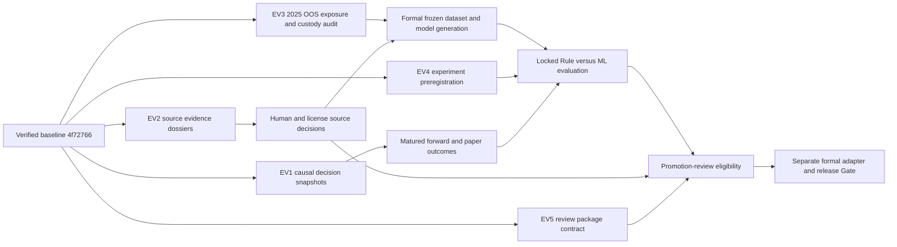

# External Evidence and Investment Effectiveness Validation 設計

> **設計日期**：2026-07-13
> **核准方案**：策略二「雙時鐘並行」
> **文件狀態**：已核准的規劃規格；尚未開始 EV1～EV5 實作
> **基線**：`dev` / `4f72766a1d1e7bd4b80ccb595ad3cb2fa84bd84a`
> **權威邊界**：本文件保存下一階段設計，不取代 `PROJECT_SNAPSHOT.md`、Roadmap、External Validation Register 或實際 QA closeout。

## 1. 目的

本設計把已完成的 A～G 歷史工程底座轉入「外部證據與投資效果驗證」階段。下一階段的成功條件不是再增加工程功能，而是建立可證明下列事項的因果證據鏈：

1. 決策快照確實在 outcome 之前形成。
2. 進入研究或模型的資料在決策當下可得，且來源、授權、修訂與缺失政策可審核。
3. Historical ML 沒有把 2025 結果回流至 Feature、Label、Universe、Rule、threshold、模型或 hyperparameter。
4. Rule Champion 與 ML Challenger 使用同一個 point-in-time universe、同一組成熟樣本、成本與限制公平比較。
5. forward、paper、shadow 與 human review 都有足夠證據，且任何 promotion 仍需獨立 Gate。

本階段只建立 evidence、eligibility、comparison、review 與 proposal 能力；不修改正式決策，不啟動自動化執行。

## 2. 已驗證基線與不得重開的工作

目前權威狀態固定為：

| 項目 | 已驗證狀態 | 本設計判讀 |
|---|---|---|
| Git | `HEAD == origin/dev == 4f72766...`，working tree/index clean | 固定使用 `dev`；不建立 branch/worktree |
| A～G engineering integration | `verified` | 不重做、不重新命名為 EV 工作 |
| Full pytest | 2240 passed | 歷史工程證據，不代表投資有效 |
| Mypy | 455 source files，0 error | 歷史工程證據 |
| Encoding | 使用者核准基線為 689 files、invalid UTF-8=0、mojibake=0 | 不因文件計數口徑差異重開 A～G |
| Gate 2～7 engineering | 35/35 | external Gate 仍 pending |
| Historical ML | `continue_shadow` | 不是 formal locked OOS |
| Formal OOS | `formal_oos_allowed=false` | 只有 EV3 純 verifier 可在完整證據下產生 true |
| Production blend | `production_blend_alpha_bp=0` | 全階段固定 0 |
| Forward evidence | pending | replay、fixture、rehearsal 不折抵 |
| Source acceptance | pending | HTTP 200、parser、candidate rows 均不等於 accepted |
| Production automation | pending | scheduler、broker、auto action 均不在本階段 |
| Formal product closeout | false | 不因本設計、未來工程完成或 20 shadow days 改寫 |

Graphify 圖譜已確認在 `4f72766` 後更新，但本設計只把它用於架構導航；所有結論均回到原始碼、測試、Gate 文件與 QA closeout 核對。

## 3. 現況與 Gap Audit

### 3.1 EV1：Evidence 已有底座，但正式 outcome 仍缺 append-only revision

現有 `EvidenceEvent`、`EvidenceEventRepository`、`ForwardPerformanceService` 與 weekly review 已能保存事件、計算 5/10/20/60 交易日 outcome 並建立唯讀摘要。缺口是：

- `EvidenceEventService` 的共同驗證尚未完整保證所有 `as_of_date`、`available_date` 都不晚於 decision time。
- outcome 現行 repository 對 `(event_id, window_days, return_basis)` 使用 upsert update；這適合既有工程 read model，但不符合正式證據的 revision append-only 要求。
- 尚無一致的 daily／weekly／monthly evidence package、citation、人工 why-not 與 missing/degraded 揭露。
- 現有 rehearsal、fixture 與 historical replay 都不能取得 forward credit。

設計決策是新增 versioned outcome revision ledger，不破壞或重寫 A～G 的既有相容 read model。正式 evidence 只認 revision ledger；舊 outcome table 在完成遷移驗證前只作 compatibility projection。

### 3.2 EV2：P0 工程契約完整，但 13 個來源均未裁決

現有 registry 已有 13 個 P0 source IDs、candidate adapters、PIT audit、row/quarantine diagnostics 與 fail-closed verifier。缺口是 owner、license scope、publication policy、revision coverage、row conservation、正式 quality threshold、接受決議與 rollback 尚未逐來源齊備。

正式歷史稽核仍顯示：

- 月營收 official eligible rows = 0。
- 季度財報 eligible rows = 0。
- corporate-action coverage = unknown。
- fundamentals 對 2024 cutoff 不具 formal eligibility。

Broker／分點已有工程與效能底座，但不在 `p0:source-acceptance-13` 分母內。它必須走獨立 revalidation lane，不得偷偷改成第 14 個 P0，也不得因目前有資料而自動 accepted。

### 3.3 EV3：Shadow 訓練契約已存在，但 formal OOS 尚未成立

現有能力包括 Feature／Label／Dataset／Model registries、trading-calendar purged walk-forward、fold-only preprocessing、OOF calibration、artifact hash/load checks 與 locked-OOS preflight。缺口是：

- strict corporate-action-safe dataset rows = 0。
- fundamental eligible rows = 0。
- 現有 rehearsal 沒有 governed persisted Rule Champion score，只使用 neutral-zero baseline；它不能當正式 Champion。
- preflight 在 `formal_oos_allowed=false` 時會於讀取 2025 payload 前阻擋，因此目前沒有 2025 locked OOS metrics。
- dataset eligibility、model manifest、load contract、OOS custody 與 lineage 尚未收斂成單一 formal Gate。

### 3.4 EV4：現有 comparison 是 direction review，不是投資效果驗證

現有 same-sample comparison 只涵蓋 Precision@K、challenger return MAE、downside Brier 與 PSI drift。正式比較仍缺 Rule TotalScore monotonicity、Rank IC、bucket spread、成本、turnover、MDD、regime/liquidity、survivorship、corporate/restriction、confidence interval、bootstrap 與 multiple-testing 防護。

### 3.5 EV5：已有 non-applying package，但 promotion Gate 尚不完整

現有 promotion package 可檢查最低 20 shadow days、drift、calibration、rollback artifact 與 verification artifacts，最高只到 `eligible_for_human_review`。它目前尚未強制綁定 formal OOS、source eligibility、完整 lineage、after-cost primary effect、downside guardrail與 forward/paper evidence。

20 個 shadow observed days 只證明 pipeline 曾以 causal prediction 連續運作，不證明模型有效，也不產生 promotion credit。

## 4. 方案比較與核准決策

### 4.1 策略一：Source/OOS 完全串行

先做 EV2，再做 EV3／EV4，最後啟動 EV1。優點是形式單純；缺點是延後不可追回的 forward、paper 與 shadow 自然時間，因此不採用。

### 4.2 策略二：雙時鐘並行（核准）

同時啟動兩個時鐘：

- **Evidence clock**：EV1 從真實 decision-time snapshot 開始累積 forward/paper evidence。
- **Governance clock**：EV2 逐來源 acceptance，EV3 先做 2025 OOS Exposure／Custody Audit，再建立 formal freeze。

EV4 可先完成 experiment preregistration 與 comparison contract，但不得提前讀取或挑選 outcome；EV5 可先建立 package contract與 thin observability projection，但 promotion eligibility 必須等待上游 Gate。

### 4.3 策略三：Shadow/replay 優先

大量使用既有 rehearsal 找研究方向，速度快但最容易污染 2025、事後挑 horizon 或把 replay 誤標為 forward。它只可作 engineering diagnostics，不作主線。

## 5. 全域不可違反條款

1. 不重做 A～G，不重新設計已凍結工程契約；必要新增能力採 versioned sidecar／adapter。
2. 不修改 `ScoringEngine` 權重或正式 Rule。
3. ML 不得影響正式 Recommendation、Advice、Portfolio、Exit、Strategy Lifecycle 或 scheduler。
4. `production_blend_alpha_bp` 永遠為 `0`。
5. 不得 auto promotion、auto retrain、auto exit、auto rebalance 或 broker execution。
6. 不得把 candidate source、HTTP 200、parser success 或 candidate rows 標成 accepted。
7. 不得把 fixture、historical replay、rehearsal 或 backfill 標成 forward evidence。
8. 正式資料檢查只允許 bounded、read-only；不得重建、覆寫或破壞正式資料。
9. 核心報酬、成本、資金、倉位與績效使用 `Decimal`、整數 bp／股數／分；float 只可存在隔離的 ML／分析／視覺化邊界。
10. DL、正式 alpha blending 與任何 production ML integration 全部延後。
11. 停止非必要 Product UI 擴建；只允許 Thin Research／Observability UI 顯示既有 domain artifacts、證據與狀態。
12. 工程完成、20 shadow days 或人工作業時間經過，都不得單獨改寫 formal product closeout。

## 6. 證據層級與狀態機

### 6.1 證據層級

| Tier | 可支持的結論 | 不可支持的結論 |
|---|---|---|
| Engineering rehearsal | contract、failure、lineage、read-only 安全 | 投資有效、forward maturity |
| Historical research | 假設形成、資料／模型診斷 | untouched OOS、promotion |
| Retrospective OOS | 已暴露期間的回顧性比較 | virgin／untouched OOS |
| Formal locked OOS | 對未暴露 frozen generation 的一次評估 | 真實執行與 paper/live 效果 |
| Shadow operational | causal inference pipeline 可運作 | 模型優於 Rule 或 promotion |
| Forward evidence | 決策後成熟 outcome | 完整 portfolio execution 效果 |
| Paper evidence | 成本、限制、配置與 research-paper gap | 真實帳戶績效 |
| Promotion review | 人工可審查的完整 evidence package | 自動套用或 release approval |

### 6.2 整體狀態機

```text
engineering_verified
  -> evidence_collecting
  -> evidence_reviewable
  -> promotion_review_eligible
  -> formal_adapter_proposed
  -> release_gate_decided
```

任何箭頭都需要本文件定義的 evidence artifact 與 Gate。`release_gate_decided` 不在 EV1～EV5 的實作授權內。

## 7. 邏輯架構與 Dependency DAG



EV1、EV2、EV3 custody audit、EV4 preregistration 與 EV5 package contract 可立即並行；EV3 formal generation、EV4 result evaluation 與 EV5 promotion eligibility 有 hard dependency。

## 8. EV1：Forward／Paper Evidence Accumulation

### 8.1 Decision snapshot

正式 snapshot 使用 `ExternalEvidenceDecisionSnapshot.v1`，至少保存：

```text
snapshot_id
evidence_tier
decision_timestamp
decision_date
data_as_of_date
max_available_timestamp
source_versions
source_quality
strategy_version
policy_version
rule_champion_snapshot_id
universe_id
universe_hash
symbol
score_bp
rank
action_or_prompt
why
why_not
risk_reasons
market_regime
liquidity_state
restriction_state
missing_sources
degraded_reasons
parent_artifact_ids
content_hash
```

所有可下游欄位必須滿足 `available_at <= decision_timestamp`。缺時間、時區、source version、universe identity 或策略 identity 時，snapshot 可保存為 diagnostics，但不得進 formal sample。`score_bp` 只對正式 Rule／ML ranking snapshot 必填；Portfolio、Exit／Risk 或其他無分數事件必須明記 `score_status=not_applicable`，不得補零，也不得進 Rule vs ML paired sample。

### 8.2 Append-only outcome revision

正式 outcome 使用 `EvidenceOutcomeRevision.v1`：

- 每次首次成熟、資料更正、corporate-action 修正或 benchmark 修正都新增 revision。
- revision 保存 `revision_id`、`parent_revision_id`、`reason_code`、`observed_at`、`data_as_of_date`、source hashes 與 verifier result。
- 唯一 current view 由最新且 `verification_status=passed`、未被後續 invalidation revision 取代的 revision 投影，不更新舊 revision。
- horizon 未成熟時狀態為 `pending_maturity`，不進分母、不補零。
- formal first experiment 的 20 交易日 outcome 為 primary；5／10 日只作 sensitivity；現有 60 日可保留 diagnostics，但不影響首次 promotion review。

### 8.3 Cadence

| Cadence | 必要內容 | Completion rule |
|---|---|---|
| Daily | snapshot count、missing/degraded、identity、capture failure、manual note | 每個預期操作日有真實 record；缺日有具名原因 |
| Weekly | 新成熟 outcome、why-not、paper gap、source incident、人工 review | 至少 3 個獨立真實週期；不得用 replay 補週 |
| Monthly | effectiveness、cost、regime/liquidity、drift、open Gate、decision log | 完整引用 daily/weekly artifacts；樣本不足明確 defer |

### 8.4 Paper boundary

Paper evidence只使用真實 saved Recommendation、人工 thesis／invalidation／holding horizon、paper allocation、成本假設與 execution trace。它不建立 broker order、不自動 rebalance、不自動改 state，也不把缺少人工 thesis 的 position 補成完整。

### 8.5 EV1 fail-closed

future availability、重複 identity、hash mismatch、pending outcome 進分母、無成本／benchmark、source degraded 未揭露、replay 冒充 forward，任一成立即使 package 為 `invalid` 或 `degraded`；不得取得成熟度 credit。

## 9. EV2：Source Acceptance 與 PIT Eligibility

### 9.1 P0-13 固定範圍

以下 13 個 IDs 的分母固定，不因 Broker lane 改變：

1. `corporate_action.ex_dividend_timeline`
2. `corporate_action.reduction_split_par_value`
3. `microstructure.suspended_halt_resume`
4. `microstructure.disposition_stock`
5. `microstructure.periodic_call_auction`
6. `microstructure.full_delivery`
7. `microstructure.limit_lock`
8. `institutional_flows`
9. `credit_transactions`
10. `tdcc_shareholding`
11. `twse.monthly_revenue_announcement`
12. `tpex.monthly_revenue_announcement`
13. `pit.quarterly_financials`

Broker／分點以 `broker_branch.revalidation` 獨立管理，只能輸出 accepted-for-declared-research-use、limited、rejected 或 deferred，不自動進 formal core feature set。

### 9.2 Source dossier

每個來源建立 `SourceAcceptanceDossier.v1`，必要欄位為：

```text
source_id
source_owner_role
license_owner_role
license_status
license_scope
redistribution_policy
source_status
publication_time_policy
timezone
available_date_policy
revision_policy
pit_coverage_window
coverage_numerator
coverage_denominator
missing_policy
row_conservation_counts
quarantine_policy
quality_thresholds
downstream_use_cases
downstream_eligibility
disable_conditions
rollback_reference
evidence_artifact_ids
reviewer_role
decision_timestamp
decision_revision_id
```

`owner` 必須是可追責角色；實作時有真實姓名才加入 signed decision，不在規劃文件虛構人名。

### 9.3 決議狀態

| 狀態 | 語意 |
|---|---|
| `accepted` | license、PIT、quality、coverage 與 declared downstream use 全部核准 |
| `limited` | 只核准列出的 research／diagnostic use；未列用途維持 none |
| `rejected` | 不得使用；保留 decision revision 與理由 |
| `deferred` | 證據不完整或等待人／license；等同 fail-closed |

決議採 `SourceAcceptanceDecisionRevision.v1` append-only；任何狀態變更新增 revision，不覆寫歷史。停用時 downstream eligibility 立即投影為 none，但歷史 artifact 不刪除。

### 9.4 PIT acceptance

至少驗證 publication timestamp、timezone、first observed、revision chain、`available_at <= decision_timestamp`、point-in-time coverage、row conservation、quarantine、missing/outage 與 rollback。無法證明 available date 的 row 不得進 formal feature。

## 10. EV3：Historical ML Formal OOS Readiness

### 10.1 第一個步驟：2025 OOS Exposure／Custody Audit

在建立新 dataset、重訓、讀取 2025 outcome 或執行任何 formal comparison 前，先產生 `OOSExposureCustodyReport.v1`。Audit 同時檢查：

- Git history、既有 reports、notebooks、TEMP／artifact manifest、CLI invocation evidence與 registry access。
- 2025 outcome payload 是否曾被程序開啟、匯出、摘要或用於比較。
- 人工 signed declaration：2025 是否影響 Feature、Label、Universe、Rule、threshold、model family、hyperparameter、calibration、blend、sample filter 或 success criteria。
- dataset/model generation 的 custody owner、access log、hash、location與封存時間。

狀態固定為：

| 狀態 | 規則 |
|---|---|
| `custody_verified_unopened` | 有足夠機器與人工證據證明未開啟、未影響；2025 才可候選 formal locked OOS |
| `exposed_no_design_influence_declared` | 2025 曾被看見，但宣告未影響設計；不得稱 virgin／untouched，只能 retrospective OOS；獨立 Gate 只能裁決其回顧用途，不能把 2025 改名為 formal locked OOS |
| `seen_oos` | 2025 曾影響任一 Feature、Label、Universe、Rule、threshold、model 或 hyperparameter；2025 永久不得再稱 virgin／untouched OOS |
| `indeterminate` | 缺 access evidence 或聲明；fail-closed，等同不可 formal OOS |

目前 closeout 只證明既有 preflight 沒有讀取指定的 2025 payload，尚不足以證明人工與其他研究路徑完全未暴露；EV3 開始時的保守狀態因此是 `indeterminate`，直到 audit artifact 與 signed declaration 齊備。

若為 `seen_oos`，必須建立新的 research generation、重新凍結 hypothesis／registries／模型，並選擇一個在 freeze 時尚未消費、之後自然成熟的 temporal holdout。新 generation 可把 2025 明記為已暴露的 development data，但不得再稱 2025 OOS；2026 matured outcome 仍只可 evaluation、不得 fit。2025 retrospective evidence 不刪除、不改名。

EV3 的第一份報告固定稽核 2025；其後每一個新 temporal holdout 都必須有自己的 `OOSExposureCustodyReport.v1`，不能沿用 2025 報告取得未暴露資格。

### 10.2 Generation-scoped freeze

每個 generation 固定：

- Feature registry hash。
- Label registry hash。
- Universe registry／point-in-time membership hash。
- source acceptance decision revisions。
- dataset content／manifest hash。
- training cutoff `2024-12-31` 或新 generation 明確 cutoff。
- purged/embargo split policy。
- preprocessing、calibration 與 model-selection policy。
- model artifact、library、schema與hyperparameter hash。
- OOS custody report ID。
- rollback artifact與 last-known-good Rule Champion ID。

### 10.3 `formal_oos_allowed` false→true

只有 pure verifier 對特定 generation 證明下列全部成立，才能輸出 true：

1. 該 generation 所宣告 holdout 的 OOS status 是 `custody_verified_unopened`。
2. dataset、model、Feature／Label／Universe registries frozen 且 hash/lineage 完整。
3. train decision、train label availability 與 blend-selection availability 均不晚於 cutoff。
4. trading-calendar purged WF、fold-only preprocess與fold-only calibration通過。
5. corporate action、restriction、survivorship、benchmark 與 declared source families 都有可接受 decision revision。
6. Fundamental 不能是 unknown／pending；若第一代不使用，必須是人工核准的 `excluded_by_approved_scope`，不可默默排除。
7. Broker short-history 與 core long-history 使用不同 dataset/model generation。
8. artifact 真實 load，schema、registry、library、content hash 與 parent lineage 一致。
9. rollback 可回到明確 Rule Champion，production alpha 仍為 0。
10. independent validator 簽核 evidence package。

true 的唯一語意是「准許執行一個 sealed、預註冊的 locked OOS evaluation」；同一組 frozen input 可作 deterministic re-verification，但不得形成新的選模、調參或反覆試驗。它不是模型有效、promotion 或 production approval。

### 10.4 2026 與後續 outcome

generation freeze 後新成熟的 outcome 只可進 append-only evaluation revision。它們不得回流 fit、imputation policy、calibration、threshold、hyperparameter、model selection、primary label、guardrail 或 success criteria。需要變更任何一項時，必須關閉原 generation 並建立新 generation；舊 evidence 保留。

## 11. EV4：Rule Champion vs ML Challenger

### 11.1 Rule Champion

`RuleChampionSnapshot.v1` 必須來自當時正式 rule-only decision snapshot，保存 rule／strategy／policy version、score configuration hash、universe、restrictions、selection capacity、decision timestamp與 source lineage。

禁止：

- neutral-zero surrogate。
- 用後來版本 Rule 回套舊日期。
- 缺正式 rule score 時補零或重算。
- 以 ML score、research blend 或今日 universe 替代。

缺 Champion snapshot 的 symbol/date 不進 formal paired sample；它不是 missing=0。

### 11.2 Challenger family

允許的研究 family 為 core linear、core histogram gradient boosting、獨立 broker short-history add-on與日後 fundamental-eligible family。第一次 formal experiment 在 unblind 前只指定一個 `challenger_model_id`；其他 family 保持 exploratory，不得看到 OOS 後替換冠軍挑戰者。

Rule-only、ML-only、research blend 分開產出。Research blend 不得作第一次 formal primary comparison，且 `production_blend_alpha_bp=0`。

### 11.3 第一次 Experiment 的預註冊鎖定

第一次 experiment 使用現有 immutable label registry 的單一 Primary Label與單一 Downside Guardrail：

- **Primary Label**：`relative_return_20d_bp`，20 交易日股票報酬減同期間 benchmark 報酬，整數 bp。
- **Downside Guardrail**：`downside_20d_flag`，沿用 registry 的 `downside_threshold_bp=-500`；它表示 20 日相對 benchmark 落後至少 500 bp，不等同絕對虧損，且不得在看結果後改 threshold。
- **Sensitivity only**：由 EV1 outcome ledger 提供的 5／10 交易日 absolute、benchmark excess與industry excess outcome；它們不得進 fit／model selection，也不得用較佳結果推翻 primary failure。
- **排除於首次 Gate**：60 日 outcome只作長期 diagnostics，不影響第一次 promotion-review eligibility。

預註冊 artifact `ExperimentPreregistration.v1` 必須在 outcome unblind 前鎖定 hypothesis、Champion ID、challenger ID、Primary Label、Downside Guardrail、K policy、cost/slippage、sample policy、date-block bootstrap、`confidence_level_bp=9500`、minimum material effect、downside non-inferiority margin、multiple-testing policy與 failure rules。`minimum_material_effect_bp` 與 `downside_noninferiority_margin_bp` 是 human-bound 風險決策，必須由 Quant Validation／Risk owner 在 unblind 前以整數 bp 簽核；工程不得代填，缺任一欄即 `invalid_preregistration`。

### 11.4 Fair sample

比較單位是同一個 `(decision_date, symbol)` paired sample：

- 同 point-in-time universe、benchmark、industry mapping、restriction與liquidity policy。
- Rule 與 ML 都必須在 outcome 前存在 immutable score/rank。
- outcome 使用相同 revision ID。
- K 取自當時 Champion snapshot 的 governed selection capacity；缺 K 即該日 invalid，不另挑有利 K。
- 缺任一側 prediction、Champion score、cost或mature label時排除並揭露，不能單邊補值。

### 11.5 Metrics 與決策規則

| 類別 | 指標 | Gate 用途 |
|---|---|---|
| Primary | paired after-cost Top-K `relative_return_20d_bp` 差（ML minus Rule） | 95% CI 下界必須不低於預註冊 `minimum_material_effect_bp` |
| Downside guardrail | `downside_20d_flag` 相對落後事件 recall 的 paired non-inferiority | recall 差的 95% CI 下界不得低於負的預註冊 guardrail margin |
| Ranking secondary | Spearman／Rank IC、Precision@K、NDCG、Top-Bottom spread、Rule score monotonicity | 解釋 ranking quality，不取代 Primary |
| Calibration secondary | Brier、reliability/calibration error | 支持 downside probability 判讀 |
| Absolute downside diagnostic | `maximum_adverse_excursion_20d_bp` 與其分布 | 揭露絕對路徑風險；首次實驗不把它改成第二個 post-hoc guardrail |
| Portfolio guardrails | turnover、transaction cost、slippage、MDD、drawdown duration、concentration | 任一 hard failure 阻擋 promotion review |
| Stability | regime、liquidity、industry、coverage、time slice | 單一 regime 勝出不得宣稱穩定 |
| Integrity | survivorship、corporate action、restriction、missingness、lineage | 任一失敗使 experiment invalid |
| Sensitivity | 5／10 日 absolute/excess、不同合理成本情境 | 只揭露脆弱性，不挑最佳 horizon |

Primary metric與guardrail使用整數 bp。Bootstrap 可在隔離分析邊界使用 float，但輸出 CI、threshold與決策值轉成整數 bp，並保存 random seed、resample policy與sample hashes。

### 11.6 Multiple testing 與 p-hacking 防護

- hypothesis、primary、guardrail、challenger、K、cost與 sample 在 unblind 前凍結。
- exploratory family／metric 清楚標記，不得取得 primary credit。
- sensitivity 全量揭露，不只報最佳 window／regime。
- model／feature search budget寫入 preregistration；超支即關閉 generation。
- 任何 post-unblind 變更建立新 generation與新 holdout，不能覆寫原實驗。

### 11.7 結果狀態

| 狀態 | 條件 |
|---|---|
| `invalid` | lineage、PIT、custody、sample、preregistration 或 integrity 失敗 |
| `fail` | primary 未達預註冊標準或 downside guardrail 失敗 |
| `inconclusive` | evidence完整但 CI／樣本不足以判定 |
| `continue_shadow` | 沒有 integrity failure，但效果尚不足以進 promotion review |
| `eligible_for_promotion_review` | formal OOS、forward/paper、primary、guardrail、stability、drift、calibration與人工 Gate 全部符合 |

`eligible_for_promotion_review` 仍不是 promotion。

## 12. EV5：Human Review、Promotion Governance 與 Product Observation

### 12.1 Review packages

Weekly／monthly package 至少包含：

- evidence citations 與 artifact hashes。
- dataset、model、prediction、Champion、experiment identity。
- Primary、guardrail、secondary與sensitivity results。
- feature importance與stability。
- calibration、feature/label drift。
- regime、liquidity、industry、coverage breakdown。
- missing source、degraded data、failure與why-not disclosure。
- owner roles、review timestamp、decision revision。
- rollback target與last-known-good Rule Champion。

### 12.2 20 shadow days 的正確語意

至少 20 個 causal shadow observed days 只支持 `shadow_pipeline_operational=true`。它不支持：

- 模型優於 Rule。
- formal OOS 通過。
- forward/paper 成熟。
- promotion-review eligibility。
- production adapter、scheduler或alpha。

### 12.3 Thin Research／Observability UI

停止非必要 Product UI 擴建。只有下列唯讀觀測可在服務與 artifact 穩定後加入既有 Research／Workbench 區域：

- Gate status、blockers、missing/degraded。
- artifact citations 與 model/dataset/prediction identity。
- 已由 domain service計算的 frozen metrics、CI、drift與review decision。

UI 不匯入 ML domain、不重算 metrics、不調整 threshold、不提供 apply／promote／retrain／trade 控制。CLI與artifact是第一優先，UI只是 thin projection。

### 12.4 Promotion 與 rollback

EV5 最高輸出 `VersionedFormalAdapterProposal.v1`；proposal 必須列出 adapter boundary、formal inputs/outputs、Rule fallback、disable switch、rollback owner與獨立 release prerequisites。實際 adapter實作、formal alpha、scheduler與broker皆需新 Gate與新計畫。

任何 major drift、schema/hash mismatch、source eligibility撤回、calibration failure、primary decay、guardrail failure或 lineage break 都使 ML overlay proposal失效，維持 Rule Champion與alpha=0。歷史 prediction與review decision不刪除。

## 13. Ownership 與獨立性

| 工作包 | Accountable role | Responsible roles | 必須獨立的 reviewer |
|---|---|---|---|
| EV1 | Evidence Owner | Evidence Operator、Portfolio/Position Reviewer | Quant Evidence Validator |
| EV2 | Data Governance Owner | Source Owner、License/Legal Owner、Data QA Owner | Release/Data Risk Reviewer |
| EV3 | ML Research Owner | Dataset Custodian、Model Artifact Owner | Independent Quant Validator、OOS Custody Reviewer |
| EV4 | Quant Validation Owner | Rule Baseline Owner、ML Researcher、Cost Model Owner | Independent Experiment Reviewer |
| EV5 | Promotion/Release Owner | Evidence Reviewer、ML Reviewer、Thin UI Owner | Risk/Release Reviewer |
| Git/Docs | Git Coordinator、Documentation Owner | 各 workstream文件 owner | 最終 Integration Reviewer |

同一人若因團隊規模兼任角色，必須分開產生 builder 與 reviewer decision artifacts、時間戳與簽核，不得由同一自動步驟自我核准。

## 14. Artifact 與 SSOT 責任

| 真相 | SSOT | 更新責任 |
|---|---|---|
| 目前專案狀態 | `PROJECT_SNAPSHOT.md` | 只有實際驗證狀態改變後由 Documentation/Integration Owner更新；本規劃不改 |
| 產品／工程方向 | Product／6M Roadmap | Gate或方向正式改變後才更新；本規劃不改 |
| External Gate | `GATE_2_TO_7_EXTERNAL_VALIDATION_REGISTER.md` append-only revisions | Gate Owner |
| Source acceptance | P0 register + `SourceAcceptanceDecisionRevision.v1` | Data Governance Owner |
| Evidence event/outcome | event store + append-only outcome revision ledger | Evidence Owner |
| Dataset/model/prediction | immutable registries與manifest | Dataset/Model Custodians |
| Experiment | preregistration + comparison artifact | Quant Validation Owner |
| Promotion review | non-applying review package與human decision revision | Promotion/Release Owner |
| User operation | `APPLICATION_MANUAL.md` | 只有未來使用者可見行為實作後更新 |
| 設計／執行脈絡 | 本 spec、Master Plan、Documentation Index | Documentation Owner |

## 15. Immediate、time-bound、human-bound、license-bound

| 類別 | 可開始工作 | 不可宣稱完成的原因 |
|---|---|---|
| Immediate | EV3 custody audit、EV1 snapshot/revision contract、EV2 dossiers、EV4 preregistration、EV5 package schema | 只產生工程與治理能力 |
| Time-bound | 5/10/20 outcome maturity、3 weekly periods、完整 paper cycle、20 shadow days | 自然交易日與真實操作不可模擬 |
| Human-bound | source decisions、paper policy、thesis/transition、experiment thresholds、promotion/release | 需要具名人類 owner/reviewer |
| License-bound | 13 P0與Broker用途、保存／再散布範圍 | 工程無法替代授權決議 |

30／60／90 日可作 observation checkpoints，但時間經過本身不構成 completion；每個 checkpoint 都必須檢查樣本、coverage、缺日、成本、regime與人工 review。

## 16. Engineering 與自然時間估計

估計以一名 owner 的有效工程日表示，不含等待 license、自然 outcome 或人工排程；它們不是交付承諾。

| 工作包 | 工程估計 | 不可壓縮時間／外部依賴 |
|---|---:|---|
| EV1 | 5～8 日 | 至少 3 真實週期；20 交易日 primary outcome；完整 paper cycle |
| EV2 | 8～15 日 | license/legal/source owner 時程未知 |
| EV3 custody audit | 2～4 日 | 人工 exposure declaration／custody evidence |
| EV3 formal freeze | 8～15 日 | EV2 eligibility、未暴露 holdout |
| EV4 preregistration/harness | 8～12 日 | mature OOS/forward/paper outcomes |
| EV5 package/thin projection | 5～8 日 | 20 shadow days只完成 operational觀測；promotion另等全部 Gate |

## 17. Completion、degraded 與 rollback 原則

### 17.1 Workstream completion

- **EV1**：causal snapshots、append-only outcome revisions、3 real weekly reviews與完整 paper evidence皆可引用；不是只看事件數。
- **EV2**：P0-13 各有 accepted/limited/rejected/deferred具名決議；deferred可以結束一次 review，但不產生 eligibility。
- **EV3**：custody、registries、formal verifier與artifact load全部通過；`formal_oos_allowed=true`仍只准 locked evaluation。
- **EV4**：預註冊 primary/guardrail、fair sample、after-cost comparison、CI與integrity全可重跑；結果可為fail或inconclusive，誠實負結果仍算實驗完成。
- **EV5**：review package、human decision、rollback proposal可審核；沒有自動 apply。

### 17.2 Degraded/fail-closed

缺 source、license、available date、custody、identity、mature outcome、cost、benchmark、Champion、CI或 reviewer時，狀態必須是 degraded／deferred／invalid；不得補成通過。

### 17.3 Rollback

資料停用回到 last accepted source revision；evidence projection回到最後有效 revision；ML一律回到正式 Rule Champion，alpha維持0；UI隱藏不可用projection但保留歷史citation。不得刪除原始資料、registry history或負面結果。

## 18. Formal product closeout 仍需的外部證據

至少仍包括：

1. 真實 forward maturity與3個weekly periods。
2. 完整 paper cycle、成本與benchmark evidence。
3. P0-13逐來源license/PIT/quality決議與Broker revalidation。
4. 人工 thesis、position transition、exit outcome與pruning decisions。
5. formal OOS custody/freeze與一次未污染評估，或誠實標記 seen-OOS 後的新 holdout。
6. 至少20個 causal shadow days，加上完整 matured labels；這只證明 operational。
7. Rule vs ML primary/guardrail、stability、drift、calibration與rollback review。
8. Promotion Review、versioned adapter proposal與獨立release approval。
9. Production automation owner approval；目前仍不啟用。

## 19. 最終產品邊界

本設計不保證 ML 優於 Rule，也不保證獲利。第一次實驗可能得到 `fail`、`inconclusive` 或 `continue_shadow`，這些都是有效而誠實的結果。只有證據完整時才有資格討論 promotion review；即使 review 通過，DL、formal alpha blending、scheduler、broker execution與auto exit仍維持延後。

## 20. 核准記錄

2026-07-13 使用者核准策略二「雙時鐘並行」與本設計方向，並追加下列校準：EV3 先做 2025 OOS Exposure／Custody Audit、seen-OOS誠實標記、第一次experiment單一Primary Label與Downside Guardrail、正式Rule-only Champion、20 shadow days只代表operational、停止非必要Product UI、alpha固定0、DL與正式blending延後。以上校準已完整納入，沒有保留待填欄位或默認例外；未簽核的 human／license 參數明確維持 fail-closed，而不是規格空白。
